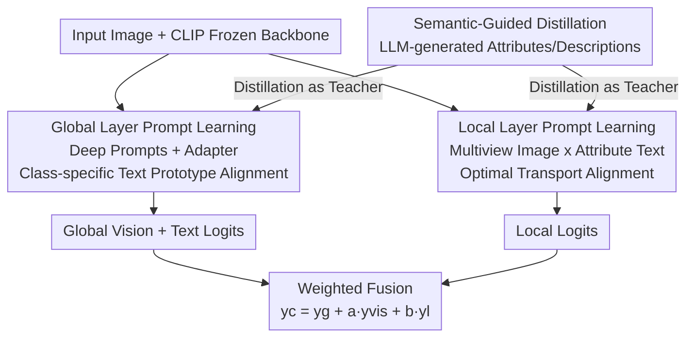

# Semantic-Guided Global-Local Collaborative Prompt Learning for Few-Shot Class Incremental Learning

**Conference**: CVPR 2026  
**Paper**: [CVF Open Access](https://openaccess.thecvf.com/content/CVPR2026/html/Yan_Semantic-Guided_Global-Local_Collaborative_Prompt_Learning_for_Few-Shot_Class_Incremental_Learning_CVPR_2026_paper.html)  
**Code**: None  
**Area**: Few-Shot Class-Incremental Learning / Prompt Learning / Vision-Language Models  
**Keywords**: FSCIL, Prompt Learning, CLIP, Optimal Transport, LLM Semantic Distillation

## TL;DR
SGLC utilizes a frozen CLIP as a backbone and adapts to FSCIL using a dual-layer prompt learning approach consisting of "global vision-text prototype alignment + local attribute-multiview optimal transport alignment." LLM-generated semantic descriptions serve as teachers via knowledge distillation for both prompt layers, leading to comprehensive improvements over previous SOTA on miniImageNet, CIFAR-100, and CUB200 benchmarks.

## Background & Motivation
**Background**: Few-Shot Class-Incremental Learning (FSCIL) requires models to learn initial classes with sufficient data in the base session and continuously incorporate new classes with extremely few samples (e.g., 5-way 5-shot) in subsequent incremental sessions without forgetting old classes. Early mainstream approaches relied on freezing shallow backbones (ResNet-18) with partial fine-tuning, while recent trends have shifted toward pre-trained ViT/CLIP with parameter-efficient fine-tuning.

**Limitations of Prior Work**: Shallow backbones have low representation ceilings and fail to learn discriminative features for both base and new classes. While CLIP-based prompt learning methods (CoOp, MaPLe, etc.) are powerful, they typically perform **single alignment** between learnable prompts and images—prompts usually only contain class names ("a photo of a [class]"), failing to leverage fine-grained intra-class discriminative information. This leads to easy overfitting under few-shot conditions, and old class prompts are often overwritten and forgotten during incremental stages.

**Key Challenge**: The fundamental tension in FSCIL is the dilemma between stability (preserving old knowledge) and plasticity (learning new knowledge). Approaches like data replay, meta-learning regularization, and dynamic structures only partially alleviate this, without simultaneously suppressing forgetting and overfitting via "representation alignment."

**Goal**: Without unfreezing the CLIP backbone, the objectives are to (1) enable alignment at both global class-level and local attribute-level, (2) make new class prompts learnable while freezing old class prototypes for inherent anti-forgetting, and (3) introduce external semantic supervision for few-shot prompts to prevent overfitting.

**Key Insight**: Humans recognize unfamiliar categories based on discriminative attributes (color, shape) rather than just memorizing class names. The authors upgrade "class name alignment" to "attribute alignment" and automatically generate these attributes and descriptions using an LLM.

**Core Idea**: Replace single class name alignment with collaborative prompt learning ("global prototype alignment + local attribute optimal transport alignment") and use LLM semantic description distillation as auxiliary supervision—addressing both forgetting and overfitting.

## Method

### Overall Architecture
SGLC uses a frozen CLIP (ViT-B/16) as the backbone, inputting an image and outputting classification logits across all seen classes. The workflow consists of three collaborative components: First, **LLM-generated semantic descriptions** (a set of cross-class discriminative attributes + global and attribute descriptions for each class); second, two parallel branches for **global layer prompt learning** (alignment of image features with "visual prototypes + class-specific text prototypes") and **local layer prompt learning** (optimal transport alignment between multiview image features and multiple attribute text features); finally, **semantic-guided distillation** uses LLM-derived features as teachers to constrain global/local learnable text prompts. In the base session, all prompts and adapters are jointly trained; in incremental sessions, only the current new class's global text prompts and local vision/text prompts are updated, while old class prototypes remain frozen. During inference, global vision-text logits and local logits are weight-fused.

### Key Designs

**1. Global Layer Prompt Learning: Deep Prompts + Adapter Adaptation + Class-specific Frozen Prototypes for Anti-forgetting**

To address the weakness of shallow backbone representations and the difficulty of single-class alignment, the authors insert learnable **deep prompts** (depth $J=6$) into both vision and language branches and add a bottleneck-style **visual-adaptive adapter** to the vision encoder: $f_{vo}=\sigma(f_v W_{down})W_{up}+f_v$, using residual connections to calibrate visual features. To preserve original CLIP knowledge, a consistency constraint with the frozen zero-shot vision encoder is used: $L_{zs}=\lVert f^{zero}-f^{vo}\rVert_2^2$.

Crucially, the text side does not use class-agnostic prompts shared across all classes (like CoOp), but **class-specific prompts** $P_{Tcls}=[T_{1cls}]\dots[T_{Mcls}][classname]$, one set per class. This provides two benefits: enhanced inter-class discriminability and, more importantly, during incremental stages, **only current class prompts are trained while old class prompts are frozen**. This prevents old text prototypes from changing, fundamentally eliminating catastrophic forgetting. Global alignment uses cross-entropy $L_{CE\text{-}G}=-\log\frac{\exp(\cos(f_{vo},t_i^T)/\tau)}{\sum_k \exp(\cos(f_{vo},t_k^T)/\tau)}$, with a visual prototype classifier $\psi=[proto_1;\dots;proto_c]$ constructed from base class feature means providing $y^{vis}$.

**2. Local Layer Prompt Learning: Attribute Prompts + Multiview Optimal Transport Alignment for Anti-overfitting**

To prevent few-shot overfitting to irrelevant factors like background, the authors upgrade single-mode alignment to local multi-mode alignment. Multiple **attribute prompts** are constructed for each class: $P_{att1}=[T_{s1}]\dots[T_{sM}][attribute1][classname]$, $P_{att2}=[\dots][attribute2][classname]$. Attributes (e.g., color, shape) are selected once by the LLM as universal discriminative attributes across classes. On the image side, different visual prompts are injected to obtain multiple view features $\{f_v^n\}$.

Since different attributes often share information (e.g., "white tail" contains both color and shape cues), simple one-to-one cosine matching would fragment semantics. The authors redefine the distance between image and text feature sets as an **Optimal Transport (OT)** problem: empirical distributions $P=\sum_n \frac1N \delta_{v_n}$ and $Q=\sum_n \frac1N \delta_{t_n}$ are built for both modalities, and a cost matrix $C$ is constructed using cosine distance. The Sinkhorn algorithm approximates the transport plan $\tilde T$, yielding image-class distance $k=\sum_{m}\sum_{n}\tilde T_{mn}(1-C)_{mn}$. This is followed by local cross-entropy $L_{CE\text{-}L}=-\log\frac{\exp(k_i/\tau)}{\sum_j \exp(k_j/\tau)}$. OT focuses the model on intrinsic semantics rather than background, which is core to anti-overfitting.

**3. Semantic-Guided Distillation: LLM Descriptions as Teachers + Visual Diversity Loss to Prevent Collapse**

To mitigate text prototype overfitting under few-shot conditions, the authors use an LLM to generate both overall class descriptions and specific attribute descriptions. These features are distilled into the learnable prompts rather than ensemble-integrated at inference—this saves storage (no need to keep old descriptions) and filters noise, naturally fitting incremental scenarios. Distillation loss uses L2 for global and local levels: $L_{Dist\text{-}G}=\frac1{C_n}\sum_i\lVert\tilde f_t^i-f_t^i\rVert_2^2$ and $L_{Dist\text{-}L}=\frac1C(\sum_i\lVert\tilde f_{tl1}^i-f_{tl1}^i\rVert_2^2+\sum_i\lVert\tilde f_{tl2}^i-f_{tl2}^i\rVert_2^2)$, combined as $L_{Dist}=L_{Dist\text{-}G}+L_{Dist\text{-}L}$.

Furthermore, to prevent collapse of multiview local image features without straying too far from global features, a visual **diversity loss** is introduced:

$$L_{div}=\lVert f_{v1}-f_v\rVert_2^2+\lVert f_{v2}-f_v\rVert_2^2-\lVert f_{v1}-f_{v2}\rVert_2^2$$

The first two terms pull local views toward the global anchor, while the third pushes local views apart, maintaining heterogeneity in the OT space.

### Loss & Training
Total loss for the base session: $L_{base}=L_{CE}+\alpha L_{Dist}+\beta L_{div}+\gamma L_{zs}$, where $L_{CE}=L_{CE\text{-}G}+L_{CE\text{-}L}$. For incremental sessions, the zero-shot consistency term is removed: $L_{incre}=L_{CE}+\alpha L_{Dist}+\beta L_{div}$. Using a CLIP-ViT/B-16 backbone, the base session is trained for 50 epochs (AdamW, lr 0.001), and incremental sessions for 20 epochs (lr 0.0001). Hyperparameters are $\alpha=\gamma=500, \beta=50$, deep prompt depth 6, global prompt length 2, and local prompt length 8.

## Key Experimental Results

### Main Results
On three benchmarks (miniImageNet/CIFAR-100: 60 base+40 new, 5-way 5-shot; CUB200: 100+100, 10-way 5-shot), metrics reported include base session accuracy $A_{base}$, incremental average $A_{navg}$, and overall average $A_{avg}$.

| Dataset | Metric | SGLC | Prev. SOTA | Gain |
|--------|------|------|----------|------|
| miniImageNet | $A_{avg}$ | **95.12** | 93.62 (IVFL) | +1.50 |
| CUB200 | $A_{avg}$ | **80.18** | 79.12 (Approxima) | +1.06 |
| CIFAR100 | $A_{avg}$ | **84.57** | 81.38 (Approxima) | +3.19 |
| miniImageNet | $A_{navg}$ | **94.82** | 93.36 (BiMC) | +1.46 |
| CUB200 | $A_{base}$ | **87.05** | 86.46 (Approxima) | +0.59 |

The paper notes that previous SOTA often perform well only on specific datasets: fine-tuning-heavy Approxima excels on CUB200/CIFAR100 but is weaker on miniImageNet; light fine-tuning BiMC/IVFL show the opposite. SGLC achieves the highest accuracy across all sessions on every dataset, demonstrating a balance of stability and plasticity.

### Ablation Study
On CUB200, modules are added sequentially (Table 2, showing $A_{navg}$/$A_{avg}$):

| Configuration | $A_{navg}$ | $A_{avg}$ | Description |
|------|-----------|-----------|------|
| baseline | 57.34 | 58.09 | Baseline only |
| + Global-Level | 77.30 | 78.04 | Global prototype alignment, significant boost |
| + Local-Level | 78.35 | 79.08 | Adds local OT alignment +1.04 |
| + Semantic (Full) | **79.49** | **80.18** | Adds semantic distillation +1.10 |

Component-level ablation (Table 3, CUB200, $A_{avg}$): CLIP 58.09 → CoOp 69.47 → +deep-layer prompts 71.22 → +visual feature correction 70.72 → Full 72.53, showing that deep prompts and adapter visual correction both contribute.

### Key Findings
- The global layer is the performance foundation: adding global alignment jumps $A_{avg}$ from 58 to 78, while local and semantic modules each add about 1 point, reaching 80.18 collaboratively.
- OT alignment significantly outperforms one-to-one cosine matching (Figure 6), confirming the need for soft assignment when attribute information overlaps.
- The number of attributes is not "the more the better": (color, shape) with $A_{avg}=80.18$ outperforms adding pattern/size (79.63/79.01), as excessive attributes introduce noise.
- Class-specific prompts + frozen old prompts are more resistant to forgetting than class-agnostic prompts (Figure 4).
- Parameter efficiency: only 0.71M trainable parameters (0.47%), far lower than Approxima (86.68M / 100%) and IVFL (5.84M / 3.98%).

## Highlights & Insights
- Modeling "local attribute-multiview image alignment" as **Optimal Transport** elegantly resolves the issue of semantic overlap between attributes where hard one-to-one matching fails. This can be transferred to any fine-grained alignment task involving "multi-part text × multi-view images."
- "Freezing old class text prototypes and only learning new class prompts" provides a structural guarantee for stability using a minimalist mechanism, rather than relying on replay or regularization.
- Using LLM to generate **cross-class universal attributes** instead of per-class clustering significantly reduces computational and manual costs. Distillation avoids storing old descriptions during inference, making it ideal for incremental scenarios.
- Achieving comprehensive SOTA with only 0.47% trainable parameters suggests the bottleneck in FSCIL lies more in the "alignment mechanism" than the "number of parameters tuned."

## Limitations & Future Work
- The presence of three modules, four loss terms, and weights $\alpha/\beta/\gamma$ differing by an order of magnitude (500/50/500) suggests many hyperparameters that might require retuning for new datasets.
- The method relies heavily on the quality of LLM-generated attributes/descriptions; robustness against LLM hallucinations is not fully discussed. Shared attributes might not suffice for open domains with vast attribute diversity.
- Evaluation is limited to three classic small benchmarks (miniImageNet/CIFAR100/CUB200); stress tests with larger scales or longer session sequences are missing.
- The number of local views is fixed at 2, and the trade-off between the number of views and OT solve cost is not explored in depth.

## Related Work & Insights
- **vs CoOp / MaPLe (Prompt Learning)**: These use class-agnostic prompts to align only class names, failing to suppress forgetting or overfitting in FSCIL. SGLC uses class-specific prompts + local OT alignment + frozen old prototypes to structurally solve the dilemma.
- **vs Approxima (Fine-tuning pre-trained ViT)**: Approxima is strong on specific sets with 100% parameter tuning; SGLC achieves better overall SOTA with 0.47% parameters and more stable generalization.
- **vs IVFL / BiMC (Light fine-tuning + Replay)**: These lean toward plasticity and are unstable across datasets. SGLC achieves both stability and plasticity through frozen prototypes and semantic distillation without relying on replay.
- **vs Cluster-based description methods [26]**: Using LLM to select discriminative attributes replaces per-class clustering of massive descriptions, significantly reducing overhead.

## Rating
- **Novelty**: ⭐⭐⭐⭐ The combination of global-local dual-layer alignment + attribute OT + LLM distillation is an innovative paradigm integration for FSCIL, though individual techniques are known modules.
- **Experimental Thoroughness**: ⭐⭐⭐⭐ Comprehensive SOTA on three benchmarks with thorough ablation and parameter analysis, though lacking larger-scale/longer-sequence stress tests.
- **Writing Quality**: ⭐⭐⭐⭐ Clear motivation chain, complete formulas, and appropriate visuals; notation is heavy but readable.
- **Value**: ⭐⭐⭐⭐ Comprehensive SOTA with 0.47% parameters offers both practical and methodological value for parameter-efficient FSCIL.

<!-- RELATED:START -->

## Related Papers

- [\[CVPR 2026\] Dual-Estimator: Decoupling Global and Local Semantic Shift for Drift Compensation in Class-Incremental Learning](dual-estimator_decoupling_global_and_local_semantic_shift_for_drift_compensation.md)
- [\[CVPR 2026\] Quantized Residuals to Continuous Prompts for Few-Shot Class Incremental Learning in Vision-Language Models](quantized_residuals_to_continuous_prompts_for_few-shot_class_incremental_learning.md)
- [\[CVPR 2026\] DGS: Dual Gradient and Semantic-Shift Guided Low-Rank Adaptation for Class Incremental Learning](dgs_dual_gradient_and_semantic-shift_guided_low-rank_adaptation_for_class_increm.md)
- [\[CVPR 2026\] HyCal: A Training-Free Prototype Calibration Method for Cross-Discipline Few-Shot Class-Incremental Learning](hycal_training_free_prototype_calibration_for_cross_discipline_fscil.md)
- [\[CVPR 2025\] SEC-Prompt: SEmantic Complementary Prompting for Few-Shot Class-Incremental Learning](../../CVPR2025/self_supervised/sec-promptsemantic_complementary_prompting_for_few-shot_class-incremental_learni.md)

<!-- RELATED:END -->
