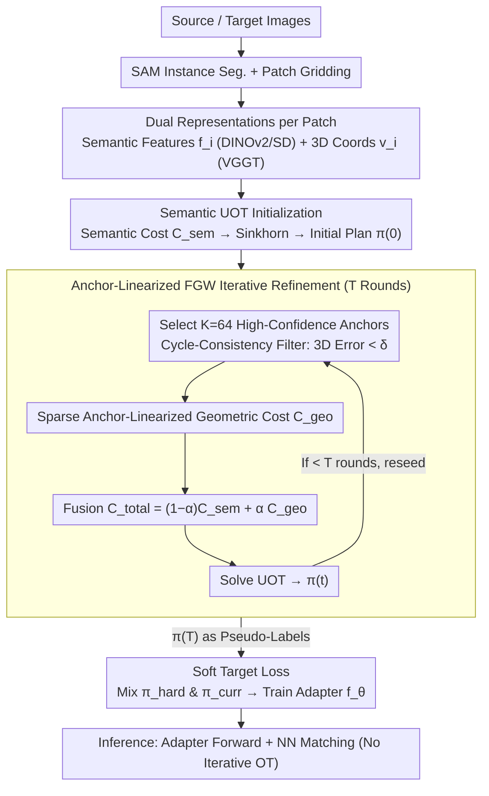

# Shape-of-You: Fused Gromov-Wasserstein Optimal Transport for Semantic Correspondence in-the-Wild

**Conference**: CVPR2026  
**arXiv**: [2603.11618](https://arxiv.org/abs/2603.11618)  
**Code**: [Shape-of-You](https://github.com/im-jiin/Shape-of-You)  
**Area**: Self-supervised  
**Keywords**: Semantic Correspondence, Optimal Transport, Gromov-Wasserstein, 3D Geometric Constraints, Pseudo-labels, Foundation Models

## TL;DR

This work reformulates semantic correspondence as a Fused Gromov-Wasserstein (FGW) optimal transport problem. By leveraging geometric structure constraints from 3D foundation models to generate globally consistent pseudo-labels, it addresses the geometric inconsistency caused by the locality and 2D appearance ambiguity of traditional nearest-neighbor matching.

## Background & Motivation

**Core Challenges in Semantic Correspondence**: In in-the-wild scenarios, extreme viewpoint changes, illumination variations, and intra-class shape differences make establishing pixel-level semantic correspondence extremely difficult. Fully supervised methods depend on expensive pixel-wise annotations, limiting scalability.

**Inherent Limitations of Pseudo-label Methods**: Current methods without explicit geometric annotations (e.g., ASIC) rely on features from foundation models like DINO/SD for nearest-neighbor (NN) matching to generate pseudo-labels. However, NN matching is a local operation that ignores global structural relationships.

**Geometric Ambiguity of 2D Features**: Models trained purely on 2D appearance cannot reflect the true 3D geometric structure of objects, leading to semantically plausible but geometrically incorrect correspondences (e.g., mismatches in symmetric parts or repetitive texture regions).

**Local Matching Failing to Maintain Structural Consistency**: NN matching makes independent point-wise decisions, failing to guarantee global geometric coherence of the match set. The resulting training noise degrades model performance.

**GW Computational Bottleneck**: Gromov-Wasserstein is a non-convex quadratic programming problem. Solving it directly is computationally infeasible and requires efficient approximation schemes.

**Partial Visibility and Occlusion**: Objects in real-world scenes are often occluded or truncated. The hard marginal constraints of balanced optimal transport (where all mass must be transported) are unsuitable for such partial matching scenarios.

## Method

### Overall Architecture

Shape-of-You (SoY) addresses the long-standing issue of "geometric inconsistency in pseudo-labels" for in-the-wild semantic correspondence. It employs a two-stage approach: in the first stage, it combines semantic feature similarity and 3D geometric structure consistency via Fused Gromov-Wasserstein (FGW) optimal transport to generate high-quality, globally consistent pseudo-labels. In the second stage, a lightweight adapter is trained using a soft target loss. During inference, only a forward pass with nearest-neighbor matching is required, eliminating the need for iterative OT solving. On the input side, given source and target images, SAM is used to segment instance regions followed by patch-gridding. Each patch receives two representations: semantic features $\mathbf{f}_i \in \mathbb{R}^d$ from DINOv2/SD and 3D coordinates $\mathbf{v}_i \in \mathbb{R}^3$ lifted by VGGT (a 3D foundation model).

### Key Designs

**1. Semantic UOT Initialization: Addressing Occlusion with Unbalanced Transport**

In real scenarios, objects are frequently occluded or truncated. The hard marginal constraints of classic OT do not hold under partial matching. In the first stage (t=0), the semantic cost matrix $C^{\text{sem}}_{ij} = 1 - \cos(\mathbf{f}_i^A, \mathbf{f}_j^B)$ is computed. Unbalanced Optimal Transport (UOT) replaces classic OT by relaxing marginal constraints through KL-divergence penalties. This allows mass to remain untransported, naturally accommodating occlusions and non-overlapping regions. The initial transport plan $\pi^{(0)}$ is obtained via Sinkhorn iterations.

**2. Anchor-linearized FGW Iterative Refinement: Approximating Quadratic GW as Linear OT**

Pure semantic matching often yields "semantically reasonable but geometrically incorrect" results. However, structure comparison using Gromov-Wasserstein is a non-convex quadratic problem. The second stage (t>0) addresses this by selecting K=64 high-confidence anchor pairs from the previous $\pi^{(t-1)}$, requiring them to satisfy 3D cycle-consistency (forward-backward error below threshold $\delta$). By substituting one $\pi$ in the quadratic term with the sparse anchor transport plan $\hat{\pi}$, the $O(N^2M^2)$ problem is linearized into an $O(NMK)$ geometric cost: $C^{\text{geo}}_{ij} = \frac{1}{K}\sum_{(a_A,a_B)\in\mathcal{A}} |D^A_{i,a_A} - D^B_{j,a_B}|$. After normalization, costs are fused as $C^{\text{total}} = (1-\alpha)\tilde{C}^{\text{sem}} + \alpha\tilde{C}^{\text{geo}}$ ($\alpha=0.3$) and solved via UOT. Through $T$ iterations, anchors become increasingly accurate, and global structure is progressively injected into the final pseudo-label $\pi^{(T)}$.

**3. Soft Target Loss: Preserving Semantically Similar Candidates**

Extracting hard labels directly from $\pi^{(T)}$ may over-penalize candidates that are semantically valid but not chosen in the top-k. This method extracts top-k candidates from $\pi^{(T)}$ to form a multi-hot binary target $\pi^{\text{hard}}$, combining it with the semantic soft target $\pi^{\text{curr}}$ (calculated from current features with gradient stop) as $\pi^{\text{soft}} = (1-\beta)\pi^{\text{hard}} + \beta\pi^{\text{curr}}$ ($\beta=0.5$). This ensures the supervision signal anchors to global consistency while remaining tolerant of similar candidates.

### Loss & Training

$$\mathcal{L}_{\text{total}} = \mathcal{L}_{\text{soft}} + \mathcal{L}_{\text{dense}}$$

- $\mathcal{L}_{\text{soft}}$: Symmetric cross-entropy loss between predicted similarity distributions and $\pi^{\text{soft}}$, including a learnable temperature parameter $\tau$.
- $\mathcal{L}_{\text{dense}}$: Standard dense correspondence loss, propagating gradients to all feature map locations via soft-argmax, regularized with Gaussian noise $\epsilon$.

## Key Experimental Results

### Main Results

| Method | SPair-71k PCK@0.1 | SPair-71k PCK@0.05 | AP-10k I.S. | AP-10k C.S. |
|------|-------------------|---------------------|-------------|-------------|
| ASIC | 36.9 | - | - | - |
| DINOv2 | 55.7 | - | - | - |
| DistillDIFT | 59.8 | 42.7 | 65.5 | 62.8 |
| DINOv2 + SD | 63.5 | 48.3 | 65.5 | 63.3 |
| **SoY (Ours)** | **67.9** | **50.8** | **68.0** | **65.8** |

On SPair-71k, the method achieves 67.9% PCK@0.1, surpassing the zero-shot DINOv2+SD baseline by 4.4 percentage points and achieving SOTA or near-SOTA in 17 out of 18 classes. It also achieves optimal results across all three settings in AP-10k zero-shot evaluation.

### Ablation Study

| Pseudo-label Strategy | Geometry-aware PCK_label@0.1 |
|-----------|----------------------------|
| Nearest Neighbor | 53.8% |
| Semantic OT | 54.5% |
| Fused OT (balanced) | 55.7% |
| **Fused UOT (ours)** | **56.1%** |

| Component Ablation | PCK@0.1 |
|---------|---------|
| Backbone (DINOv2+SD) Zero-shot | 63.5 |
| Adapter + NN Labels | 64.6 |
| Adapter + FGW Labels | 66.8 |
| + relaxed c.c. + soft target loss | **67.9** |

### Key Findings

- **3D Geometric Distance is Crucial**: In intra-structure comparisons, 3D geometric distance (67.6%) outperforms both 2D distance (65.7%) and semantic distance (66.2%). Interestingly, 2D distance performed worse than the baseline without GW (66.5%).
- **Geometric Constraints Matter for Ambiguity**: The GW term provides a +2.3%p gain on the Geometry-aware subset, significantly higher than its overall impact, proving that 3D constraints primarily resolve geometric ambiguity.
- **Component Synergy**: FGW pseudo-labels (+2.0%p) offer far greater gains than cycle-consistency (+0.2%p), suggesting that global structure matching is more effective than local post-processing. Soft target loss further improves upon FGW labels.

## Highlights & Insights

- **Novel Problem Formulation**: First to model semantic correspondence as an FGW optimal transport problem, merging cross-domain semantic similarity (Wasserstein) with intra-domain geometric consistency (Gromov-Wasserstein).
- **Efficient Anchor Linearization**: Approximates the NP-hard quadratic GW problem using only 64 anchors, making it solvable via Sinkhorn and engineeringly feasible.
- **Strategic Use of 3D Foundation Models**: Utilizes VGGT to lift 2D images to 3D, providing meaningful geometric metrics for the GW term rather than relying on 2D coordinates.
- **High Inference Efficiency**: Once trained, inference only requires a lightweight adapter forward pass and nearest-neighbor matching, with no need for iterative OT solving.

## Limitations & Future Work

- **Dependency on 3D Model Quality**: Reconstructions failures in VGGT on transparent or flat surfaces can lead to erroneous anchors.
- **Symmetry Challenges**: Symmetrical parts (e.g., car doors) under certain viewpoints can still cause anchor mismatches.
- **Soft Target Oversmoothing**: The mixture ratio $\beta=0.5$ might occasionally blur geometric signals.
- **SAM Reliance**: Pseudo-label generation depends on SAM's instance segmentation quality; inaccurate masks impact downstream matching.

## Related Work & Insights

- **Semantic Correspondence without Geometric Labels**: ASIC (NN pseudo-labels), SHIC (image-to-shape), DistillDIFT (feature distillation) — these rely on local matching or 2D distillation and lack global structural awareness.
- **Optimal Transport for Structure Matching**: Traditional Wasserstein OT and GECO (using UOT for geometry-consistent feature learning) provide foundations, but lack the structural comparison capability of Gromov-Wasserstein.
- **3D Geometric Foundation Models**: DUSt3R and MASt3R require multiple stages; VGGT predicts multiple 3D attributes in a single pass. This work utilizes VGGT for geometric priors.
- **GW Approximation**: Techniques similar to anchor-based GW surrogates used in graph matching and video segmentation are adapted here for semantic correspondence.

## Rating

- Novelty: ⭐⭐⭐⭐ (FGW modeling combined with 3D priors is a first)
- Experimental Thoroughness: ⭐⭐⭐⭐ (Two datasets, thorough ablation, and pseudo-label quality verification)
- Writing Quality: ⭐⭐⭐⭐ (Clear OT background, complete derivation, and informative visuals)
- Value: ⭐⭐⭐⭐ (Provides a new paradigm for unsupervised semantic correspondence; 3D+OT approach is transferable to other matching tasks)

<!-- RELATED:START -->

## Related Papers

- [\[CVPR 2026\] An Optimal Transport-driven Approach for Cultivating Latent Space in Online Incremental Learning](an_optimal_transport_driven_approach_for_cultivating_latent_space_in_online_incr.md)
- [\[ICCV 2025\] MoSiC: Optimal-Transport Motion Trajectory for Dense Self-Supervised Learning](../../ICCV2025/self_supervised/mosic_optimal-transport_motion_trajectory_for_dense_self-supervised_learning.md)
- [\[CVPR 2026\] Can You Learn to See Without Images? Procedural Warm-Up for Vision Transformers](can_you_learn_to_see_without_images_procedural_warm-up_for_vision_transformers.md)
- [\[CVPR 2026\] SECOS: Semantic Capture for Rigorous Classification in Open-World Semi-Supervised Learning](secos_semantic_capture_for_rigorous_classification_in_open-world_semi-supervised.md)
- [\[ICML 2026\] PartCo: Part-Level Correspondence Priors Enhance Category Discovery](../../ICML2026/self_supervised/partco_part-level_correspondence_priors_enhance_category_discovery.md)

<!-- RELATED:END -->
