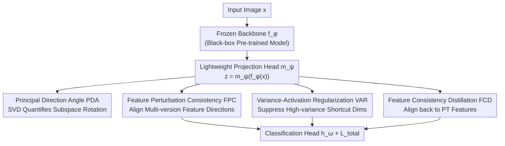

# Stabilizing Feature Geometry in Noisy Pretrained Models for Robust Downstream Tasks

**Conference**: CVPR 2026  
**Paper**: [CVF Open Access](https://openaccess.thecvf.com/content/CVPR2026/html/Zhang_Stabilizing_Feature_Geometry_in_Noisy_Pretrained_Models_for_Robust_Downstream_CVPR_2026_paper.html)  
**Code**: None  
**Area**: Representation Learning / Pre-training Robustness  
**Keywords**: Catastrophic inheritance, feature geometry, principal direction rotation, noisy pre-training, black-box fine-tuning

## TL;DR
The authors discover that pre-training noise not only weakens spectral energy but also causes a "rotation" of the principal feature subspace. They propose the Principal Direction Angle (PDA) to quantify this rotation and design the FGS framework—a lightweight projection head inserted after a frozen backbone using a trio of Perturbation Consistency, Variance-Activation Regularization, and Feature Consistency Distillation. FGS outperforms previous spectral methods on multiple vision benchmarks by at least +1.53% on average.

## Background & Motivation
**Background**: The Pre-train then Fine-tune (PT-FT) paradigm is mainstream in modern vision models—learning transferable representations on massive datasets like ImageNet-21K, LAION-5B, or JFT-300M, followed by supervised adaptation to downstream tasks. However, these large-scale datasets, often crawled from the web with automated labeling, inevitably contain low-quality images, mislabeled or ambiguous tags, and social biases.

**Limitations of Prior Work**: Noise is "absorbed" by the model and inherited by downstream features, causing performance to collapse as noise ratios increase—a phenomenon termed **catastrophic inheritance**, observed in OpenCLIP, BERT, and GPT. Few existing studies (e.g., NMTune, LoRA-based adaptation) explain this from a **spectral perspective**: noise suppresses the energy of principal components in the singular value spectrum (spectral energy degradation, SED). Consequently, they attempt to "restore" representation strength by amplifying leading singular values.

**Key Challenge**: Spectral methods implicitly assume that **principal feature directions remain invariant under noisy pre-training, with only energy weakening**. Upon re-examining this assumption, the authors identify an overlooked effect: **even when spectral energy remains nearly intact, mild pre-training noise causes significant rotation of the principal feature subspace**. If principal directions are occupied by low-semantic information (e.g., background), blindly amplifying leading singular values will reinforce noise patterns.

**Goal**: (1) Identify a geometric metric to quantitatively characterize "principal direction rotation." (2) Correct the distorted feature geometry under realistic constraints where clean reference models are unavailable and backbones are often black-boxes that cannot propagate gradients.

**Key Insight**: By using SVD to examine the **angles** between clean and noisy principal subspaces, the authors find that this angle increases monotonically with the noise ratio and is strongly negatively correlated with downstream accuracy. Grad-CAM visualizations also show that noisy models shift attention from primary objects (e.g., "dog") to backgrounds (e.g., "pencils"), proving that rotation is a primary cause, rather than mere energy decay.

**Core Idea**: Diagnose rotation using the Principal Direction Angle (PDA), then utilize a "clean-model-free, backbone-frozen" geometric stabilization trio to suppress rotation and stabilize feature geometry.

## Method

### Overall Architecture
The Feature Geometry Stabilization (FGS) framework dictates that since clean models are unavailable and backbones are often black-box, the **backbone remains untouched**. Instead, a **lightweight learnable projection module** $m_\psi$ is inserted between the frozen pre-trained backbone $f_\phi$ and the task classification head $h_\omega$ to reshape the inherited features $z = m_\psi(f_\phi(x))$. The projection head training does not require backbone gradients, making it compatible with black-box architectures.

Three complementary regularization terms are stacked around this projection head: **FPC** maintains local stability of feature directions under perturbation (directly countering "rotation"), **VAR** suppresses "shortcut dimensions" with high variance/activation but low semantics (preventing noise from occupying principal directions), and **FCD** distills the projected features back to pre-trained features (preventing over-correction from losing pre-trained semantics). The final objective = Cross-Entropy + weighted sum of the three regularizations.

### Key Designs

**1. Principal Direction Angle (PDA): Quantifying "Feature Rotation"**

Spectral views ignore direction. PDA quantifies the angle between the principal subspaces of a clean model $P_0$ and a noisy model $P_\gamma$. Let $F_\gamma \in \mathbb{R}^{M\times D}$ be the feature matrix for $M$ samples from model $P_\gamma$. Using SVD: $F_\gamma = U_\gamma \Sigma_\gamma V_\gamma^\top$, the first $k$ left singular vectors span the principal subspace $\mathcal{U}_\gamma = \text{span}(u_{\gamma,1},\dots,u_{\gamma,k})$. PDA calculates the average principal angle between the directions of two subspaces:

$$\bar\theta_\gamma = \frac{1}{k}\sum_{i=1}^{k}\theta_i$$

where $\theta_i$ is the $i$-th principal angle. For the clean model, $\bar\theta_0 = 0$. A larger $\bar\theta_\gamma$ indicates more severe rotation by noise. Empirical results show it increases with noise (5% to 30%) and correlates with lower accuracy even when spectral energy is stable.

**2. Feature Perturbation Consistency (FPC): Directional Stability via Self-Perturbation**

Since clean references are unavailable, FPC uses "self-perturbation." Controlled noise is injected into the input feature $f = f_\phi(x)$ to get $f^{noisy} = f + \epsilon$ (where $\epsilon$ follows a distribution like salt-and-pepper noise). Both versions pass through $m_\psi$ and $h_\omega$ to obtain $z, z^{noisy}, h, h^{noisy}$. Cosine similarity enforces directional alignment:

$$\mathcal{L}_{\mathrm{FPC}} = \frac{1}{B}\sum_{i=1}^{B}\big(1-\cos(\theta_{z,i}) + 1-\cos(\theta_{h,i})\big)$$

This constraint suppresses directional drift and anchors representations in stable subspaces, serving as a proxy task to counter rotation identified by PDA.

**3. Variance-Activation Regularization (VAR): Cutting Off "Shortcut Dimensions"**

Models often rely on "shortcut features" (high variance/activation, often dataset-specific pseudo-correlations). Noise aligning with these unstable axes distorts the principal directions. VAR penalizes the product of "variance $\times$ activation energy" for each dimension $j$:

$$\mathcal{L}_{\mathrm{VAR}} = \sum_{j=1}^{d}\Big(\frac{1}{B}\sum_{i=1}^{B}(z_{ij}-\mu_j)^2\Big)\Big(\frac{1}{B}\sum_{i=1}^{B}z_{ij}^2\Big)$$

where $\mu_j$ is the batch mean of the $j$-th dimension. This suppresses dimensions that are both high-variance and high-activation, preventing them from dominating the spectrum.

**4. Feature Consistency Distillation (FCD): Semantic Preservation**

Strict constraints might erode pre-trained semantics. FCD distills projected features $z$ back to pre-trained features $f$ using KL divergence with temperature $T$:

$$\mathcal{L}_{\mathrm{FCD}} = \frac{1}{B}\sum_{i=1}^{B}\mathrm{KL}\!\left(\mathrm{softmax}\!\left(\tfrac{f_i}{T}\right)\,\Big\|\,\mathrm{softmax}\!\left(\tfrac{z_i}{T}\right)\right)$$

This preserves the transferable structure, allowing only local subspace fine-tuning. The total objective is:

$$\mathcal{L}_{\mathrm{total}} = \mathcal{L}_{\mathrm{CE}} + \lambda_1\mathcal{L}_{\mathrm{FPC}} + \lambda_2\mathcal{L}_{\mathrm{VAR}} + \lambda_3\mathcal{L}_{\mathrm{FCD}}$$

## Key Experimental Results

Settings: 5 real-world noisy pre-trained models (ResNetv2-152x2/Swin-L supervised on ImageNet-21K, EfficientNet-B3 semi-supervised on JFT-300M, ViT-L/ConvNext-L contrastive on LAION-2B) + ResNet-50 with synthetic noise. Baselines: LP (Linear Probing), MLP, NMTune (Prev. SOTA).

### Main Results (Real-world Noisy Models, Average Accuracy)

| Model / Task | LP | MLP | NMTune (Prev. SOTA) | FGS (Ours) |
|------|------|------|------|------|
| ResNetv2-152x2 · OOD | 0.4871 | 0.5126 | 0.5052 | **0.5408** |
| ResNetv2-152x2 · ID | 0.8461 | 0.8523 | 0.8511 | **0.8665** |
| Swin-L · OOD | 0.5733 | 0.5971 | 0.6215 | **0.6368** |
| Swin-L · ID | 0.8718 | 0.8876 | 0.8982 | **0.9074** |
| ViT-L · OOD | 0.7154 | 0.7359 | 0.7403 | **0.7662** |
| ConvNext-L · OOD | 0.7070 | 0.7320 | 0.7528 | **0.7668** |

Gain on OOD over MLP/NMTune: ResNetv2-152x2 +2.82%/+3.56%, ViT-L +3.03%/+2.59%. Even for naturally robust models (Swin-L), stabilizing feature geometry provides additional gains.

### Ablation Study (OOD, Cumulative Modules, DomainNetSketch)

| Configuration | Key Phenomenon | Description |
|------|---------|------|
| MLP (Baseline) | Lowest | No geometric regularization |
| + FCD only | Better than MLP | Distillation alone has limited gain |
| + VAR only | Better than MLP | Suppressing shortcut dims is effective |
| + FPC only | Strongest single module | Outperforms VAR/FCD by 1.29%/0.88% at 30% noise |
| Full (FPC+VAR+FCD) | Highest across all noise | Modules are complementary with synergistic gains |

### Key Findings
- **FPC contributes the most**: All modules outperform MLP individually, but FPC shows the largest surge at high noise ratios, confirming that "countering directional rotation" is the core challenge.
- **Double-Noise Robustness**: When both pre-training and downstream datasets are noisy (up to 50% downstream noise), FGS reduces performance decay by **12–23%** compared to NMTune.
- **Noise Injection Sensitivity**: For FPC, salt-and-pepper noise performs best. Generator-synthesized noise leads to performance drops, likely because it encodes harmful biases from the generator.
- **t-SNE Visualization**: FGS significantly improves intra-class compactness and inter-class separability at $\gamma=20\%$.

## Highlights & Insights
- **Quantifying the Overlooked "Directional Rotation" via PDA**: PDA proves that rotation occurs even when energy is stable, disproving the assumption of invariant principal directions in spectral methods.
- **Black-box Friendly**: By freezing the backbone and learning only the projection head, FGS is highly practical for closed-source models (LAION/JFT).
- **Clear Logic in the Trio**: FPC anchors directions, VAR cuts off bad axes, and FCD prevents semantic loss—a closed loop of "Attack, Defend, and Shield."
- **Self-Perturbation Proxy**: Using "consistency under self-perturbation" as a proxy for stability successfully circumvents the need for a clean reference model.

## Limitations & Future Work
- PDA's diagnostic value relies on having a clean model to calculate angles (constructed via artificial noise in experiments). Real-world closed-source models lack clean counterparts, although the method itself functions without PDA.
- Stabilization occurs only at the projection head; interior backbone distortions remain. The upper bound is limited by the frozen backbone's quality.
- Performance gains are robust but moderate (+1.5% to +4%). The failure of generative noise suggests sensitivity to perturbation design.
- Future Work: Differentiable PDA for online subspace constraint or estimating rotation without clean references.

## Related Work & Insights
- **vs. NMTune (Prev. SOTA)**: NMTune only amplifies singular values, assuming fixed directions. FGS addresses directional rotation, which NMTune might inadvertently amplify. FGS consistently beats NMTune by 1.5%–3.5% on OOD tasks.
- **vs. Spectral Energy Research**: Prior work attributed catastrophic inheritance to SED. Ours argues that SED and directional instability **jointly** drive the phenomenon.
- **vs. Downstream Denoising (e.g., TURN)**: Those methods handle target noise but ignore pre-trained distortion. FGS is complementary to fine-tuning-stage robustification.

## Rating
- Novelty: ⭐⭐⭐⭐⭐ Advancing catastrophic inheritance from a spectral to a geometric perspective via PDA is a significant shift.
- Experimental Thoroughness: ⭐⭐⭐⭐ Extensive coverage of real models and noise types, though lacks a systematic sensitivity analysis of $\lambda$ and head capacity.
- Writing Quality: ⭐⭐⭐⭐ Clear "Diagnosis to Prescription" narrative.
- Value: ⭐⭐⭐⭐ Practical for black-box backbones; the PDA diagnostic paradigm is highly transferable.

<!-- RELATED:START -->

## Related Papers

- [\[AAAI 2026\] Robust Tabular Foundation Models](../../AAAI2026/self_supervised/robust_tabular_foundation_models.md)
- [\[CVPR 2026\] Teaching DINOv3 About Partial 3D Geometry: A Self-Supervised Geometry-Aware Approach](teaching_dinov3_about_partial_3d_geometry_a_self-supervised_geometry-aware_appro.md)
- [\[CVPR 2026\] OpenVision 2: A Family of Generative Pretrained Visual Encoders for Multimodal Learning](openvision_2_a_family_of_generative_pretrained_visual_encoders_for_multimodal_le.md)
- [\[CVPR 2026\] Reframing Long-Tailed Learning via Loss Landscape Geometry](reframing_long-tailed_learning_via_loss_landscape_geometry.md)
- [\[CVPR 2026\] Geometry-driven OOD Detectors Are Class-Incremental Learners](geometry-driven_ood_detectors_are_class-incremental_learners.md)

<!-- RELATED:END -->
