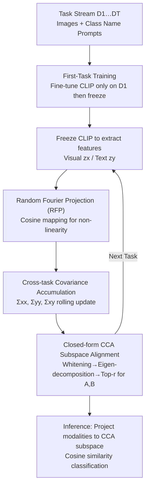

# Subspace Alignment for CLIP-based Continual Learning via Canonical Correlation Analysis

**Conference**: CVPR 2026  
**Paper**: [CVF Open Access](https://openaccess.thecvf.com/content/CVPR2026/html/Zhang_Subspace_Alignment_for_CLIP-based_Continual_Learning_via_Canonical_Correlation_Analysis_CVPR_2026_paper.html)  
**Code**: https://github.com/zhwhu/CCA-CL  
**Area**: Continual Learning / Multi-modal VLM  
**Keywords**: CLIP, Continual Learning, Asymmetric Drift, Canonical Correlation Analysis, Subspace Alignment

## TL;DR
Addressing the issue where the "visual encoder drift is significantly greater than the text encoder drift" in CLIP-based continual learning (termed Asymmetric Drift by the authors), this paper proposes CCA-CL. It accumulates visual-text covariance statistics across tasks and employs closed-form Canonical Correlation Analysis (CCA) to solve for a shared subspace that maximizes cross-modal correlation. This pulls both modalities back into alignment without modifying CLIP parameters or storing exemplars. By incorporating Random Fourier Projections (RFP) for non-linearity, it achieves SOTA accuracy across four benchmarks with the fastest training speed (5.8 minutes on CIFAR-100).

## Background & Motivation

**Background**: Performing Class-Incremental Learning (CIL) using frozen or fine-tuned pre-trained CLIP has become a mainstream approach. Strategies typically involve either freezing CLIP as a feature extractor with external learnable modules (e.g., PROOF, ENGINE) or fine-tuning the backbone via parameter-efficient methods like LoRA (e.g., MagMax, LGVLM). Both paths aim to preserve original CLIP representations while adapting to new tasks.

**Limitations of Prior Work**: Existing methods focus primarily on "how to update parameters for new tasks" but overlook a structural problem accumulated across tasks—the severe asymmetry in update magnitudes between the visual and text branches. The visual input distribution changes drastically with tasks (e.g., Task A desert scenes $\rightarrow$ Task B images of cats), forcing significant drift in the image encoder. Conversely, the text side only involves changing class names within a template like `"a photo of [CLS]"`, resulting in minimal distributional variance and leaving the text encoder nearly static.

**Key Challenge**: The authors formally define this phenomenon as **Asymmetric Drift (AD)**. The visual drift $\Delta_v$ is consistently larger than the text drift $\Delta_t$. As the two modalities move through the feature space at different speeds, the visual-text feature distance $\text{dist}(t)$ monotonically increases over tasks, leading to degraded cross-modal alignment and declining accuracy (validated in Figure 3 of the paper). A natural solution would be to pull the modalities closer for each task. however, directly fine-tuning CLIP in its original space to narrow this distance risks destroying pre-trained knowledge and triggering catastrophic forgetting—this is the core conflict.

**Goal + Key Insight**: The objective is to narrow the modal distance **without modifying CLIP parameters**. The authors' insight is: rather than forcing feature adjustments in the original CLIP space, it is better to **project both modalities into a new shared subspace** where they naturally align. This is precisely what Canonical Correlation Analysis (CCA), a classic statistical tool from 1936, excels at: finding a pair of linear projections that maximize the correlation between two sets of projected variables.

**Core Idea**: Accumulate cross-task visual-text covariance statistics and solve a closed-form CCA to obtain a pair of projection matrices $(A, B)$, mapping image and text features into a shared subspace where "correlation is maximized and distance is minimized" before computing similarity. Since only covariance matrices are accumulated without storing original samples, the method is inherently exemplar-free. Random Fourier Projections (RFP) are further utilized to capture non-linear relationships that linear CCA cannot represent.

## Method

### Overall Architecture

The CCA-CL pipeline consists of a lightweight fine-tuning of CLIP on the first task (First-Task Training, FTT) to adapt the model to the downstream domain, followed by **permanently freezing CLIP**. For every subsequent task, the frozen encoders extract visual features $z_x$ and text features $z_y$ (optionally passing through RFP first). Their cross-task covariance statistics $(\Sigma_{xx}, \Sigma_{yy}, \Sigma_{xy})$ are updated recursively, and a **closed-form** CCA is solved to obtain the projection matrices $(A_t, B_t)$ for the current task. During inference, image features and text prototypes of all classes are projected into this CCA subspace for classification based on cosine similarity. Aside from the FTT, the entire process involves **no gradient-based training**—CCA is a closed-form solution and RFP is a random mapping, ensuring both speed and stability.

### Key Designs

**1. Cross-task Covariance Accumulation + Closed-form CCA Subspace Alignment: Converting Modal Distance Reduction into a Training-free Statistical Problem**

This is the core of the method. The pain point is that AD causes visual and text features to drift further apart in the original CLIP space, and direct fine-tuning to realign them ruins pre-trained knowledge. CCA-CL circumvents the original space to find a shared subspace where **cross-modal correlation is maximized**. Given image features $z_x \in \mathbb{R}^{N \times D}$ and corresponding text features $z_y \in \mathbb{R}^{N \times D}$ in a mini-batch, centered around rolling means $\bar z_x, \bar z_y$, three covariances are recursively accumulated:

$$\Sigma_{xx}\leftarrow\Sigma_{xx}+(z_x-\bar z_x)^\top(z_x-\bar z_x),\quad \Sigma_{yy}\leftarrow\Sigma_{yy}+(z_y-\bar z_y)^\top(z_y-\bar z_y),\quad \Sigma_{xy}\leftarrow\Sigma_{xy}+(z_x-\bar z_x)^\top(z_y-\bar z_y)$$

This "covariance-only accumulation" design offers a key benefit: covariance implicitly retains long-term memory of past data distributions **without requiring original samples**, making it naturally exemplar-free. After accumulation, the closed-form CCA is solved: first, eigen-decomposition of $\Sigma_{xx}, \Sigma_{yy}$ yields whitening matrices $W_x=U_x\Lambda_x^{-1/2}U_x^\top$ and $W_y=U_y\Lambda_y^{-1/2}U_y^\top$; then the whitened cross-covariance $C=W_x\Sigma_{xy}W_y$ is computed; finally, eigen-decomposition of $K=CC^\top$ gives $KV=V\Lambda_\rho$ (where $\Lambda_\rho=\text{diag}(\rho_1,\dots,\rho_D)$ are canonical correlation coefficients). Following an **energy criterion**, only the top-$r$ directions are kept: $\sum_{i=1}^{r}\rho_i^2 / \sum_{i=1}^{D}\rho_i^2\ge\eta$ (typically $\eta=0.99$), discarding noisy directions. The final projection matrices are:

$$A=W_xV_r,\qquad B=W_y(C^\top V_r)\Lambda_\rho^{r\,-1}$$

Both modalities are projected into the shared subspace: $z_x^{\text{cca}}=A^\top z_x$, $z_y^{\text{cca}}=B^\top z_y$. In this subspace, correlation is maximized and distance minimized, resolving the alignment issue via a gradient-free closed-form solution. Unlike Deep CCA or Kernel CCA which require training, the use of closed-form statistical alignment here is why CLIP remains undisturbed and training is fast.

**2. Random Fourier Projection (RFP): Supplementing Linear CCA with Non-linear Expressiveness**

Linear CCA only captures linear dependencies, which lacks expressiveness in complex scenarios. The authors address this by passing $z_x, z_y$ through a random Fourier mapping layer before covariance accumulation, projecting features into a high-dimensional space where non-linear correlations become linearly separable:

$$z_x'=\phi(z_x)=\sqrt{\tfrac{2}{D'}}\cos(Wz_x+b),\qquad z_y'=\phi(z_y)=\sqrt{\tfrac{2}{D'}}\cos(Wz_y+b)$$

Here, the projection matrix $W \in \mathbb{R}^{D' \times D}$ is sampled from a Gaussian distribution $\mathcal{N}(0,\sigma^{-2}I)$, and $b$ is sampled uniformly from $[0, 2\pi]$, where $D'$ is the projection dimension. This random projection implicitly approximates an RBF kernel mapping. Once features are in this high-dimensional space, previously non-linear cross-modal correlations become approximately linearly separable, allowing the same closed-form CCA to be applied. The beauty of RFP lies in its **zero trainable parameters and zero optimization steps**—it is a purely random mapping that extends CCA's power from linear to non-linear. Ablation studies show RFP alone contributes +4.5% in accuracy.

**3. First-Task Training (FTT) + Fully Frozen Pipeline: Using One Adaptation to Prevent AD via Freezing**

CCA-CL unfreezes all CLIP parameters for a lightweight fine-tuning only on the first task (using SGD, a learning rate of $1\times10^{-6}$, batch size 64, for 5 epochs). Subsequently, CLIP is frozen for all remaining tasks. This design serves a dual purpose: first, FTT adapts CLIP to the downstream data domain, balancing domain adaptation with the preservation of zero-shot generalization; second, **reducing the total training volume inherently mitigates AD**. Since asymmetric drift stems from continuous asymmetric parameter updates, freezing subsequent tasks and relying on statistical alignment cuts off the source of the drift. A training-free variant, `CCA-CL (no FTT)`, which performs zero parameter updates, drops only 2% (83.0% to 81.0%) compared to the full version on CIFAR-100 while reducing training time from 5.8 to 3.9 minutes, proving that subspace alignment is the primary performance driver.

### Loss & Training
Except for the lightweight fine-tuning (standard classification fine-tuning) on the first task, the entire continual learning process involves **no loss function and no gradient training**: covariance is accumulated rolling-wise, and projection matrices are solved via closed-form CCA. At inference, classification is based on cosine similarity in the subspace:

$$\hat y=\arg\max_c\frac{(A^\top\phi_{\text{rfp}}(F_v(x)))^\top(B^\top\phi_{\text{rfp}}(z_y^{(c)}))}{\|A^\top\phi_{\text{rfp}}(F_v(x))\|_2\,\|B^\top\phi_{\text{rfp}}(z_y^{(c)})\|_2}$$

## Key Experimental Results

Evaluated on four benchmarks (CIFAR-100, ImageNet-R, ImageNet-100, CUB-200) split into 10 incremental tasks using a CLIP ViT-B/16 backbone on a single RTX 4090. Metrics reported are Average Incremental Accuracy (Avg) and Last Task Accuracy (Last).

### Main Results

| Method | Replay | CIFAR-100 (Avg/Last) | ImageNet-R | ImageNet-100 | CUB-200 |
|------|------|------|------|------|------|
| Continual-CLIP | × | 75.2 / 66.7 | 79.1 / 72.0 | 85.0 / 75.4 | 76.3 / 71.3 |
| MagMax (ECCV'24) | × | 85.6 / 79.0 | 87.1 / 80.8 | 86.3 / 75.9 | 70.8 / 62.1 |
| RAPF (ECCV'24) | ✓ | 86.1 / 79.0 | 85.5 / 80.2 | 87.5 / 80.2 | 83.0 / 76.3 |
| ENGINE (ICCV'25) | ✓ | 86.9 / 79.2 | 86.2 / 80.3 | — | 85.3 / 79.2 |
| PROOF (TPAMI'25) | ✓ | 84.8 / 76.2 | 82.8 / 77.0 | 84.7 / 72.4 | 83.9 / 79.3 |
| **Ours (no FTT)** | × | 85.4 / 81.0 | 84.7 / 79.4 | 86.0 / 78.0 | 85.9 / 79.2 |
| **Ours (CCA-CL)** | × | **87.2 / 83.0** | **86.8 / 81.3** | 86.9 / 80.2 | **86.3 / 79.7** |

Ours achieves the **highest Last accuracy across all datasets**, outperforming the runner-up by 3.8% on CIFAR-100 (83.0 vs ENGINE 79.2) **without relying on any exemplar replay or GPT-generated prompts**. While Avg accuracy is the highest except on ImageNet-100 (where CLAP/RAPF benefit from replay), the training-free `no FTT` variant still ranks second on CIFAR-100 and outperforms most competitors on other datasets despite updating zero parameters.

### Ablation Study

| CCA | RFP | FTT | CIFAR-100 Acc | Description |
|-----|-----|-----|------|------|
| | | | 66.7 | Continual-CLIP Baseline (Frozen) |
| ✓ | | | 76.5 | +CCA Subspace Alignment, +9.8 |
| ✓ | ✓ | | 81.0 | +RFP Non-linearity, +4.5 |
| ✓ | ✓ | ✓ | **83.0** | +FTT First-Task Fine-tuning, +2.0 (Full) |

Each component contributes positively: CCA Subspace Alignment is the primary driver (+9.8), followed by RFP non-linearity (+4.5), and FTT (+2.0).

### Key Findings
- **Dominant Efficiency**: CCA-CL completes all 10 tasks on CIFAR-100 in just 5.8 minutes, compared to 13.9 minutes for RAPF (over 2x slower) and over 80 minutes for ENGINE/SLCA (over 10x slower). Higher accuracy is achieved without iterative training due to the closed-form solution and random mapping. `no FTT` further reduces this to 3.9 minutes.
- **RFP Width $W$ Trade-off**: Increasing $W$ from 2048 to 10240 shows accuracy improves then stabilizes, while VRAM consumption grows monotonically. $W=6144$ (i.e., $1024\times6$) provides the best trade-off (81.0% Last, 6.3 GB VRAM).
- **Energy Threshold $\eta$**: At $\eta=0.99$, only $\bar r=47.2$ canonical directions are retained on average to achieve 81.0% accuracy. Setting $\eta$ too high (e.g., 1.0 to keep all 6144 dimensions) introduces noisy directions and slightly degrades performance, highlighting the need for "compression + denoising" in the subspace.
- **Motivation Validation**: Figure 5 compares modal distances—direct CLIP fine-tuning causes distance to increase and accuracy to decrease across tasks; Continual-CLIP (frozen) maintains a stable but large distance. CCA-CL keeps the distance both small and stable, leading to consistent accuracy gains and confirming the causal link of "AD $\rightarrow$ increased modal distance $\rightarrow$ accuracy drop."

## Highlights & Insights
- **Formalizing an overlooked phenomenon into a measurable problem**: The authors use $\Delta_v, \Delta_t, \text{dist}(t)$ to quantify the chain of "Visual Drift > Text Drift $\rightarrow$ increased modal distance $\rightarrow$ performance drop." The definition and metrics of Asymmetric Drift provide a solid foundation for future research.
- **Solving modern multi-modal problems with 90-year-old statistical tools**: CCA (1936) is naturally designed to maximize correlation between two sets of variables, precisely matching the "cross-modal alignment" requirement. Replacing gradient training with its **closed-form solution** is elegant and avoids disturbing CLIP parameters.
- **Covariance as Memory**: Accumulating $\Sigma$ without storing samples implicitly preserves historical distributions. This concept of using covariance as a memory mechanism is a reusable pattern for other lightweight, exemplar-free incremental scenarios.
- **Zero-parameter non-linear expansion**: Using RFP to approximate RBF kernels upgrades linear CCA to its non-linear counterpart without adding trainable parameters or optimization steps. This trick is applicable wherever linear methods lack expressiveness but training is undesirable.

## Limitations & Future Work
- The method still relies on **First-Task Fine-tuning (FTT)**; future work could incorporate Parameter-Efficient Fine-Tuning (PEFT) to further improve scalability and stability.
- **Assumption dependency**: The advantage of CCA-CL relies on the stability of the text side (low variance). In settings with richer or more diverse text prompts (e.g., long descriptions or GPT-generated prompts), text drift may no longer be negligible.
- The experiments focus on 10-task class-incremental splits on standard classification benchmarks; behavior in longer task sequences or across drastically different domains requires further exploration.
- High-dimensional RFP features ($W=10240$ requires 11.9 GB VRAM) might become a memory bottleneck in scenarios with massive class counts or higher feature dimensions.

## Related Work & Insights
- **vs PROOF / ENGINE (Frozen CLIP + Learnable Modules)**: These rely on training additional modules for feature fusion or text knowledge injection, often requiring gradients and sometimes GPT prompts/replay. CCA-CL avoids extra modules and uses closed-form CCA for statistical alignment.
- **vs MagMax / LGVLM (Fine-tuned CLIP)**: These methods update CLIP itself via task vectors or LoRA, which is the root cause of Asymmetric Drift. CCA-CL instead freezes CLIP and aligns in a subspace to bypass AD.
- **vs MG-CLIP / Mod-X (Modal Misalignment perspective)**: MG-CLIP maintains a stable modal gap, and Mod-X analyzes intra-modal rotation and inter-modal offset. CCA-CL approaches this from a **distance perspective** and explicitly minimizes the modal distance via CCA projection.
- **vs Deep CCA / Kernel CCA**: Modern CCA variants typically require iterative training. This paper adheres to **closed-form CCA** for its training-free nature and suitability for rapid incremental learning, using RFP to compensate for non-linearity.

## Rating
- Novelty: ⭐⭐⭐⭐ First to formalize and quantify Asymmetric Drift; usage of closed-form CCA + RFP for exemplar-free alignment is highly original.
- Experimental Thoroughness: ⭐⭐⭐⭐ Four benchmarks, deep ablation, efficiency analysis, and visual motivation validation; though task sequences are relatively standard.
- Writing Quality: ⭐⭐⭐⭐ Logical flow from motivation to metrics to method to validation is clear; complete formulas and diagrams.
- Value: ⭐⭐⭐⭐ Fast, accurate, and exemplar-free; highly practical for deployment. The covariance-as-memory logic and AD metric are highly reusable.

<!-- RELATED:START -->

## Related Papers

- [\[NeurIPS 2025\] Continuous Subspace Optimization for Continual Learning (CoSO)](../../NeurIPS2025/self_supervised/continuous_subspace_optimization_for_continual_learning.md)
- [\[CVPR 2026\] A Faster Path to Continual Learning](a_faster_path_to_continual_learning.md)
- [\[CVPR 2026\] Spectral Mixture-of-Experts for Continual Learning](spectral_mixture-of-experts_for_continual_learning.md)
- [\[CVPR 2026\] Is Parameter Isolation Better for Prompt-Based Continual Learning?](is_parameter_isolation_better_for_prompt-based_continual_learning.md)
- [\[CVPR 2026\] Exemplar-Free Continual Learning for State Space Models](exemplar-free_continual_learning_for_state_space_models.md)

<!-- RELATED:END -->
