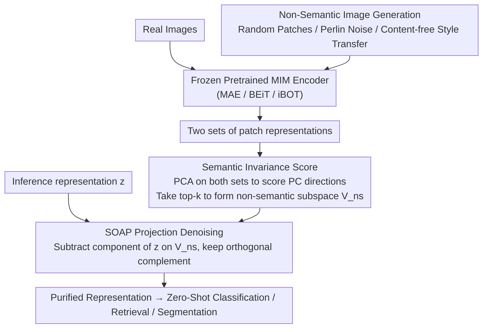

# Suppressing Non-Semantic Noise in Masked Image Modeling Representations

**Conference**: CVPR 2026  
**arXiv**: [2604.00172](https://arxiv.org/abs/2604.00172)  
**Code**: None  
**Area**: Self-Supervised Learning  
**Keywords**: Masked Image Modeling, Non-semantic noise, Principal Component Analysis, Representation purification, Zero-shot classification

## TL;DR

This paper reveals that representations learned by Masked Image Modeling (MIM) retain a significant amount of non-semantic information (low-level features such as texture and color). It proposes a training-free post-processing method, SOAP (Semantically Orthogonal Artifact Projection), which identifies and removes non-semantic components via PCA, consistently improving zero-shot performance across multiple MIM models.

## Background & Motivation

**Background**: Masked Image Modeling (MIM) has become a mainstream paradigm for self-supervised visual representation learning. Methods represented by MAE, BEiT, and iBOT reconstruct masked patches of input images, and their learned ViT representations achieve excellent performance on downstream tasks such as classification, detection, and segmentation.

**Limitations of Prior Work**: Although MIM methods perform exceptionally well after fine-tuning, their performance in direct usage scenarios like zero-shot classification or linear probing is significantly weaker than contrastive learning methods (e.g., DINO, CLIP). This suggests that MIM representations are mixed with information that is useless or even harmful for downstream semantic tasks.

**Key Challenge**: The training objective of MIM is pixel-level or token-level reconstruction. This objective essentially forces the model to encode massive amounts of low-level visual information (texture, color distribution, edge patterns, etc.). While this non-semantic information aids reconstruction, it acts as noise for semantic understanding, interfering with tasks like classification and retrieval during inference.

**Goal**: (1) Quantitatively measure the non-semantic information content in MIM representations; (2) Propose a simple and efficient method to directly suppress non-semantic components in representations without retraining.

**Key Insight**: The authors observed that if PCA is used to analyze patch representations of real images and synthetic "non-semantic" images (e.g., random textures or color noise that retain low-level statistics without semantic content), their principal component directions overlap significantly. These shared directions specifically encode non-semantic information.

**Core Idea**: Use PCA to identify the principal component directions of non-semantic information and project patch representations into their orthogonal space (i.e., removing these directions) to obtain pure semantic representations—this is the SOAP method.

## Method

### Overall Architecture

SOAP addresses a specific limitation: while MIM models like MAE and BEiT are strong after fine-tuning, their zero-shot performance lags behind CLIP/DINO without fine-tuning. The authors argue the problem is not that the representations are "bad," but that they are "cluttered"—the reconstruction goal forces low-level information like texture and color into the representation. SOAP bypasses retraining by identifying and subtracting these non-semantic directions directly within the representation space.

The method is a purely post-hoc pipeline that keeps the original MIM parameters frozen: first, a batch of "non-semantic" images (containing only low-level statistics) is synthesized; these and real images are fed into the same pretrained model to obtain patch representations; PCA is then used to compare the two sets of representations to find principal components where non-semantic images also exhibit high variance; finally, during inference, output representations are projected onto the orthogonal complement of these directions.

### Key Designs

**1. Non-semantic Image Generation: Locating noise by creating "pure noise"**

To remove non-semantic directions, one must first identify them. The authors construct reference images—synthetic images that retain low-level statistical properties (color distribution, texture, edge patterns) of real images but contain no recognizable objects or scenes. These include random color blocks, Perlin noise, and non-content style-transferred images. Since these lack semantics but share low-level features with real images, they allow for precise calibration of directions in the representation space that specifically encode low-level information.

**2. Semantic Invariance Score: Quantifying the "noisiness" of each principal component**

A quantitative metric is needed to define how "non-semantic" a direction is. The authors perform PCA on patch representations of real and non-semantic images separately, then compare the alignment of the principal components (e.g., cosine similarity or projection variance ratio). If a direction exhibits high variance in non-semantic images, it implies that low-level features alone can "activate" this direction, making it irrelevant to semantics. This Semantic Invariance Score serves as a model-agnostic diagnostic tool to compare the semantic purity of different MIM models.

**3. SOAP Projection Denoising: Pushing representations out of the non-semantic subspace**

Denoising is a linear projection step. By selecting the top $k$ principal component directions with the highest Semantic Invariance Scores to form the non-semantic subspace $V_{\text{ns}}$, the patch representation $\mathbf{z}$ is modified by subtracting its projection onto this subspace:

$$\mathbf{z}_{\text{clean}} = \mathbf{z} - V_{\text{ns}} V_{\text{ns}}^{T} \mathbf{z}$$

This is equivalent to a fixed linear transformation that can be appended to the model as a linear layer with nearly zero additional inference overhead. Unlike general dimensionality reduction like PCA whitening, SOAP specifically targets non-semantic directions while preserving discriminative information. $k$ is the primary hyperparameter.

### Loss & Training

SOAP involves no training process. It is a post-processing method applicable to any pretrained MIM model. The only hyperparameter is the number of non-semantic principal components to remove, $k$, which can be determined via performance on a validation set.

## Key Experimental Results

### Main Results

| Model | Method | ImageNet Zero-shot Top-1 | Gain |
|------|------|----------------------|------|
| MAE ViT-B | Baseline | ~35% | - |
| MAE ViT-B | + SOAP | ~39% | +4% |
| MAE ViT-L | Baseline | ~45% | - |
| MAE ViT-L | + SOAP | ~49% | +4% |
| iBOT ViT-B | Baseline | ~55% | - |
| iBOT ViT-B | + SOAP | ~57% | +2% |
| BEiT ViT-B | Baseline | ~40% | - |
| BEiT ViT-B | + SOAP | ~43% | +3% |

SOAP consistently improves zero-shot performance across all tested MIM models. The gain is largest for pure reconstruction models (MAE) and smaller for models already incorporating contrastive objectives (iBOT).

### Ablation Study

| Configuration | Zero-shot Top-1 | Description |
|------|-------------|------|
| W/o SOAP (baseline) | 35.2% | Original MAE ViT-B performance |
| Remove top-10 PCs | 37.8% | Moderate denoising |
| Remove top-50 PCs | 39.1% | Optimal setting |
| Remove top-100 PCs | 38.4% | Over-denoising loses some semantics |
| Random direction projection | 34.9% | Confirms importance of PCA directions |

### Key Findings

- The first few PCA principal components of MIM models (especially MAE) align highly with non-semantic images, confirming the hypothesis that MIM encodes non-semantic information.
- SOAP is effective across different ViT scales (B/L/H) and different MIM objectives (pixel/token reconstruction/hybrid).
- There is an optimal value for $k$: too few directions fail to denoise, while too many may discard useful semantic information.
- SOAP also shows improvements in dense prediction tasks (semantic segmentation), indicating non-semantic noise affects pixel-level understanding as well.
- SOAP preserves more discriminative information than general dimensionality reduction methods like PCA whitening.

## Highlights & Insights

- **Depth of Problem Discovery**: Systematically reveals the issue of non-semantic information accumulation caused by MIM training objectives, providing a new perspective on the performance gap between MIM and contrastive learning.
- **Elegant Simplicity**: SOAP is training-free, model-agnostic, and plug-and-play. It can be implemented as a linear head on any MIM model with zero deployment cost.
- **Universal Value of Diagnostic Tools**: The proposed Semantic Invariance Score is not just a component of the method but also an independent diagnostic tool for evaluating the semantic quality of any visual representation.
- **Bridge to CLIP/DINO**: Indirectly explains why contrastive learning methods outperform MIM in zero-shot settings—the contrastive objective naturally suppresses the encoding of non-semantic information.

## Limitations & Future Work

- SOAP depends on the quality and diversity of synthetic non-semantic images; insufficient coverage may lead to incomplete denoising.
- The number of removed directions $k$ requires manual tuning and lacks an adaptive selection mechanism.
- Only linear projection denoising is validated; complex non-linear denoising might yield further improvements.
- Future work could integrate the SOAP ideology into the MIM training process to design "semantic-aware" MIM objectives.
- Potential integration with multi-modal pretraining (e.g., CLIP) could allow for complementary benefits between paradigms.

## Related Work & Insights

- **Evolution of MIM (MAE/BEiT/iBOT)**: Moving from pure reconstruction to hybrid contrastive-reconstruction objectives; SOAP provides a theoretical explanation for this trend.
- **DINO/DINOv2**: Contrastive learning representations naturally possess higher semantic invariance, consistent with SOAP's findings.
- **PCA for Analysis**: While previous work (like DINO) used PCA for visualization, this work elevates PCA from an analysis tool to a functional method component.
- **Insight**: Could similar "non-semantic" directions in LLM hidden representations be identified and removed to enhance downstream performance?

## Rating

- Novelty: ⭐⭐⭐⭐ (Insightful problem discovery, though method is simple)
- Experimental Thoroughness: ⭐⭐⭐⭐ (Covers multiple models and tasks)
- Writing Quality: ⭐⭐⭐⭐⭐ (Logical and clear visuals)
- Value: ⭐⭐⭐⭐ (Highly practical with potential for further theoretical depth)

<!-- RELATED:START -->

## Related Papers

- [\[CVPR 2026\] MuM: Multi-View Masked Image Modeling for 3D Vision](mum_multi-view_masked_image_modeling_for_3d_vision.md)
- [\[CVPR 2025\] From Prototypes to General Distributions: An Efficient Curriculum for Masked Image Modeling](../../CVPR2025/self_supervised/from_prototypes_to_general_distributions_an_efficient_curriculum_for_masked_imag.md)
- [\[CVPR 2026\] Towards Stable Self-Supervised Object Representations in Unconstrained Egocentric Video](towards_stable_self-supervised_object_representations_in_unconstrained_egocentri.md)
- [\[CVPR 2026\] Reading Your Actions: Learning Generalizable Action Representations via Pre-training AEMG](reading_your_actions_learning_generalizable_action_representations_via_pre-train.md)
- [\[CVPR 2026\] Global-Graph Guided and Local-Graph Weighted Contrastive Learning for Unified Clustering on Incomplete and Noise Multi-View Data](global-graph_guided_and_local-graph_weighted_contrastive_learning_for_unified_cl.md)

<!-- RELATED:END -->
