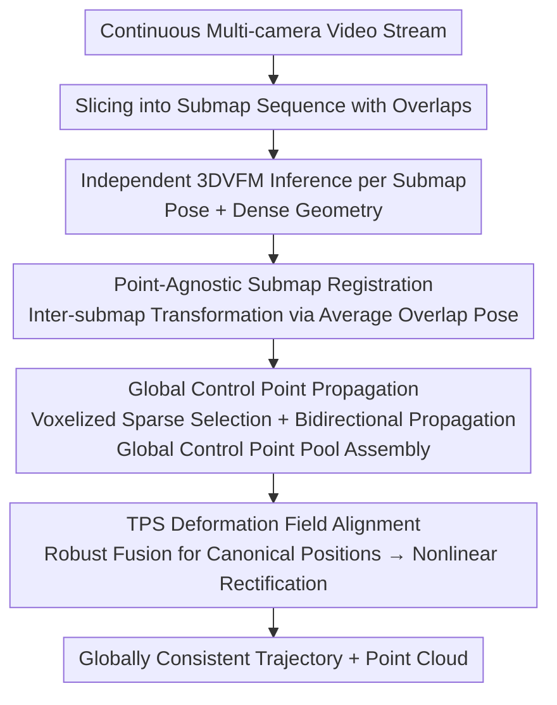

# TALO: Pushing 3D Vision Foundation Models Towards Globally Consistent Online Reconstruction

**Conference**: CVPR 2026  
**arXiv**: [2512.02341](https://arxiv.org/abs/2512.02341)  
**Code**: [GitHub](https://github.com/Xian-Bei/TALO)  
**Area**: Self-supervised learning  
**Keywords**: 3D Vision Foundation Models, Online Reconstruction, Thin Plate Spline, Submap Alignment, Autonomous Driving

## TL;DR

Ours proposes TALO, a high-degree-of-freedom alignment framework based on Thin Plate Spline (TPS). By propagating global control points and utilizing a point-agnostic submap registration design, it corrects spatially-varying inconsistencies of 3D vision foundation models in online reconstruction. It is compatible with various foundation models and camera configurations, significantly reducing trajectory errors on Waymo and nuScenes datasets.

## Background & Motivation

**Background**: 3D Vision Foundation Models (3DVFMs) such as VGGT, π³, and MapAnything can reconstruct key 3D properties (intrinsics, poses, dense geometry) from uncalibrated images via single-forward inference, demonstrating strong generalization. However, these models are mostly designed for offline scenarios. When deployed in online scenarios like autonomous driving, each time window (submap) is inferred independently, making cross-submap consistency difficult to maintain.

**Limitations of Prior Work**: VGGT-Long utilizes 7-DOF Sim(3) alignment, while VGGT-SLAM employs 15-DOF SL(4) alignment. However, Sim(3) cannot handle spatially-varying nonlinear geometric distortions, and SL(4) is highly unstable in outdoor multi-camera scenarios, with over 60% of scenes failing due to divergence. Both methods only perform pairwise alignment between adjacent submaps, failing to ensure global consistency.

**Key Challenge**: Prediction errors of foundation models are non-uniformly distributed in space (e.g., different cameras may have opposite depth scale biases). A single global linear transformation cannot simultaneously correct all regions. The under-constrained nature of SL(4) makes it extremely sensitive to geometric noise, often producing physically impossible poses (e.g., severely tilted buildings).

**Goal**: How to flexibly correct the spatially-varying geometric inconsistencies of 3DVFMs in online scenarios while remaining robust to noise?

**Key Insight**: Utilize Thin Plate Spline (TPS) to provide a high-degree-of-freedom nonlinear deformation field, combined with globally propagated control points to capture long-range information, and replace noise-prone point-cloud-based alignment with point-agnostic submap registration.

**Core Idea**: Replace traditional Sim(3)/SL(4) global transformations with a TPS deformation field and global control point propagation to achieve flexible correction of spatially-varying distortions in online 3D reconstruction.

## Method

### Overall Architecture

3D vision foundation models can independently infer poses and dense geometry within each time window (submap), but consistency across submaps remains unmanaged—this is the gap TALO aims to fill. It slices continuous multi-camera video streams into a sequence of submaps with overlapping frames. Each submap is processed independently by a 3DVFM. Then, three steps align them into a shared canonical space: first, inter-submap transformations are calculated using camera poses of overlapping frames (rather than noisy point clouds); next, a set of sparse control points is propagated bidirectionally along the sequence to form a global control point pool; finally, these control points are used to fit a Thin Plate Spline (TPS) deformation field to nonlinearly rectify each submap.

### Key Designs

**1. Point-Agnostic Submap Registration: Aligning with Camera Poses Instead of Noisy Point Clouds**

If inter-submap alignment relies on dense point clouds predicted by 3DVFMs, the noise within the point clouds is directly fed into the alignment, amplifying errors. TALO bypasses point clouds and directly uses camera poses from overlapping frames to calculate the inter-submap transformation $\mathbf{H}_{k \to k-1}^i = \mathbf{T}_{k-1}^i (\mathbf{T}_k^i)^{-1}$, subsequently averaging the transformations across all overlapping frames (using Chordal L2 averaging for rotations). 

Empirically, camera poses are much more stable than raw point clouds, and trajectories produced by this step are the most accurate—replacing this with point cloud alignment in ablation studies leads to significant degradation, indicating that the choice of alignment primitive is more critical than the alignment algorithm itself.

**2. Global Control Point Propagation: Flowing Long-Range Information Across the Submap Chain**

Pairwise alignment only ensures consistency between adjacent submaps, allowing global drift to accumulate. TALO uses voxelization (voxel size $\delta_v$) in each overlapping region to select spatially uniform sparse control points. Leveraging the pixel-alignment property of 3DVFMs, it uses pixel coordinates to lock the same physical location across two submaps. Control points are propagated bidirectionally: voxels already occupied in a new submap do not generate new points, while newly generated points are back-propagated to enrich mutual observations. All observations eventually merge into a global control point pool.

Thus, each physical location accumulates observations from multiple submaps. Global consistency no longer relies on pairwise accumulation but is uniformly constrained by this shared control point pool.

**3. TPS Deformation Field Alignment: Rectifying Spatially-Varying Distortions with High Degrees of Freedom**

Global linear transformations like Sim(3)/SL(4) assume a uniform error field. However, prediction errors in foundation models are spatially non-homogeneous (different cameras may even exhibit opposite depth scale biases). A single linear transformation cannot resolve such complex distortions. TALO first performs robust fusion of multi-submap observations for each control point (suppressing dynamic objects and outliers) to obtain a canonical 3D position. It then fits a Thin Plate Spline (TPS) deformation field based on the "current location $\to$ canonical location" correspondence, deforming each submap into the shared canonical space.

The high degrees of freedom in TPS allow it to correct spatially-varying distortions region-by-region, while local rigidity regularization maintains structural coherence within submaps, preventing geometric degradation for the sake of alignment—a flexibility that linear transformations cannot provide.

### Loss & Training

- TALO is a **training-free, plug-and-play framework** that requires no fine-tuning of the foundation model.
- It is a purely optimization-based method: fitting the TPS deformation field based on control point correspondences.
- It is fully compatible with any 3DVFM (VGGT, π³, MapAnything) and any camera configuration (monocular, multi-view).

## Key Experimental Results

### Main Results: Trajectory Accuracy on Waymo Dataset (Average ATE RMSE [m])

| Foundation Model | Alignment Strategy | ATE↓ | RTE↓ | RRE↓ |
|----------|----------|------|------|------|
| VGGT | VGGT-Long (Sim3) | 1.42 | 0.32 | 0.71 |
| VGGT | VGGT-SLAM (SL4) | 12.21 | 5.50 | 10.90 |
| **VGGT** | **TALO (Ours)** | **1.09** | **0.28** | **0.14** |
| π³ | VGGT-Long (Sim3) | 2.22 | 0.48 | 0.93 |
| π³ | VGGT-SLAM (SL4) | 22.23 | 5.64 | 9.82 |
| **π³** | **TALO (Ours)** | **0.86** | **0.26** | **0.24** |
| Map. | VGGT-Long (Sim3) | 3.68 | 0.63 | 1.71 |
| Map. | VGGT-SLAM (SL4) | 30.50 | 11.17 | 23.57 |
| **Map.** | **TALO (Ours)** | **1.40** | **0.42** | **0.60** |

### Trajectory Accuracy on nuScenes Dataset (Average ATE RMSE [m])

| Foundation Model | Alignment Strategy | ATE↓ | RTE↓ | RRE↓ |
|----------|----------|------|------|------|
| VGGT | VGGT-Long | 1.63 | 0.47 | 0.58 |
| VGGT | VGGT-SLAM | 17.53 | 3.25 | 6.51 |
| **VGGT** | **TALO (Ours)** | **1.31** | **0.37** | **0.19** |
| π³ | VGGT-Long | 1.63 | 0.60 | 1.49 |
| π³ | VGGT-SLAM | 9.37 | 4.49 | 7.93 |
| **π³** | **TALO (Ours)** | **Best** | **Best** | **Best** |

### Key Findings

- VGGT-SLAM (SL4) diverges in over 60% of outdoor scenes (ATE >> 5% of GT trajectory length), with catastrophic failures occurring frequently.
- TALO achieves the best ATE/RTE/RRE across all three foundation models, with zero scene divergence.
- Compared to VGGT-Long, TALO reduces average ATE on Waymo by 23% (VGGT) to 62% (MapAnything), and RRE by over 80%.
- Point-agnostic registration is key to trajectory accuracy; replacing it with point cloud alignment leads to significant performance degradation.

## Highlights & Insights

- **Plug-and-Play**: It does not modify the foundation model; it only performs post-processing alignment, making it highly practical.
- **Solid Theoretical Analysis**: It analyzes the fundamental flaws of Sim(3) and SL(4) from a mathematical perspective (assuming a globally uniform error field), revealing the root causes of their failure.
- **Comprehensive Experimental Coverage**: Validation across 3 foundation models × 2 datasets × multiple camera configurations fully verifies its generalization.
- **Ingenious Control Point Propagation**: Efficient global information transfer is achieved by utilizing pixel-alignment properties and voxelization.

## Limitations & Future Work

- The flexibility of the TPS deformation field depends on the number and distribution of control points, which may be insufficient in extremely sparse scenes.
- Handling dynamic objects relies on threshold settings for robust fusion; performance may be affected in extremely dynamic scenarios.
- Although training-free, the computational overhead of TPS fitting and control point propagation during runtime is not analyzed in detail.
- Synergy with loop closure detection was not discussed.

## Related Work & Insights

- **Relationship with VGGT-Long/SLAM**: TALO is a direct improvement over existing global alignment paradigms, replacing Sim(3)/SL(4) with TPS.
- **Relationship with DUSt3R/MASt3R**: While these methods predict dense point maps, they lack an online reconstruction mechanism; TALO can serve as a back-end alignment module for them.
- **Insight**: In the era of foundation models, lightweight post-processing alignment schemes may be more efficient and practical than end-to-end fine-tuning. The idea of global control point propagation can be extended to SLAM and large-scale scene reconstruction.

## Rating

- Novelty: ⭐⭐⭐⭐ — Using TPS for 3DVFM online alignment is novel, and the control point propagation is cleverly designed.
- Experimental Thoroughness: ⭐⭐⭐⭐⭐ — Comprehensive validation across models, datasets, and camera configurations with clear comparisons.
- Writing Quality: ⭐⭐⭐⭐ — In-depth problem analysis, clear illustrations, and concise formulas.
- Value: ⭐⭐⭐⭐⭐ — A universal plug-and-play solution with significant importance for the actual deployment of 3D foundation models.

<!-- RELATED:START -->

## Related Papers

- [\[CVPR 2026\] Scaling Parallel Sequence Models to Vision Foundation Models](scaling_parallel_sequence_models_to_vision_foundation_models.md)
- [\[CVPR 2026\] How Much 3D Do Video Foundation Models Encode?](how_much_3d_do_video_foundation_models_encode.md)
- [\[CVPR 2026\] Robustness of Vision Foundation Models to Common Perturbations](robustness_of_vision_foundation_models_to_common_perturbations.md)
- [\[CVPR 2026\] Chain-of-Models Pre-Training: Rethinking Training Acceleration of Vision Foundation Models](com_pt_chain_of_models_pretraining.md)
- [\[CVPR 2026\] MuM: Multi-View Masked Image Modeling for 3D Vision](mum_multi-view_masked_image_modeling_for_3d_vision.md)

<!-- RELATED:END -->
