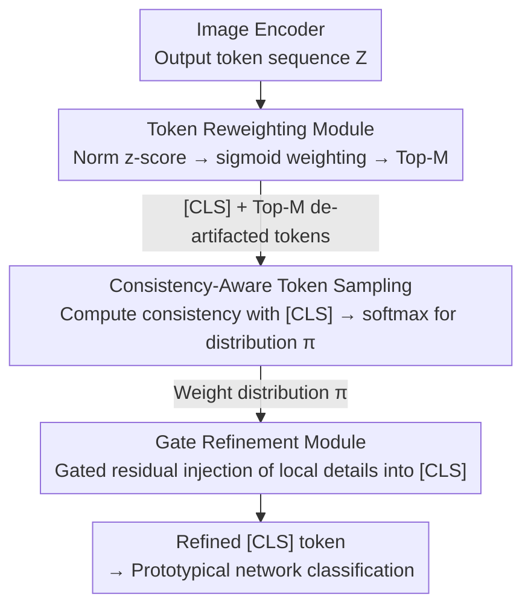

# TAR: Token-Aware Refinement for Fine-grained Generalized Category Discovery

**Conference**: CVPR 2026  
**Paper**: [CVF Open Access](https://openaccess.thecvf.com/content/CVPR2026/html/Yang_TAR_Token-Aware_Refinement_for_Fine-grained_Generalized_Category_Discovery_CVPR_2026_paper.html)  
**Code**: https://github.com/VectorYangYiStar/TAR  
**Area**: Self-supervised / Representation Learning  
**Keywords**: Generalized Category Discovery (GCD), Fine-grained Recognition, Attention Artifacts, Token Reweighting, Plug-and-play

## TL;DR
Targeting the "attention artifacts" issue in ViTs for fine-grained Generalized Category Discovery (GCD)—where a few high-norm tokens sequester attention, causing the [CLS] token to over-rely on global semantics while ignoring local discriminative cues—TAR introduces a plug-and-play three-module pipeline. It utilizes parameter-free reweighting to exclude high-norm tokens, samples reliable local tokens based on [CLS] consistency, and injects local details into [CLS] via gating, achieving consistent performance gains across fine-grained benchmarks like CUB, Cars, and Aircraft.

## Background & Motivation
**Background**: The goal of Generalized Category Discovery (GCD) is to correctly classify known categories and cluster unknown categories within an unlabeled set. Mainstream approaches utilize DINO-pretrained ViTs or CLIP as backbones for feature extraction, followed by a prototypical network for classification, performing well on coarse-grained datasets.

**Limitations of Prior Work**: These methods struggle in fine-grained scenarios (e.g., CUB birds, Stanford Cars, FGVC-Aircraft). They apply the same processing strategy used for coarse grains—feeding only the **[CLS] token** into the prototypical network for prediction. However, [CLS] primarily encodes **global semantics**, whereas fine-grained recognition demands **local discriminative cues** (e.g., wing patterns, intake shapes), which are effectively discarded.

**Key Challenge**: The authors point to **attention artifacts** in ViTs: a few non-semantic/background tokens exhibit **abnormally high norms**, forming spurious attention hotspots that siphon attention away from object parts and pollute the aggregated [CLS] representation. Experimental evidence shows that a higher presence of artifacts correlates with lower accuracy in fine-grained GCD. The combination of "sole reliance on [CLS]" and "inherent ViT artifacts" is identified as the root cause of failure in fine-grained GCD.

**Goal**: To (1) suppress attention artifacts and (2) re-inject ignored local discriminative information back into [CLS] without retraining the backbone or altering the main GCD framework.

**Key Insight**: Since artifacts correspond to high-norm tokens, refinement should occur at the token sequence level. Instead of relying solely on [CLS], the **entire token sequence** should be utilized to filter reliable tokens that are consistent with global semantics but carry local details.

**Core Idea**: Replace direct [CLS] classification with a plug-and-play module: "reweighting to remove artifacts → consistency-aware sampling to select reliable local tokens → gated injection into [CLS]". This allows [CLS] to maintain global semantics while absorbing fine-grained local cues.

## Method

### Overall Architecture
TAR (Token-Aware Refinement) is a plug-and-play module positioned between the existing GCD framework (e.g., unimodal MOS, multimodal GET) backbone and the prototypical network. The input is the full token sequence $Z=[z_0,z_1,\dots,z_n]\in\mathbb{R}^{B\times T\times D}$ (where $z_0$ is [CLS]), and the output is a "refined [CLS] token" enhanced with local details. Three sequential modules are employed: **TRM** (Token Reweighting Module) for parameter-free denoising and high-norm token exclusion; **CATS** (Consistency-Aware Token Sampling) to calculate a reliability weight distribution $\pi$ based on semantic consistency with [CLS]; and **GRM** (Gate Refinement Module) to inject $\pi$-weighted local information into [CLS] using a residual gating mechanism.

### Key Designs

**1. Token Reweighting Module (TRM): Parameter-free z-score reweighting to suppress high-norm artifacts**

Addressing the presence of artifacts, TRM performs denoising purely through statistics without learnable parameters. For feature tokens $Z_f=[z_1,\dots,z_n]$, it calculates the $\ell_2$ norm of each embedding and applies z-score normalization $z^s_i=\frac{\|z_i\|-\mu}{\sigma}$ to bring norms to a uniform scale. A sigmoid function converts these into weights $w_i=\frac{1}{1+e^{\alpha z^s_i}}$ (where $\alpha$ controls steepness)—tokens with abnormally high norms (large $z^s_i$) receive lower weights. Only the Top-M weighted tokens are kept and scaled: $\widehat{Z}_f=\{\hat z_i=w_i\cdot z_i\mid i\in \mathrm{TopM}(w)\}$. TRM provides a "largely artifact-free" sequence for subsequent steps.

**2. Consistency-Aware Token Sampling (CATS): Selecting reliable local tokens via [CLS] consistency**

After removing artifacts, CATS determines which local tokens are reliable using **semantic consistency with [CLS]** as a benchmark. [CLS] and reweighted tokens are projected into a shared space to calculate cosine similarity $s_i=\cos(W_q z_0, W_k \hat z_i)$, normalized via softmax into a distribution $\pi_i=\frac{e^{s_i}}{\sum_j e^{s_j}}$. To prevent this distribution from **collapsing** onto very few tokens, a KL divergence loss pulls $\pi$ toward a uniform prior $U$. Additionally, a consistency regularization term ensures robustness by minimizing the symmetric KL divergence $L_{con}$ between $\pi$ and a noise-perturbed distribution $\pi^*$.

**3. Gate Refinement Module (GRM): Gated residual injection of local details into [CLS]**

To merge local information without overwhelming global semantics, GRM uses a learnable gate. Local representations are aggregated as $a=\sum_i \pi_i W_{proj}\hat z_i$. A gating coefficient $\gamma=\alpha\,\sigma(W_g[z_0,a])+\beta$ is calculated to adaptively regulate the injection volume. The [CLS] token is updated via a **residual** connection: $z_0\leftarrow z_0+\gamma\cdot a$. This residual form ensures that global semantics are refined rather than overwritten, facilitating stable gradient flow.

### Loss & Training
TAR adds two CATS-related regularization terms to the original GCD loss $L_{gcd}$:
$$L_{total}=L_{gcd}+\lambda_{kl}L_{KL}(\pi\|U)+\lambda_{con}L_{con}.$$
$L_{KL}(\pi\|U)$ prevents sampling collapse, and $L_{con}$ provides symmetric KL consistency. The backbone is ViT-B/16, trained for 200 epochs with a batch size of 128 and an initial learning rate of 0.1 on an RTX 4090.

## Key Experimental Results

### Main Results
TAR as a plug-and-play module consistently improves performance across two different backbones (unimodal MOS, multimodal GET), with particularly strong gains in Base categories:

| Backbone / Dataset | Metric | Baseline | +TAR | Gain |
|--------------|------|----------|------|------|
| GET · CUB | All | 77.0 | 78.4 | +1.4 |
| GET · Stanford Cars | All | 78.5 | 80.4 | +1.9 |
| GET · Stanford Cars | Base | 86.8 | 91.1 | +4.3 |
| GET · FGVC-Aircraft | Base | 59.6 | 64.8 | +5.2 |
| GET · 3-set Avg | All | 71.4 | 73.0 | +1.6 |
| MOS · 3-set Avg | Base | 73.4 | 75.8 | +2.4 |

Results on more challenging datasets:

| Dataset | Metric | GET | GET+TAR |
|--------|------|-----|---------|
| Herbarium 19 | All | 49.7 | 49.8 |
| Herbarium 19 | Base | 64.5 | 66.1 |
| ImageNet-1k | All | 62.4 | 63.1 |
| ImageNet-1k | Base | 74.0 | 75.2 |

### Ablation Study
Ablation on CUB using the GET baseline (row labels from original Table 3):

| Config | All | Base | Novel | Description |
|------|-----|------|-------|------|
| (a) Baseline | 75.5 | 77.4 | 74.6 | Reproduced baseline |
| (i) Full TAR | 78.4 | 80.2 | 77.5 | Full model |
| (e) w/o $L_{con}$ | 75.9 | 78.5 | 74.5 | No consistency reg, All −2.5 |
| (f) w/o $L_{KL}$ | 75.3 | 78.5 | 75.3 | No collapse prev, All −2.1 |
| (g) w/o TRM | 76.7 | 78.1 | 76.1 | No reweighting, All −1.7 (Base −2.1) |
| (h) w/o GRM | 76.1 | 78.7 | 74.8 | No gated fusion, All −2.3 (Novel −2.7) |

### Key Findings
- **Every component is essential**: Removing any module results in a drop; removing $L_{con}$ causes the largest decline in Novel accuracy, highlighting its role in token consistency for unknown classes.
- **TRM is necessary despite being parameter-free**: While adding TRM alone doesn't change optimization, its removal leads to a 2.1 drop in Base accuracy, showing it protects discriminative power for known classes.
- **Significant gains in Base categories**: Gains like +4.3 in Cars and +5.2 in Aircraft confirm that de-artifacting and local detail injection are highly effective for fine-grained discrimination.

## Highlights & Insights
- **Linking attention artifacts to GCD failure**: The authors establish a causal link between "artifacts" and "fine-grained GCD accuracy," supported by empirical evidence, providing a concrete problem definition.
- **Parameter-free de-artifacting**: TRM's use of z-score and sigmoid weighting is a lightweight, reusable trick for token denoising without adding network complexity.
- **Refinement over replacement**: The strategy of using the entire token sequence to "refine" [CLS] rather than discarding it is a robust approach that could be applied to various tasks relying on single-token classification.
- **Broad compatibility**: Its plug-and-play nature across unimodal and multimodal backbones ensures low implementation costs.

## Limitations & Future Work
- Authors acknowledge that TAR makes representations "largely artifact-free" but does not completely eliminate redundancy; absolute information decoupling remains an open problem.
- Gains are somewhat modest in certain settings (All +0.4~+1.0), and gains in Novel categories are generally smaller than in Base categories, suggesting limited impact on the "discovery" aspect compared to the "recognition" aspect.
- Sensitivity analysis for hyperparameters like Top-M, sigmoid steepness $\alpha$, and loss weights $\lambda_{kl}/\lambda_{con}$ is not fully explored.

## Related Work & Insights
- **vs Register Tokens**: Unlike methods that introduce registers at training or inference to absorb artifacts, TAR processes the sequence at the tail end to reweight and inject local details back into [CLS].
- **vs GET/MOS (CVPR 2025 SOTA)**: Those methods focus on backbone or multimodal representations while still relying on [CLS] classification. TAR is orthogonal and can be layered on top.
- **vs Parametric GCD**: Previous methods focus on prototypical loss or two-stage adaptation while sticking to the [CLS]-only paradigm; TAR identifies this paradigm as the weakness in fine-grained settings.

## Rating
- Novelty: ⭐⭐⭐⭐ Connects artifacts to fine-grained GCD failure with a practical three-module solution.
- Experimental Thoroughness: ⭐⭐⭐⭐ Comprehensive across 5 datasets and 2 backbones; lacks extensive hyperparameter sensitivity analysis.
- Writing Quality: ⭐⭐⭐⭐ Clear motivation and complete formulations.
- Value: ⭐⭐⭐⭐ Practical and low-cost, though gains on Novel categories could be improved.

<!-- RELATED:START -->

## Related Papers

- [\[CVPR 2026\] The Devil Is in Gradient Entanglement: Energy-Aware Gradient Coordinator for Robust Generalized Category Discovery](the_devil_is_in_gradient_entanglement_energy-aware_gradient_coordinator_for_robu.md)
- [\[CVPR 2026\] Learning Like Humans: Analogical Concept Learning for Generalized Category Discovery](learning_like_humans_analogical_concept_learning_for_generalized_category_discov.md)
- [\[CVPR 2026\] Seeing Through the Shift: Causality-Inspired Robust Generalized Category Discovery](seeing_through_the_shift_causality-inspired_robust_generalized_category_discover.md)
- [\[CVPR 2026\] Decouple Your Discovery and Memory in Continual Generalized Category Discovery](decouple_your_discovery_and_memory_in_continual_generalized_category_discovery.md)
- [\[CVPR 2026\] OmniGCD: Abstracting Generalized Category Discovery for Modality Agnosticism](omnigcd_abstracting_generalized_category_discovery_for_modality_agnosticism.md)

<!-- RELATED:END -->
