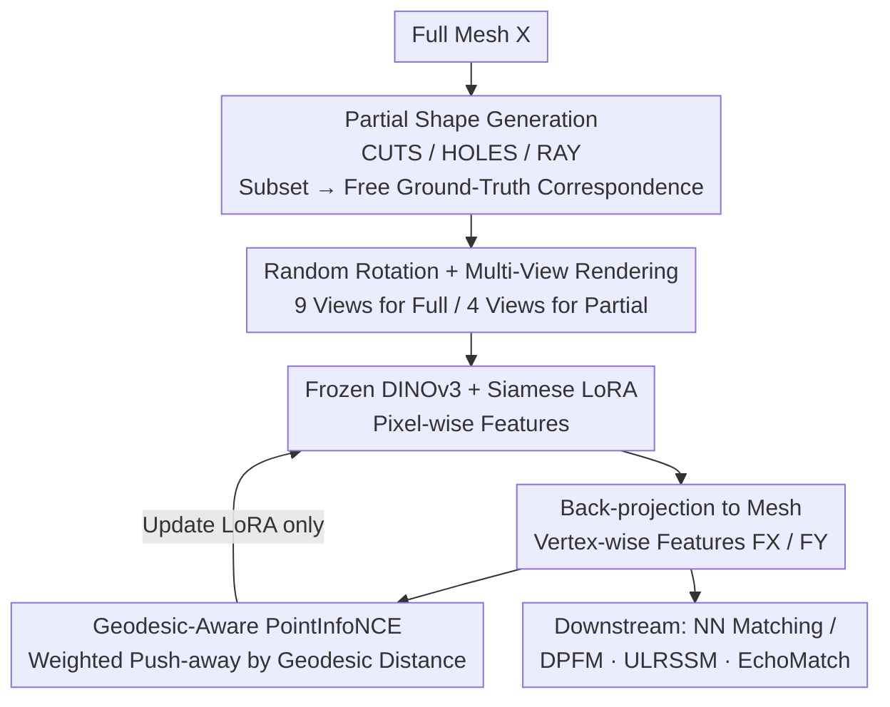

# Teaching DINOv3 About Partial 3D Geometry: A Self-Supervised Geometry-Aware Approach

**Conference**: CVPR 2026  
**Paper**: [CVF Open Access](https://openaccess.thecvf.com/content/CVPR2026/html/Ehm_Teaching_DINOv3_About_Partial_3D_Geometry_A_Self-Supervised_Geometry-Aware_Approach_CVPR_2026_paper.html)  
**Code**: https://github.com/vikiehm/geo-lora  
**Area**: Self-Supervised / 3D Vision  
**Keywords**: Self-Supervised Learning, Visual Foundation Models, LoRA Fine-Tuning, Partial Shape Matching, Geodesic Constraints

## TL;DR
This paper proposes GeoLoRA, which utilizes synthetic "full-shape $\leftrightarrow$ partial-shape" pairs as self-supervised signals. By attaching a weight-shared LoRA module to a frozen DINOv3, and employing a geodesic distance-weighted PointInfoNCE contrastive loss, the method injects 3D geometric awareness into 2D foundation features, achieving state-of-the-art (SOTA) performance on partial shape matching (partial-to-full / partial-to-partial) and left-right chirality determination.

## Background & Motivation
**Background**: Finding dense correspondence between 3D deformable objects is a fundamental task in shape analysis. Traditional approaches rely on hand-crafted descriptors (HKS, WKS, SHOT) or functional maps. Recently, features from Vision Foundation Models (VFMs) like DINO have been increasingly leveraged as inputs, because they are self-supervisedly trained on large-scale images and can capture point semantics across deformations and identities.

**Limitations of Prior Work**: These methods struggle when shapes are only **partially observed** (occlusions, scanning noise, missing reconstructions). Hand-crafted descriptors are built on theoretical assumptions such as "watertight meshes and identical topology," making them vulnerable to the boundaries of partial shapes. Coordinate-based features depend heavily on the spatial alignment of the shape. Although the DINO family offers good semantics, its **understanding of 3D geometry is limited**—it frequently commits geometric errors like left-right flipping or confusing occluded/unoccluded regions, which persist even in the latest DINOv3.

**Key Challenge**: Foundation models are trained solely on single-view 2D images, lacking true 3D grounding. Injecting "geometric understanding" requires feeding 3D information directly into the training process. However, training a 3D foundation model from scratch requires massive amounts of data and compute, which is impractical.

**Goal**: To endow existing 2D foundation features with 3D geometric awareness without retraining the foundation model, specifically for the task of partial shape matching.

**Key Insight**: The key observation is that by starting from a **full shape** and procedurally slicing it to create a **partial shape**, the pair naturally possesses known 3D correspondences (as the partial shape is a subset of the full shape). This effectively yields supervision signals for free, without requiring any human annotation.

**Core Idea**: To self-supervisedly train a lightweight LoRA adapter using "synthetic partial shapes + known correspondences" to align the rendered features of both full and partial shape sides. Additionally, introducing **geodesic distance weighting** into the contrastive loss penalizes geometrically distant negative samples more heavily, thereby embedding a strong surface geometry prior into the features.

## Method

### Overall Architecture
The entire GeoLoRA pipeline trains only a single LoRA module attached to a frozen DINOv3, aiming to align feature representations of a "partial observation of an object" and its "full observation" in the feature space. Given a full mesh $X$, its partial version $Y$ is generated using one of three procedural methods (CUTS/HOLES/RAY). Since $Y$ is a subset of $X$, they naturally share a ground-truth correspondence $\Pi_{YX}$. Subsequently, both shapes are randomly rotated around the Y-axis, and multi-view images are rendered from multiple camera views around the objects. Each image passes through "frozen DINOv3 + weight-shared LoRA" to obtain pixel-wise features, which are then back-projected to the meshes and averaged across all pixels that observe each vertex, yielding vertex-wise features $F_X$ and $F_Y$. Finally, a geodesic-aware PointInfoNCE contrastive loss is used to pull corresponding vertices closer while pushing other vertices away weighted by their geodesic distance, updating the LoRA weights via backpropagation. During inference, these features are directly used for nearest-neighbor matching or fed into existing matching pipelines (DPFM / ULRSSM / EchoMatch) as input features.

### Key Designs

**1. Synthetic Partial Shape Construction for Self-Supervision: Deriving Partials from Full Shapes with Free Ground-Truth Correspondence**

The main bottleneck in partial shape matching is the lack of supervision, as obtaining dense correspondence annotations for real-world partial scans is highly challenging. The authors circumvent this issue by starting with a full shape $X=(V_X, T_X)$ and randomly selecting one of three methods to slice a partial shape $Y=(V_Y, T_Y)$. These three slicing techniques each simulate a specific type of real-world degradation: **CUTS** halves the shape using a random plane passing through the center; **HOLES** randomly selects several regions and removes vertices within a random radius (simulating erosion or local reconstruction errors); **RAY** simulates partial visibility from a random camera viewpoint (simulating single-view occlusions). Since all three slicing methods ensure that $V_Y \subset V_X$ and $T_Y \subset T_X$, the partial shape is strictly a subset of the full shape, rendering the ground-truth vertex correspondence $\Pi_{YX} \in \mathbb{R}^{|V_Y|\times|V_X|}$ completely known. This step serves as the foundation of the self-supervised approach—all supervision originates from the geometric reality of the subset relationship, requiring no manual annotations and relying purely on synthetic data.

Notably, during training, the full and partial shapes share the **same pose**, which might initially seem contradictory to the goal of "solving non-rigid registration." However, the authors argue that this is precisely the task the backbone needs to master: when observing a partial geometry, it should reconstruct features as if they belonged to a complete geometry.

**2. Siamese LoRA + Multi-View Back-Projection: Endowing Foundation Models with 3D Geometry while Updating <1% Parameters**

Fine-tuning the entire DINOv3 directly incurs prohibitive computational costs and risks destroying its generic semantics. The authors **freeze** the DINOv3 (ViT-B/16) and attach LoRA modules (rank $r=16$, scaling factor $\alpha=32$) only to the attention layers, employing a **siamese** architecture where both the full and partial branches **share the same LoRA weights**. This guarantees extremely few trainable parameters while aligning both features within a shared adaptation space.

Features flow from the image domain back to the mesh domain: $X$ is randomly rotated around the Y-axis, then rendered from $N$ virtual cameras to produce $512\times512\times3$ images. These images are fed into DINOv3+LoRA to extract pixel-wise features $Q^i_X \in \mathbb{R}^{512\times512\times768}$. Pixel features from all views that observe a specific vertex are averaged to back-project them into vertex-wise features $F_X \in \mathbb{R}^{|V_X|\times768}$. The partial shape $Y$ is processed similarly to obtain $F_Y$. For efficiency during training, 9 views are used for full shapes and 4 views for partial shapes; inference scales up to 49 views to yield stabler features. This multi-view aggregation + back-projection converts 2D patch features into consistent representations on 3D surfaces, serving as a bridge between the 2D model and 3D geometry.

**3. Geodesic-Aware PointInfoNCE: Embedding Geometrical Priors by Distance-Weighted Negative Repulsion**

An alignment objective alone is insufficient. The standard PointInfoNCE contrastive loss (Eq. 1) penalizes all mismatched pairs uniformly:

$$\mathcal{L}_{NCE} = -\sum_{(v_i,v_j)\in GT}\log\frac{\exp(F^i_Y\cdot F^j_X/\tau)}{\sum_{v_k\in V_Y}\exp(F^k_Y\cdot F^j_X/\tau)}$$

The numerator pulls corresponding vertices closer, while the denominator pushes other vertices away to prevent feature collapse. However, its limitation is that a "slight mismatch to a neighboring point" and a "severe mismatch to the opposite limb" are penalized equally, ignoring the severity of the mistake. The authors resolve this by weighting each negative sample in the denominator by its geodesic distance: using the geodesic distance matrix $D_X$ on the full shape ($D^{jk}_X$ is the surface distance between vertices $v_j$ and $v_k$, where partial vertices are mapped to $X$ via the known correspondences), we obtain:

$$\mathcal{L} = -\sum_{(v_i,v_j)\in GT}\log\frac{\exp(F^i_Y\cdot F^j_X/\tau)}{\sum_{v_k\in V_Y}\exp\big((D^{jk}_X+0.5)\cdot F^k_Y\cdot F^j_X/\tau\big)}$$

Negative samples with larger geodesic distances are weighted more heavily and pushed further apart (the $+0.5$ offset keeps the weight range comparable to multiplying by $1.0$ in the standard loss). This geometric constraint addresses a notorious issue with foundation models: points that are far apart on the 3D surface but appear symmetric in 2D views (e.g., left and right limbs) are explicitly pushed apart. Experiments confirm major gains in left-right chirality discrimination and geodesic error.

### An Illustrative Example
To illustrate the training process using a full human mesh $X$ from BECOS: ① The RAY method is randomly selected to simulate visibility from a random camera, generating a partial mesh $Y$ missing the back and parts of the arms, and the mapping of each vertex in $Y$ to its counterpart in $X$ is recorded. ② Both $X$ and $Y$ are randomly rotated around the Y-axis. 9 virtual cameras are placed around $X$ and 4 around $Y$ to render $512^2$ images. ③ Each image is processed through the frozen DINOv3 + shared LoRA to output pixel-wise 768-dimensional features, which are then back-projected and averaged into vertex features $F_X$ and $F_Y$. ④ For each ground-truth pair $(v_i^Y, v_j^X)$, the geodesic-weighted PointInfoNCE loss is computed: pulling $F^i_Y$ and $F^j_X$ closer while pushing other vertices on $Y$ away, scaled by their geodesic distance to $v_j$ on $X$ — the farther they are, the harder they are pushed. ⑤ Gradients backpropagate to update only the LoRA modules. Each full shape generates two partial views per batch, training for 50k iterations.

### Loss & Training
The core loss is the geodesic-aware PointInfoNCE (Eq. 2), where $\tau$ is the temperature hyperparameter. The backbone DINOv3 ViT-B/16 is frozen throughout. LoRA is inserted into all attention layers ($r=16$, $\alpha=32$). The network uses 9 views for full shapes and 4 views for partial shapes during training, and 49 views for inference. Each batch generates 2 partial observations per full shape. The model is trained for 50,000 iterations on an A40 GPU.

## Key Experimental Results

### Main Results
Quality of raw feature matching (L2 nearest neighbors, mean geodesic error $\times100$, lower is better; both GeoLoRA and DINOv2/v3 use 49 views):

| Setting | Dataset | DINOv3 (Second Best) | GeoLoRA | Note |
|------|--------|--------------|---------|------|
| P2F | BECOS | 19.95 | **5.57** | Hardest dataset, largest reduction |
| P2F | SHREC16 CUTS | 21.25 | **10.86** | — |
| P2F | PFAUST-H | 13.82 | **3.33** | Challenging hole generation |
| P2P | BECOS | 16.84 | **6.72** | Substantial lead despite not being trained on P2P |
| P2P | PSMAL | 18.64 | **6.85** | Non-isometric animal shapes |

Integration into downstream SOTA matching pipelines (Partial-to-Full, geodesic error $\times100$, values in parentheses are after ULRSSM test-time adaptation):

| Dataset | Feature | ULRSSM | DPFM |
|--------|------|--------|------|
| SHREC16 CUTS | DINOv3 | 5.94 (4.30) | 10.78 |
| SHREC16 CUTS | GeoLoRA | **3.01 (1.97)** | **6.57** |
| PFAUST-H | DINOv3 | 5.19 (5.22) | 6.46 |
| PFAUST-H | GeoLoRA | **2.29 (2.19)** | **5.66** |

On partial-to-partial matching (EchoMatch / DPFM, geodesic error + mIoU), EchoMatch error on BECOS drops from 9.74 $\rightarrow$ **5.55** with mIoU rising from 67.07 $\rightarrow$ **71.27**; PSMAL error drops from 5.56 $\rightarrow$ **4.33** with mIoU rising from 82.75 $\rightarrow$ **85.41**.

### Ablation Study

| Configuration | Key Metrics | Details |
|------|---------|------|
| Number of Views 16 $\rightarrow$ 49 $\rightarrow$ 100 | Geo Err 25.47 $\rightarrow$ 20.09 $\rightarrow$ 20.00 | Error quickly saturates while time grows linearly; 49 views is the performance sweet spot |
| PointInfoNCE | Err 11.29 | Standard contrastive loss |
| GeoLoRA (Geodesic Weighting) | **Err 5.89** | Geodesic weighting nearly halves the error |
| Chirality: DINOv3 | Acc 70.45 | Raw foundation features |
| Chirality: PointInfoNCE | Acc 84.09 | LoRA alignment only |
| Chirality: GeoLoRA | **Acc 91.42** | Adds geodesic weighting, gaining 7+ percentage points |

### Key Findings
- **Geodesic weighting is the core contributor to performance gains**: Convincing evidence is shown on the BECOS validation set where the error drops from 11.29 with standard PointInfoNCE to 5.89, nearly halving the error. This proves that "distancing negative samples weighted by surface distance" is far more crucial than simple alignment.
- **Chirality is significantly improved**: Chirality classification accuracy increases from 70.45% (original DINOv3) to 91.42%. This demonstrates that the geometric prior effectively rectifies the foundation model's "left-right confusion." The authors suggest that partial-to-full matching could serve as an auxiliary task to enhance geometric understanding in foundation models.
- **Generalizability**: Despite not being trained specifically for partial-to-partial settings, the features still significantly outperform DINOv3 and can be seamlessly integrated into existing downstream matching pipelines.
- **Limited-gain scenarios**: On CP2P24, since the downstream method is supervised and already has strong supervision, changing to better features yields minor gains. On BECOS, the error after functional mapping via ULRSSM/DPFM is higher than directly using GeoLoRA. The authors attribute this to unnormalized shapes in BECOS causing diagonal scaling prediction errors, as well as the synthetic raycasting producing numerous boundaries that degrade functional map quality.

## Highlights & Insights
- **The ingenious "subset as supervision" design**: Generating a partial shape from a full shape automatically reveals their correspondences. This elegantly converts a difficult task lacking annotations into a fully self-supervised setup using only synthetic data with zero human intervention.
- **Reusable geodesic-weighted contrastive loss**: Generalizing the idea of "negative sample weight $\propto$ surface geodesic distance" to other contrastive learning tasks with geometric/structural priors (e.g., point cloud registration, mesh segmentation) allows models to penalize mistakes based on their severity rather than uniformly.
- **LoRA injects domain knowledge into foundation models**: Endowing a 2D VFM with 3D geometric awareness by tuning less than 1% of the parameters—without retraining or destroying generic semantics—provides an elegant demonstration of the "foundation model + lightweight adaptation" paradigm for 3D tasks.
- **Byproduct—chirality determination**: Adopting partial-to-full matching as an auxiliary task remarkably improves the foundation model's grasp of left-right chirality, suggesting that 3D geometric supervision can feed back into and enhance the structural understanding of 2D base features.

## Limitations & Future Work
- **Acknowledged limitations**: The proposed method inherits the "upright-pose" bias of DINOv3 pre-trained on natural images. Although it still outperforms DINOv3 in upside-down poses, both suffer performance degradation compared to upright shapes.
- **Reliance on synthetic clipping**: It remains questionable whether the three synthetic degradation procedures (CUTS/HOLES/RAY) adequately cover the distribution of real-world scans. The large number of boundaries generated by RAYcasting can also degrade the quality of downstream functional maps (as observed on BECOS).
- **Scope limitations**: The work currently focuses on non-rigid, textureless 3D shapes (humans and animals), but has not yet tackled cluttered scenes or man-made objects. The authors leave these as future extensions.
- **Future directions**: Potential improvements include jointly optimizing the geodesic-weighted contrastive loss with functional map frameworks, or incorporating physical degradation models that closer match real sensors during training to bridge the synthetic-to-real gap.

## Related Work & Insights
- **vs. Raw DINOv3/DINOv2 features**: Instead of simply treating foundation features as input, this work is the first to inject 3D information of partial shapes into the foundation model. While raw DINOv3 exhibits geometric confusion (such as left-right and occlusion errors) on partial shapes, GeoLoRA rectifies this via Siamese LoRA and the geodesic loss.
- **vs. Diff3f [19]**: Diff3f similarly employs multi-view rendering and back-projection of foundation features for shape matching, but it relies on purely 2D features lacking 3D geometric supervision. This work adopts Diff3f's multi-view sampling pipeline but introduces synthetic partial pairs and geodesic-weighted self-supervision.
- **vs. PointContrast / PointInfoNCE [61]**: PointInfoNCE is designed for pre-training on rigid static-scene point clouds and treats all negative samples uniformly. This paper adapts it into a geodesic-weighted version tailored for non-rigid, partial, and textureless shapes.
- **vs. DPFM / ULRSSM / EchoMatch**: These represent downstream matching pipelines. This work does not compete with them but rather serves as a superior plug-and-play feature descriptor, consistently reducing error rates and boosting mIoUs.

## Rating
- Novelty: ⭐⭐⭐⭐⭐ The first work to inject 3D geometric awareness into a foundation model via self-supervised LoRA for partial non-rigid shape matching. The combination of "subset as supervision" and "geodesic-weighted contrast" is highly ingenious.
- Experimental Thoroughness: ⭐⭐⭐⭐⭐ Extensive evaluation across multiple P2F/P2P datasets, integration into multiple SOTA pipelines, validation on chirality and real-world scans, and comprehensive ablations on the number of views and loss formulations.
- Writing Quality: ⭐⭐⭐⭐ The motivation and method are clearly articulated with intuitive pipeline diagrams; some symbolic details require checking the supplementary material.
- Value: ⭐⭐⭐⭐⭐ Achieves new SOTAs across several partial shape matching benchmarks. The features are plug-and-play, making them highly practical for the 3D shape analysis community.

<!-- RELATED:START -->

## Related Papers

- [\[ICCV 2025\] WIR3D: Visually-Informed and Geometry-Aware 3D Shape Abstraction](../../ICCV2025/self_supervised/wir3d_visually-informed_and_geometry-aware_3d_shape_abstraction.md)
- [\[CVPR 2026\] Geometry-driven OOD Detectors Are Class-Incremental Learners](geometry-driven_ood_detectors_are_class-incremental_learners.md)
- [\[CVPR 2026\] Reframing Long-Tailed Learning via Loss Landscape Geometry](reframing_long-tailed_learning_via_loss_landscape_geometry.md)
- [\[CVPR 2026\] Stabilizing Feature Geometry in Noisy Pretrained Models for Robust Downstream Tasks](stabilizing_feature_geometry_in_noisy_pretrained_models_for_robust_downstream_ta.md)
- [\[CVPR 2026\] UniRefiner: Teaching Pre-trained ViTs to Self-Dispose Dross via Contrastive Register](unirefiner_teaching_pre-trained_vits_to_self-dispose_dross_via_contrastive_regis.md)

<!-- RELATED:END -->
