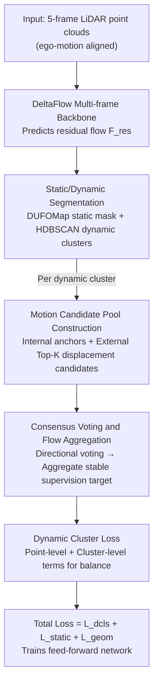

# TeFlow: Enabling Multi-frame Supervision for Self-Supervised Feed-forward Scene Flow Estimation

**Conference**: CVPR 2026  
**arXiv**: [2602.19053](https://arxiv.org/abs/2602.19053)  
**Code**: [github.com/KTH-RPL/OpenSceneFlow](https://github.com/KTH-RPL/OpenSceneFlow)  
**Area**: Self-supervised learning / Autonomous driving  
**Keywords**: Scene flow, self-supervised, multi-frame supervision, temporal ensemble, feed-forward network, point cloud

## TL;DR

TeFlow is proposed as the first method to introduce multi-frame supervision into self-supervised feed-forward scene flow estimation. By employing a temporal ensemble strategy to construct a motion candidate pool and aggregating temporally consistent supervision signals via consensus voting, it achieves a Three-way EPE of 3.57 cm on Argoverse 2—comparable to the optimization-based method Floxels—while maintaining real-time inference (8s vs. 24min), a 22.3% improvement over SeFlow++.

## Background & Motivation

**Background**: Scene flow estimates the 3D motion of every point in LiDAR point clouds. Existing self-supervised methods are categorized into: (1) **Optimization-based methods** (NSFP, EulerFlow), which utilize long-term multi-frame constraints to optimize scene-specific models, achieving high accuracy but extreme latency (hours to days); (2) **Feed-forward methods** (SeFlow, ZeroFlow), which are efficient for inference but rely on training targets derived only from two-frame point correspondences, making them susceptible to occlusion, noise, and sparse observations.

**Key Challenge**: Multi-frame supervision has the potential to provide more stable training signals, but naively extending two-frame objectives to multiple frames is ineffective due to drastic changes in point correspondences, resulting in inconsistent signals. As shown in Figure 1b of the paper, the two-frame supervision signal direction fluctuates significantly over time; even when the true motion is smooth, two-frame estimates oscillate due to occlusion and noise.

**Limitations of Prior Work**: ZeroFlow generates pseudo-labels from a slow "teacher" through knowledge distillation but requires 7.2 GPU-months of computation. SeFlow improves two-frame loss functions but remains limited by the performance ceiling of two-frame signals. Multi-frame architectures (Flow4D, DeltaFlow) are effective in supervised learning but are still constrained by two-frame objectives in self-supervised settings.

**Key Insight**: Instead of designing better two-frame losses, this work aims to **mine temporally consistent motion cues across multiple frames**. By constructing a candidate motion pool and using consensus voting, stable multi-frame supervision signals are generated, allowing feed-forward models to fully exploit multi-frame architecture temporal modeling capabilities under self-supervision for the first time.

## Method

### Overall Architecture

The core problem TeFlow addresses is that while self-supervised feed-forward scene flow can use multi-frame architectures, it has been restricted to two-frame correspondences as supervision signals, which are unstable due to noise and occlusion. The approach upgrades the acquisition of supervision signals from single-frame correspondence to multi-frame voting. The network utilizes the DeltaFlow multi-frame backbone, taking 5 frames of ego-motion aligned LiDAR point clouds as input to predict residual flow $\mathcal{F}_{res}$. The primary novelty lies in the supervision pipeline.

During training, the point cloud is segmented into static and dynamic components using an external module (static masks from DUFOMap, dynamic clusters $\mathcal{C}_j$ pre-clustered by HDBSCAN). A temporal ensemble is performed for each dynamic cluster: motion candidates are collected from multiple frames into a pool, aggregated into a reliable supervision target $\bar{\mathbf{f}}_{\mathcal{C}_j}$ via consensus voting, and trained alongside static region constraints and Chamfer loss for geometric alignment.

### Key Designs

**1. Motion Candidate Pool Construction: Generating motion hypotheses for each dynamic cluster**

Two-frame supervision is unstable because it relies on correspondences between adjacent frames. When a frame is occluded or falls into a sparse region, the estimated motion direction jumps. TeFlow addresses this by gathering a pool of candidates for each dynamic cluster $\mathcal{C}_j$. This pool intentionally combines two sources: **Internal candidates** $\hat{\mathbf{f}}_{\mathcal{C}_j}$, the current average flow predicted by the network for the cluster, which acts as a stable anchor; and **External candidates** $\mathbf{f}^{t'}_{\mathcal{C}_j,k}$, extracted using nearest neighbor search across each temporal frame $t'$ for the Top-K points with the largest displacement, normalized by time intervals:

$$\mathbf{f}^{t'}_{\mathcal{C}_j,k} = \frac{\mathcal{NN}(\mathbf{p}_k, \mathcal{P}_{t',d}) - \mathbf{p}_k}{t' - t}$$

This combination allows the sources to complement each other: internal anchors alone prevent the model from learning new information, while external candidates alone are easily biased by noise. Top-K selection filters background noise, and temporal normalization ensures candidates from different frames are comparable.

**2. Consensus Voting and Flow Aggregation: Selecting reliable targets through multi-frame voting**

A consensus-based approach is used to filter out noise. Candidates vote for each other based on directional consistency. A consensus matrix measures alignment, and each candidate is assigned a reliability weight:

$$\mathbf{M}_{ab} = \mathbf{1}[\cos(\mathbf{f}_a, \mathbf{f}_b) > \tau_{cos}], \qquad w_i = \gamma^{m_i}\,(1 + \|\mathbf{f}_i\|_2^2)$$

The weight $\gamma^{m_i}$ ($\gamma=0.9$) represents temporal decay, reflecting lower trust in candidates further from the current frame. The term $1+\|\mathbf{f}_i\|_2^2$ gives higher weight to candidates with larger displacements. The voting score for each candidate is the sum of weights of consistent candidates $\mathbf{S} = \mathbf{M}\mathbf{w}$. The winner $a^\dagger$ is the candidate with the highest score, and the final target is the weighted average of all candidates consistent with the winner:

$$\bar{\mathbf{f}}_{\mathcal{C}_j} = \frac{\sum_b \mathbf{M}_{a^\dagger b}\, w_b\, \mathbf{f}_b}{\sum_b \mathbf{M}_{a^\dagger b}\, w_b}$$

**3. Dynamic Cluster Loss: Balancing small and large objects**

To prevent large objects (e.g., cars) from dominating the gradient over small objects (e.g., pedestrians), TeFlow utilizes a balanced loss combining point-level and cluster-level terms:

$$\mathcal{L}_{dcls} = \frac{1}{|\mathcal{P}_\mathcal{C}|}\sum_j\sum_{\mathbf{p}_i \in \mathcal{C}_j}\|\hat{\mathbf{f}}_i - \bar{\mathbf{f}}_{\mathcal{C}_j}\|^2_2 + \frac{1}{N_c}\sum_j\Big(\frac{1}{|\mathcal{C}_j|}\sum_{\mathbf{p}_i \in \mathcal{C}_j}\|\hat{\mathbf{f}}_i - \bar{\mathbf{f}}_{\mathcal{C}_j}\|^2_2\Big)$$

The point-level term ensures overall alignment, while the cluster-level term weights each object equally regardless of point count.

### Loss & Training

Total Loss: $\mathcal{L}_{total} = \mathcal{L}_{dcls} + \mathcal{L}_{static} + \mathcal{L}_{geom}$

- $\mathcal{L}_{static}$: Encourages residual flow of static points to be zero.
- $\mathcal{L}_{geom}$: Multi-frame Chamfer distance ensures geometric alignment of warped point clouds with neighboring frames.
- Training Strategy: Adam optimizer, lr=0.002, batch size=20, 10×RTX 3080, 15 epochs, approximately 15-20 hours.

## Key Experimental Results

### Main Results: Argoverse 2 Test Set Leaderboard

| Method | Type | #Frames | Runtime/seq | Three-way EPE↓ | Dynamic Norm↓ | PED↓ |
|------|------|:---:|:---:|:---:|:---:|:---:|
| NSFP | Optimization | 2 | 60m | 6.06 | 0.422 | 0.722 |
| EulerFlow | Optimization | all | 1440m | 4.23 | 0.130 | 0.195 |
| Floxels | Optimization | 13 | 24m | 3.57 | 0.154 | 0.195 |
| ZeroFlow | Feed-forward | 3 | 5.4s | 4.94 | 0.439 | 0.808 |
| SeFlow | Feed-forward | 2 | 7.2s | 4.86 | 0.309 | 0.464 |
| SeFlow++ | Feed-forward | 3 | 10s | 4.40 | 0.264 | 0.367 |
| **TeFlow** | **Feed-forward** | **5** | **8s** | **3.57** | **0.205** | **0.253** |

### Ablation Study

| Loss Combination | Dynamic Norm Mean↓ | CAR↓ | PED↓ | Three-way EPE↓ |
|---------|:---:|:---:|:---:|:---:|
| $\mathcal{L}_{geom}$ only | 0.386 | 0.317 | 0.297 | 8.85 |
| **All three components** | **0.265** | **0.198** | **0.295** | **4.43** |

| Frames | Dynamic Norm Mean↓ | Three-way EPE Mean↓ |
|:---:|:---:|:---:|
| 2 (SeFlow) | 0.408 | 6.35 |
| **5** | **0.265** | **4.43** |
| 8 | 0.300 | 5.40 |

### Key Findings

- Even with only 2 frames, TeFlow outperforms SeFlow by 13.5% due to the candidate pool and cluster loss.
- 5 frames is the optimal window; beyond this, noise from distant frames degrades performance.
- The candidate pool ablation shows that combining internal and external sources (0.265) is superior to using either alone.
- SOTA results on nuScenes: Dynamic Norm 0.395 vs. SeFlow++ 0.509, with a 33.8% reduction in pedestrian error.

## Highlights & Insights

- **Precise Insight**: Identifies that the bottleneck for multi-frame self-supervision is signal quality, solved through temporal consistency mining.
- **Elegant Aggregation**: The consensus voting mechanism converts unreliable multi-source estimates into stable signals without extra networks.
- **Efficiency-Accuracy Frontier**: Achieves high accuracy (matching optimization methods) while maintaining real-time speeds, bridging the gap between the two methodology classes.

## Limitations & Future Work

- Dependency on external modules for static/dynamic segmentation (DUFOMap) and clustering (HDBSCAN).
- Performance degradation beyond 5 frames suggests the consensus mechanism needs refinement for long-range frames.
- Assumes linear motion for candidate normalization, which may not hold for curving trajectories.

## Related Work & Insights

- **vs. EulerFlow**: While EulerFlow achieves high precision through continuous ODE optimization, it requires 1440 minutes. TeFlow matches the performance in 8 seconds.
- **vs. SeFlow/SeFlow++**: Moves beyond improving two-frame losses by fundamentally upgrading the quality of the supervision signal source.

## Rating

⭐⭐⭐⭐⭐ (5/5)

Overall Evaluation: Accurately identifies the core bottleneck of self-supervised feed-forward scene flow and provides a clean, elegant solution. It sets a new Pareto frontier by being the first real-time method to reach the accuracy of optimization-based approaches.

<!-- RELATED:START -->

## Related Papers

- [\[CVPR 2026\] HCL-FF: Hierarchical and Contrastive Learning for Forward-Forward Algorithm](hcl-ff_hierarchical_and_contrastive_learning_for_forward-forward_algorithm.md)
- [\[CVPR 2026\] VideoSSR: Video Self-Supervised Reinforcement Learning](videossr_video_self-supervised_reinforcement_learning.md)
- [\[CVPR 2025\] AutoSSVH: Automated Frame Sampling for Self-Supervised Video Hashing](../../CVPR2025/self_supervised/autossvh_exploring_automated_frame_sampling_for_efficient_self-supervised_video_.md)
- [\[ICLR 2026\] Rethinking Unsupervised Cross-Modal Flow Estimation: Learning from Decoupled Optimization and Consistency Constraint](../../ICLR2026/self_supervised/rethinking_unsupervised_cross-modal_flow_estimation_learning_from_decoupled_opti.md)
- [\[ICLR 2026\] Multimodality as Supervision: Self-Supervised Specialization to the Test Environment via Multimodality](../../ICLR2026/self_supervised/multimodality_as_supervision_self-supervised_specialization_to_the_test_environm.md)

<!-- RELATED:END -->
