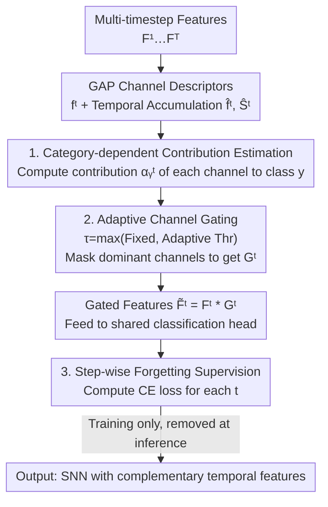

# Temporal Representation Enhancement (TRE): Learning to Forget Dominant Patterns for Enhanced Temporal Spiking Features

**Conference**: CVPR 2026  
**Paper**: [CVF Open Access](https://openaccess.thecvf.com/content/CVPR2026/html/Liu_Temporal_Representation_Enhancement_TRE_Learning_to_Forget_Dominant_Patterns_for_CVPR_2026_paper.html)  
**Code**: None  
**Area**: Spiking Neural Networks / Temporal Representation Learning  
**Keywords**: Spiking Neural Network (SNN), Temporal Redundancy, Learning to Forget, Channel Gating, Category Contribution Estimation

## TL;DR
To address the issue of temporal redundancy in Spiking Neural Networks (SNNs), where the same set of dominant channels are repeatedly activated across multiple timesteps, this paper proposes TRE. TRE estimates the contribution of each channel per category during training and uses adaptive threshold gating to temporarily mask "overly dominant" channels, forcing subsequent timesteps to mine complementary semantics. At inference, no masking is applied, resulting in zero extra overhead while achieving stable performance gains on CIFAR-100/ImageNet/DVS-CIFAR10.

## Background & Motivation
**Background**: SNNs utilize discrete spikes to process inputs across several timesteps. Naturally incorporating temporal dynamics and low power consumption, they are promising models connecting neuroscience with energy-efficient computing. Directly trained SNNs typically employ surrogate gradients for backpropagation and use **identical supervision signals** (the same classification head and label) at each timestep to stabilize optimization.

**Limitations of Prior Work**: The authors observe that this "time-invariant supervision" causes features across different timesteps to converge toward nearly identical representation subspaces. The network repeatedly activates the same high-response channels from $T=1$ to $4$ (the channel contribution density curves in Fig. 1 are narrow and sharp). Subsequent timesteps essentially repeat the semantics of earlier ones, providing almost no new information. The authors term this phenomenon **temporal redundancy**.

**Key Challenge**: The root cause lies in the conflict between "uniform supervision" and "temporal diversity." While uniform supervision ensures stable optimization, it also homogenizes gradients across timesteps. Consequently, the mutual information $I(f^t; f^{t-1})$ increases, while the marginal information provided by new timesteps regarding the target category $I(f^t; y) - I(f^{t-1}; y)$ decreases, wasting multi-step capacity. Existing improvements (deeper networks, multi-step calibration, or consistency constraints like TET/SLTT) mostly focus on **aligning or stabilizing** temporal features, which further reinforces convergence rather than actively **diversifying** it.

**Key Insight**: The authors draw inspiration from "predictive coding" in cognitive neuroscience—the brain **inhibits already explained signals and highlights novel residual information** in each perceptual cycle. Analogously, SNNs should "forget" dominant patterns that have already been fully utilized in subsequent timesteps, shifting attention to unexplored semantic subspaces. While spatial masking methods (masking dominant spatial regions in CNNs to expose other cues) have proven effective, they operate only in the spatial domain and cannot address SNN-specific temporal redundancy.

**Core Idea**: The temporal learning process is reformulated as a **"learning-to-forget"** process. Channel contributions to the current prediction are measured per category. Dominant channels with excessively high contributions are gated during training using dynamic thresholds, forcing the model to explore complementary features in later timesteps. This mechanism requires no architectural changes and adds zero inference overhead.

## Method

### Overall Architecture
TRE is a temporal modulation mechanism active only during training, attachable to any directly trained SNN backbone. Given a sequence of temporal features $\{F^1, \dots, F^T\}$ (where each $F^t \in \mathbb{R}^{H\times W\times C}$), the pipeline is as follows: first, Global Average Pooling (GAP) compresses each timestep into a channel descriptor $f^t = \text{GAP}(F^t)$. Then, descriptors and logits from timesteps $1$ to $t-1$ are accumulated to obtain a "temporal prior" of channel relevance. This is followed by **Category-dependent Contribution Estimation** to compute the contribution score $\alpha_y^t$ for each channel relative to the ground truth class $y$. **Adaptive Channel Gating** then masks dominant channels exceeding the threshold to produce gated features $\tilde F^t = F^t * G^t$. These gated features are fed into a shared classification head, constrained by **Step-wise Forgetting Supervision**. During inference, the gating pipeline is entirely removed, and the network reverts to the original SNN, **adding no computational cost or latency**.

### Key Designs

**1. Category-dependent Contribution Estimation: Quantifying dominant channels in current predictions**

To "forget dominant patterns," one must first identify which channels are dominant—specifically **for the current ground truth class**, as blind masking might damage useful features. The paper designs a category-conditional attribution. Temporal accumulation treats historical information as a prior: $\hat f^t = \frac{1}{t-1}\sum_{i=1}^{t-1} f^i$ and $\hat S^t = \frac{1}{t-1}\sum_{i=1}^{t-1} S^i$, where $S^i = \text{FC}(f^i)$ are the logits at step $i$ and FC is the shared linear layer. Using the weight row $w_y \in \mathbb{R}^C$ of the classification head for class $y$, the relevance score for channel $c$ at time $t$ is defined as:

$$\alpha_y^t[c] = \frac{\big(\exp(\hat f^t_c \cdot w_{y,c}) - 1\big)\cdot \exp\!\big(\sum_{i\neq c}\hat f^t_i \cdot w_{y,i}\big)}{\sum_{k=1}^{K}\exp(\hat S^t_k)}.$$

Intuitively, $\alpha_y^t[c]$ measures the marginal change in the model's confidence for class $y$ if channel $c$ were removed. This provides a **temporally aware and category-sensitive** score for dominant patterns.

**2. Adaptive Channel Gating: Precise masking using dual thresholds**

Simple top-k masking might cut useful features in samples with flat contribution distributions. This method uses a data-adaptive threshold: a constant baseline threshold $\theta_0^c$ is combined with a threshold $\theta_a^c = \mu(\alpha_y^t) + \lambda_c\,\sigma(\alpha_y^t)$ that follows the current sample's distribution (where $\mu, \sigma$ are the mean and standard deviation of contribution scores). The unified threshold is $\tau^c = \max(\theta_0^c, \theta_a^c)$. The gating vector is defined by an indicator function: $G^t[c] = \mathbb{I}(\alpha_y^t[c] < \tau^c)$. Channels below the threshold are kept ($G=1$), while dominant ones are zeroed ($G=0$). Gated features are $\tilde F^t = F^t * G^t$. Similar to dropout, gating includes normalization to maintain expected activation magnitudes and alleviate train/test distribution shifts.

**3. Step-wise Forgetting Supervision: Encouraging exploration of "new evidence"**

Gating only masks dominant channels during training. To ensure the network learns complementary representations, the loss must "see" the predictions after masking. At $t=1$, no history exists, so original predictions $p^1$ are used. For $t>1$, predictions from gated features $\tilde p^t = \text{softmax}(\text{FC}(\text{GAP}(\tilde F^t)))$ are used. The overall objective is:

$$L = L_{CE}(p^1, y) + \sum_{t=2}^{T} L_{CE}(\tilde p^t, y).$$

Because dominant channels are masked in subsequent steps, the network is **forced** to find discriminative evidence in the remaining, previously ignored semantic channels. This shifts "uniform supervision leading to convergence" toward "differentiated supervision encouraging exploration."

### Loss & Training
The backbone uses LIF neurons with Spiking ResNet-19/34. For CIFAR-100 and DVS-CIFAR10, SGD (momentum 0.9, initial lr 0.1, cosine annealing) is used. ImageNet follows the PSN configuration for 320 epochs. The firing threshold is set to 1, and the membrane decay constant to 2. $T=4$ for CIFAR-100 and $T=10$ for DVS-CIFAR10.

## Key Experimental Results

### Main Results
On static datasets (CIFAR-100 + ImageNet), TRE achieves higher accuracy with fewer timesteps than current SOTA:

| Dataset | Method | Backbone | Timesteps | Accuracy |
|--------|------|------|--------|--------|
| CIFAR-100 | SLTT | ResNet-18 | 6 | 74.67% |
| CIFAR-100 | TET | ResNet-19 | 4 | 74.47% |
| CIFAR-100 | GAC-SNN | ResNet-18 | 4 | 79.83% |
| CIFAR-100 | SlipReLU (Conv.) | ResNet-18 | 128 | 78.55% |
| CIFAR-100 | **TRE (Ours)** | ResNet-19 | 4 | **81.27%** |
| ImageNet | MPBN | ResNet-34 | 4 | 64.71% |
| ImageNet | PSN | ResNet-34 | 4 | 70.54% |
| ImageNet | **TRE (Ours)** | ResNet-34 | 4 | **71.60%** |

On CIFAR-100, $T=4$ outperforms SLTT ($T=6$) by +6.60% and SlipReLU ($T=128$) by +2.72%.

On the neuromorphic dataset DVS-CIFAR10:

| Method | Backbone | Timesteps | Accuracy |
|------|------|--------|--------|
| LM-H | ResNet-19 | 10 | 79.10% |
| TET | ResNet-19 | 10 | 83.00% |
| **TRE (Ours)** | ResNet-19 | 10 | **83.60%** |

### Ablation Study
Comparison of supervision strategies (ResNet-19):

| Dataset | Supervision | Timesteps | Accuracy | Note |
|--------|---------|--------|--------|------|
| CIFAR-100 | baseline (Uniform) | 4 | 77.75% | Starting Point |
| CIFAR-100 | TET | 4 | 80.16% | — |
| CIFAR-100 | **TRE** | 4 | **81.27%** | +3.52 over baseline |
| DVS-CIFAR10 | baseline | 10 | 78.40% | Starting Point |
| DVS-CIFAR10 | **TRE** | 10 | **83.60%** | +5.20 over baseline |

Gating strategy analysis (CIFAR-100, $T=4$):

| Gating Strategy | Accuracy | Note |
|---------|--------|------|
| Top-1 gating | 80.88% | Fixed masking of top 1 channel |
| Top-4 gating | 80.52% | More masking leads to degradation |
| **TRE Adaptive** | **81.27%** | Adaptive masking per sample |

### Key Findings
- **Explicit "Diversification" is more effective than "Alignment"**: TRE outperforms TET, which only adjusts the supervision structure, proving that actively masking dominant patterns is superior.
- **Greater gains on event-based data**: The improvement on DVS-CIFAR10 (+5.20) is larger than on CIFAR-100 (+3.52), as neuromorphic data contains richer temporal structures that benefit from mining complementary cues.
- **Fixed top-k causes over-masking**: Accuracy decreases as $k$ increases, whereas adaptive thresholds distinguish between truly dominant and complementary channels.
- **Normalization stabilizes training**: Normalized gating ensures the distribution of classification scores is consistent between training and inference.

## Highlights & Insights
- **Clever "Learning-to-Forget" Framework**: While most temporal SNN work attempts to align timesteps, this paper does the opposite. By actively forgetting utilized channels, it converts temporal redundancy into a manageable gating mechanism.
- **Zero Inference Overhead**: Since all gating is removed during inference, the method provides improvements without increasing latency or power consumption, which is highly beneficial for SNN deployment.
- **Transferable Category-conditional Attribution**: The paradigm of using classifier weights to estimate and inhibit dominant units could be transferred to general ANN regularization or long-tail suppression.

## Limitations & Future Work
- **Task Specificity**: Experiments focus solely on **classification**. Effectiveness in detection, segmentation, or complex event-stream tasks remains unverified.
- **Hyperparameters and Cost**: The introduction of $\theta_0^c$ and $\lambda_c$ adds complexity. Training costs associated with per-step contribution estimation were not fully quantified in the main text.
- **Dependence on Linear Head**: The contribution estimation assumes the classification head weights represent channel evidence. If features are not linearly separable, dominant channel identification may be inaccurate.

## Related Work & Insights
- **vs. TET / SLTT**: These focus on stabilizing features; TRE actively diversifies them, yielding higher accuracy in identical settings.
- **vs. ANN-to-SNN**: TRE achieves higher accuracy with 4 steps than conversion methods do with 128 steps, significantly reducing latency.
- **vs. Spatial Masking**: Unlike methods that suppress spatial regions, TRE targets the temporal domain specifically to solve temporal redundancy.

## Rating
- Novelty: ⭐⭐⭐⭐ 
- Experimental Thoroughness: ⭐⭐⭐⭐ 
- Writing Quality: ⭐⭐⭐⭐ 
- Value: ⭐⭐⭐⭐ 

<!-- RELATED:START -->

## Related Papers

- [\[CVPR 2026\] Robust Spiking Neural Networks by Temporal Mutual Information](robust_spiking_neural_networks_by_temporal_mutual_information.md)
- [\[CVPR 2026\] Temporal Interaction in Spiking Transformers with Multi-Delay Mixer](temporal_interaction_in_spiking_transformers_with_multi-delay_mixer.md)
- [\[CVPR 2026\] On the Role of Temporal Granularity in the Robustness of Spiking Neural Networks](on_the_role_of_temporal_granularity_in_the_robustness_of_spiking_neural_networks.md)
- [\[ICLR 2026\] PredNext: Explicit Cross-View Temporal Prediction for Unsupervised Learning in Spiking Neural Networks](../../ICLR2026/self_supervised/prednext_explicit_cross-view_temporal_prediction_for_unsupervised_learning_in_sp.md)
- [\[CVPR 2026\] Temporal Imbalance of Positive and Negative Supervision in Class-Incremental Learning](temporal_imbalance_of_positive_and_negative_supervision_in_class-incremental_lea.md)

<!-- RELATED:END -->
## Related Papers

- [\[CVPR 2026\] On the Role of Temporal Granularity in the Robustness of Spiking Neural Networks](on_the_role_of_temporal_granularity_in_the_robustness_of_spiking_neural_networks.md)
- [\[CVPR 2026\] Temporal Interaction in Spiking Transformers with Multi-Delay Mixer](temporal_interaction_in_spiking_transformers_with_multi-delay_mixer.md)
- [\[CVPR 2026\] Robust Spiking Neural Networks by Temporal Mutual Information](robust_spiking_neural_networks_by_temporal_mutual_information.md)
- [\[CVPR 2026\] Adaptive Spatial-Temporal Window: Unlocking the Potential of Event Cameras in Heterogeneous Velocity Scenarios](adaptive_spatial-temporal_window_unlocking_the_potential_of_event_cameras_in_het.md)
- [\[AAAI 2026\] Expressive Temporal Specifications for Reward Monitoring](../../AAAI2026/others/expressive_temporal_specifications_for_reward_monitoring.md)

<!-- RELATED:END -->
