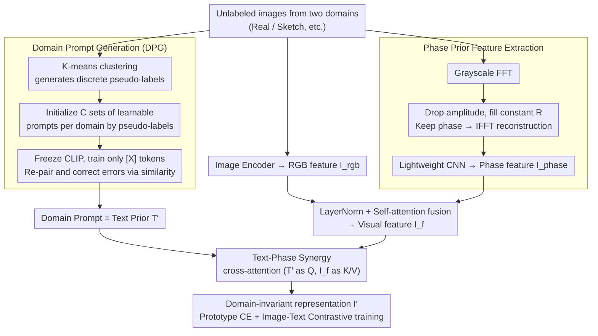

# Text-Phase Synergy Network with Dual Priors for Unsupervised Cross-Domain Image Retrieval

**Conference**: CVPR 2026  
**arXiv**: [2603.12711](https://arxiv.org/abs/2603.12711)  
**Code**: None  
**Area**: Cross-domain Retrieval / Self-supervised Learning  
**Keywords**: UCDIR, domain prompt, phase spectrum, text-phase dual priors, cross-domain alignment  

## TL;DR

Ours proposes TPSNet, which utilizes domain prompts learned by CLIP as text priors to provide fine-grained semantic supervision, while introducing phase spectrum features as phase priors to bridge domain distribution gaps and maintain semantic integrity. The synergy of text-phase dual priors achieves significant improvements in unsupervised cross-domain image retrieval.

## Background & Motivation

**Background**: Unsupervised Cross-Domain Image Retrieval (UCDIR) aims to retrieve semantically identical images across heterogeneous image domains (e.g., real images and sketches) without annotated data. The core difficulty lies in the dual challenge of lacking labels and significant domain distribution gaps.

**Limitations of Prior Work**: (1) Pseudo-label noise—pseudo-labels generated via K-means clustering serve as supervision signals, but discrete pseudo-labels are often inaccurate, causing noise interference in both intra-domain representation learning and cross-domain alignment, and leading to unreliable class prototypes; (2) Semantic degradation during cross-domain alignment—strategies like adversarial training or statistical distribution alignment inevitably damage semantic information while eliminating domain differences because domain-specific and semantic features are entangled.

**Core Idea**: (1) Use domain prompts learned by CLIP as text priors, providing richer and more accurate semantic supervision than discrete pseudo-labels; (2) Use the phase spectrum isolated by Fourier Transform as a phase prior—the phase spectrum encodes structural and semantic information and is robust to domain shifts—bridging domain gaps while maintaining semantic integrity. The two paths work in synergy.

## Method

### Overall Architecture

The dilemma of UCDIR is that without ground truth labels, only discrete pseudo-labels from K-means are available for supervision, which are noisy and lack semantics. Meanwhile, traditional adversarial or statistical alignment tends to erase semantics during domain alignment. The concept of TPSNet is to replace these two tasks with more reliable "priors" and let them collaborate. The network operates in two stages: first, Domain Prompt Generation (DPG) learns a set of category prompts for each domain, upgrading cluster pseudo-labels into continuous semantic signals in the CLIP text space; then, the Text-Phase Dual Priors Network (TPDP) uses these prompts as **text priors** to guide semantic features, while using the image phase spectrum as a **phase prior** to cross the domain gap. Finally, cross-attention fuses the dual priors into domain-invariant semantic representations.

### Key Designs

**1. Domain Prompt Generation: Replacing noisy pseudo-labels with CLIP text priors**

Using K-means pseudo-labels directly for supervision allows misaligned samples to pollute intra-domain representations and class prototypes. DPG treats pseudo-labels not as the endpoint, but as an initialization scaffold: it prepares $C$ learnable prompt templates ("An image of a $[X]^1\ldots[X]^M$") for each domain, then freezes CLIP and trains only the $[X]$ tokens using contrastive loss $\mathcal{L}_{prompt}=\mathcal{L}_{i2t}+\mathcal{L}_{t2i}$. Critically, re-pairing occurs based on image-text cosine similarity during contrast, meaning the optimization process itself corrects a portion of misassigned pseudo-labels. After training, each prompt becomes a text segment encoding precise category semantics, carrying far more information than a discrete integer label.

**2. Phase-Prior Feature Extraction: Bridging domain gaps with phase spectrum invariance**

To eliminate domain gaps without damaging semantics, a signal that is "inherently consistent across domains" must be identified. In Fourier analysis, the amplitude spectrum mainly carries domain-specific low-level statistics like style and color, while the phase spectrum encodes structure and edges—the semantic skeleton shared across domains. TPSNet performs FFT on grayscale images to obtain $F(u,v)=|A(u,v)|e^{j\phi(u,v)}$, then discards the amplitude and substitutes it with a constant $R$:

$$F'(u,v) = R\,e^{j\phi(u,v)}$$

Then, IFFT reconstructs an image retaining only phase information. This step strips most domain-specific factors at the input. The reconstructed image passes through a lightweight CNN to obtain phase features $I^{phase}$, which are fused with RGB features via LayerNorm + Self-Attention to form $I^f$, allowing the semantic skeleton and original appearance to complement each other.

**3. Text-Phase Dual Priors Synergy: Mutual guidance through attention**

The text prior knows "what the category should be," and the phase prior knows "which features are stable across domains," but they reside in semantic and frequency spaces, respectively. TPSNet uses cross-attention to align them: using domain prompt text features $T'$ as Query and fused visual features $I^f$ as Key/Value,

$$I' = \text{CrossAttention}(T';\,I^f)$$

Thus, the text prior provides the "direction toward the category" from the semantic dimension, while the phase prior ensures "no deviation by domain shift" from the feature dimension. The two complement and enhance each other within the attention weights. The resulting $I'$ is trained jointly using prototype cross-entropy $\mathcal{L}_{pce}$ and image-text contrastive loss with label smoothing $\mathcal{L}_{i2tce}$. Class prototypes are updated via momentum $\mathcal{P} \leftarrow m\mathcal{P} + (1-m)I'$ for stability.

### Loss & Training

The total loss is $\mathcal{L} = \alpha\mathcal{L}_{pce} + \beta\mathcal{L}_{i2tce}$, where $\mathcal{L}_{i2tce}$ uses label smoothing $\sigma_j=(1-\epsilon)y_i+\epsilon/C$ to further dilute pseudo-label noise. Training is conducted in two stages: Stage 1 optimizes only the prompt tokens (DPG), and Stage 2 trains all TPDP modules.

## Key Experimental Results

### Main Results

**Office-Home (65 classes, 4 domains, 12 scenarios) and DomainNet (7 classes, 6 domains)**:

| Method | Office-Home Mean P@1 | Office-Home Mean P@15 |
|------|-------------------|---------------------|
| DD | ~45 | ~35 |
| ProtoOT | ~50 | ~47 |
| ShieldIR | ~53 | ~50 |
| **TPSNet** | **Significant SOTA** | **Significant SOTA** |

### Ablation Study

| Configuration | Effect | Description |
|------|------|------|
| Pseudo-label only (No Domain Prompt) | Baseline | Large noise |
| + Text Prior (Domain Prompt) | Significant ↑ | More precise semantic supervision |
| + Phase Prior | Further ↑ | Domain-invariant features are helpful |
| **Dual Prior Synergy** | **Optimal** | Best effect via complementary enhancement |

### Key Findings

- The text prior alone provides a significant boost—indicating CLIP's semantic signals are much richer than cluster pseudo-labels.
- The phase prior shows more pronounced improvements in scenarios with large domain gaps (e.g., Art↔Clipart), validating the phase spectrum invariance hypothesis.
- Label smoothing is effective in alleviating pseudo-label noise.

## Highlights & Insights

- The dual-path design of text prior + phase prior is highly insightful—the former provides domain-invariant signals from the semantic space and the latter from the frequency space. This "multi-view domain invariance" is more robust than single alignment strategies.
- Reconstructing images using constant amplitude and original phase is simple yet effective—phase indeed encodes structural semantic information consistent across domains.

## Limitations & Future Work

- Dependency on K-means clustering for domain prompt initialization; clustering quality impacts all subsequent steps.
- The phase spectrum is extracted only from grayscale images, losing potential domain-invariant components in color information.
- Domain gaps in current datasets are relatively limited; performance under more extreme domain shifts remains to be verified.

## Related Work & Insights

- **vs DD/CODA**: These use pseudo-labels directly for intra-domain contrast and cross-domain alignment; TPSNet replaces pseudo-labels with domain prompts for superior semantic supervision.
- **vs FDA/FUDA**: These replace low frequencies in the frequency domain for domain adaptation; TPSNet further separates amplitude/phase, leveraging the inherent domain invariance of phase.

## Rating

- Novelty: ⭐⭐⭐⭐ The dual-path design of text + phase priors is a novel combination in UCDIR.
- Experimental Thoroughness: ⭐⭐⭐⭐ Two benchmarks, 12 cross-domain scenarios, and comprehensive ablation.
- Writing Quality: ⭐⭐⭐ Clear structure, though diagrams and tables are complex.
- Value: ⭐⭐⭐ UCDIR is a meaningful problem with significant improvements shown.

<!-- RELATED:START -->

## Related Papers

- [\[CVPR 2026\] D2Dewarp: Dual Dimensions Geometric Representation Learning Based Document Image Dewarping](d2dewarp_dual_dimensions_geometric_representation_learning_based_document_image_.md)
- [\[CVPR 2026\] Is Parameter Isolation Better for Prompt-Based Continual Learning?](is_parameter_isolation_better_for_prompt-based_continual_learning.md)
- [\[CVPR 2026\] Semantic-Guided Global-Local Collaborative Prompt Learning for Few-Shot Class Incremental Learning](semantic-guided_global-local_collaborative_prompt_learning_for_few-shot_class_in.md)
- [\[CVPR 2026\] Graph Attention Prototypical Network for Robust Few-Shot Classification](graph_attention_prototypical_network_for_robust_few-shot_classification.md)
- [\[CVPR 2026\] GM-R²: Generative Matching Learning for Unsupervised Geometric Representation and Registration](gm-r2_generative_matching_learning_for_unsupervised_geometric_representation_and.md)

<!-- RELATED:END -->
