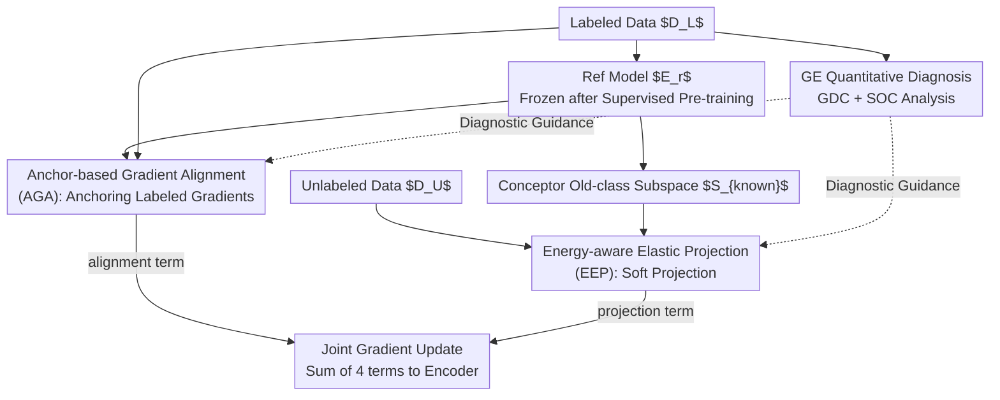

# The Devil Is in Gradient Entanglement: Energy-Aware Gradient Coordinator for Robust Generalized Category Discovery

**Conference**: CVPR 2026  
**Paper**: [CVF Open Access](https://openaccess.thecvf.com/content/CVPR2026/html/Zheng_The_Devil_Is_in_Gradient_Entanglement_Energy_Aware_Gradient_Coordinator_for_CVPR_2026_paper.html)  
**Code**: https://haiyangzheng.github.io/EAGC  
**Area**: Generalized Category Discovery / Self-Supervised Representation Learning  
**Keywords**: Generalized Category Discovery (GCD), Gradient Entanglement, Gradient Projection, Conceptor Subspace, Plug-and-play

## TL;DR
This paper identifies "gradient entanglement" in Generalized Category Discovery (GCD), where sharing parameters between supervised and unsupervised objectives causes unsupervised gradients to pollute supervised directions and supervised gradients to pull new class representations into old class subspaces. It proposes EAGC, a plug-and-play module that uses a supervised reference model to anchor labeled sample gradients (AGA) while adaptively soft-projecting unlabeled gradients out of the old class subspace based on energy (EEP), achieving an average gain of 3.2% in All ACC and 4.3% in New ACC across four GCD baselines and five datasets.

## Background & Motivation
**Background**: The GCD setting involves a labeled "old class" dataset $D_L$ and an unlabeled dataset $D_U$ containing both old and new classes. The goal is to categorize all samples in $D_U$ into correct (potentially newly discovered) classes. Mainstream parametric methods (SimGCD, LegoGCD, SPTNet) and non-parametric methods (SelEx) largely rely on a weighted sum of a supervised loss $L_{sup}$ and an unsupervised/pseudo-label loss $L_{unsup}$ for end-to-end joint optimization: $L_{GCD}=\alpha L_{sup}(D_L)+\beta L_{unsup}(D_U)$.

**Limitations of Prior Work**: This "direct summation" often fails to balance old and new classes. The authors pinpoint this problem using two quantitative metrics: supervised gradient directions are increasingly diverted by unsupervised gradients, while new class representations are gradually absorbed into the old class feature subspace.

**Key Challenge**: $L_{sup}$ derived from clean labels provides stable and consistent gradient directions, whereas $L_{unsup}$ from pseudo-labels/self-supervision is noisy and disorganized, especially in early training. When sharing parameters $\theta$, **supervisory asymmetry** occurs: noisy gradients $g_U$ distort reliable gradients $g_L$, and because old classes receive gradients from both labeled supervision $g_L$ and unlabeled old-class samples $g_U^{known}$, old-class directions dominate the optimization, pulling new class representations into the old-class subspace. The authors name this phenomenon **Gradient Entanglement (GE)**.

**Goal**: Without modifying the backbone or original losses, the objective is to operate at the gradient level to suppress the two manifestations of GE: (1) stabilizing the optimization direction of labeled samples; (2) pushing unlabeled gradients away from the old-class subspace without harming unlabeled samples that actually belong to old classes.

**Key Insight**: Treat GCD as a **gradient conflict** problem. The method draws inspiration from gradient projection in multi-task/continual learning but introduces adaptive processing for the unique GCD challenge where old and new classes are mixed in the unlabeled set.

**Core Idea**: Utilize a frozen supervised reference model as an "anchor" to calibrate labeled gradients, and apply a Conceptor soft subspace with energy-aware weights to elastically project unlabeled gradients out of the old-class subspace.

## Method

### Overall Architecture
EAGC (Energy-Aware Gradient Coordinator) is a **pure gradient-layer, plug-and-play** coordinator. Before training, a reference model $E_r$ is trained on labeled data and frozen to construct the old-class subspace $S_{known}$. During training, two backpropagation hooks are attached to labeled and unlabeled samples within the same batch to modify feature-level gradients $\nabla_z L$ before they propagate to the encoder. The method keeps the network structure and original losses intact, modifying the final feature-level gradient into four components:

$$\nabla_z L_{GCD} = \nabla_z L_{sup} + \nabla_z L_{unsup} + \nabla_{z_l} g_{align} + \nabla_{z_u} g_{proj}.$$

The first two are the original baseline gradients, while the latter two are injected by AGA (on labeled samples) and EEP (on unlabeled samples), distinguished by a `masklab` mask.

### Key Designs

**1. Quantitative Diagnosis of Gradient Entanglement: GDC and SOC**

The authors quantify the trade-off difficulty using two coefficients. The first is the **Gradient Deviation Coefficient (GDC)**: let $\hat g_L=\nabla_\theta L_{sup}$ be the reference gradient when training with only supervised loss ($\beta=0$), and $g$ be the actual joint optimization gradient:

$$\text{GDC} = 1 - \frac{\langle \hat g_L, g\rangle}{\lVert \hat g_L\rVert\,\lVert g\rVert} \in [0,2],$$

which is essentially 1 minus the cosine similarity. Higher values indicate greater pollution of the supervised direction. The second is the **Subspace Overlap Coefficient (SOC)**: using the first $k$ principal components $U_k$ of old-class features $Z_{old}$ to construct a projection matrix $P_{old}=U_k U_k^\top$, SOC measures the energy ratio of new class features $Z_{new}$ falling into this subspace:

$$\text{SOC} = \frac{\lVert Z_{new}P_{old}\rVert_F^2}{\lVert Z_{new}\rVert_F^2} \in [0,1],$$

where higher values denote the "swallowing" of new class representations by the old-class subspace. Observations on SimGCD show GDC rising monotonically and SOC jumping early, remaining high. AGA and EEP are designed to lower GDC and SOC, respectively.

**2. AGA (Anchor-based Gradient Alignment): Anchoring Labeled Gradients with a Frozen Model**

Targeting GDC, this module prevents labeled optimization from being diverted by unlabeled noise. A reference model $E_r$ is pre-trained (predicting $p_i=\sigma(f(E(x_i^l))/\tau_s)$, loss $L_{cls}=\frac{1}{|B_L|}\sum_{i\in B_L}\ell(y_i^l,p_i)$) and frozen to provide stable feature anchors $\hat z_i^l=E_r(x_i^l)$. During GCD training, an additional **stabilization term** is added to labeled feature gradients:

$$\nabla_{z_l} L_{GCD} = \underbrace{\nabla_{z_l}L_{sup}+\nabla_{z_u}L_{unsup}}_{\text{Perturbation}} + \underbrace{\lambda_a(z^l-\hat z^l)}_{\text{Stabilization}},$$

where $\nabla_{z_l}g_{align}=\lambda_a(z^l-\hat z^l)$ pulls the current feature $z^l$ towards $\hat z^l$. This acts as a **proximal regularization** in the feature space, creating a trust region around the supervised optimum to inhibit semantic drift.

**3. EEP (Energy-aware Elastic Projection): Adaptive Soft Projection for Unlabeled Gradients**

Targeting SOC, this module consists of three steps. First, **Construct the Old-class Subspace** using Conceptor theory instead of PCA to avoid over-compression. The weighted soft subspace is:

$$S_{known} = R(R+\eta^{-2}I)^{-1}, \quad R=\tfrac{1}{N}Z_{old}^\top Z_{old},$$

where aperture $\eta$ controls the softness. Second, **Soft Projection**: feature gradients are modified as $\nabla_{z_u}L_{unsup}\leftarrow \nabla_{z_u}L_{unsup}-\lambda_p(\nabla_{z_u}L_{unsup}\,S_{known})$ to subtract components in the old-class subspace. Third, **Energy-aware Adaptive Weighting**: to avoid harming unlabeled old-class samples, an energy ratio for a feature is defined:

$$E_{old}(z_i)=\frac{z_i^\top S_{known}z_i}{\lVert z_i\rVert_2^2}\in[0,1],$$

normalized by the average energy of labeled data $E_{old}^l$ to get the elastic weight:

$$\tau_i = 1 - \frac{E_{old}(z_i^u)}{E_{old}^l}.$$

Samples highly aligned with the old-class subspace (likely old classes) receive a small $\tau_i$ (weak projection), while misaligned samples (likely new classes) receive a large $\tau_i$ (strong projection).

### Loss & Training
EAGC introduces no new loss functions. The original $L_{GCD}=\alpha L_{sup}+\beta L_{unsup}$ is maintained. AGA and EEP are implemented via backward hooks. Hyperparameters are $(\lambda_a, \lambda_p)=(0.7,0.5)$ and $\eta=2.0$. The reference model is trained for 30 epochs (3 for CIFAR-100 to avoid overfitting), using $\tau_s=0.1$. The backbone is a DINO-pretrained ViT-B/16.

## Key Experimental Results

### Main Results
Evaluation across five datasets and four baselines using Average ACC (All/Old/New):

| Baseline | All | Old | New | +EAGC All | +EAGC Old | +EAGC New |
|----------|-----|-----|-----|-----------|-----------|-----------|
| SimGCD | 66.3 | 74.2 | 62.0 | 70.7 | 77.1 | 67.3 |
| LegoGCD | 68.8 | 77.0 | 64.9 | 70.5 | 77.7 | 66.8 |
| SPTNet | 70.2 | 77.5 | 65.9 | 71.2 | 76.7 | 68.4 |
| SelEx | 70.9 | 78.9 | 66.1 | 76.7 | 80.7 | 73.4 |

Average gains across baselines: All +3.2%, New +4.3%. Specifically, SelEx+EAGC on CUB improved All ACC by 9.6%.

### Ablation Study
On SimGCD, AGA primarily boosts Old ACC (+4.8%), while EEP primarily enhances New ACC (+4.6%). Removing the energy-aware weight $\tau$ (one-size-fits-all projection) drops Average All ACC by 4.2% and Old ACC by 4.7% in SelEx, confirming that unselective projection hurts old-class learning.

### Key Findings
- AGA manages GDC while EEP manages SOC, demonstrating targeted design.
- Gains are higher on finer-grained datasets and stronger baselines like SelEx.
- The energy-aware weight $\tau$ is critical for EEP to handle the mixed nature of the unlabeled set.
- Quantitative diagnosis shows SimGCD's GDC dropped from 0.2669 to 0.1525 and SOC from 0.6478 to 0.4923 on CUB.

## Highlights & Insights
- **Diagnostic-driven design**: Quantifying "poor training" into measurable coefficients (GDC/SOC) before solving them provides a solid logical foundation.
- **Pure gradient-level plug-and-play**: Modifying gradients via hooks rather than losses or architectures makes it universally applicable with low engineering overhead.
- **Conceptor soft subspace**: Replacing hard PCA truncation with energy-weighted operators preserves critical low-energy details for class discrimination.
- **Elastic intervention**: The concept of regulating intervention intensity based on energy ratios in a protected subspace is highly transferable to other open-set or semi-supervised scenarios.

## Limitations & Future Work
- Training and freezing a reference model $E_r$ adds to the training pipeline and memory usage. Its quality may be sensitive to labeled data volume.
- Three hyperparameters ($\lambda_a, \lambda_p, \eta$) were tuned on CUB and reused; a systematic sensitivity analysis across highly diverse domains is lacking.
- Gains on New ACC for certain strong baselines (e.g., SPTNet) on specific datasets were marginal or showed slight regression, suggesting uneven benefits depending on existing gradient entanglement severity.

## Related Work & Insights
- **vs Gradient Surgery (PCGrad) / GPM**: These multi-task/continual learning methods use projection to resolve conflicts but often rely on hard orthogonality or full supervision. EAGC differs by using energy-aware soft projection specifically for mixed unlabeled sets.
- **vs GCD Baselines**: While prior work focuses on loss objectives or clustering, EAGC operates at the optimization level, allowing it to be orthogonally combined with almost any existing GCD framework.

## Rating
- Novelty: ⭐⭐⭐⭐⭐ First to quantify GCD trade-offs as GDC/SOC entanglement and solve them at the gradient layer.
- Experimental Thoroughness: ⭐⭐⭐⭐⭐ Comprehensive evaluation across multiple datasets, baselines, and backbones.
- Writing Quality: ⭐⭐⭐⭐ Clear logic from diagnosis to verification; some mathematical operators require careful reading.
- Value: ⭐⭐⭐⭐⭐ A low-cost, high-yield component for the GCD community.

<!-- RELATED:START -->

## Related Papers

- [\[CVPR 2026\] TAR: Token-Aware Refinement for Fine-grained Generalized Category Discovery](tar_token-aware_refinement_for_fine-grained_generalized_category_discovery.md)
- [\[CVPR 2026\] Seeing Through the Shift: Causality-Inspired Robust Generalized Category Discovery](seeing_through_the_shift_causality-inspired_robust_generalized_category_discover.md)
- [\[CVPR 2026\] Learning Like Humans: Analogical Concept Learning for Generalized Category Discovery](learning_like_humans_analogical_concept_learning_for_generalized_category_discov.md)
- [\[CVPR 2026\] DGS: Dual Gradient and Semantic-Shift Guided Low-Rank Adaptation for Class Incremental Learning](dgs_dual_gradient_and_semantic-shift_guided_low-rank_adaptation_for_class_increm.md)
- [\[CVPR 2026\] Decouple Your Discovery and Memory in Continual Generalized Category Discovery](decouple_your_discovery_and_memory_in_continual_generalized_category_discovery.md)

<!-- RELATED:END -->
