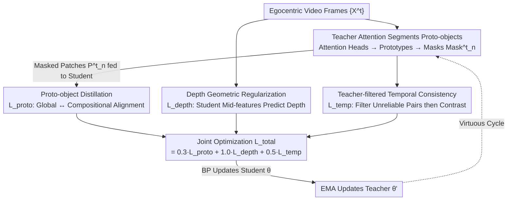

# Towards Stable Self-Supervised Object Representations in Unconstrained Egocentric Video

**Conference**: CVPR 2026  
**Paper**: [CVF Open Access](https://openaccess.thecvf.com/content/CVPR2026/html/Tan_Towards_Stable_Self-Supervised_Object_Representations_in_Unconstrained_Egocentric_Video_CVPR_2026_paper.html)  
**Area**: Self-Supervised / Representation Learning  
**Keywords**: Egocentric Video, Self-Supervised, Object Discovery, Temporal Consistency, Depth Regularization

## TL;DR
EgoViT employs a teacher-student ViT framework to jointly optimize three mechanisms—"proto-object discovery + depth geometric regularization + teacher-filtered temporal consistency"—from unlabeled egocentric videos. It achieves an +8.0% improvement in unsupervised object discovery CorLoc and a +4.8% increase in semantic segmentation mIoU.

## Background & Motivation
**Background**: Human visual intelligence emerges "self-supervised" through embodied experiences—by continuously observing how objects move, are occluded, and reappear, we acquire low-level concepts such as object permanence. However, mainstream self-supervised learning (SSL) paradigms in computer vision (e.g., DINO, iBOT, MAE) are mostly built on static third-person images or short video clips from controlled environments, where data is "object-centric, clean-background, and center-composed."

**Limitations of Prior Work**: Directly applying these methods to unconstrained egocentric videos (e.g., long-form "Walking Tours") results in failure. Egocentric video presents three inherent challenges: dense object interactions, severe occlusions, and continuous ego-motion. Mainstream SSL learns general correspondences at the patch or frame level without a concept of "object identity," making it impossible to stably associate the same object across frames in cluttered scenes. Object-centric methods like Slot Attention assume approximately static inputs and are disrupted by the non-stationarity of egocentric video. Motion-grouping-based methods struggle to distinguish "true object motion" from "camera motion." While traditional Multiple Object Tracking (MOT) can track, it relies on pre-defined category detectors and cannot discover new objects.

**Key Challenge**: The "temporal richness" of egocentric video is both an opportunity and a burden—the constantly changing viewpoints and occlusions make "maintaining consistent object representations" extremely difficult. Existing SSL methods either lack the concept of an object or cannot withstand the disturbances of ego-motion.

**Goal**: To learn **identity-consistent and temporally persistent** category-agnostic object representations from unconstrained egocentric videos without any human annotation.

**Key Insight**: The authors shift the learning focus from "low-level pixel correspondence" to "discovering and tracking emergent proto-objects." This is inspired by two factors: first, DINO's attention heads can naturally emerge as object detectors; second, the primate visual system relies on **stereo/depth information** to stably model a dynamic world. Thus, the authors hypothesize that stable object representations can **emerge** from the joint optimization of three complementary signals: appearance, depth, and time.

**Core Idea**: Using "proto-objects" as representation units, a momentum-updated teacher network discovers and stabilizes them. Depth geometry anchors these representations to physical structures, while the teacher filters out unreliable temporal correspondences. These three components form a virtuous cycle that gradually refines initial crude object hypotheses into persistent representations.

## Method

### Overall Architecture
EgoViT is a **teacher-student ViT framework**: the student network $g_\theta$ is updated via standard backpropagation, while the teacher network $g_{\theta'}$ is updated using an Exponential Moving Average (EMA) of the student's parameters, ensuring it remains "more stable" than the student. The input consists of egocentric video frames $\{X^t\}_{t=1}^{T}$, and the output is an end-to-end trained object representation transferable to downstream tasks.

The workflow revolves around three synergistic mechanisms (appearance, geometry, and time): first, the teacher uses its final layer's attention heads to segment $N$ "proto-object" masks per frame and feeds them to the student (Appearance). Simultaneously, the student's intermediate features predict a depth map to anchor representations to geometric structures (Geometry). Finally, the teacher filters unreliable cross-frame pairings within a temporal window, performing contrastive learning only on reliable pairs (Time). The three losses are weighted and jointly optimized, forming a cycle of "initial hypothesis → gradual refinement → stable representation."

### Key Designs

**1. Teacher Attention Segmentation: A parameter-free three-step method to "carve" object candidates from unlabeled frames**

To discover objects, one must first have candidate regions, but there are no annotations or detectors. The authors utilize the observation that ViT attention heads emerge as object detectors. They let the **momentum teacher's** last layer use $N$ attention heads to each discover a different "proto-object" (potential, temporally stable visual primitives of a complex scene). For the $n$-th prototype of the $t$-th frame, the process involves three steps: ① **Prototype Synthesis**: Aggregate the head's query embedding $q^t_n$ and its spatial attention map $A^t_n$ into a head-specific prototype feature $o^t_n = A^t_n \cdot q^t_n$, representing what concept the head is currently "looking for"; ② **Spatial Localization**: Compute the cosine similarity between $o^t_n$ and each patch embedding $e^t$ from the teacher backbone to get a soft assignment map $M^t_n = \mathrm{sim}(o^t_n, e^t)$, highlighting regions matching the appearance; ③ **Discrete Masking**: Perform binarization with a parameter-free adaptive threshold $\mathrm{Mask}^t_n = \mathbb{1}(M^t_n > \mathbb{E}[M^t_n])$ to extract the most significant regions. The mask is applied back to the original image to get $P^t_n = X^t \odot \mathrm{Mask}^t_n$, which is fed into the student encoder to get prototype feature $f_n$. The brilliance lies in using a dynamic, hyperparameter-free threshold (exceeding the image mean) to avoid and solve failures in varying scenes without adding learnable parameters.

**2. Proto-object Distillation Learning: Forcing "the whole" and "the sum of parts" to align within the student to drive compositional understanding**

Segmenting prototypes is only the first step; the student must learn high-quality representations. The authors use a knowledge distillation objective $L_{\text{proto}}$ to enforce consistency between two representations in the student: the global feature $f^t$ from the **full unmasked input** and the **compositional feature** $f^t_{\text{agg}} = \sum_n w^t_n f^t_n$ aggregated from individual proto-object features. Both are aligned to the stable global target $f'^t$ provided by the teacher for the full input. Alignment is achieved via cross-entropy between softmax outputs:

$$H(y', y) = -\sum_{i=1}^{C} \mathrm{softmax}\!\left(\frac{y'}{\tau_t}\right)_i \cdot \log \mathrm{softmax}\!\left(\frac{y}{\tau_s}\right)_i$$

where $\tau_t, \tau_s$ are teacher/student temperatures. The combined loss is:

$$L_{\text{proto}} = H(f', f) + H(f', f_{\text{agg}})$$

The first term $H(f', f)$ ensures holistic scene understanding, while $H(f', f_{\text{agg}})$ anchors learning to object-level entities—essentially forcing the model to "reconstruct holistic understanding from local parts," embedding compositionality into the representation. This is more constrained than pure frame-level distillation (like DINO, which only aligns global features).

**3. Depth Geometric Regularization: Anchoring representations to physical structures using accessible depth maps**

Appearance cues alone are insufficient to stably decouple objects from backgrounds under continuous ego-motion. While optical flow is a classic motion cue, it is computationally expensive and often unavailable. Inspired by primate perception using geometry to stabilize the dynamic world, the authors add an **auxiliary depth regression task**: feeding intermediate features $m^t$ from the student encoder into a lightweight decoder to predict a depth map. The depth regularization loss $L_{\text{depth}}$ includes a **scale-invariant term** for relative layout and a **gradient-consistency term** to preserve boundaries, focusing optimization on geometric structure while ignoring unreliable absolute scale and translation. A key engineering point: during training, off-the-shelf monocular estimators (Depth-Anything-V2) provide pseudo-depth for supervision, but **no geometric input is required during inference**, resulting in zero additional inference cost. Ablations show this as the "synergistic glue"—without depth, even with P+T, performance drops significantly because temporal learning is misled by blurred appearance without stable geometric anchors.

**4. Teacher-Filtered Temporal Consistency: Pruning "unreliable cross-frame pairs" via the stable teacher before contrastive learning**

Aligning prototypes cross time is the hardest part of egocentric video—occlusions, out-of-frame motion, and rapid appearance changes create noisy pairs. The authors' innovation is using the **stable momentum teacher to actively filter** unreliable correspondences before they reach the student. For two frames $t, t'$ within window $W$ ($|t-t'| \le W$): ① **Teacher Consistency Filtering**: Compute the cosine similarity of the $n$-th prototype's teacher features across frames; retain only those exceeding a threshold $M^{(t,t')}_n = \mathbb{1}(\mathrm{sim}(z'^t_n, z'^{t'}_n) > \epsilon)$, with $\epsilon=0.8$. This prunes "dirty" pairs caused by occlusions or scene exits; ② **Temporal Contrast**: Perform InfoNCE only on filtered reliable pairs, pulling the student's prototype $z^{t'}_n$ at $t'$ towards the teacher's corresponding $z'^t_n$ (positive) and pushing it away from other prototypes $k \neq n$:

$$L^{(t,t')}_{\text{temp}} = -\frac{1}{|P|}\sum_{n \in P} \log \frac{\exp(\mathrm{sim}(z^{t'}_n, z'^t_n)/\gamma)}{\sum_{k=1}^{K}\exp(\mathrm{sim}(z^{t'}_n, z'^t_k)/\gamma)}$$

where $P$ is the set of valid prototypes and $\gamma$ is the temperature. Ablations prove this "filter" is the key to making temporal self-supervision work; without it, proto-level temporal alignment causes CorLoc to drop from 37.9% to 33.2%.

### Loss & Training
The three mechanisms are jointly optimized:

$$L_{\text{total}} = \lambda_P L_{\text{proto}} + \lambda_D L_{\text{depth}} + \lambda_T L_{\text{temp}}$$

In experiments, $\lambda_P, \lambda_D, \lambda_T = 0.3, 1.0, 0.5$. The backbone is a ViT-S/16 initialized from scratch, AdamW, effective batch size 192, 5e-4 learning rate with 10-epoch warmup and cosine decay to 1e-5. Weight decay increases linearly from 0.04 to 0.4. The main model is trained for 320 epochs, while ablations use 40. The teacher uses EMA throughout.

## Key Experimental Results

### Main Results
All models (including baselines) are pre-trained from scratch via self-supervision on **the same 65-minute WT-Zurich egocentric video** with a unified protocol.

| Task / Metric | DINO (baseline) | DoRA | EgoViT-Zurich | EgoViT vs. DINO |
|------|------|------|------|------|
| Semantic Seg. ADE20K mIoU | 21.2 | 21.6 | **26.0** | +4.8 |
| Instance Seg. MS-COCO mAP | 20.6 | 20.4 | **24.3** | +3.7 |
| Video Obj. Seg. DAVIS (J&F)m | 53.8 | 53.8 | **54.3** | +0.5 |
| Unsupervised Obj. Disc. VOC CorLoc | 37.2 | 24.1 | **45.2** | +8.0 |
| Linear Probe ImageNet Acc | 30.9 | 29.6 | **34.0** | +3.1 |

EgoViT-WT-all, trained on the full Walking Tours dataset, further increases CorLoc to 50.2% and mIoU to 30.6%, demonstrating graceful scaling. On LaSOT long-term tracking (using the OSTrack framework with swapped backbones), EgoViT achieves an AUC of 64.7, significantly higher than DINO (60.5) and DoRA (61.7).

### Ablation Study

| Config (D=Depth, P=Proto, T=Temp) | k-NN | CorLoc | Note |
|------|------|------|------|
| None (≈DINO) | 21.8 | 27.5 | Baseline |
| D only | 22.2 | 34.6 | Depth alone provides large gain |
| P only | 22.0 | 35.6 | Prototype alone provides large gain |
| D+T | 22.5 | **37.9** | Best two-component combination |
| P+T (no D) | 22.9 | 35.9 | Temporal misled without geometric anchors |
| Full (D+P+T) | **23.2** | **38.3** | Optimal complementarity |

| Temporal Strategy | Granularity | Frames | CorLoc | Description |
|------|------|------|------|------|
| D+T Frame-level | Frame | 3 | 34.2 ↓ | Naive frame-level degrades |
| D+T No Filter | Proto | 4 | 33.2 ↓ | Worse with unfiltered noise |
| D+T Full | Proto | 4 | **37.9** | Efficient with teacher filter + proto-level |

### Key Findings
- **Depth is "Synergistic Glue"**: P+T without D achieves only 35.9% CorLoc, performing worse than D+T (37.9%). The authors explain that without stable geometric anchors for "where" an object is, temporal learning is misled by blurred appearance. Depth provides "where," prototypes provide "what," and time provides "how it persists."
- **Teacher Filtering is the On/Off Switch**: Without filtering, proto-level temporal alignment drops CorLoc from 37.9% to 33.2%, worse than no temporal alignment at all—confirming that direct matching in unconstrained video introduces excessive noise.
- **Robustness to Depth Quality**: CorLoc remains stable at 36–38.6% across Gaussian blurred depth and different estimators (MiDaS / Depth-Pro), indicating the model relies on coarse structural cues rather than precise geometry.
- **Stability Across Cities/Lighting**: Performance on videos from five cities (including dusk/night) remains stable, showing the robustness of the discovered prototypes.

## Highlights & Insights
- **The "Proto-object" Abstraction is Clever**: It is neither a pixel nor a pre-defined category, but a reusable visual primitive emerging from attention heads. This avoids both the "novel object discovery" limitation of detectors and the "static assumption" of slot attention.
- **Triple-threat Teacher**: The teacher acts as the "annotator" for masking, the "stable target" for distillation, and the "referee" for temporal pairs. A single EMA teacher glues three mechanisms without additional modules.
- **Depth-as-Regularizer is Highly Practical**: Borrowing pseudo-depth during training but having zero geometric dependence during inference provides geometric priors for free.
- **Filtering-priority Logic is Transferable**: The strategy of "pruning unreliable positive samples using a stable network before contrastive learning" is applicable to any noisy temporal or cross-view self-supervised task.

## Limitations & Future Work
- **Fixed Hyperparameter $N$**: Each frame is segmented into $N$ prototypes based on the number of attention heads. How the model adapts when the actual number of objects is much higher or lower than $N$ is not explored.
- **Dependence on Monocular Estimator Bias**: While robust to quality, the representations might inherit systematic errors (e.g., handling of transparent/reflective objects) from the pseudo-depth source.
- **Early Visual Ambiguity**: The authors admit representations are unstable during early training stages and suggest incorporating LLM semantic cues or multi-view inputs as future directions.

## Related Work & Insights
- **vs. DoRA**: DoRA treats temporal correspondence as **spatial data augmentation** for consistency; EgoViT introduces a direct proto-to-proto temporal alignment objective $L_{\text{temp}}$, making **time a primary supervisory axis** anchored by depth. EgoViT improves CorLoc from DoRA's 24.1% to 45.2%.
- **vs. Slot Attention**: EgoViT handles egocentric non-stationarity via teacher stability and temporal filtering, whereas Slot Attention relies on static assumptions.
- **vs. Motion Grouping/Flow**: These struggle with camera-ego-motion and expensive computation; EgoViT uses cheaper depth as a geometric cue.
- **vs. MOT**: Unlike MOT, EgoViT is category-agnostic and discovers objects in an open-world setting.

## Rating
- Novelty: ⭐⭐⭐⭐ The combination of "proto-objects + triple-mechanism synergy + teacher filtering" is fresh for egocentric SSL, though individual components have precedents.
- Experimental Thoroughness: ⭐⭐⭐⭐⭐ Six downstream tasks, comprehensive ablations, and generalization across five cities identify a solid baseline.
- Writing Quality: ⭐⭐⭐⭐ Clear logic and diagrams, though some scaling symbol noise exists in formulas due to OCR.
- Value: ⭐⭐⭐⭐ Provides a scalable paradigm for learning persistent object representations from unlabeled egocentric videos; the +8.0% CorLoc gain is significant.

<!-- RELATED:START -->

## Related Papers

- [\[CVPR 2026\] Finding Distributed Object-Centric Properties in Self-Supervised Transformers](finding_distributed_object-centric_properties_in_self-supervised_transformers.md)
- [\[CVPR 2026\] Progressive Mask Distillation for Self-supervised Video Representation](progressive_mask_distillation_for_self-supervised_video_representation.md)
- [\[CVPR 2026\] TimeBridge: Self-Supervised Video Representation Learning via Start-End Joint Embedding and In-Between Frame Prediction](timebridge_self-supervised_video_representation_learning_via_start-end_joint_emb.md)
- [\[CVPR 2025\] AutoSSVH: Automated Frame Sampling for Self-Supervised Video Hashing](../../CVPR2025/self_supervised/autossvh_exploring_automated_frame_sampling_for_efficient_self-supervised_video_.md)
- [\[CVPR 2026\] TeFlow: Enabling Multi-frame Supervision for Self-Supervised Feed-forward Scene Flow Estimation](teflow_enabling_multi-frame_supervision_for_self-supervised_feed-forward_scene_f.md)

<!-- RELATED:END -->
