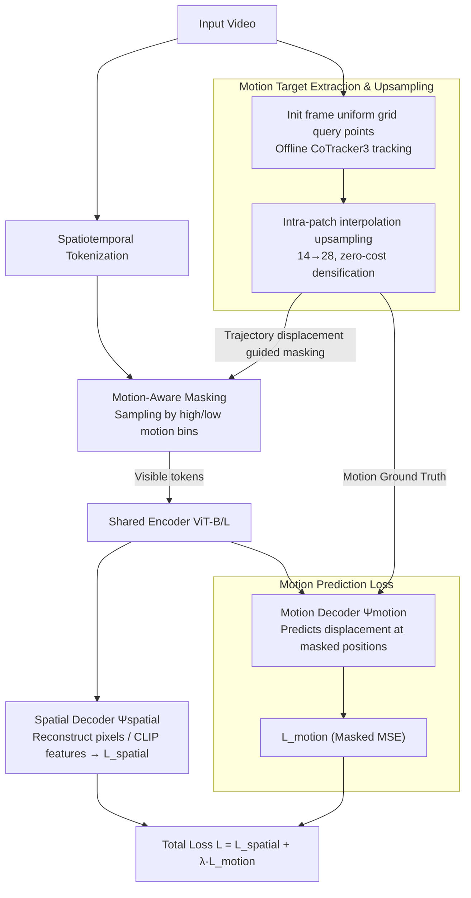

# TrackMAE: Video Representation Learning via Track, Mask, and Predict

**Conference**: CVPR 2026  
**arXiv**: [2603.27268](https://arxiv.org/abs/2603.27268)  
**Code**: [https://github.com/rvandeghen/TrackMAE](https://github.com/rvandeghen/TrackMAE)  
**Area**: Self-Supervised Learning / Video Understanding  
**Keywords**: Masked Video Modeling, Point Tracking, Motion Prediction, Self-Supervised Pretraining, Video Representation

## TL;DR

Explicit motion signals are introduced into the masked video modeling (MVM) framework: point trajectories are extracted using CoTracker3 as additional reconstruction targets, and a motion-aware masking strategy is designed to jointly learn spatial reconstruction and motion prediction. This approach significantly outperforms existing self-supervised video methods on motion-sensitive benchmarks (SSv2, FineGym).

## Background & Motivation

Masked Video Modeling (MVM) has become a concise and efficient self-supervised pretraining paradigm for video—masking 80-95% of spatiotemporal tokens and reconstructing the visible parts. However, existing MVM methods face core deficiencies:

**Implicit Motion Encoding**: Pixel reconstruction targets tend to learn low-level appearance statistics (color/texture continuity) rather than temporal dynamics. Due to strong temporal redundancy in videos, pixel reconstruction often takes "shortcuts" via spatial correlation or short-range consistency.

**Poor Performance on Motion-Sensitive Tasks**: MVM methods perform well on appearance-dominated datasets (K400, UCF101) but lag significantly behind on SSv2 and FineGym, which require fine-grained temporal modeling.

**Limitations of Prior Work**:
   - Improved masking strategies (e.g., flow-based masking): Only introduce motion information implicitly.
   - Improved reconstruction targets (e.g., HOG, DINO, CLIP features): Encode high-level semantics but do not explicitly model motion.
   - MME uses trajectory signals but relies on precomputed optical flow, requires complex preprocessing, and is sensitive to camera motion.

Key Insight: **Temporal correspondence should be a first-class signal in pretraining**, complementing rather than competing with pixel/feature targets.

## Method

### Overall Architecture

TrackMAE addresses the problem where "pixel reconstruction takes shortcuts and motion signals are implicitly overshadowed" by incorporating temporal correspondence as an explicit, supervisable reconstruction target in a standard MVM. Mechanism: A video is first partitioned into spatiotemporal tokens and largely masked; visible tokens pass through a shared encoder. Simultaneously, offline CoTracker3 extracts sparse point trajectories from the original video as "motion answers." The decoder is branched into two heads—a spatial decoder $\Psi_{spatial}$ reconstructs pixels or CLIP features in visible regions, while a motion decoder $\Psi_{motion}$ predicts point displacement trajectories at masked positions. The masking itself is no longer purely random but determined by the magnitude of trajectory displacement. The encoder architecture remains unchanged, adding only a lightweight motion head and a trajectory-based sampling rule.

### Key Designs

**1. Motion Target Extraction and Upsampling: Trajectories as Zero-Cost Supervision Signals**

Pixel reconstruction fails to learn temporal dynamics because it lacks a label directly describing "how things move." TrackMAE fills this gap. Specifically, it places a uniform grid of query points on the first frame (grid side $G=H/p$, equivalent to one point per patch center), tracks them via CoTracker3, and outputs coordinates aligned with video tokens: $T/2 \times H/p \times W/p \times 2$. It predicts inter-frame displacement rather than absolute coordinates so the motion head output aligns token-wise with the supervision target. Since dense tracking is expensive, the authors use "upsampling": assuming near-uniform motion within a patch, they spatially interpolate sparse trajectories ($14\to28$, upsampling factor $\upsilon=2$), effectively tracking 4 points per patch without additional tracking cost. This zero-cost densification brings a $+1.7\%/+1.9\%$ gain and even outperforms actual $56\times56$ dense tracking in ablations, validating the patch-wise motion smoothness assumption.

**2. Motion Prediction Loss: Trajectory Reconstruction as a Parallel Target**

Once motion labels are available, an objective is needed to force the encoder to represent them. The motion decoder $\Psi_{motion}$ predicts point displacement only at masked token positions, and the loss is calculated only there:

$$\mathcal{L}_{motion} = \frac{1}{|\mathcal{T}^{masked}|} \sum_{i \in \mathcal{T}^{masked}} \|\mathbf{m}_i - \hat{\mathbf{m}}_i\|_2^2$$

This is linearly combined with the spatial reconstruction loss for the total objective: $\mathcal{L} = \mathcal{L}_{spatial} + \lambda \cdot \mathcal{L}_{motion}$. The weight $\lambda$ depends on the spatial target: $\lambda=1$ for pixel reconstruction, and $\lambda=0.25$ for CLIP feature reconstruction (since feature target gradients are larger). A key observation is that motion targets and CLIP features are highly complementary—CLIP encodes "what is there," while trajectories encode "how it moves." They describe orthogonal information, resulting in higher gains when combined compared to pixel targets ($+4.0$ vs $+3.5$ on SSv2s).

**3. Motion-Aware Masking: Re-purposing Trajectory Information**

Random tube masking treats high and low motion regions equally, often leaving low-information static backgrounds for the encoder. Since trajectories are already extracted, they can be reused for guided masking at zero cost. The mean displacement $\bar{\mathbf{M}}$ of each query point over time is used as a sampling criterion. All positions are split into "high motion" and "low motion" bins based on displacement, and a motion ratio $\rho_{motion}$ controls how many visible tokens are sampled from each bin. A default $\rho_{motion}=50\%$ (equal sampling) is optimal; biasing toward either side leads to slight performance drops. This introduces no extra computation and provides a stable gain of approximately $0.5\%$.

### Loss & Training

- Encoder: ViT-B / ViT-L
- Pretraining Data: Kinetics-400 (K700 for ViT-L)
- Pretraining 800 epochs, following VideoMAE hyperparameter settings.
- CoTracker3: Offline mode, $14\times14$ grid, upsampling factor $\upsilon=2$.
- Feature reconstruction targets use CLIP ViT-B.
- Downstream Evaluation: Linear probing and full fine-tuning protocols.

## Key Experimental Results

### Main Results

**Linear Probing** (Table 1, ViT-B, K400 Pretraining)

| Method | Target | K400 | HMDB | SSv2 | GYM |
|---|---|---|---|---|---|
| VideoMAE | Pixel | 20.7 | 37.7 | 17.5 | 23.9 |
| MGMAE | Pixel | 24.9 | 41.3 | 16.8 | 26.1 |
| MGM | Pixel | 19.8 | 40.3 | 21.7 | 25.8 |
| **TrackMAE** | **Pixel** | **25.7** | **40.6** | **23.6** | **29.0** |
| SIGMA | DINO | 47.5 | 52.3 | 20.8 | 30.1 |
| SMILE | CLIP | 56.2 | 53.4 | 23.7 | 30.2 |
| **TrackMAE** | **CLIP** | **55.2** | **53.1** | **27.3** | **31.8** |

TrackMAE leads significantly on motion-sensitive tasks (SSv2, GYM).

**Full Fine-tuning** (Table 2)

| Method | Backbone | Target | SSv2 | K400 |
|---|---|---|---|---|
| VideoMAE | ViT-B | Pixel | 68.5 | 80.0 |
| SMILE | ViT-B | CLIP | 72.1 | 83.1 |
| **TrackMAE** | **ViT-B** | **CLIP** | **72.8** | **83.9** |
| VideoMAE | ViT-L | Pixel | 74.0 | 85.2 |
| **TrackMAE** | **ViT-L** | **CLIP** | **75.7** | **86.7** |

### Ablation Study

**Reconstruction Target Combinations** (Table 3, ViT-S)

| Target | K400s | SSv2s | Description |
|---|---|---|---|
| Traj only | 46.5 | 53.1 | Trajectory itself is a strong signal |
| Pixel only | 46.0 | 52.2 | Baseline |
| Pixel + Traj | 48.9 | 55.7 | Complementary gain $+2.9/+3.5$ |
| CLIP only | 52.7 | 57.1 | Semantic features are stronger |
| **CLIP + Traj** | **55.8** | **61.1** | **Complementary gain $+3.1/+4.0$** |

**Upsampling Performance** (Table 5)

| Grid Size | Upsampling | K400s | SSv2s |
|---|---|---|---|
| 14×14 | None | 48.9 | 55.7 |
| 28×28 | None | 49.5 | 56.7 |
| 56×56 | None | 50.0 | 57.0 |
| 14×14 | 14→28 ($\upsilon=2$) | **50.6** | **57.6** |

Upsampling ($14\to28$) outperforms actual $56\times56$ dense tracking with zero extra cost.

### Key Findings

- Trajectory prediction as an independent self-supervised task is highly effective (46.5 on K400s) and can encode useful video representations.
- Motion trajectories and CLIP features show significantly higher complementarity than with pixel targets ($+4.0$ vs $+3.5$ on SSv2s), as CLIP encodes "what" and trajectories encode "how."
- Equal sampling of high/low motion regions ($\rho=50\%$) is optimal; biasing either way results in slight drops.
- The upsampling trick achieves performance close to $4\times$ dense tracking at zero cost, supporting the patch-level motion smoothness assumption.
- TrackMAE demonstrates good scaling properties on ViT-L (SSv2: 75.7%, K400: 86.7%).

## Highlights & Insights

1. **Motion as a First-Class Citizen**: Unlike methods like MME that use optical flow to indirectly build signals, TrackMAE utilizes modern point trackers (CoTracker3) for high-quality trajectories, avoiding complex pre-processing and camera motion sensitivity.
2. **Simple and Effective Design**: The method only adds a lightweight trajectory decoder and motion-aware masking without altering the encoder architecture.
3. **Ingenious Upsampling**: Leverages spatial smoothness to "densify" sparse trajectories at zero cost, with performance exceeding real dense tracking.
4. **Target Complementarity Analysis**: The strongest complementarity is between CLIP and trajectories ($+4.0\%$), providing evidence for joint learning of high-level semantics and motion.
5. **Completely Online Extraction**: Trajectories are extracted from RGB videos online (not precomputed flow like MME), simplifying the training pipeline.

## Limitations & Future Work

- Operational overhead of CoTracker3: While using offline mode and sparse grids, it still adds to training time.
- Only ViT-B/L were validated; scaling behavior to larger models (ViT-H/Giant) and datasets is unknown.
- Gains from motion-aware masking are limited (~0.5%), requiring more refined sampling strategies.
- Initial frame query point initialization might miss objects that appear in later frames.
- Transferability of trajectory prediction to other downstream tasks (e.g., VOT, action localization) has not been explored.

## Related Work & Insights

- Key difference from SMILE: SMILE injects motion awareness through synthetic motion (copy-paste + random paths); TrackMAE uses trajectory signals from real pixel motion.
- Difference from Tracktention: Tracktention injects trajectories into attention layers for temporal consistency; TrackMAE uses trajectories as reconstruction targets to learn motion semantics.
- Broad application trend of CoTracker3: Point trackers are becoming general-purpose tools for video understanding (attention routing, dense feature learning, self-supervised pretraining).
- Method portability: Any "free" signal from pretrained models can serve as an auxiliary prediction target for MVM.

## Rating

- **Novelty**: ⭐⭐⭐⭐ — Bringing point trajectories into MVM pretraining is intuitive, though the core idea is natural.
- **Experimental Thoroughness**: ⭐⭐⭐⭐⭐ — Covers 6 benchmarks, linear probing + fine-tuning, comprehensive ablations, and ViT-B/L scales.
- **Writing Quality**: ⭐⭐⭐⭐ — Clear structure, solid motivation analysis, fair comparisons.
- **Value**: ⭐⭐⭐⭐ — Substantial improvement on motion-sensitive benchmarks; CoTracker3 cost remains the primary concern for practicality.

<!-- RELATED:START -->

## Related Papers

- [\[CVPR 2026\] Progressive Mask Distillation for Self-supervised Video Representation](progressive_mask_distillation_for_self-supervised_video_representation.md)
- [\[CVPR 2026\] VideoSSR: Video Self-Supervised Reinforcement Learning](videossr_video_self-supervised_reinforcement_learning.md)
- [\[CVPR 2026\] Recurrent Video Masked Autoencoders](recurrent_video_masked_autoencoders.md)
- [\[CVPR 2026\] Towards Stable Self-Supervised Object Representations in Unconstrained Egocentric Video](towards_stable_self-supervised_object_representations_in_unconstrained_egocentri.md)
- [\[CVPR 2026\] How Much 3D Do Video Foundation Models Encode?](how_much_3d_do_video_foundation_models_encode.md)

<!-- RELATED:END -->
