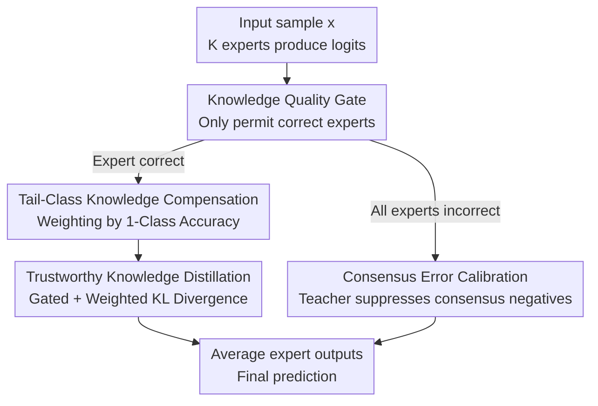

# Trust-calibrated Collaborative Learning for Long-Tailed Visual Recognition

**Conference**: CVPR 2026  
**Paper**: [CVF Open Access](https://openaccess.thecvf.com/content/CVPR2026/html/Zhou_Trust-calibrated_Collaborative_Learning_for_Long-Tailed_Visual_Recognition_CVPR_2026_paper.html)  
**Area**: Long-Tailed Visual Recognition / Multi-Expert Collaborative Learning  
**Keywords**: Long-Tailed Recognition, Multi-Expert Models, Mutual Distillation, Trust Calibration, Consensus Error Correction

## TL;DR
Addressing the issues in multi-expert "mutual distillation" for long-tailed recognition—where errors from a single expert propagate to the entire group (bias propagation) or the entire group collectively confirms errors with high confidence (error consolidation)—this paper proposes TCL. It employs a "Knowledge Quality Gate + Tail-Class Knowledge Compensation" to ensure only correct experts propagate knowledge while amplifying rare correct insights. Furthermore, a "Consensus Error Calibration" module detects and suppresses high-confidence negative classes agreed upon by all experts, improving CIFAR100-LT Top-1 accuracy from 57.2% to 58.7%.

## Background & Motivation
**Background**: Real-world data almost always follows a long-tailed distribution, where a few head classes contain the majority of samples, while numerous tail classes have very few. Solutions for long-tailed recognition generally follow three paths: data-level (re-sampling), loss-level (re-weighting/margin adjustment like Focal/LDAM), and model-level (multi-expert ensembles). **Multi-expert ensembles** achieve SOTA by voting across complementary classifiers, with **Mutual Knowledge Distillation (M-KD)** serving as the core mechanism in recent top models like SHIKE, NCL, and MDCS.

**Limitations of Prior Work**: Existing multi-expert methods assume "all knowledge produced by experts is beneficial," thus passing prediction distributions **indiscriminately** during mutual distillation. The authors investigate whether all knowledge transferred via M-KD is reliable. The findings suggest otherwise: mutual distillation can degenerate into an "error amplifier," introducing two fatal issues. First is **Bias Propagation**: if an expert misclassifies a tail sample, this erroneous knowledge pollutes other experts via distillation, spreading bias across the ensemble. Second is **Error Consolidation**: when all experts mistakenly predict a tail sample as the same incorrect class with high confidence, mutual distillation reinforces this "consensus error." This generates a misleading gradient in the opposite direction of the supervisory signal, causing a "collaboration deadlock" and hindering convergence due to gradient conflict.

**Key Challenge**: The "collaboration gain" and "error propagation risk" of mutual distillation are coupled. To enhance collaboration, one must often tolerate error transmission. Existing methods benefit from the former but fail to prevent the latter.

**Goal**: To upgrade multi-expert collaboration from "indiscriminate knowledge transfer" to "trust-calibrated collaboration." This involves: (1) filtering erroneous knowledge at the distillation entry point without starving rare tail-class correct knowledge, and (2) actively injecting a corrective gradient aligned with supervision when all experts converge on an error.

**Key Insight**: Implementing a "trust valve" for mutual distillation—where only correct experts are eligible to propagate knowledge (quality gate), with rare correct knowledge amplified via inverse class-accuracy weighting (tail-class compensation). Additionally, a dynamic calibration teacher suppresses consensus high-confidence negative classes (consensus error calibration), transforming indiscriminate collaboration into trustworthy collaboration.

## Method

### Overall Architecture
TCL (Trust-Calibrated Collaborative Learning) is built on a K-expert (K=3 in the paper) backbone. The initial layers are shared, while the later layers are independent for each expert to ensure diversity (following the SHIKE architecture). Each expert $k$ outputs logits $z^k$. Beyond standard supervised classification loss, TCL integrates two core modules:

1. **Trustworthy Knowledge Orchestration (TKO)**: Manages "how knowledge is passed between experts." It utilizes a **Knowledge Quality Gate** to determine if an expert answered correctly, allowing only correct experts to transmit knowledge. It then uses **Tail-Class Knowledge Compensation** to assign higher distillation weights to rare but correct classes. Finally, **Trustworthy Knowledge Distillation** (KL divergence with gating and weights) performs the collaborative optimization.
2. **Consensus Error Calibration (CEC)**: Manages "what to do when all experts are wrong." When all experts provide incorrect answers and the quality gates are closed (rendering TKO inactive), CEC identifies classes assigned high-confidence scores by the entire group (consensus high-confidence negatives). A **Dynamic Calibration Teacher** then suppresses these logits, generating a "calibration gradient" aligned with the ground truth.

Final predictions are obtained by averaging all expert outputs. The data flow is as follows:

### Key Designs

**1. Knowledge Quality Gate: Source-truncation of error propagation**

Bias propagation stems from the "indiscriminate" nature of M-KD. The Knowledge Quality Gate (KQG) treats each expert as a switch: **knowledge is only permitted to transfer when the expert's prediction for the current sample is correct.** For sample $x_i$ with label $y_i$, expert $k$ computes $p_i^k = \mathrm{softmax}(z_i^k)$. A correctness indicator is defined as:

$$\mathbb{I}_i^k = \begin{cases} 1, & \arg\max(p_i^k) = y_i, \\ 0, & \text{otherwise.} \end{cases}$$

$\mathbb{I}_i^k$ acts as a binary switch. Correct predictions (=1) open the gate; incorrect ones (=0) close it, blocking the diffusion of bias.

**2. Tail-Class Knowledge Compensation: Protecting rare tail knowledge**

The KQG has a side effect: tail samples are correctly predicted less frequently, so the gate may starve tail-class knowledge. Tail-Class Knowledge Compensation (TKC) corrects this using **inverse class-accuracy weighting**. Classes with lower accuracy receive higher distillation weights. Maintaining a moving average of class accuracies $\alpha_C = \{\alpha_1, \dots, \alpha_C\}$, the raw weight is $w'_c = \sqrt{1 - \alpha_c}$, normalized to a mean of 1:

$$w_c = \frac{w'_c}{\sum_{j=1}^{C} w'_j} \cdot C.$$

The square root **smooths the weight distribution**, preventing extreme weights from destabilizing training.

**3. Trustworthy Knowledge Distillation: Integrating gating and compensation**

The TKO loss for expert $k$ distilling to expert $j$ for sample $x_i$ of class $c$ is:

$$\mathcal{L}_{TKO}^{k\to j}(x_i) = \mathbb{I}_i^k \cdot w_c \cdot D_{KL}(p_i^k \| p_i^j),$$

The total TKO loss is the sum over all ordered expert pairs $\mathcal{L}_{TKO}(x_i) = \sum_{k}\sum_{j \neq k} \mathcal{L}_{TKO}^{k\to j}(x_i)$.

**4. Consensus Error Calibration: Breaking deadlock via supervision-aligned gradients**

When all experts are wrong, the gates close and experts disconnect, causing a "collaboration deadlock." CEC addresses this by identifying **consensus high-confidence negatives**—non-target classes whose average logits exceed the ground truth class. Let $\bar{z}_i = \frac{1}{K}\sum_k z_i^k$. The set of consensus negative classes is $\mathcal{N}_i = \{c \mid c \neq y_i \text{ and } \bar{z}_i[c] > \bar{z}_i[y_i]\}$.

A **Dynamic Calibration Teacher** $\tilde{z}_i^T$ is constructed to suppress these classes to the average level, while the target class is set to a small negative value $\kappa$ (e.g., -30):

$$\tilde{z}_i^T[c] = \begin{cases} \bar{z}_i^{\text{avg}}, & c \in \mathcal{N}_i, \\ \kappa, & c = y_i, \\ \bar{z}_i[c], & \text{otherwise}. \end{cases}$$

Setting the target class to $\kappa$ **protects the learning of the ground truth from interference** during this calibration. The CEC loss is calculated as $\mathcal{L}_{CEC}(x_i) = \sum_k D_{KL}(\tilde{p}_i^T \| \tilde{p}_i^{S_k})$, where student logits also set the target class to $\kappa$.

### Loss & Training
The total loss integrates three terms: supervised classification loss, TKO loss, and CEC loss. The classification loss uses logit adjustment: $\mathcal{L}_{CLS} = \sum_k -\log\frac{e^{z_i^k[y_i] + \delta_k \tau_k}}{\sum_j e^{z_i^k[j] + \delta_k \tau_j}}$, where $\tau = \log\frac{N}{C}$ is frequency-based adjustment.

TCL adopts a **mildly differentiated** $\delta = \{0.9, 1.0, 1.1\}$, balancing distillation stability with beneficial diversity. The total objective is $\mathcal{L}_{Total} = \mathcal{L}_{CLS} + \mathcal{L}_{TKO} + \beta \mathcal{L}_{CEC}$, where $\beta$ (optimized at 0.02) balances the CEC contribution.

## Key Experimental Results

### Main Results
TCL was evaluated on 5 standard benchmarks (CIFAR10/100-LT, ImageNet-LT, Places-LT, iNaturalist 2018). Results for CIFAR100-LT (IF=100):

| Method | Multi-Expert | Many | Medium | Few | All |
|------|--------|------|--------|-----|-----|
| ProCo | × | 70.1 | 53.4 | 36.4 | 54.2 |
| SHIKE† | ✓ | 73.4 | 56.5 | 36.0 | 56.3 |
| MDCS† | ✓ | 72.9 | 56.3 | 33.7 | 55.4 |
| **TCL** | ✓ | **75.5** | **59.3** | **38.3** | **58.7** |

Large-scale datasets (Top-1 Accuracy):

| Method | ImageNet-LT (R50) | ImageNet-LT (RX50) | Places-LT | iNat 2018 |
|------|------|------|------|------|
| SHIKE | 59.7 | 59.6 | 41.9 | 75.4 |
| MDCS | 60.7 | 61.8 | 42.4 | 75.6 |
| **TCL** | **61.6** | **63.0** | **44.2** | **76.9** |

TCL outperforms the previous SOTA (SHIKE/MDCS) by 2.4%/3.3% on CIFAR100-LT, with the **most significant gain in tail classes (Few=38.3%)**.

### Ablation Study
Component ablation (CIFAR100-LT IF=100, All Accuracy):

| KQG | TKC | CEC | Many | Medium | Few | All |
|-----|-----|-----|------|--------|-----|-----|
| × (baseline) | × | × | 71.4 | 58.6 | 34.7 | 55.9 |
| M-KD (Indiscriminate) | × | × | 73.6 | 57.8 | 35.7 | 56.7 |
| ✓ | ✓ | ✓ (Full) | 75.5 | 59.3 | 38.3 | 58.7 |

### Key Findings
- **Indiscriminate M-KD leads to "hollow" gains**: While overall accuracy increases, gains are concentrated in Many-shot classes, while Medium-shot accuracy actually decreases, indicating amplified bias. KQG prevents this drag.
- **CEC specializes in tail recovery**: CEC improves Few-shot accuracy from 36.2% to 38.3% (+2.1%), as consensus errors occur most frequently in tail samples.
- **Soft suppression > Hard suppression**: Suppressing consensus negatives to the "mean" (58.7%) outperforms suppressing them to the "minimum" (58.0%). Similarly, smoothed weights (SInA) outperform raw inverse accuracy (InA).
- **Moderate differentiation of $\delta$**: A slight difference $\delta=\{0.9, 1.0, 1.1\}$ (58.7%) is superior to strong specialization (e.g., Few accuracy drops to 31.7 with extreme $\delta$).

## Highlights & Insights
- **Decoupling "collaboration" from "error diffusion"**: The paper identifies that collaboration gains and error risks are inherently linked in prior multi-expert methods, precisely characterizing bias propagation and error consolidation as distinct failure modes.
- **KQG + TKC as an "Antagonistic Design"**: While the quality gate restricts knowledge (only correct experts), it risks silencing rare tail knowledge. The compensation mechanism addresses this by re-amplifying tail signals.
- **CEC as a Boundary-Failure Solution**: CEC specifically targets the scenario where the TKO mechanism is inactive (all gates closed), injecting corrective signals when errors are most stubborn.
- **Ground-Truth Protection**: Setting the target class to $\kappa=-30$ during calibration ensures the model focuses on suppressing consensus errors without disrupting the primary learning signal for the correct class.

## Limitations & Future Work
- **Limitations**: (1) The binary "correct/incorrect" gate based on $\arg\max$ ignores soft knowledge from "nearly correct" predictions. (2) Reliance on ground-truth labels for calibration limits the method to **fully supervised training**. (3) Additional computational overhead exists for calculating indicators and detecting consensus negatives. (4) Absolute accuracy for tail classes (38.3%) remains low.
- **Future Work**: Transitioning from hard $\arg\max$ gates to soft confidence-based gating; extending consensus detection to top-k classes; and exploring label-free "self-consistency" signals to extend the approach to semi-supervised long-tailed learning.

## Related Work & Insights
- **vs. SHIKE / NCL**: These methods rely on indiscriminate mutual distillation. TCL identifies this as a root cause of bias and introduces a trust-based valve to improve results on identical backbones.
- **vs. MDCS / SADE**: These focus on expert specialization. TCL demonstrates that maintaining distillation stability via moderate differentiation is more effective than forced specialization.
- **vs. ProCo / BCL**: Despite being a multi-expert approach, TCL outperforms contrastive learning-based single models on tail classes (Few=38.3% vs 36.4%), proving the potential of "trustworthy collaboration."

## Rating
- Novelty: ⭐⭐⭐⭐ 
- Experimental Thoroughness: ⭐⭐⭐⭐⭐ 
- Writing Quality: ⭐⭐⭐⭐ 
- Value: ⭐⭐⭐⭐

<!-- RELATED:START -->

## Related Papers

- [\[ICLR 2026\] GUIDE: Gated Uncertainty-Informed Disentangled Experts for Long-tailed Recognition](../../ICLR2026/self_supervised/guide_gated_uncertainty-informed_disentangled_experts_for_long-tailed_recognitio.md)
- [\[CVPR 2026\] Decision Boundary-aware Generation for Long-tailed Learning](decision_boundary-aware_generation_for_long-tailed_learning.md)
- [\[AAAI 2026\] BCE3S: Binary Cross-Entropy Based Tripartite Synergistic Learning for Long-tailed Recognition](../../AAAI2026/self_supervised/bce3s_binary_cross-entropy_based_tripartite_synergistic_learning_for_long-tailed.md)
- [\[CVPR 2026\] Free-Grained Hierarchical Visual Recognition](free-grained_hierarchical_visual_recognition.md)
- [\[ICLR 2026\] CoLA: Co-Calibrated Logit Adjustment for Long-Tailed Semi-Supervised Learning](../../ICLR2026/self_supervised/cola_co-calibrated_logit_adjustment_for_long-tailed_semi-supervised_learning.md)

<!-- RELATED:END -->
