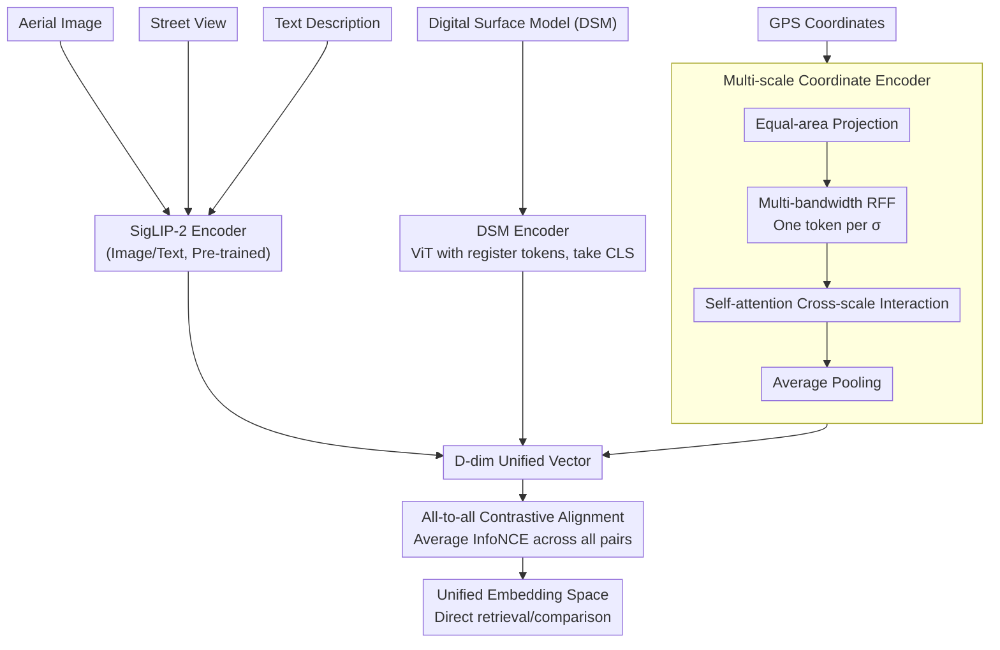

# UniGeoCLIP: Unified Geospatial Contrastive Learning

**Conference**: CVPR 2026  
**arXiv**: [2604.11668](https://arxiv.org/abs/2604.11668)  
**Code**: [https://gastruc.github.io/unigeoclip](https://gastruc.github.io/unigeoclip)  
**Area**: Self-Supervised Learning  
**Keywords**: Geospatial Representation Learning, Contrastive Learning, Multi-modal, Coordinate Encoding, Unified Embedding Space

## TL;DR
UniGeoCLIP aligns five complementary geospatial modalities (aerial imagery, street-view imagery, Digital Surface Models, text, and GPS coordinates) into a unified embedding space through pure all-to-all contrastive learning and introduces a multi-scale coordinate encoder to enhance spatial representation.

## Background & Motivation

**Background**: Geospatial representation learning follows three paradigms: embedding fields (coordinates $\to$ vectors), multi-modal fusion (multi-sensor $\to$ single representation), and contrastive alignment (e.g., GeoCLIP/SatCLIP aligning coordinates with satellite imagery).

**Limitations of Prior Work**: (1) Embedding fields are static snapshots incapable of modeling dynamics; (2) Fusion models compress all modalities into a single representation, preventing cross-modal retrieval or comparison; (3) Existing contrastive methods only align two modalities (typically coordinates + satellite imagery), ignoring crucial modalities like text, street-view, and topography.

**Key Challenge**: Different geospatial modalities provide complementary information (aerial for layout, street-view for facades, topography for elevation, and text for semantics), but a framework to unify them into a single space is lacking.

**Core Idea**: All-to-all contrastive learning—contrasting all five modalities against each other (rather than through a central pivot) to construct a truly unified embedding space. This is combined with a new multi-scale coordinate encoder to overcome the representation bottleneck of raw coordinate embeddings.

## Method

### Overall Architecture
UniGeoCLIP aims to project five heterogeneous observations of the same location—aerial images, street-view images, Digital Surface Models (DSM), text descriptions, and GPS coordinates—into the same $D$-dimensional space, enabling direct retrieval and comparison. In practice, each modality passes through a dedicated encoder (images and text use SigLIP-2 encoders, DSM uses an independent ViT, and GPS coordinates use a newly designed multi-scale encoder) to map them into vectors of the same dimension. Instead of selecting a "primary modality," the model performs pairwise contrastive alignment between all modalities. Post-training, embeddings from any two modalities reside in the same space, allowing for direct similarity calculations.

### Key Designs

**1. All-to-all Contrastive Alignment: Direct alignment without a pivot**
Multi-modal alignment methods like ImageBind typically select a "central modality" (usually images) as a pivot, where other modalities only align with it to gain indirect comparability. The problem is that poor quality in the pivot modality leads to cascading errors—in geospatial scenes, images are not always the most reliable anchors. UniGeoCLIP eliminates the pivot: for each batch, $D$-dimensional embeddings of the five modalities are paired. For every ordered direction $m\mapsto n$ (using $f^m$ as the anchor to retrieve $f^n$ within the batch), an InfoNCE loss is calculated. These are then **averaged** (using uniform weights, $\frac{1}{M^2}\sum_{(m,n)}\mathcal{L}_{m\mapsto n}$) for joint optimization. This explicitly pulls any two modalities (even DSM and text) together, creating a "fully connected" rather than "star" embedding space, where weak modalities are not constrained by a single anchor.

**2. Scaled Lat-Lon Encoder: Representing continent-level and block-level structures**
Direct encoding of longitude/latitude suffers from scale issues: if the bandwidth $\sigma$ of Random Fourier Features (RFF) is fixed, low $\sigma$ only captures large-scale slow variations, while high $\sigma$ only captures high-frequency block-level details. This method first uses an equal-area projection to map coordinates to a plane (eliminating high-latitude area distortion), then encodes them using a set of RFF matrices with different bandwidths, producing one token per $\sigma$. Low-frequency tokens manage continent/regional structures, while high-frequency tokens manage block structures. These tokens interact via self-attention (rather than simple concatenation) to allow information exchange across scales, before being average-pooled into a $D$-dimensional embedding. This effectively builds a multi-scale pyramid for coordinates, covering spatial frequencies from continents to city blocks.

**3. DSM Encoder: Capturing elevation geometry missed by other modalities**
Aerial and street-view images are RGB projections that lose vertical geometry, whereas the Digital Surface Model (DSM) records the elevation of terrain and buildings. Since no large-scale DSM pre-trained weights exist, a ViT with register tokens is trained from scratch, using the CLS token as the modality embedding. Register tokens absorb global information to prevent high-norm artifacts from contaminating patch representations, allowing the CLS token to summarize the elevation map more cleanly.

### Loss & Training
The training objective is to average the InfoNCE loss across all ordered modality pairs: $\mathcal{L}=\frac{1}{M^2}\sum_{(m,n)\in\mathcal{M}^2}\mathcal{L}_{m\mapsto n}$. Here, $\mathcal{L}_{m\mapsto n}$ is the standard InfoNCE loss using cosine similarity and temperature $\tau$, with negative samples drawn from other positions in the same batch. Uniform weights are applied to all pairs. Image and text encoders are initialized from SigLIP-2, while DSM and GPS encoders are trained from scratch.

> ⚠️ Hyperparameters such as temperature $\tau$, values and count $K$ of $\sigma_k$, and the number of self-attention blocks $B$ follow the original paper.

## Key Experimental Results

### Main Results

| Task | Metric | UniGeoCLIP | Baseline | Gain |
|------|------|------------|-----------|------|
| Land-use Classification | Acc | Ours | GeoCLIP/SatCLIP | Consistently Superior |
| Cross-modal Retrieval | Recall@K | Ours | Pairwise methods | New Capability |
| Socio-economic Inference | R² | Ours | Coordinate Baseline | Significant |

### Ablation Study

| Configuration | Classification Accuracy | Description |
|------|---------|------|
| 5-modal All-to-all | Best | Full Model |
| Pivot (via Image only) | Second Best | Indirect alignment loss |
| 2-modal (Coord + Aerial) | Decrease | Incomplete information |
| Single-scale Coord Encoder | Decrease | Limited spatial resolution |

### Key Findings
- Joint alignment of five modalities is consistently superior to a simple combination of pairwise alignments.
- The gap between all-to-all and pivot alignment is most pronounced in weak modalities (e.g., DSM).
- The multi-scale coordinate encoder significantly outperforms standard Fourier features in geolocalization tasks.

## Highlights & Insights
- **True Unified Embedding Space**: Any combination of modalities can be directly compared and retrieved, which is impossible for pure fusion models.
- **Multi-scale Coordinate Encoding**: Using self-attention for cross-scale information interaction is more elegant and effective than simple concatenation.

## Limitations & Future Work
- Requires co-located training data for all five modalities.
- The temporal dimension is not modeled.
- Future work could extend this to time-series satellite imagery and dynamic monitoring.

## Related Work & Insights
- **vs GeoCLIP/SatCLIP**: These only align coordinates with one image type; UniGeoCLIP aligns five modalities.
- **vs ImageBind/UniBind**: These rely on indirect alignment via a pivot; UniGeoCLIP uses all-to-all alignment.

## Rating
- Novelty: ⭐⭐⭐⭐ First five-modality geospatial contrastive learning.
- Experimental Thoroughness: ⭐⭐⭐⭐ Evaluated on multiple downstream tasks.
- Writing Quality: ⭐⭐⭐⭐ Clear framework.
- Value: ⭐⭐⭐⭐ Provides a foundation for universal geospatial AI representations.

<!-- RELATED:START -->

## Related Papers

- [\[CVPR 2026\] Learning from Semantic Dictionaries: Discriminative Codebook Contrastive Learning for Unified Visual Representation and Generation](learning_from_semantic_dictionaries_discriminative_codebook_contrastive_learning.md)
- [\[CVPR 2026\] Global-Graph Guided and Local-Graph Weighted Contrastive Learning for Unified Clustering on Incomplete and Noise Multi-View Data](global-graph_guided_and_local-graph_weighted_contrastive_learning_for_unified_cl.md)
- [\[CVPR 2026\] HCL-FF: Hierarchical and Contrastive Learning for Forward-Forward Algorithm](hcl-ff_hierarchical_and_contrastive_learning_for_forward-forward_algorithm.md)
- [\[CVPR 2026\] Easy2Hard: From Partially to Fully Unmatched Modalities as Negative Samples in Contrastive Learning](easy2hard_from_partially_to_fully_unmatched_modalities_as_negative_samples_in_co.md)
- [\[ICML 2026\] Statistical Consistency and Generalization of Contrastive Representation Learning](../../ICML2026/self_supervised/statistical_consistency_and_generalization_of_contrastive_representation_learnin.md)

<!-- RELATED:END -->
