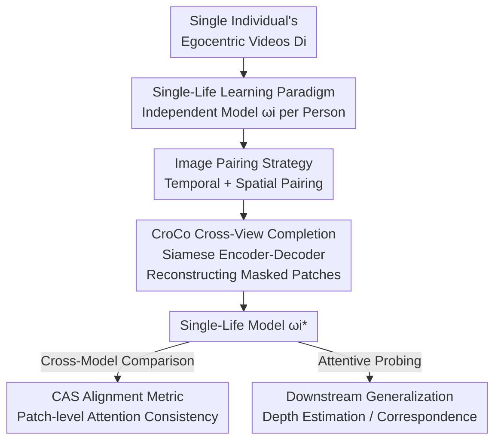

# Unique Lives, Shared World: Learning from Single-Life Videos

**Conference**: CVPR 2026  
**Paper**: [CVF OpenAccess](https://openaccess.thecvf.com/content/CVPR2026/html/Han_Unique_Lives_Shared_World_Learning_from_Single-Life_Videos_CVPR_2026_paper.html)  
**Code**: None (Project page: https://sites.google.com/view/learn-from-single-life)  
**Area**: Self-Supervision / Representation Learning  
**Keywords**: Single-life learning, Egocentric video, Cross-view completion, Geometric representation, Representation alignment

## TL;DR
A geometry-aware visual encoder can be trained via self-supervision using only "a single person's lifetime of egocentric video" (effectively 38 hours). The study further discovers that models independently trained on different individuals converge to highly consistent geometric representations. These "single-life" representations can transfer to downstream tasks like depth estimation, achieving performance comparable to models trained on diverse internet videos of equal duration.

## Background & Motivation

**Background**: The current mainstream creed in visual representation learning is "Scale + Diversity"—aggregating massive, unrelated images or videos from across the internet to train a general encoder (e.g., DINOv2, CLIP) for strong generalization.

**Limitations of Prior Work**: This paradigm differs fundamentally from biological learning. Humans and animals do not learn from randomly sampled, disassociated images but from a highly redundant, continuous visual stream of "personal experience." This stream repeatedly observes the same scenes from different angles, yet it is narrow, monotonous, and derived from a single individual. Dominant methods have not rigorously investigated whether a single individual's experience is sufficient to learn a robust visual representation.

**Key Challenge**: "Data diversity" is assumed to be an indispensable prerequisite, while individual experience is considered too narrow. However, the authors point out an overlooked fact—while each person's visual experience is unique, they all originate from and are constrained by the same physical world. Structural attributes such as 3D Euclidean geometry and object permanence leave consistent imprints on all visual data. In other words, diversity may not be a necessary condition for geometric learning; a **Shared World structure** is the true signal source.

**Goal**: To propose and validate the "Single-Life Learning Paradigm"—training independent models using only one person’s egocentric videos—and answer two questions: (i) Do models independently trained by different people achieve consistent geometric understanding (Alignment)? (ii) Can single-life models generalize to unseen environments and downstream geometric tasks (Generalization)?

**Key Insight**: The authors are inspired by two points. First, the Platonic Representation Hypothesis (that large models on web-scale data converge to a single representation of reality), which they narrow down to the **Shared World Hypothesis**: since all "lives" are rooted in the same physical reality, geometric representations learned from individual experiences should converge to functionally similar structures. Second, infants develop geometric perception and 3D spatial awareness before learning semantics, suggesting that geometric representations can emerge from raw visual experience without linguistic supervision.

**Core Idea**: Use **naturally occurring multiple viewpoints** within a single egocentric video as self-supervised signals (cross-view completion) to train a model for each person individually. Consistency and generalization are achieved through the shared geometry of the same world rather than data aggregation.

## Method

### Overall Architecture
The "Method" is a research framework rather than a novel network architecture. The input is a collection of egocentric videos $D_i$ for an individual $i$ (a "life"), and the output is an independently trained visual encoder $f_{\omega_i}$. This process is repeated across multiple individuals to obtain a set of models $\{\omega_1^*,\dots,\omega_n^*\}$ that do not share training data and are trained from random initialization. The pipeline involves: **sampling image pairs** from single-life videos → self-supervised training using the **CroCo cross-view completion** objective → obtaining single-life models → measuring geometric alignment between different models using the proposed **CAS metric** and evaluating downstream generalization via attentive probing.

Formally, each individual optimizes their own set of parameters independently:

$$\omega_i^* = \arg\min_{\omega_i} \mathcal{L}(f_{\omega_i}, D_i).$$

This directly contrasts with the mainstream paradigm of aggregating all sources to train a universal model.

### Key Designs

**1. Single-Life Learning Paradigm: Treating "one person's experience" as a self-sufficient data source**

Mainstream self-supervision implicitly assumes data must be diverse; the authors challenge this premise directly. The paradigm is defined cleanly: a "life" is an egocentric video stream $D_i$ collected by an individual. A model is trained for each individual from scratch without cross-individual data aggregation. This generates a set of **non-overlapping, independent** models to cleanly address "alignment" and "generalization"—if consistency emerges between models, it must stem from the shared structure of the world rather than shared training data. This differs from prior "learning from video streams" work by focusing not on the online, sequential learning process, but on whether single-life data is sufficient and how similar the learned representations become.

**2. CroCo Cross-View Completion: Using natural multi-view signals in egocentric video as geometric supervision**

To learn geometry from egocentric video, an objective capable of utilizing multiple views of the same scene is required. The authors adopt CroCo (Cross-View Completion), a self-supervised objective proven effective for geometric learning. The **key modification is the data source**: instead of using massive synthetic or curated image pairs, they use pairs sampled from a single individual's visual experience. The architecture is a Siamese encoder-decoder Transformer: given a source image $x_s$ and a target image $x_t$, both are patched. The target image is heavily masked, leaving only visible patches $\tilde p_t$. A weight-sharing ViT encoder encodes $z_s = E_\omega(p_s)$ and $z_t = E_\omega(\tilde p_t)$. The decoder uses target features (with mask tokens) as queries $Q$ and source features as $K, V$ to perform cross-attention and reconstruct masked patches $\hat p_t = D_\varepsilon(z_s, z_t)$, optimized via MSE:

$$\mathcal{L}_{\text{CroCo}} = \lVert \hat p_t - p_t^{\text{masked}} \rVert^2.$$

This is effective because completing masked content from a different viewpoint requires the model to understand 3D spatial transformations, naturally inducing geometric correspondence.

**3. Temporal + Spatial Dual Pairing Strategy: Converting noisy egocentric video viewpoint changes into learnable image pairs**

The success of CroCo depends on the quality of image pairs. The authors use two signals. **Temporal pairing** leverages video continuity: temporally adjacent frames likely have non-trivial viewpoint overlap without requiring labels. **Spatial pairing** is inspired by **proprioception**: biological entities realize they are looking at the same scene from a different angle based on body pose. The authors use camera poses and 3D point clouds (if available) to find frame pairs, specifically filtering for overlap using the **Jaccard index** between visible 3D point clouds. Experiments confirm the union of both is strongest, though temporal pairing alone is remarkably effective.

**4. Correspondence Alignment Score (CAS): A training-free, patch-level model alignment metric**

To verify if models converge to consistent geometric understanding, a metric is needed that captures **local geometric correspondence** without additional training. The authors extend the mutual $k$-nearest neighbor score to the patch level. For each model, decoder cross-attention layers are aggregated into a cross-attention map $A = \frac{1}{d}\sum_{b=1}^{d} q_b^\top k_b$, where $A_i, A_j \in \mathbb{R}^{N\times N}$. For each patch $p$ in the source image, the top-$k$ attended patches in the target image are $\text{TopK}_{A_i}(p)$. The mutual correspondence ratio between two models is:

$$\text{MTopK}_{A_i,A_j}(p) = \frac{1}{k}\,\lvert \text{TopK}_{A_i}(p) \cap \text{TopK}_{A_j}(p) \rvert.$$

CAS is then averaged over a set of test pairs $T$ and all patches:

$$\text{CAS}(\omega_i^*, \omega_j^*) = \frac{1}{|T|}\sum_{(x_s,x_t)\in T}\frac{1}{N}\sum_{p=1}^{N}\text{MTopK}_{A_i,A_j}(p).$$

CAS ranges from $0$ to $1$, is robust to attention value scale, and is sensitive to patch-level relationships, making it suitable for measuring geometric model alignment.

### Loss & Training
The objective is the CroCo pixel reconstruction MSE. **20 single-life models + 5 control models** were trained. Downstream evaluation uses a lightweight single-attention block readout (attentive probing) on frozen encoders.

## Key Experimental Results

### Main Results: Single-Life vs. Diverse Data Baselines

| Task / Setting | Metric | Single-Life Model (Ours) | Control (Diverse) | Conclusion |
|----------------|--------|-------------------------|-------------------|------------|
| Alignment with CroCo ckpt | CAS↑ | Strong after 30m-2h | K400 30h as upper bound | Single-life approaches diverse bound |
| Non-life video alignment | CAS↑ | Near zero | — | Egocentric perspective is key |
| NYU-Depth-v2 (30h ALD) | $\delta_1$↑ | Comparable or superior | Same-size K400 | 30h Single-life ≈ 30h Diverse |
| HPatches Zero-shot | AEPE↓ | Comparable/superior | Same-size K400 | Competitive geometric correspondence |
| ScanNet Depth | AbsRel↓ | Comparable within 1h | K400 superior | Diverse data wins on difficult benchmarks |

Note: Full K400 (~850h) sets the performance ceiling, but a 30h single ALD life can match 30h of K400.

### Ablation Study: Pairing Strategy

| Pairing Strategy | Depth Gain (Rel. to Augmented) | Description |
|------------------|-------------------------------|-------------|
| Spatial + Temporal | Highest | Integrates continuous motion + large shifts |
| Temporal Only | Second highest | Highly effective and label-free |
| Spatial Only | Positive Gain | Requires pose/point cloud Jaccard filtering |
| Random Pairing | Surprisingly effective | Humans stay in place; random hits overlap |
| Augmented Pairing| 0% (Baseline) | Same-image 2D transforms; lacks 3D shifts |

### Key Findings
- **Alignment has a "Critical Duration"**: Alignment with CroCo emerges after ~30 mins (Walking Tours) to 2 hours (HD-Epic).
- **Egocentric perspective is necessary, not just "long video"**: Non-life control videos (screen recordings, surveillance) show near-zero alignment, indicating movement and interaction are essential.
- **Models from similar environments cluster**: CAS matrices show block-diagonal structures; models cluster by dataset (Kitchen vs. Walking), while 30h K400 sits at the center.
- **Alignment correlates with generalization**: Models with high CAS scores tend to perform better on downstream tasks.
- **Not limited to CroCo**: DINOv2 also learns generalizable geometric representations from single-life data, though CroCo is superior for correspondence tasks.

## Highlights & Insights
- **Downgrading Data Diversity**: Diversity is seen as an "accelerator" rather than a requirement. Dense, structured signals in a single long-term life are sufficient for learning fine-grained geometric priors.
- **Dual-Purpose Attention Maps**: Cross-attention maps provide geometric supervision during training and act as the CAS metric for alignment comparison without additional probing.
- **Proprioception-Inspired Pairing**: Translating the biological intuition of body-pose awareness into technical Jaccard overlap metrics based on camera poses.
- **Transferable Metric**: CAS can be extended to any scenario requiring the comparison of local geometric consistency between independent visual models.

## Limitations & Future Work
- **Conceptual scale**: 38 hours is still orders of magnitude shorter than a human lifetime; this is a feasibility proof.
- **Geometric focus**: The study does not cover semantic tasks (recognition/detection); whether semantics emerge from single-life data remains an open question.
- **Performance gap on complex benchmarks**: On ScanNet, diverse data still outperforms single-life models, suggesting a need for better coverage of OOD geometry.
- **Sensor dependency**: Spatial pairing requires camera poses/3D point clouds, which are unavailable in standard egocentric videos.

## Related Work & Insights
- **vs. DoRA**: DoRA learns **semantics** from single videos using heavy augmentation; this work focuses on **geometry** and cross-model alignment.
- **vs. CroCo / Siamese MAE**: This work adopts their architecture but shifts the data source from curated web pairs to single-individual streams.
- **vs. Platonic Representation Hypothesis**: While the Platonic hypothesis concerns web-scale models, the "Shared World Hypothesis" proves convergence even in extremely constrained single-individual settings.

## Rating
- Novelty: ⭐⭐⭐⭐⭐ 
- Experimental Thoroughness: ⭐⭐⭐⭐ 
- Writing Quality: ⭐⭐⭐⭐⭐ 
- Value: ⭐⭐⭐⭐⭐ 

<!-- RELATED:START -->

## Related Papers

- [\[CVPR 2026\] SECOS: Semantic Capture for Rigorous Classification in Open-World Semi-Supervised Learning](secos_semantic_capture_for_rigorous_classification_in_open-world_semi-supervised.md)
- [\[CVPR 2026\] VT-Intrinsic: Physics-Based Decomposition of Reflectance and Shading using a Single Visible-Thermal Image Pair](vt-intrinsic_physics-based_decomposition_of_reflectance_and_shading_using_a_sing.md)
- [\[CVPR 2026\] Beyond the Static World: Continual Category Discovery under Visual Drift](beyond_the_static_world_continual_category_discovery_under_visual_drift.md)
- [\[CVPR 2025\] CheXWorld: Image World Modeling for Radiograph Representation Learning](../../CVPR2025/self_supervised/chexworld_exploring_image_world_modeling_for_radiograph_representation_learning.md)
- [\[ICML 2025\] AdaWorld: Learning Adaptable World Models with Latent Actions](../../ICML2025/self_supervised/adaworld_learning_adaptable_world_models_with_latent_actions.md)

<!-- RELATED:END -->
