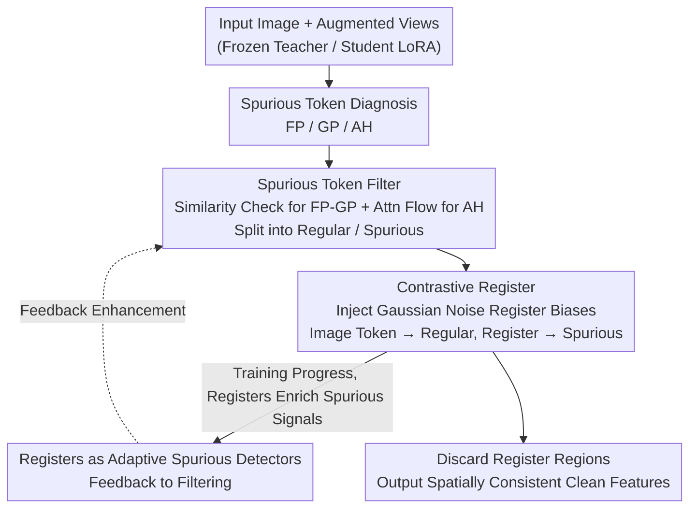

# UniRefiner: Teaching Pre-trained ViTs to Self-Dispose Dross via Contrastive Register

**Conference**: CVPR 2026  
**arXiv**: [2605.19622](https://arxiv.org/abs/2605.19622)  
**Code**: https://congpeiqiu.github.io/UniRefiner (Project Page)  
**Area**: Self-Supervised / Representation Learning  
**Keywords**: ViT Feature Refinement, Spurious Tokens, Register Token, Self-Distillation, Dense Prediction

## TL;DR
UniRefiner systematically categorizes up to 40% of "spurious tokens" in the feature maps of large-scale pre-trained ViTs (including EVA-CLIP-8B and InternViT-6B) into three types. By using a multiplex detector to identify them and employing "contrastive registers" during LoRA self-distillation, it explicitly drives spurious signals into register regions while retaining clean semantics in image regions. With only 5k images and a few fine-tuning epochs, vision-language models (VLMs) originally ill-suited for dense tasks outperform DINOv2 on ADE20K (EVA-CLIP-8B reaches 51.9% mIoU, +9.4% Gain).

## Background & Motivation
**Background**: ViT pre-training has matured through vision-centric (DINO series) and vision-language (CLIP/EVA-CLIP/SigLIPv2/InternViT) branches, serving as standard backbones for dense tasks like segmentation, depth estimation, and controllable generation (e.g., REPA using DINOv2 features to supervise diffusion models).

**Limitations of Prior Work**: Despite the massive parameter counts and rich world knowledge of vision-language models, practitioners still default to vision-specific backbones for dense prediction. The reason is the "spatial inconsistency" of VLM feature maps—where many token embeddings do not align with their spatial positions. The authors refer to these as spurious tokens, which contaminate the per-position representation quality required for dense tasks.

**Key Challenge**: Previous works (such as registers or DVT) narrowly interpret spurious tokens as "high-norm outliers," thus addressing only a single type or treating all tokens indiscriminately. However, in large models, this contamination is both pervasive and complex: over 40% of tokens in EVA-CLIP-8B are spurious and present diverse forms. Simple outlier removal is insufficient. The root cause is the "lack of a complete characterization of spurious tokens and a mechanism to accurately localize and directionally remove them."

**Goal**: (1) Provide a unified definition and classification of what constitutes a "spurious token" for dense tasks; (2) Design a general, post-hoc expansion framework that does not modify the architecture, teaching models to dispose of these tokens themselves.

**Key Insight**: The authors redefine a spurious token as any token that fails to encode "semantics aligned with its own spatial position." This broader definition exposes the problem more thoroughly and allows for the systematic derivation of three basic categories.

**Core Idea**: Diagnosis (identifying three types of spurious tokens via a multiplex detector) followed by treatment (Contrastive Register: explicitly "aligning" spurious signals to discardable register tokens and clean semantics to image tokens), enabling the ViT to learn to discard impurities.

## Method

### Overall Architecture
UniRefiner is a post-hoc refinement framework: a pre-trained ViT is frozen as a teacher, and a student branch (Siamese structure) is initialized with LoRA. Within 5k images and approximately two epochs, the student ViT is fine-tuned into a "self-refining" version without architecture modifications. During a forward pass: ① **Spurious Token Classification** provides behavioral definitions for FP/GP/AH types (the diagnostic basis); ② a **Spurious Token Filter** performs multiplex detection on the teacher's output from augmented views, splitting tokens into "regular" (to be kept) and "spurious" (to be discarded) groups; ③ Gaussian noise patches are injected as register biases around the student's input to generate image and register tokens, followed by **Contrastive Register Distillation** which aligns image tokens to the teacher's regular tokens and register tokens to the teacher's spurious tokens; ④ as training progresses, the learned registers enrich themselves with spurious content and are **used as adaptive spurious detectors** to feedback into step ②, forming a closed loop. Finally, register regions are discarded, leaving spatially consistent clean features in the image regions.

### Key Designs

**1. Unified Characterization of Three Spurious Token Types: Decomposing "Spatial Misalignment" into Detectable Behaviors**

The authors categorize spurious tokens based on whether they "faithfully represent their positional content" into three failure modes. **Fixed Pattern (FP) tokens**: nearly invariant across completely unrelated images, acting as templates with minimal visual information; detected by high similarity to random tokens in an unrelated reference image—$\Gamma_{\text{fp}}=\{i\mid \max_{j\in\Gamma_{ref}}\cos(\bm{Z}_s[i],\bm{Z}_{ref}[j])\ge\tau_{\text{fp}}\}$. **Global Proxy (GP) tokens**: vary with the image but describe global scene context rather than local content; identified by constructing a composite image (source + reference) and finding tokens highly similar to multiple scene regions that do not meet the FP cross-image invariance. **Attention Hijackee (AH) tokens**: not static anomalies themselves, but semantics "overwritten" by dominant neighbors in self-attention—they are rarely used as information sources by other tokens but constantly absorb information from strong neighbors. They cannot be detected by feature similarity and require checking attention flow asymmetry (see Design 2). This taxonomy is the foundation for all subsequent steps.

**2. Spurious Token Filter: Multiplex Detection via Similarity (FP/GP) and Attention Flow (AH)**

The filter uses two complementary paths. **Similarity Path for FP/GP**: the augmented view $\bm{X}'$ and a reference image are concatenated into a composite image $\bm{X}'_{cat}$, passed through the teacher, and evaluated via a joint threshold $\tau_{\text{fp-gp}}$—tokens are marked spurious if they are "excessively similar to any token in the composite image (GP)" or "too similar to the reference image (FP)." **Attention Flow Path for AH**: since AH anomalies arise from pairwise interactions, cosine similarity fails. Instead, the authors use cross-layer attention flow. The **hijack score** is defined as the average attention inflow a token receives: $h_j=\frac{1}{L}\sum_l\sum_i \bm{A}^l[i,j]$, where $\bm{A}^l=\mathrm{softmax}(\bm{Q}^l{\bm{K}^l}^\top/\sqrt{d})$. A small $h_j$ indicates the token is rarely treated as a meaningful information source; an adaptive threshold using mean and variance identifies them: $\Gamma_{\text{ah}}=\{i\mid h_i\le\mu_h+\tau_{\text{ah}}\sigma_h\}$. The final set is $\Gamma_{\text{spu}}=\Gamma_{\text{fg-gp}}\cup\Gamma_{\text{ah}}$, and its complement is the regular set $\Gamma_{\text{regu}}$.

**3. Contrastive Register: Explicitly Driving Spurious Signals to Discardable Regions**

Prior register methods (like DVT) passively append register tokens, hoping they absorb anomalies. However, VLM spurious signals are so pervasive that unconstrained registers are quickly overwhelmed. UniRefiner's core insight is providing an **explicit learning objective**. First, **Register Bias Injection** appends Gaussian noise patches around the input image, expanding the feature map from $H\times W$ to $(H+2N_{reg})\times(W+2N_{reg})$, where $N_{reg}=\lceil \min(W,H)/r_{reg}\rceil$. This is flexible across resolutions and prevents register collapse. Then, **Bidirectional Alignment via Contrastive Distillation** is performed: image regions $\bm{Z}$ and register regions $\bm{Z}_{reg}$ are extracted from the student. ROI-Align extracts features $\bm{Z}_{\bm{X}'}^{\text{roi}}$ aligned with the cropped views. Image tokens are aligned to the teacher's regular tokens (preserving spatial semantics), while register tokens are aligned to the most similar spurious teacher tokens (collecting impurities).

**4. Register-Guided Filtering: Closing the Loop with Adaptive Detectors**

As training progresses, the student ViT continuously migrates spurious signals to the register area. Consequently, these registers become "rich in spurious content." The authors use these learned registers as adaptive spurious detectors: any token in the composite feature highly similar to a register token ($\max_j\cos(\bm{Z}^{\text{cat}}_{\bm{X}'}[i],\bm{Z}_{reg}[j])\ge\tau_{\text{reg}}$) is marked as spurious. This creates a virtuous cycle: better registers $\rightarrow$ more accurate detection $\rightarrow$ cleaner supervision $\rightarrow$ better registers.

### Loss & Training
Training follows the principle of "invariance to perturbations" using random resized crops for Siamese self-distillation. The teacher is frozen, and only student LoRA (rank 8) is trained. Three InfoNCE-based losses are used:

$$\mathcal{L}_{\text{regu}}=\frac{1}{|\Gamma_{\text{regu}}^{X'}|}\sum_i \mathcal{L}_{NCE}(\bm{Z}_{\bm{X}'}^{\text{roi}}[i],\bm{Z}^{\text{cat}}_{\bm{X}'}[i]),\quad i\in\Gamma_{\text{regu}}^{X'}$$

$\mathcal{L}_{\text{regu}}$ ensures image tokens retain the teacher's spatially aligned semantics; $\mathcal{L}_{\text{spu}}$ aligns each register token to its most similar spurious teacher token to collect noise; and a **uniformity loss** $\mathcal{L}_{\text{uni}}$ maximizes the divergence between image and register tokens to prevent impurity leakage. The total objective is $\mathcal{L}=\mathcal{L}_{\text{regu}}+\lambda_{\text{spu}}\mathcal{L}_{\text{spu}}+\lambda_{\text{uni}}\mathcal{L}_{\text{uni}}$. Convergence is fast: ~5 mins for SigLIPv2-So/16 and ~20 mins for EVA-CLIP-8B on H100 GPUs.

## Key Experimental Results

### Main Results

UniRefiner consistently improves dense prediction (mIoU↑ / RMSE↓) across various pre-training paradigms and scales under linear probing:

| Backbone | ADE20K mIoU | CityScapes mIoU | VOC mIoU | NYUd RMSE↓ |
|----------|-------------|-----------------|----------|------------|
| DINOv2 G/14 | 49.1 | 71.5 | 84.2 | 0.347 |
| DINOv2 + UniRefiner | 50.6 | 73.4 | 85.4 | 0.308 |
| SigLIPv2 So/16 | 45.6 | 63.4 | 77.8 | 0.469 |
| SigLIPv2 + UniRefiner | **49.8** | 67.9 | 82.1 | 0.387 |
| EVA-CLIP 8B/14 | 42.5 | 69.5 | 69.6 | 0.512 |
| EVA-CLIP + UniRefiner | **51.9** (+9.4) | 74.6 | 83.6 | 0.359 |

**Highlights**: Refined EVA-CLIP-8B reaches 51.9% mIoU on ADE20K, surpassing the specialized DINOv2-Giant (49.1%). Even smaller SigLIPv2-So (49.8%) outperforms DINOv2-Giant after refinement, indicating that VLM spatial capabilities were previously suppressed by spurious tokens.

Zero-shot open-vocabulary segmentation (8 benchmarks avg): EVA-CLIP-8B improves from 21.6% to 34.3% Avg mIoU. In REPA, replacing DINOv2 with refined SigLIPv2 improves ImageNet 256² FID from 2.21 to 1.96 (better than DINOv2's 2.02).

### Ablation Study

Register Design Ablation (SigLIPv2-So, ADE20K):

| Configuration | mIoU | mACC | Description |
|------|------|------|------|
| Full Model | 49.8 | 62.9 | Ours |
| Learnable tokens (vs Gaussian) | 47.9 | 60.1 | DVT-style registers (-1.9) |
| w/o $\mathcal{L}_{\text{uni}}$ | 45.8 | 59.0 | No uniformity loss (-4.0) |
| w/o $\mathcal{L}_{\text{spu}}$ | 45.0 | 58.5 | No spurious alignment (-4.8) |

### Key Findings
- **Contrastive losses are most critical**: Removing $\mathcal{L}_{\text{spu}}$ or $\mathcal{L}_{\text{uni}}$ drops performance significantly more than changing the register format, proving that "explicitly driving and separating" impurities is the core mechanism.
- **FP-GP filtering is the baseline**: Without it, spurious tokens dominate image tokens, causing segmentation to collapse (performing worse than the vanilla baseline).
- **Larger models gain more**: EVA-CLIP-8B has the highest spurious token ratio (>40%) and sees the largest gains (+9.4 mIoU), suggesting VLM spatial potential was severely underestimated.
- PCA visualizations confirm that spurious tokens are physically clustered into the border register regions, separating them from clean image tokens.

## Highlights & Insights
- **From vague concepts to diagnostic science**: Categorizing spurious tokens into FP/GP/AH with computable criteria makes "dirty feature maps" treatable for the first time.
- **Active Rejection**: Shifts registers from "passive absorbers" to "active collectors" via explicit contrastive objectives, turning a heuristic trick into a supervised mechanism.
- **Closed-loop self-detection**: Reusing learned registers as detectors is a cost-effective self-enhancement strategy.
- **Unlocking Billion-Scale Potential**: Demonstrates that 8B-scale VLMs can outperform vision-only stalwarts in dense tasks with minimal refinement cost, offering a high-efficiency paradigm for repurposing foundation models.

## Limitations & Future Work
- **Reliance on Teacher Criteria**: Multiple thresholds ($\tau_{\text{fp}}, \tau_{\text{ah}}, \tau_{\text{reg}}$) exist; although adaptive methods are used, their robustness across domains and resolutions remains to be fully explored.
- **Detection Overhead**: Concatenating images (FP/GP) and storing attention maps (AH) incurs extra computational costs during training.
- **Protocol Scope**: Primarily validated under linear probing; incremental gains in full fine-tuning or instance segmentation are not yet quantified.

## Related Work & Insights
- **vs. DVT / Registers**: Unlike passive high-norm outlier removal, UniRefiner uses a multi-type taxonomy and explicit contrastive alignment to handle the massive heterogeneity in large VLMs.
- **vs. Denoising Refinement**: While sharing the "perturbation invariance" principle, UniRefiner's separation of regular/spurious tokens before distillation ensures supervision comes from reliable sources, avoiding noise contamination.
- **vs. DINOv2 Route**: Proves that refined VLMs can unify dense tasks and open-vocabulary capabilities in a single backbone, potentially challenging the need for separate vision-specific models.

## Rating
- Novelty: ⭐⭐⭐⭐⭐ (Diagnostic taxonomy + Contrastive steering)
- Experimental Thoroughness: ⭐⭐⭐⭐ (Broad range of tasks/backbones, though linear-probing focused)
- Writing Quality: ⭐⭐⭐⭐⭐ (Logical flow from diagnosis to treatment)
- Value: ⭐⭐⭐⭐⭐ (High utility for repurposing large-scale VLMs)

<!-- RELATED:START -->

<!-- RELATED:END -->

## Related Papers

- [\[ICLR 2026\] Fly-CL: A Fly-Inspired Framework for Enhancing Efficient Decorrelation and Reduced Training Time in Pre-trained Model-based Continual Representation Learning](../../ICLR2026/self_supervised/fly-cl_a_fly-inspired_framework_for_enhancing_efficient_decorrelation_and_reduce.md)
- [\[CVPR 2026\] Reading Your Actions: Learning Generalizable Action Representations via Pre-training AEMG](reading_your_actions_learning_generalizable_action_representations_via_pre-train.md)
- [\[CVPR 2026\] Chain-of-Models Pre-Training: Rethinking Training Acceleration of Vision Foundation Models](com_pt_chain_of_models_pretraining.md)
- [\[NeurIPS 2025\] Self-Supervised Contrastive Learning is Approximately Supervised Contrastive Learning](../../NeurIPS2025/self_supervised/self-supervised_contrastive_learning_is_approximately_supervised_contrastive_lea.md)
- [\[CVPR 2026\] UniGeoCLIP: Unified Geospatial Contrastive Learning](unigeoclip_geospatial_contrastive.md)

<!-- RELATED:END -->
