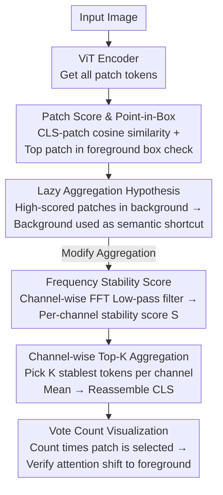

# Vision Transformers Need More Than Registers

**Conference**: CVPR 2026  
**arXiv**: [2602.22394](https://arxiv.org/abs/2602.22394)  
**Code**: [https://github.com/ChengShiest/LAST-ViT](https://github.com/ChengShiest/LAST-ViT)  
**Area**: Self-supervised  
**Keywords**: Vision Transformer, Lazy Aggregation, Register Token, DINO, Dense Feature Alignment

## TL;DR
This paper argues that prevalent dense feature artifacts in ViT under label, text, and self-supervision are not merely high-norm token issues, but a consequence of the model learning to use background patches as global semantic shortcuts under the combined influence of coarse-grained supervision and global attention. To address this, the authors propose LaSt-ViT, which replaces original CLS aggregation with selective aggregation guided by frequency-domain stability, consistently improving localization, segmentation, and open-vocabulary tasks across 12 benchmarks.

## Background & Motivation
ViTs have evolved beyond classification backbones to become general feature extractors for downstream vision systems. However, when using these features for spatially aligned dense prediction tasks like localization, segmentation, and open-vocabulary detection, they often "attend to the wrong places."

Prior works have addressed this from different perspectives:
- Under label supervision, studies noted that ViT dense features are insensitive to foreground objects.
- Under text supervision, CLIP-based ViTs often show poor patch-text alignment, hindering zero-shot dense prediction.
- Under self-supervision, the DINO series exhibits high-norm/artifact tokens that disrupt object discovery.

The authors contend that these phenomena, while seemingly different, likely stem from the same mechanism under different training paradigms. Existing methods often "patch" symptoms in specific settings—such as adding register tokens to DINO to offload abnormal global information—without explaining why these tokens appear or why similar issues persist in text- or label-supervised settings.

The core motivation is summarized in three layers:
- First, to establish a unified, comparable definition for artifacts across different supervision paradigms.
- Second, to determine whether register tokens address the root cause or merely move the symptoms.
- Third, to propose a unified solution that suppresses artifacts during pre-training without depending on specific loss functions.

The Key Insight is: for ViTs receiving only image-level supervision, the CLS token is responsible for whole-image semantics but lacks explicit constraints to ensure each patch aligns with foreground semantics. Under this setting, the most "efficient" path for the model is not extracting global semantics from foreground patches, but using global self-attention to diffuse foreground information into numerous background patches, allowing CLS to perform semantic aggregation from these "background shortcuts." This behavior is termed lazy aggregation.

This explanation is compelling as it accounts for two phenomena:
- Why background patches often have high patch scores: they serve as proxy storage for global semantics.
- Why registers only alleviate the issue: they provide new storage locations but do not change the model's tendency to rely on shortcut aggregation.

In short, the problem is not "how to move abnormal tokens," but "how to stop the ViT from learning to use the background as a global semantic shortcut from the start."

## Method
The method consists of two parts: a unified diagnostic toolset to prove the existence of lazy aggregation, and a redesigned CLS aggregation mechanism that forces global representations to depend on stable, foreground-related patches. The paper redefines the diagnostic metrics first, as comparing supervised, text-supervised, and self-supervised systems requires a unified measurement.

### Overall Architecture
The pipeline is as follows: it starts with a standard ViT encoder to obtain patch token representations $\mathbf{x}_{patch} \in \mathbb{R}^{N \times D}$. A Patch Score is defined to measure the similarity between each patch and the global CLS, identifying which locations the model treats as key patches. If high-scoring patches consistently fall in the background, this is quantified using the Point-in-Box (PiB) metric. Once diagnosed, the training mechanism is modified: instead of allowing CLS to absorb information from all patches indiscriminately, a stability score is calculated for each channel of every patch in the frequency domain. Top-K stable tokens are then selected channel-wise for aggregation to reassemble the CLS representation.

LaSt-ViT does not rewrite the ViT backbone or add complex supervision branches; it redefines "where and how CLS retrieves information." This simplicity allows it to be applied to supervised, text-supervised, and self-supervised paradigms.

### Key Designs

**1. Patch Score & Point-in-Box: Unified Metrics Across Paradigms**

The lack of a unified definition for "abnormal" hindered comparison across paradigms. The authors use the cosine similarity between CLS and patches as a probe: $\mathcal{S}_p = \frac{\mathbf{x}_{patch} \cdot Q_{CLS}}{\lVert \mathbf{x}_{patch} \rVert_2 \lVert Q_{CLS} \rVert_2}$. Higher scores indicate patches closer to the global semantic representation. Ideally, for healthy dense features, high-scoring regions should align with the main object. PiB quantifies this by checking if the highest-scoring patch falls within the foreground box, providing a standardized metric across architectures and paradigms.

**2. Lazy Aggregation Hypothesis: Root Cause is Background Shortcuts, not High-norms**

Through training dynamics, masking experiments, and structural interventions, the authors probe artifact formation. A key control experiment showed that removing high-scoring patches hardly hurts classification accuracy (sometimes improving it), whereas removing low-scoring patches leads to significant drops. This refutes the intuition that "high score = key foreground" and suggests these locations are redundant background proxies. PiB is low from the early training stages and remains constant while accuracy rises, indicating artifacts are an early-learned optimization strategy. Registers only provide a different "container" for shortcuts but do not change the underlying preference.

**3. Frequency Stability Score: Identifying Foreground Candidates via Channel Stability**

Identifying foreground patches without extra supervision relies on a statistical observation: foreground regions show more semantic consistency and smoother changes across channel dimensions in deep features, while background semantics are noisier. A 1D FFT is applied per patch across the channel dimension, multiplied by a Gaussian low-pass weight $\mathbf{g}$, and inverse-transformed to get a low-frequency version $\hat{\mathbf{x}}_{patch}$. A stability score is then calculated for each channel $j$ of patch $i$:

$$\mathbf{S}_{i,j} = \frac{\hat{\mathbf{x}}_{patch}[i,j]}{|\hat{\mathbf{x}}_{patch}[i,j] - \mathbf{x}_{patch}[i,j]| + \varepsilon}$$

A small difference after low-pass filtering indicates "stable" information, more likely belonging to a shared object semantic rather than high-frequency background noise.

**4. Per-channel Top-K Aggregation: Selective Local Evidence for CLS**

The stability score replaces original CLS aggregation by introducing "selectivity." For the $j$-th channel, the set of tokens $\mathcal{I}_K(j)$ with the highest stability scores is selected. Only these $K$ tokens are averaged for that channel's CLS value: $\mathcal{Q}_{CLS}[j] = \frac{1}{K}\sum_{i \in \mathcal{I}_K(j)} \mathbf{x}_{patch}[i,j]$. Channel-wise selection is used because a patch may be reliable for some semantic subspaces but not others, preserving fine-grained representation while preventing background noise from flooding the CLS. This addresses the root cause by limiting the information sources of CLS.

**5. Vote Count Visualization: Verifying Attention Shift**

To verify the mechanism, the authors count how many channels select a specific patch: $v_i = \sum_{j=1}^{D} \mathbf{1}\{i \in \mathcal{I}_K(j)\}$. Higher vote counts indicate patches recognized as reliable across more semantic channels. Visualizations show high-vote patches align strongly with foreground regions and adaptively scale with the amount of foreground evidence, proving that LaSt-ViT pulls attention back to the subject.

### Loss & Training
The paper maintains original training objectives, focusing changes on CLS aggregation:

- In fully supervised scenarios: Standard cross-entropy image classification is used.
- In text-supervised scenarios: CLIP-style image-text contrastive learning is used.
- In self-supervised scenarios: DINO-style self-distillation is used.

LaSt-ViT functions as a general aggregation module rather than a task-specific loss, focusing gains on foreground semantic alignment.

Validation support for the motivation:
- Increasing patch size (reducing background tokens) improves PiB from 0.44 to 0.52 but drops top-1 accuracy from 62% to 55%, showing coarse supervision encourages shortcuts.
- Replacing global attention with window attention increases PiB but consistently decreases top-1 accuracy, proving global dependency provides recognition gains but enables background shortcuts.

## Key Experimental Results

### Main Results
The PiB metric demonstrates whether LaSt-ViT corrects the root cause:

| Paradigm / Model | Baseline PiB | LaSt-ViT PiB | Gain |
|------|------:|------:|------:|
| Supervised ViT | 42.7 | 55.1 | +12.4 |
| DINO-v1 | 44.5 | 69.7 | +25.2 |
| CLIP ViT | 39.8 | 50.1 | +10.3 |
| ResNet Reference | 68.4 / 71.1 / 53.9 | - | - |

Findings: 
1) Artifacts are universal. 2) LaSt-ViT significantly improves foreground alignment. 3) DINO-v1 benefits most, as self-supervised ViTs are particularly susceptible to lazy aggregation.

Object discovery results in the self-supervised domain:

| Method | FPS | VOC07 CorLoc | VOC12 CorLoc | COCO CorLoc |
|------|------:|------:|------:|------:|
| DINO-seg | 29.4 | 45.8 | 46.2 | 42.1 |
| LOST | 29.4 | 61.9 | 64.0 | 50.7 |
| DINO + LaSt-ViT | 55.9 | 64.4 | 67.6 | 51.6 |

LaSt-ViT outperforms DINO-seg and LOST while being significantly faster by avoiding heavy feature decomposition.

Dense task improvements across supervised and text-supervised settings:

| Task | Baseline | LaSt-ViT | Gain |
|------|------:|------:|------:|
| VOC12 coarse segmentation, ViT-B/16 supervised | 22.3 mIoU | 32.8 | +10.5 |
| VOC12 coarse segmentation, ViT-S/16 supervised | 29.5 mIoU | 41.9 | +12.4 |
| VOC12 coarse segmentation, ViT-S/16 DINO | 47.7 mIoU | 55.1 | +7.4 |
| CLIP ViT-B/16 on VOC20 segmentation | 49.0 mIoU | 75.0 | +26.0 |
| F-ViT ViT-B/16 on OV-COCO novel AP50 | 117.5 | 133.3 | +15.8 |

### Ablation Study
Ablations focus on the value of $K$ and comparison with other pooling methods.

Label-supervised $K$ ablation:

| Configuration | IN1K Top-1 | VOC07 CorLoc | VOC12 CorLoc | Note |
|------|------:|------:|------:|------|
| Attention-Pool | 59.1 | 14.1 | 28.7 | Original |
| Mean-Pool | 64.3 | 15.3 | 29.6 | Simple mean |
| LaSt-ViT, K=1 | 64.6 | 30.4 | 35.6 | Aggressive filter |
| LaSt-ViT, K=7 | 64.8 | 32.1 | 37.6 | Optimal trade-off |
| LaSt-ViT, K=49 (Full) | 64.9 | 15.8 | 30.3 | Near-full aggregate |

When $K$ is too large, localization gains degrade significantly, proving that "selectivity" rather than the pooling formula itself is the key driver.

Text-supervised $K$ ablation:

| Configuration | IN1K | VOC mIoU | COCO mIoU | Note |
|------|------:|------:|------:|------|
| Attention-Pool | 55.8 | 10.7 | 3.3 | Original CLIP |
| Max-Pool | 53.1 | 71.9 | 12.2 | Suppresses background, low accuracy |
| LaSt-ViT, K=1 | 53.5 | 72.7 | 13.5 | Too aggressive |
| LaSt-ViT, K=49 | 55.8 | 75.8 | 18.5 | Optimal |
| LaSt-ViT, K=196 (Full) | 55.3 | 13.5 | 4.8 | Baseline failure |

### Key Findings
- Removing high-score patches does little harm to classification, confirming they act as background shortcuts rather than key foreground features.
- Artifacts appear early in training and persist, characterizing them as an early optimization bias rather than late-stage overfitting.
- Register tokens resolve high-norm behavior but PiB remains low; high-norm is a symptom, not the root cause.
- Limiting global dependency or reducing background patches improves PiB but sacrifices accuracy; a modified aggregation mechanism is required.
- Selective aggregation is essential; dense task performance degrades when $K$ approaches the full token count.

## Highlights & Insights
- The paper successfully unifies disparate artifact phenomena into the "lazy aggregation" framework, providing a consistent explanation for Supervised, CLIP, and DINO systems.
- It shifts the perspective from "moving high-norm tokens" (Registers) to "preventing background shortcuts," focusing on the representation formation mechanism.
- The use of frequency-domain stability is an elegant way to identify foreground tokens without explicit supervision, leveraging the statistical consistency of foreground vs. background semantics.
- Channel-wise Top-K selection allows for a more nuanced approach than whole-token selection, acknowledging that different channels represent different semantic subspaces.
- The research follows a rigorous "diagnose-model-verify" paradigm, making it an excellent template for analytical papers.

## Limitations & Future Work
- The theoretical explanation is largely empirical; a formal optimization-level derivation of why CLS converges to background shortcuts early in training is missing.
- The frequency stability assumption (vibrant background vs. consistent subject) may not hold in scenes dominated by complex textures or multiple instances.
- The method focuses on CLS aggregation, potentially limiting applicability to ViT variants without explicit CLS or those using heavy token-mixing architectures.
- While experimental breadth is high, coverage of more modern self-supervised backbones like DINOv2 or MAE would strengthen the case.
- There is no systematic comparison of whether Registers and LaSt-ViT are complementary.

## Related Work & Insights
- **vs Register**: Registers provide storage slots to offload artifacts; LaSt-ViT modifies the aggregation source to prevent the shortcut mechanism.
- **vs CLIP dense alignment**: Unlike methods that modify the final layers or add patch-text alignment losses, LaSt-ViT addresses the issue at the pre-training representation level.
- **vs token pruning/selection**: While pruning focuses on efficiency, LaSt-ViT focuses on semantic integrity. The two can be combined.
- **Insight for self-supervision**: Object-centric performance isn't just determined by the distilled loss; how the CLS token aggregates information is a critical, independent design dimension.
- **Personal takeaway**: If a backbone's global representation is formed through unhealthy shortcuts, downstream dense task issues are merely symptoms. Analyzing "where global semantics come from" should take priority over head design.

## Rating
- Novelty: ⭐⭐⭐⭐⭐ Unified "lazy aggregation" root cause explanation is highly insightful.
- Experimental Thoroughness: ⭐⭐⭐⭐☆ Extensive across 12 benchmarks and 3 paradigms; could benefit from more modern backbones.
- Writing Quality: ⭐⭐⭐⭐☆ Logical diagnostic flow and persuasive organization.
- Value: ⭐⭐⭐⭐⭐ Provides a foundational analysis framework for ViT global semantic mechanisms.

<!-- RELATED:START -->

## Related Papers

- [\[CVPR 2026\] Can You Learn to See Without Images? Procedural Warm-Up for Vision Transformers](can_you_learn_to_see_without_images_procedural_warm-up_for_vision_transformers.md)
- [\[CVPR 2025\] SATA: Spatial Autocorrelation Token Analysis for Enhancing the Robustness of Vision Transformers](../../CVPR2025/self_supervised/sata_spatial_autocorrelation_token_analysis_for_enhancing_the_robustness_of_visi.md)
- [\[CVPR 2026\] DiverseDiT: Towards Diverse Representation Learning in Diffusion Transformers](diversedit_towards_diverse_representation_learning_in_diffusion_transformers.md)
- [\[CVPR 2026\] Temporal Interaction in Spiking Transformers with Multi-Delay Mixer](temporal_interaction_in_spiking_transformers_with_multi-delay_mixer.md)
- [\[CVPR 2026\] Scaling Parallel Sequence Models to Vision Foundation Models](scaling_parallel_sequence_models_to_vision_foundation_models.md)

<!-- RELATED:END -->
## Related Papers

- [\[CVPR 2026\] Can You Learn to See Without Images? Procedural Warm-Up for Vision Transformers](can_you_learn_to_see_without_images_procedural_warm-up_for_vision_transformers.md)
- [\[CVPR 2026\] DiverseDiT: Towards Diverse Representation Learning in Diffusion Transformers](diversedit_towards_diverse_representation_learning_in_diffusion_transformers.md)
- [\[CVPR 2026\] Finding Distributed Object-Centric Properties in Self-Supervised Transformers](finding_distributed_object-centric_properties_in_self-supervised_transformers.md)
- [\[CVPR 2025\] SATA: Spatial Autocorrelation Token Analysis for Enhancing the Robustness of Vision Transformers](../../CVPR2025/self_supervised/sata_spatial_autocorrelation_token_analysis_for_enhancing_the_robustness_of_visi.md)
- [\[CVPR 2026\] Robustness of Vision Foundation Models to Common Perturbations](robustness_of_vision_foundation_models_to_common_perturbations.md)

<!-- RELATED:END -->
