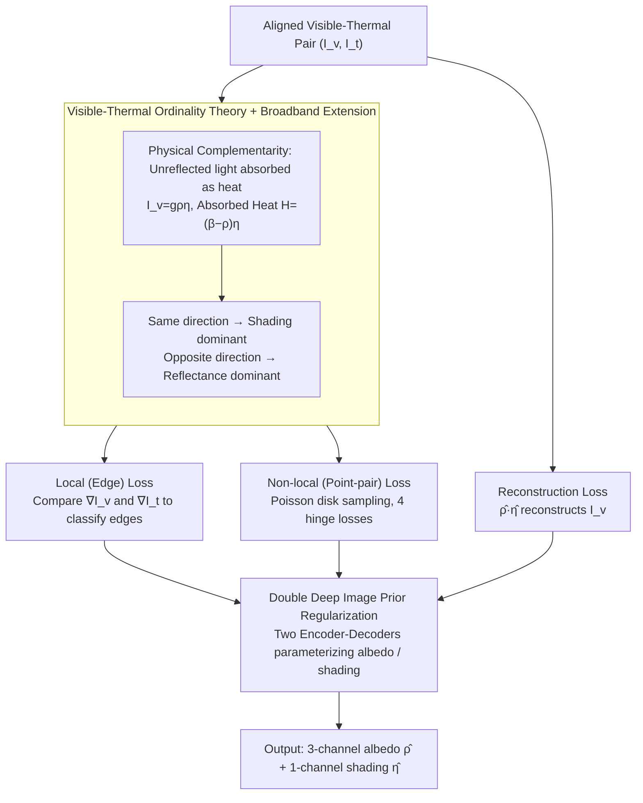

# VT-Intrinsic: Physics-Based Decomposition of Reflectance and Shading using a Single Visible-Thermal Image Pair

**Conference**: CVPR 2026  
**arXiv**: [2509.10388](https://arxiv.org/abs/2509.10388)  
**Code**: [https://vt-intrinsic.github.io](https://vt-intrinsic.github.io)  
**Area**: Self-supervised Learning  
**Keywords**: Intrinsic Image Decomposition, Visible-Thermal Imaging, Reflectance Estimation, Shading Decomposition, Ordinal Constraints

## TL;DR
VT-Intrinsic utilizes the physical complementarity between visible and thermal infrared images (unreflected light is absorbed as heat) to derive visible-thermal intensity ordinality that directly maps to reflectance and shading ordinality. This serves as a self-supervised signal for neural network optimization, enabling high-quality intrinsic image decomposition without pre-training data.

## Background & Motivation

1. **Background**: Intrinsic Image Decomposition (IID) aims to decompose an image into reflectance (albedo) and illumination (shading) components. This is a classic problem in computer vision and graphics. Mainstream approaches include: optimization-based methods (e.g., Retinex, relying on strong priors) and learning-based methods (trained on synthetic data, suffering from sim-to-real gaps).

2. **Limitations of Prior Work**:
    - Obtaining ground truth reflectance and shading for real-world scenes is extremely difficult, requiring specialized equipment and controlled procedures.
    - Learning-based methods are limited by synthetic training data, often leading to over-smoothing or hallucinations in real scenes (especially severe in diffusion-based methods).
    - Optimization methods rely on strong priors (smooth shading, chromaticity invariance, etc.), which generalize poorly to complex real-world scenes.
    - NIR-assisted methods are limited because NIR reflectance still shows significant material variation, and LED lighting lacks NIR components.

3. **Key Challenge**: IID is a fundamentally under-constrained inverse problem—albedo and shading cannot be uniquely determined from a single visible image alone. Existing methods either use unreliable priors or require massive amounts of labeled data.

4. **Goal**: To achieve high-quality IID using an additional thermal infrared image to provide physically meaningful constraints, without requiring pre-training data or controlled lighting.

5. **Key Insight**: A critical physical insight is that for opaque objects, the portion of incident light not reflected is absorbed as heat. Consequently, low-reflectance regions are dark in the visible spectrum but bright in thermal images (absorbing more heat), while shading changes occur in the same direction in both. This "ordinal relationship" directly distinguishes between reflectance edges and shading edges.

6. **Core Idea**: Utilize the intensity ordinality between visible and thermal infrared images (same direction = shading dominant, opposite direction = reflectance dominant) as a dense self-supervised signal to decompose reflectance and shading.

## Method

### Overall Architecture
This paper addresses the classic under-constrained inverse problem of IID: a single visible image cannot uniquely separate reflectance from shading. The solution involves capturing an aligned thermal infrared image. Since unreflected light is absorbed as heat, the intensity relationship between a pixel in the visible and thermal images encodes whether the change is due to reflectance or shading. The pipeline derives a set of **ordinal constraints** (local edge constraints + non-local point-pair constraints) from these physical complementarities. These constraints, along with a reconstruction loss, are used to optimize a Double Deep Image Prior (DDIP) network to output a 3-channel albedo $\hat{\rho}$ and a single-channel shading $\hat{\eta}$. The process is entirely self-supervised using only the image pair, without any pre-trained weights or external data.

### Key Designs

**1. Visible-Thermal Ordinality Theory: Translating unobservable reflectance/shading orders into measurable visible/thermal intensity orders**

IID is difficult because the relative magnitudes of albedo and shading are not directly observable. The core strategy here introduces a second measurable channel: in a Lambertian scene, visible intensity is $I_v = g\rho\eta$, and absorbed heat is $\mathcal{H} = (1-\rho)\eta$. Assuming thermal equilibrium and neglecting conduction, the thermal image $I_t$ is a monotonic proxy for absorbed heat, i.e., $\mathcal{H} = c_1 I_t - c_3$. Comparing any two pixels $x_i, x_j$ yields a clean discriminative rule: when $I_v$ and $I_t$ change in the **same direction**, it is shading dominant, $\eta(x_i) > \eta(x_j)$; when they change in **opposite directions**, it is reflectance dominant, $\rho(x_i) > \rho(x_j)$. This step equates invisible albedo/shading ordinality with observable visible/thermal ordinality.

**2. Extension to Broadband Sources: Ensuring validity under real-world sources like sunlight or incandescent lamps**

The derivation assumes pure visible light sources, but real-world sources contain IR components that contaminate thermal signals. The absorbed heat is redefined as $\mathcal{H} = (\beta - \rho_v)\eta$, where $\beta = 1 + (1-\rho_i)l_i/l_v$ absorbs the influence of IR illumination. The key assumption for maintaining ordinality is that IR reflectance $\rho_i$ is approximately constant locally, as IR reflectance variation between materials is much smaller than in the visible spectrum. Thus, $\beta$ can be treated as a local constant. Statistics from the USGS spectral library (427 materials) show that 94.2% of material pairs satisfy this ordinal consistency.

**3. Local (Edge) Loss: Classifying edges into reflectance or shading edges to constrain gradients**

Edges are the most intuitive signals for albedo/shading boundaries. The first set of constraints compares the cosine similarity of $\nabla I_v$ and $\nabla I_t$: opposite gradients (cosine $< -\epsilon_p$) signify an albedo edge, while same-direction gradients ($> \epsilon_p$) signify a shading edge. Constraints are applied inversely: at albedo edges, shading should not change sharply (penalize $\|\nabla\hat{\eta}\|^2$); at shading edges, reflectance should not change sharply (penalize $\|\nabla\bar{\rho}\|^2$). Comparing directions rather than absolute values makes this robust to lighting intensity and camera gain.

**4. Non-local (Point-pair) Loss: Filling in long-range ordering and anchoring absolute values**

Edge constraints are local and only handle relative changes between adjacent pixels. To address global levels, pixels are sampled via Poisson disk sampling into pairs $(x_i, x_j)$. Based on the signs of normalized intensity differences $\delta I_v, \delta I_t$, pairs are categorized into four classes ($S_+, S_-, A_+, A_-$). Hinge losses pull predicted values toward the corresponding ordinal relationships. For example, a pair in $S_+$ (shading dominant) penalizes $\max(\hat{\eta}_j - \hat{\eta}_i + \varepsilon_m, 0)$, forcing $\hat{\eta}_i > \hat{\eta}_j$ with a margin.

**5. Double Deep Image Prior Regularization: Providing structural priors to anchor absolute values**

Ordinal constraints only define order and cannot fully lock in absolute values; optimization purely on these may overfit noise. The method uses two randomly initialized encoder-decoder networks to parameterize albedo and shading. This utilizes the implicit regularization of the Deep Image Prior (DIP)—where the architecture naturally fits low frequencies before high frequencies—to provide a structural prior. Additional hard constraints include a sigmoid for albedo in $[0,1]$ and non-negativity for shading.

### Loss & Training
The total loss is $\mathcal{L} = \|\hat{\rho} \cdot \hat{\eta} - I_v\|_2 + \lambda_1 \mathcal{L}_{edge} + \lambda_2 \mathcal{L}_{ord}$. The first term is reconstruction loss, while the latter two are ordinality constraints. Note that the thermal image is only used to generate labels for the constraints and is not itself reconstructed.

## Key Experimental Results

### Main Results (si-MSE × $10^{-2}$, ↓ Lower is better)

| Method | Category | Painted Mask Albedo | Color Checker Albedo | White LED Albedo | Incandescent Albedo | Sunlight Albedo |
|------|------|----------------|------------|-------------|-------------|------------|
| RGB-Retinex | Optimization | 25 | 3.4 | 2.42 | 2.33 | 2.73 |
| Intrinsic-v2 | Learning | 27 | 2.8 | 1.25 | 4.36 | 4.17 |
| CRefNet | Learning | 38 | 8.8 | 1.79 | 2.29 | 1.98 |
| JoLHT-Video | Physics | 8.4 | 2.0 | N/A | ✗ | ✗ |
| **VT-Intrinsic** | Physics | **11** | **2.7** | **0.37** | **1.06** | **1.19** |

### Key Findings
- VT-Intrinsic outperforms all learning-based methods across all lighting conditions without any pre-training data.
- It achieves performance close to JoLHT-Video (which requires thermal video, controlled lighting, and calibration) but requires only a single thermal image.
- Validation on expert-annotated points shows ordinality accuracy exceeding 98%, proving the reliability of the theory in real-world scenarios.
- Learning methods tend to over-smooth albedo/shading, whereas this approach maintains detail.

## Highlights & Insights
- **Clever Use of Physical Complementarity**: Visible captures reflected light, thermal captures absorbed heat. This pair naturally encodes the information needed to distinguish albedo from shading.
- **Derivation Chain**: From energy conservation to the heat transfer equation to thermal equilibrium—the physical intuition is rigorous and clear.
- **Zero-shot Superiority**: Surpassing models trained on massive datasets using only physical constraints on a single image pair demonstrates that the correct physical inductive bias can outperform statistical learning.

## Limitations & Future Work
- Assumes Lambertian reflection; fails on metallic, transparent, or specular objects.
- Assumes heat originates primarily from light absorption; non-light heat sources (engines, humans) cause interference.
- Multi-colored illumination is currently not supported.
- Microbolometer resolution is typically lower than visible sensors, potentially affecting detail recovery.

## Related Work & Insights
- **vs JoLHT-Video**: JoLHT-Video uses transient processes in thermal video to estimate absorbed light, requiring controlled light. VT-Intrinsic uses steady-state heat ordinality, making it more applicable.
- **vs NIR-Priors**: NIR methods assume NIR reflectance varies little as a shading proxy, but NIR reflectance still varies by material. VT-Intrinsic's reliance on thermal absorption is more fundamental.

## Rating
- Novelty: ⭐⭐⭐⭐⭐ 
- Experimental Thoroughness: ⭐⭐⭐⭐ 
- Writing Quality: ⭐⭐⭐⭐⭐ 
- Value: ⭐⭐⭐⭐⭐

<!-- RELATED:START -->

## Related Papers

- [\[CVPR 2026\] Reconstructing Spiking Neural Networks Using a Single Neuron with Autapses](reconstructing_spiking_neural_networks_using_a_single_neuron_with_autapses.md)
- [\[CVPR 2026\] Unique Lives, Shared World: Learning from Single-Life Videos](unique_lives_shared_world_learning_from_single-life_videos.md)
- [\[CVPR 2026\] Suppressing Non-Semantic Noise in Masked Image Modeling Representations](suppressing_non-semantic_noise_in_masked_image_modeling_representations.md)
- [\[CVPR 2026\] D2Dewarp: Dual Dimensions Geometric Representation Learning Based Document Image Dewarping](d2dewarp_dual_dimensions_geometric_representation_learning_based_document_image_.md)
- [\[ICML 2025\] PDE-Transformer: Efficient and Versatile Transformers for Physics Simulations](../../ICML2025/self_supervised/pde-transformer_efficient_and_versatile_transformers_for_physics_simulations.md)

<!-- RELATED:END -->
