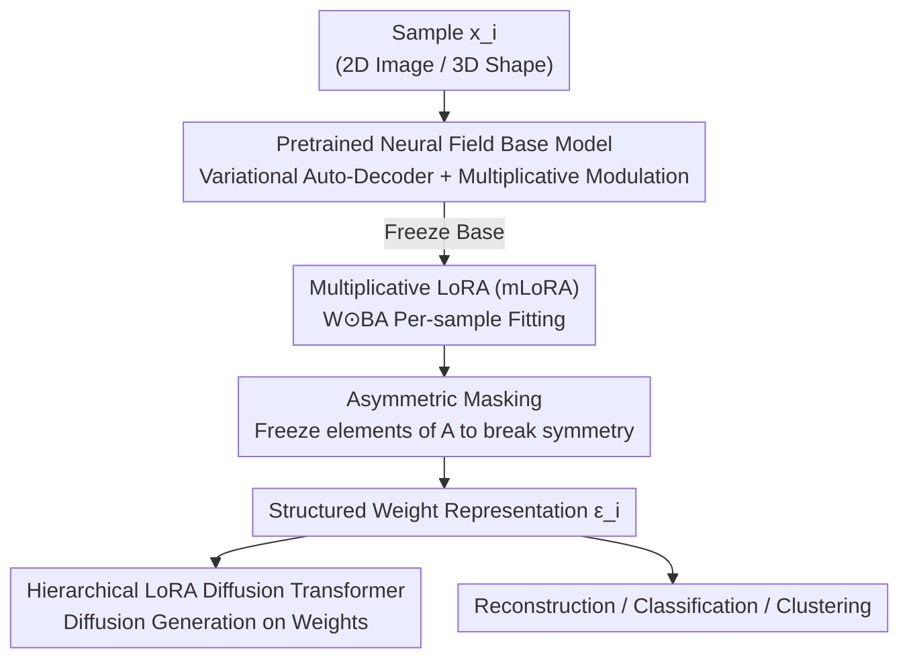

# Weight Space Representation Learning via Neural Field Adaptation

**Conference**: CVPR 2026  
**Paper**: [CVF Open Access](https://openaccess.thecvf.com/content/CVPR2026/html/Yang_Weight_Space_Representation_Learning_via_Neural_Field_Adaptation_CVPR_2026_paper.html)  
**Code**: To be confirmed  
**Area**: Self-supervised / Representation Learning (Weight Space Representation, Neural Fields)  
**Keywords**: Weight space representation, neural field INR, multiplicative LoRA, permutation symmetry, weight diffusion generation

## TL;DR
This paper proposes using a "pretrained neural field base model + multiplicative LoRA (mLoRA) + asymmetric masking" to constrain network weights fitted to individual samples into structured representations. This ensures that INR weights possess high-quality reconstructability, support weight diffusion model generation, and maintain semantic separability, significantly outperforming the prior weight space method HyperDiffusion on FFHQ and ShapeNet.

## Background & Motivation
**Background**: Treating neural network weights as "learnable, manipulatable, and explainable objects" is an emerging direction. Existing research explores model merging, weight generation via diffusion models, or using weights as inputs to other networks. Implicit Neural Representations (INR / neural fields) naturally encode signals (images, 3D shapes) into the weights $f(p\,|\,\omega)$ of a small network that maps "coordinates $\to$ values," making it a natural question whether these weights can be directly used as data representations.

**Limitations of Prior Work**: Network weights are notoriously "blurry." Permutation of neurons and channel scaling do not change the function realized by the network—meaning two networks with identical functions can be arbitrarily far apart in weight space. Different random initializations for the same sample yield vastly different parameter configurations. This makes the distribution of weights highly multimodal and difficult to learn; directly using them for representations or feeding them to diffusion models is nearly impossible.

**Key Challenge**: To use weights as representations, the weight space must be "smooth, structured, and grouped by semantics." However, independent INR optimization scatters each sample into random, symmetry-broken locations in weight space, preventing the emergence of structure.

**Goal**: Inject appropriate inductive biases into independently optimized weights to shape a chaotic parameter space into an organized, semantic representation space, and verify its support for reconstruction, generation, and discrimination tasks.

**Key Insight**: The authors observe two properties of LoRA that are beneficial for creating structure: first, LoRA restricts updates to a low-dimensional subspace defined by a base model (LoRAs of different ranks share singular vector directions, suggesting a meaningful low-rank adaptation subspace); second, low-rank inherently reduces dimensionality, alleviating the curse of dimensionality in high-dimensional weight spaces. Thus, rather than building an external encoder to handle arbitrary weights, structure is directly imposed on the weight space itself.

**Core Idea**: Use a "frozen pretrained neural field base model + multiplicative LoRA (element-wise multiplication rather than addition) + asymmetric masking to break permutation symmetry," so that the LoRA weights of each sample directly become its structured representation.

## Method

### Overall Architecture
The core idea is: **instead of fitting an MLP from scratch for each sample, share the same frozen pretrained neural field and fine-tune using only sample-specific low-rank adaptation weights; these adaptation weights serve as the representations.** The input is a set of samples $\{x_i\}_{i=1}^{N}$ (2D images or 3D shapes), and the output is a set of LoRA weights $\varepsilon_i$ for each sample, forming a structured weight space used for reconstruction, diffusion generation, and classification.

The pipeline is as follows: Train a neural field base model with multiplicative modulation using a variational auto-decoder paradigm (capturing transferable features) $\to$ Freeze the base model and optimize multiplicative LoRA parameters for each sample to reconstruct it $\to$ Apply a shared asymmetric mask to all LoRA $A$ matrices to eliminate internal permutation symmetry $\to$ Flatten the weight representations and feed them into a Hierarchical LoRA Diffusion Transformer to learn the distribution, sample new weights, and instantiate new neural fields.

### Key Designs

**1. Multiplicative LoRA (mLoRA): Using "multiplication" instead of "addition" to avoid feature entanglement**

Standard LoRA is additive: $W' = W + BA$, where $A, B$ are low-rank matrices. However, the authors found additive LoRA insufficient for neural field weight learning. INRs synthesize signals "additively" (linear layers combine basis functions, activations generate harmonics), making representations highly entangled. Additive LoRA injects new signal components into this mixture, further complicating the weight space. This paper uses element-wise multiplication:

$$W' = W \odot BA$$

where $\odot$ denotes element-wise multiplication. Multiplicative updates scale existing features rather than injecting new ones, preserving channel structure and avoiding extra entanglement. This aligns with the "multiplicative modulation" widely used in generative neural fields. Once permutation symmetry is removed, mLoRA weights align with the channel axes of the base network, which is the source of its structure.

**2. Asymmetric Masking: Freezing LoRA elements to eliminate internal permutation/GL symmetry**

Permutation symmetry is the root of the multimodal nature of weight spaces. Here, symmetry comes from two sources: **External symmetry** from base network neuron permutations (eliminated by sharing a fixed base model) and **Internal symmetry** within LoRA factors ($r$ rank dimensions can be permuted, and any invertible matrix $G \in GL(r)$ satisfies $(AG)(G^{-1}B)=AB$). 

To break internal symmetry, the authors apply an asymmetric mask to the $A$ matrix of all LoRAs: several elements in each row are randomly frozen and shared across all samples. While additive LoRA requires frozen terms to be initialized with large variance $\mathcal{N}(0, \sigma I)$ to break symmetry, which harms optimization, mLoRA can simply set frozen terms to zero $A_{ij} \leftarrow 0$. This cleanly "gates" the corresponding rank components without requiring compensation, naturally fitting the multiplicative structure.

**3. Multiplicative Modulated Base Model + Variational Auto-Decoder Training**

The quality of LoRA representations depends on the strength of the base model. The authors use a coordinate-based neural field with an MLP backbone where sample differences are injected via multiplicative weight modulation. The base model is trained using a variational auto-decoder paradigm, jointly optimizing network parameters $\omega$ and per-sample latent codes $\{z_i\}$:

$$\min_{\omega,\{z_i\}} \sum_{i=1}^{N} L_{recon}(f_\omega(p, z_i), x_i(p)) + \lambda_r \lVert z_i \rVert_2^2$$

Transferable features learned across multiple instances are more disentangled, providing a cleaner basis for the subsequent multiplicative LoRA scaling.

**4. Hierarchical LoRA Diffusion Transformer**

To generate new weights, DDPM diffusion is applied to the flattened weight representations. The authors design a Hierarchical LoRA Layer Encoder: for layer $l$, each rank component pair $(a_l^{(i)}, b_l^{(i)})$ is treated as a token. "Vector-level position encoding" marks the rank index, followed by $r$-head attention to model intra-layer dependencies. Finally, "layer-level position encoding" is added before the data enters the backbone Transformer to model cross-layer relationships. This design respects the combinatorial structure of LoRA weights.

### Loss & Training
Two types of loss: the base model uses reconstruction loss plus latent $L_2$ regularization. Per-sample LoRA is fitted on the frozen base model using reconstruction loss. The diffusion model uses the standard simplified noise prediction loss. All standalone networks share initialization to promote consistency.

## Key Experimental Results

### Main Results: Reconstruction + Generation
Reconstruction quality (PSNR↑ for FFHQ, Chamfer Distance↓ for ShapeNet):

| Representation | FFHQ PSNR↑ | ShapeNet CD-A↓ | ShapeNet CD-M↓ |
|------|-----------|----------------|----------------|
| MLP | 35.11 | 2.57 | 3.78 |
| MLP-Asym | 33.28 | 2.64 | 4.00 |
| LoRA | 35.69 | 2.44 | 3.39 |
| LoRA-Asym | 24.63 | 2.46 | 3.44 |
| mLoRA | 35.65 | 2.45 | 3.49 |
| **mLoRA-Asym** | **36.91** | **2.41** | **3.35** |

Weight Space Generation (FFHQ, lower is better):

| Method | FD↓ | MMD-G↓ | MMD-P↓ |
|------|-----|--------|--------|
| HyperDiffusion | 0.241 | 0.158 | 1.887 |
| LoRA-Asym | 0.269 | 0.157 | 1.877 |
| mLoRA | 0.100 | 0.056 | 0.674 |
| **mLoRA-Asym** | **0.073** | **0.039** | **0.467** |

### Ablation Study / Discriminative Tasks (ShapeNet 10 Class)

| Representation | Clustering ARI↑ | 1-NN Classification↑ | Logistic Classification↑ |
|------|----------|-----------|----------------|
| MLP | 39.3% | 50.0% | 78.1% |
| LoRA | 56.3% | 75.2% | 86.1% |
| **mLoRA** | **67.1%** | **85.1%** | **90.0%** |
| mLoRA-Asym | 56.5% | 80.8% | 84.5% |

### Key Findings
- **Multiplicative is the master switch**: Multiplicative consistently outperforms additive in reconstruction, generation, and discrimination. Additive LoRA fails in generation because it injects new components into entangled neural fields, destroying weight space structure.
- **Asymmetric masking requires multiplicative**: For additive versions, masking requires large-variance frozen terms, which creates entanglement. mLoRA uses zero-masking, which further disentangles and improves reconstruction.
- **Structure correlates with generation**: mLoRA-Asym weights converge to a "linear mode" (high similarity across initializations, low linear interpolation barriers), leading to superior diffusion generation.
- **Discriminative vs. Generative**: mLoRA (non-Asym) performs best on discriminative tasks (90% Logistic), while mLoRA-Asym is superior for generation/reconstruction, suggesting that breaking symmetry does not necessarily improve semantic separability.

## Highlights & Insights
- **Switching from additive to multiplicative is the most critical contribution**: This change addresses the diagnosis that adding components to an already additive synthesis process (INR) increases entanglement.
- **Clever symmetry breaking**: The use of zero-masking for mLoRA is explained through channel alignment (Corollary 2.2), providing a mechanical rather than empirical explanation.
- **Transferable Hierarchical LoRA Diffusion**: The design of tokens for rank pairs and hierarchical attention is applicable to any task involving modeling distributions over low-rank weights.
- **High-resolution capability**: This work pushes weight space generation from toy datasets (MNIST/CIFAR) to FFHQ-128.

## Limitations & Future Work
- **Limited Resolution**: FFHQ is capped at 128×128, which is modest compared to current pixel-space SOTA.
- **Inconsistent Optimal Configurations**: mLoRA is better for discrimination, while mLoRA-Asym is better for generation; a unified representation is still missing.
- **Dependency on Base Model**: The quality of the representation relies on the "generative/disentangled" nature of the pretrained base neural field.

## Related Work & Insights
- **vs HyperDiffusion**: Both perform diffusion on neural field weights, but this work focuses on how adaptation mechanisms (mLoRA) and symmetry breaking (asymmetric masking) affect weight space structure, outperforming HyperDiffusion on complex datasets.
- **vs GL-equivariant networks**: Instead of building an external equivariant encoder to handle weights, this paper directly imposes structure on the weight space itself.
- **vs Standard LoRA**: Proves that additive forms are harmful in the context of INR weight learning.

## Rating
- Novelty: ⭐⭐⭐⭐⭐ 
- Experimental Thoroughness: ⭐⭐⭐⭐ 
- Writing Quality: ⭐⭐⭐⭐⭐ 
- Value: ⭐⭐⭐⭐ 

<!-- RELATED:START -->

## Related Papers

- [\[CVPR 2026\] Exemplar-Free Continual Learning for State Space Models](exemplar-free_continual_learning_for_state_space_models.md)
- [\[ICML 2026\] How 'Neural' is a Neural Foundation Model?](../../ICML2026/self_supervised/how_neural_is_a_neural_foundation_model.md)
- [\[CVPR 2026\] An Optimal Transport-driven Approach for Cultivating Latent Space in Online Incremental Learning](an_optimal_transport_driven_approach_for_cultivating_latent_space_in_online_incr.md)
- [\[CVPR 2026\] Assignment-Driven Hash Learning in a Hyper-Semantic Space for On-the-Fly Category Discovery](assignment-driven_hash_learning_in_a_hyper-semantic_space_for_on-the-fly_categor.md)
- [\[CVPR 2026\] On the Role of Temporal Granularity in the Robustness of Spiking Neural Networks](on_the_role_of_temporal_granularity_in_the_robustness_of_spiking_neural_networks.md)

<!-- RELATED:END -->
