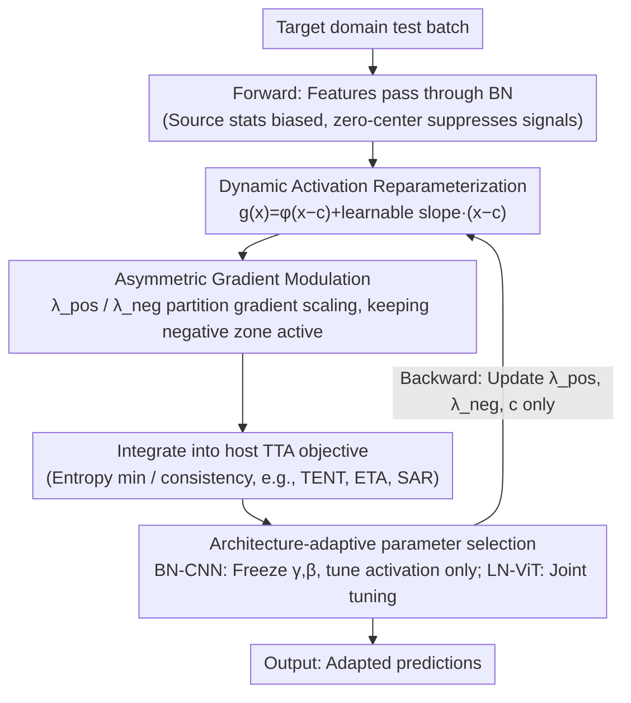

# AcTTA: Rethinking Test-Time Adaptation via Dynamic Activation

**Conference**: CVPR 2026  
**arXiv**: [2603.26096](https://arxiv.org/abs/2603.26096)  
**Code**: [https://hyeongyu-kim.github.io/actta/](https://hyeongyu-kim.github.io/actta/)  
**Area**: Signal & Communication / Test-Time Adaptation  
**Keywords**: Test-Time Adaptation, Activation Function, Distribution Shift, Normalization Layer, Dynamic Activation

## TL;DR
This paper proposes AcTTA, a test-time adaptation framework based on dynamic activation function modulation. By reparameterizing traditional fixed activation functions into a learnable form—incorporating activation center shifts and asymmetric gradient slopes—the model adaptively adjusts activation behavior during inference to handle distribution shifts. AcTTA consistently outperforms normalization-based TTA methods on CIFAR10-C, CIFAR100-C, and ImageNet-C.

## Background & Motivation

1. **Background**: Test-time adaptation (TTA) is a crucial paradigm for dealing with discrepancies between deployment environments and training distributions. Existing TTA methods primarily focus on adjusting affine parameters of normalization layers and recalibrating running statistics, with methods like TENT, EATA, and SAR using normalization layers as the primary adaptation mechanism.

2. **Limitations of Prior Work**: This normalization-centric perspective overlooks a critical component: the activation function. As the core of nonlinearity, activation functions fundamentally shape the geometry of the feature space and determine how the model responds to input changes. However, in TTA, activation functions have been treated as fixed nonlinear mappings and have never been incorporated into the scope of adaptation.

3. **Key Challenge**: Under distribution shifts, the source domain statistics in Batch Normalization (BN) layers no longer align with target features, resulting in biased feature representations. When these biased features pass through zero-centered activation functions (e.g., ReLU, GELU), useful signals may be suppressed below the activation threshold, leading to information loss and gradient vanishing. This "zero-centered rigidity" is a key factor limiting adaptation effectiveness.

4. **Goal**: To make the activation function itself an adaptable component in TTA by: (1) adjusting gradient behavior to maintain learning flow; (2) shifting activation boundaries to align with new feature centers; and (3) maintaining compatibility with source domain pre-trained representations.

5. **Key Insight**: Authors observe that outside the TTA context, learnable/modulated activation functions (such as PReLU, ACON, PAU) have demonstrated that even subtle modifications to activation behavior can improve performance and training stability, indicating that activation functions possess inherent learnable flexibility.

6. **Core Idea**: Transform activation functions from fixed components into adaptive participants. By parameterizing the activation center and asymmetric slopes, the network can self-correct internal biases during inference.

## Method

### Overall Architecture
AcTTA aims to solve the problem where BN source statistics misalign with target features under distribution shift, causing biased features to be suppressed by zero-centered activations. The mechanism transforms each activation function into a test-time learnable module by inserting a dynamic activation unit at the original activation position. During inference, only three activation parameters—$\lambda_{pos}$, $\lambda_{neg}$, and $c$—are updated, while network weights remain frozen and no source data is required. This mechanism is objective-agnostic; it does not introduce its own loss function but instead incorporates these parameters into the learnable set of any existing TTA method (e.g., entropy minimization, consistency regularization), allowing it to serve as a plug-and-play module for TENT, ETA, SAR, etc.

### Key Designs

**1. Dynamic Activation Reparameterization: Converting fixed activations into inference-tuneable parameterized forms**

A major pain point is that activation functions are treated as immutable nonlinear mappings. AcTTA notes that modern activations can be approximated as $\phi(x) = x \cdot \sigma(\beta x)$, where the derivative is essentially an input-dependent slope function. It explicitly exposes this implicit slope as a learnable form $\lambda(x) = \lambda_{neg} + (\lambda_{pos} - \lambda_{neg}) \sigma(\beta x)$, where $\lambda_{neg}$ and $\lambda_{pos}$ control the asymptotic slopes of the negative and positive regions, respectively. A learnable center parameter $c$ is also introduced to shift the activation boundary. The final activation is formulated as:

$$g(x) = \phi(x-c) + \big[\lambda_{neg} + (\lambda_{pos} - \lambda_{neg})\sigma(\beta(x-c))\big](x-c)$$

Crucially, slope adaptation alone cannot correct feature center shifts; the parameter $c$ allows the activation boundary to re-center based on target domain statistics, "retrieving" useful signals pushed below the boundary. This reparameterization also provides a zero-risk starting point: when $\lambda_{neg}=\lambda_{pos}=0$ and $c=0$, $g(x)$ precisely reverts to the original $\phi(x)$, ensuring full compatibility with the pre-trained model.

**2. Asymmetric Gradient Modulation: Scaling gradients in positive/negative regions to maintain learning flow**

Traditional zero-centered activations under distribution shift cause imbalanced gradients and biased updates; once features shift, the negative half-plane easily falls into a dead zone. By learning $\lambda_{pos}$ and $\lambda_{neg}$ separately, AcTTA preserves non-zero gradients in the negative region to prevent dead gradients and flexibly adjusts response intensity in the positive region. This ensures stable gradient propagation even under skewed feature distributions. A direct benefit of this stability is that AcTTA can be optimized at learning rates approximately 10 times higher than conventional ones ($10^{-2}$ vs $10^{-3}$), whereas TENT would collapse under similar conditions.

**3. Architecture-adaptive Trainable Parameter Selection: Selecting parameters based on backbone type**

The optimal components for adaptation differ across normalization mechanisms. For BN-based CNNs (e.g., WRN), freezing BN affine parameters $(\gamma, \beta)$ and only adapting activation parameters $(\lambda_{pos}, \lambda_{neg}, c)$ yields the best results. This is because BN relies on disturbed running statistics, and modifying $(\gamma, \beta)$ may amplify distribution noise, which activation adaptation bypasses. For LN-based ViTs, joint adaptation of normalization and activation parameters is optimal; LN normalizes per-sample and does not rely on source statistics, so its $(\gamma, \beta)$ and activation parameters provide complementary degrees of freedom. A depth configuration is also applied: only a portion of layers' activations are made learnable, with a default of 50% (optimal depth varies: WRN ~50%, ResNet ~75%, ViT ~25%).

## Key Experimental Results

### Main Results

| Dataset/Backbone | Metric(Err%) | AcTTA_TENT | TENT | Gain |
|-------------|-----------|------------|------|------|
| CIFAR10-C / WRN-28 | Error | 17.03 | 18.51 | -1.48 |
| CIFAR10-C / ResNeXt | Error | 9.53 | 10.28 | -0.75 |
| CIFAR100-C / WRN-40 | Error | 33.81 | 35.25 | -1.44 |
| ImageNet-C / ResNet50(BN) | Error | 64.95 | 66.50 | -1.55 |
| ImageNet-C / ResNet50(GN) | Error | 66.84 | 69.60 | -2.76 |
| ImageNet-C / ViT-B/16 | Error | 51.79 | 53.85 | -2.06 |

The combination of AcTTA with other TTA baselines (ETA, SAR, DeYO, ROID, CMF) also brought consistent improvements, demonstrating excellent modular compatibility.

### Ablation Study

| Configuration | WRN-28 Err% | ViT-B/16 Err% | Description |
|------|------------|--------------|------|
| TENT (γ,β only) | 18.51 | 53.85 | Baseline |
| AcTTA (γ,β,λ+,λ-,c) | 18.06 | 52.37 | Full parameters |
| AcTTA* (λ+,λ-,c only) | 17.03 | 55.30 | Frozen BN, CNN optimal |
| AcTTA* (c only) | 17.50 | 61.56 | Center shift only |
| No adaptation | 43.52 | 62.10 | Original model |

### Key Findings
- **Activation params > Normalization params on BN-CNN**: Freezing BN affine parameters and only adapting activation parameters (AcTTA*) achieved the lowest error rate of 17.03% on WRN-28, suggesting overlapping roles between BN and activation adaptation.
- **Significant contribution of center shift $c$**: Adapting only $c$ yielded significant improvements on CNNs (18.51→17.50), indicating that residual bias from source domain running statistics can be compensated for by adjusting activation boundaries.
- **Stability at high learning rates**: AcTTA remained stable at 10x the learning rate (34.56% @ LR=1e-2 on CIFAR100-C), whereas TENT collapsed completely under the same conditions (51.57%).
- **Comparison with other learnable activations**: PReLU and PAU performed poorly in TTA scenarios (PAU reached 99.96% error on ViT), indicating that TTA requires joint center-shift and asymmetric slope modulation rather than generic function approximation.
- **Architecture-specific optimal depth**: The optimal adaptation depth is ~50% for WRN, ~25% for ViT, and ~75% for ResNet.

## Highlights & Insights
- **Activation function as a new TTA dimension**: This is the first work to systematically incorporate activation functions into the TTA framework, expanding the traditional normalization-centric view. This approach can be transferred to other online adaptation scenarios like continual learning or domain generalization.
- **Initialization compatibility**: The design where $\lambda=0, c=0$ fully restores the original activation function is clever, ensuring a zero-risk, lossless start. This "additive" module design is a reusable trick.
- **High learning rate stability**: By maintaining non-zero gradients in the negative region, AcTTA essentially solves the gradient vanishing problem under distribution shift, enabling more aggressive learning rates which is vital for real-time TTA deployment.

## Limitations & Future Work
- **Optimal depth requires prior knowledge**: The optimal adaptation depth varies significantly across architectures (10% to 75%), and while the paper uses 50% as a compromise, it may not be optimal for all cases.
- **Limited effectiveness in small batch scenarios**: At batch=4, some combinations (e.g., AcTTA_SAR on ViT) performed worse than the baseline, suggesting activation adaptation still relies on batch statistics.
- **Evaluation limited to corruption benchmarks**: The method has not been tested on more complex shifts such as natural domain shifts or cross-modal shifts.
- **Lack of detailed computational analysis**: The increase in learnable parameters and additional forward/backward computation time are not quantitatively compared.

## Related Work & Insights
- **vs TENT**: TENT only adapts BN layers $(\gamma, \beta)$. AcTTA shows that freezing BN parameters and adapting only activation functions is better for CNNs, implying functional overlap between these components.
- **vs ACON**: ACON introduces learnable gating but still assumes a zero-centered boundary, failing to handle shifted feature distributions. AcTTA's center shift design directly addresses this.
- **vs PAU**: While PAU is effective as a general learnable activation during training, it collapses in TTA (99.96% error on ViT), proving that TTA requires targeted shift-slope modulation rather than general function approximation.

## Rating
- Novelty: ⭐⭐⭐⭐ The activation function perspective in TTA is fresh, though the reparameterization form is relatively simple.
- Experimental Thoroughness: ⭐⭐⭐⭐⭐ Covers multiple datasets, architectures, and TTA baselines with comprehensive ablations.
- Writing Quality: ⭐⭐⭐⭐⭐ Clear logic, progressing naturally from motivation to method and experiments.
- Value: ⭐⭐⭐⭐ Opens a new research direction for TTA, though the practical gain (1-3% error reduction) is incremental.

<!-- RELATED:START -->

## Related Papers

- [\[ICLR 2026\] Enhancing Instruction Following of LLMs via Activation Steering with Dynamic Rejection](../../ICLR2026/signal_comm/enhancing_instruction_following_of_llms_via_activation_steering_with_dynamic_rej.md)
- [\[ECCV 2024\] PYRA: Parallel Yielding Re-Activation for Training-Inference Efficient Task Adaptation](../../ECCV2024/signal_comm/pyra_parallel_yielding_re-activation_for_training-inference_efficient_task_adapt.md)
- [\[CVPR 2025\] Continuous Space-Time Video Resampling with Invertible Motion Steganography](../../CVPR2025/signal_comm/continuous_space-time_video_resampling_with_invertible_motion_steganography.md)
- [\[NeurIPS 2025\] Angular Steering: Behavior Control via Rotation in Activation Space](../../NeurIPS2025/signal_comm/angular_steering_behavior_control_via_rotation_in_activation_space.md)
- [\[CVPR 2026\] MERLIN: Building Low-SNR Robust Multimodal LLMs for Electromagnetic Signals](merlin_building_low-snr_robust_multimodal_llms_for_electromagnetic_signals.md)

<!-- RELATED:END -->
