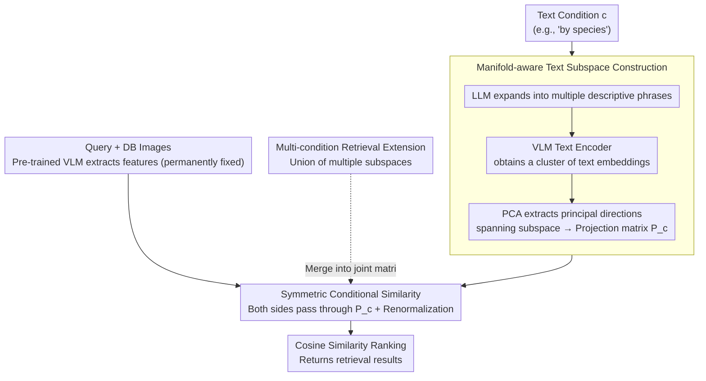

# CLAY: Conditional Visual Similarity Modulation in Vision-Language Embedding Space

**Conference**: CVPR 2026  
**arXiv**: [2604.11539](https://arxiv.org/abs/2604.11539)  
**Code**: None  
**Area**: Signal Communication  
**Keywords**: Conditional image retrieval, Vision-language models, Similarity modulation, Training-free, Hyperspherical geometry

## TL;DR
CLAY proposes a training-free method for conditional visual similarity calculation, which modulates similarity by constructing a text-conditioned subspace within the VLM embedding space. This approach adapts to different retrieval conditions without recomputing database features and supports multi-condition retrieval.

## Background & Motivation

**Background**: Image retrieval systems typically rely on a fixed, single similarity metric. However, human perception of similarity is adaptive; when viewing the same image, focus can shift between aspects such as species, color, or action.

**Limitations of Prior Work**: (1) Training-based methods require specific models for each condition and necessitate recomputing all database features when conditions change; (2) Existing methods only support single-condition retrieval and cannot specify multiple dimensions simultaneously; (3) Training data requires paired images for every condition.

**Key Challenge**: Recomputing database embeddings when conditions change incurs high computational costs, yet different conditions require different similarity measures.

**Core Idea**: Separate the conditioning process from visual feature extraction—keep visual embeddings fixed and dynamically modulate them within the similarity calculation space based on text conditions.

## Method

### Overall Architecture
CLAY addresses the reuse problem of "same database, different retrieval conditions." Traditional approaches "bake" conditions into the features, requiring full database recomputation when conditions change, which is costly and limited to a single dimension. CLAY reverses this—visual features are extracted once using a pre-trained VLM and remain permanently fixed; conditions only affect the "comparison step." Given a text condition $c$ (e.g., "by species"), it generates a projection matrix $P_c$ that projects both query and database visual features into this conditional subspace before calculating cosine similarity. Changing a condition only involves changing $P_c$, while database features remain untouched.

### Key Designs

**1. Manifold-aware Text Subspace Construction: Expanding a single condition into a meaningful set of directions**

A single text embedding is merely a point in space and cannot define a "semantic direction" concept, let alone a projection. CLAY first uses an LLM to expand the condition text into multiple descriptive phrases (e.g., "species" expands to "this is a bird," "this is a mammal," etc.), extracts a cluster of embeddings via a VLM text encoder, and then uses PCA to extract principal directions that span an orthogonal subspace to form the projection matrix $P_c$. Consequently, condition-related semantics are characterized by a set of directions rather than an isolated point. A critical step involves accounting for the hyperspherical geometry of the VLM embedding space—since features are normalized on a unit sphere, projection pulls vectors away from the sphere. Therefore, renormalization after projection is mandatory to maintain the geometric meaning of similarity (ablation studies show a significant drop without normalization).

**2. Symmetric Conditional Similarity: Filtering query and database features with the same matrix**

The most intuitive implementation might transform only the query while keeping database features static (asymmetric). However, the database features would still contain significant condition-irrelevant noise (e.g., color, background, or pose when retrieving by species), interfering with the ranking. CLAY passes both sides through the same $P_c$:

$$\text{csim}(I_q, I_d \mid c) = \cos\big(P_c \cdot f(I_q),\; P_c \cdot f(I_d)\big)$$

Bidirectional projection ensures both query and database images are stripped down to only condition-relevant components before comparison, symmetrically filtering out interference. Since $P_c$ can be pre-computed and cached offline, switching conditions during retrieval only requires switching a matrix with zero additional feature computation—an efficiency dividend of "changing the metric, not the features."

**3. Multi-condition Retrieval Extension: Union of subspaces**

In practice, users often want to retrieve by "species" and "color" simultaneously, but existing methods are single-condition. CLAY directly takes the union of subspaces for multiple conditions to form a joint projection matrix, preserving both types of semantic directions. Because the mechanism operates at the subspace level, multiple conditions require no retraining or feature recomputation; adding a dimension simply involves merging another set of principal directions.

### Loss & Training
Completely training-free, utilizing only the feature space of pre-trained VLMs—all "learning" is replaced by LLM expansion and PCA principal direction extraction.

## Key Experimental Results

### Main Results

| Dataset | Metric | CLAY | GeneCIS (Training-based) | FocalLens |
|--------|------|------|-----------------|-----------|
| GeneCIS Benchmark | Recall@1 | Competitive/Superior | Baseline | Baseline |
| CLAY-EVAL | MR@K | SOTA | N/A (Multi-condition) | N/A |

### Ablation Study

| Configuration | Retrieval Accuracy | Description |
|------|---------|------|
| Symmetric Projection | Optimal | Full Method |
| Asymmetric Projection | Decrease | Database-side noise |
| Single Text Embedding | Significant Decrease | Insufficient subspace expressiveness |
| No Normalization | Decrease | Ignores hyperspherical geometry |

### Key Findings
- The training-free method achieves or exceeds training-based methods on standard benchmarks with higher computational efficiency.
- The difference between symmetric and asymmetric projection proves the importance of bidirectional filtering of condition-irrelevant information.
- Accounting for hyperspherical geometry (normalization) significantly impacts performance.

## Highlights & Insights
- **"Changing the metric instead of the features"**: This subverts traditional thinking—instead of changing feature extraction, it modifies the comparison method, allowing full database feature reuse.
- **Training-free SOTA**: Achieves performance comparable to training-based methods without any training data, offering high practical utility.

## Limitations & Future Work
- Dependence on the quality of text descriptions generated by the LLM.
- Selection of subspace dimensions requires tuning.
- May lack precision under extremely fine-grained conditions.

## Related Work & Insights
- **vs GeneCIS**: Requires training and paired data; feature recomputation is necessary when conditions change.
- **vs FocalLens**: Also performs conditional retrieval but requires training and does not support multi-condition retrieval.

## Rating
- Novelty: ⭐⭐⭐⭐⭐ Moving conditioning from feature extraction to similarity space is a novel approach.
- Experimental Thoroughness: ⭐⭐⭐⭐ Constructed a new evaluation dataset.
- Writing Quality: ⭐⭐⭐⭐ Concise mathematical formulations.
- Value: ⭐⭐⭐⭐⭐ Training-free, efficient, and supports multi-condition retrieval; highly practical.

<!-- RELATED:START -->

## Related Papers

- [\[ICLR 2026\] Mamba-3: Improved Sequence Modeling using State Space Principles](../../ICLR2026/signal_comm/mamba-3_improved_sequence_modeling_using_state_space_principles.md)
- [\[ICML 2025\] Fourier Position Embedding: Enhancing Attention's Periodic Extension for Length Generalization](../../ICML2025/signal_comm/fourier_position_embedding_enhancing_attentions_periodic_extension_for_length_ge.md)
- [\[ECCV 2024\] RAW-Adapter: Adapting Pre-trained Visual Model to Camera RAW Images](../../ECCV2024/signal_comm/raw-adapter_adapting_pre-trained_visual_model_to_camera_raw_images.md)
- [\[ICML 2025\] Large Language Model (LLM)-enabled In-context Learning for Wireless Network Optimization](../../ICML2025/signal_comm/large_language_model_llm-enabled_in-context_learning_for_wireless_network_optimi.md)
- [\[AAAI 2026\] Balancing Multimodal Domain Generalization via Gradient Modulation and Projection](../../AAAI2026/signal_comm/balancing_multimodal_domain_generalization_via_gradient_modulation_and_projectio.md)

<!-- RELATED:END -->
