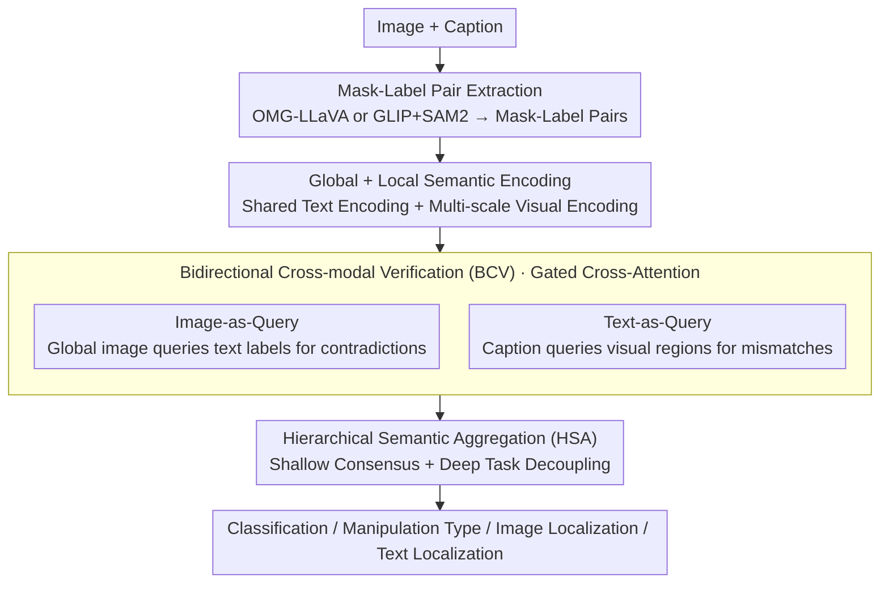

# Bridging Pixels and Words: Mask-Aware Local Semantic Fusion for Multimodal Media Verification

**Conference**: CVPR 2026  
**arXiv**: [2603.26052](https://arxiv.org/abs/2603.26052)  
**Code**: None  
**Area**: Social Computing  
**Keywords**: Multimodal misinformation, bidirectional cross-modal verification, mask-label pairs, hierarchical semantic aggregation, deepfake detection

## TL;DR
The MaLSF framework is proposed, utilizing mask-label pairs as semantic anchors to achieve active local semantic conflict detection through Bidirectional Cross-modal Verification (BCV) and Hierarchical Semantic Aggregation (HSA) modules, achieving SOTA on DGM4 and fake news detection tasks.

## Background & Motivation
**Background**: Advanced generative models (DALL·E, Stable Diffusion, etc.) have made multimodal deepfakes increasingly realistic; the DGM4 task requires simultaneous detection and localization of image-text manipulations.

**Limitations of Prior Work**: Existing methods (HAMMER, UFAFormer, EMSF, etc.) rely on "passive" holistic fusion—encoding the entire image and text into high-dimensional vectors before fusion. This leads to **feature dilution**: a critical word substitution (e.g., "recovered" $\rightarrow$ "failed") becomes almost imperceptible within global text features, as subtle conflict signals are overwhelmed by global semantic alignment.

**Key Challenge**: The most stealthy misinformation resides in subtle **local semantic inconsistencies** (e.g., an image of an athlete celebrating with champagne paired with the text "failed to participate in the sprint"), which global fusion cannot capture.

**Goal**: How to perform active bidirectional cross-validation like humans—actively searching for evidence of failure in the image upon reading "failed," and searching for victory semantics in the text upon seeing "champagne"?

**Key Insight**: Use mask-label pairs to establish precise correspondences between pixel regions and text descriptions, enabling fine-grained local reasoning.

**Core Idea**: Transform multimodal verification from "passive fusion" into "active interrogation"—the BCV module acts as the interrogator, while the HSA module serves as the reasoning engine to hierarchically aggregate multi-granularity conflict signals.

## Method

### Overall Architecture
MaLSF aims to shift multimodal verification from "passive holistic fusion" to "active local interrogation." Given an image and text, a Parser first extracts a set of mask-label pairs $\{(\mathbf{M}_i, \mathbf{L}_i)\}$ as verification units connecting pixels and words, which are encoded into text features and multi-scale visual features. Subsequently, the BCV module performs cross-interrogation from both image and text directions to identify local contradictions. The HSA module then hierarchically aggregates multi-granularity conflict signals. Finally, branched heads simultaneously output binary classification, manipulation type, image localization, and text localization.

### Key Designs

**1. Mask-Label Pair Extraction: Establishing Auditable Units for "Pixels" and "Words"**

The root cause of "feature dilution" in global fusion is the lack of a fine-grained unit for reconciliation. MaLSF binds image regions with text descriptions as mask-label pairs to serve as the minimal units for local verification. Two complementary Parsers are provided: an Open Vocabulary Parser using OMG-LLaVA for end-to-end generation of descriptions and mask-label pairs, where labels are determined by the model autonomously; and a Caption-Anchored Parser that follows a two-stage process, using GLIP to extract bounding boxes from the image and original caption, followed by SAM2 for refined masks.

**2. Bidirectional Cross-modal Verification (BCV): Interrogating from Two Directions**

Human detection of fake news relies on active questioning. BCV implements two-way verification accordingly. Image-as-Query uses global image features to query text labels to find contradictions:

$$\{\mathbf{F}_{\text{img}}^{\text{cap}}, \mathbf{F}_{\text{img}^1, ..., \mathbf{F}_{\text{img}}^N\} = \mathcal{T}_V(\mathbf{V}_{\text{img}}, [\mathbf{l}_{\text{cap}}, \{w_j^l \mathbf{l}_j\}])$$

Text-as-Query uses the caption text to query visual regions to identify mismatches:

$$\{\mathbf{F}_{\text{cap}}^{\text{img}}, \mathbf{F}_{\text{cap}}^1, ..., \mathbf{F}_{\text{cap}}^N\} = \mathcal{T}_L(\mathbf{l}_{\text{cap}}, [\mathbf{V}_{\text{img}}, \{w_i^v \mathbf{V}_i\}])$$

Both paths utilize a gating mechanism $w_i^v = \sigma(\phi_l(\mathbf{l}_{\text{cap}}^{cls})^\top \phi_v(\mathbf{v}_i^{cls}))$ to automatically select informative local semantics and suppress noisy regions.

**3. Hierarchical Semantic Aggregation (HSA): From Consensus to Task-Specific Convergence**

Verification produces multi-granularity signals. HSA uses two layers to prevent interference between global consensus and fine-grained context. Shallow fusion aggregates [CLS] tokens ($a_{\text{img}}, a_{\text{cap}}$) for global consensus and sequence tokens ($s_{\text{img}}, s_{\text{cap}}$) for fine-grained context. Deep fusion decouples by task: classification aggregates modal [CLS] features; manipulation typing uses learnable tokens $p_v, p_l$ to query sequences; image localization uses $p_{\text{bbox}}$ to query visual sequences; and text localization performs position-wise binary classification on text sequences.

### Loss & Training
$$\mathcal{L} = \mathcal{L}_{bcls} + \alpha \mathcal{L}_{mcls} + \beta \mathcal{L}_{ig} + \gamma \mathcal{L}_{tg}$$
- $\mathcal{L}_{ig}$: L1 loss + GIoU loss (Image Localization)
- Others: Cross-Entropy loss

## Key Experimental Results

### Main Results (DGM4 Dataset)

| Method | AUC | ACC | mAP | IoU_mean | Text F1 | ΔAvg |
|------|-----|-----|-----|----------|---------|------|
| HAMMER | 93.19 | 86.39 | 86.22 | 76.45 | 71.35 | 0 |
| UFAFormer | 93.81 | 86.80 | 87.85 | 78.33 | 72.02 | +1.13 |
| EMSF | 95.11 | 88.75 | 91.42 | 80.83 | 73.44 | +3.33 |
| **MaLSF★** | **95.56** | **89.33** | 90.76 | **82.47** | **76.88** | **+4.87** |
| **MaLSF◇** | **95.60** | **89.37** | 90.46 | 82.37 | **77.19** | **+4.94** |

### Ablation Study (Fake News Detection, Weibo21)

| Method | Accuracy | Fake F1 | Real F1 |
|------|----------|---------|---------|
| CAFE | 88.2 | 88.5 | 87.6 |
| FND-CLIP | 94.3 | 94.0 | 94.6 |
| DAMMFND | 94.7 | 94.8 | 94.7 |
| **MaLSF★** | **95.5** | **95.5** | **95.4** |

### Key Findings
- MaLSF achieves SOTA across all DGM4 metrics, with the largest gains in image localization (IoU_mean +1.64) and text localization (F1 +3.44).
- Both Parsers show comparable performance, with the Open Vocabulary Parser slightly better, demonstrating framework robustness.
- SOTA results on fake news detection (binary task) prove the framework's versatility.
- The bidirectional design of BCV significantly outperforms unidirectional verification.

## Highlights & Insights
- The diagnosis of the "feature dilution" problem is precise—global fusion indeed drowns out critical local conflict signals.
- Mask-label pairs serve as elegant "semantic anchors" bridging pixels and words.
- The "interrogatively active" metaphor for BCV aligns intuitively with experimental effectiveness.
- The dual-parser design demonstrates the complementary value of open-vocabulary and caption-constrained labels.

## Limitations & Future Work
- Quality of mask-label pairs depends on external models (OMG-LLaVA, GLIP, SAM2), leading to error propagation.
- Fixed numbers of mask-label pairs may not adapt to all scenarios (over-redundant for simple scenes, insufficient for complex ones).
- Computational overhead grows linearly with the number of mask-label pairs.
- Integration with LLMs for higher-level semantic reasoning (e.g., causal judgment) is a potential direction.

## Related Work & Insights
- HAMMER/HAMMER++ pioneered the DGM4 task but focused on global reasoning.
- EMSF improved with dual-branch cross-attention but remained a form of passive fusion.
- Insight: Multimodal verification should simulate the "active inquiry" process of human cognition rather than mere passive matching.

## Rating
- Novelty: ⭐⭐⭐⭐ The BCV + HSA design for bidirectional verification and hierarchical aggregation is novel.
- Experimental Thoroughness: ⭐⭐⭐⭐⭐ Comprehensive validation on DGM4 and fake news detection with ablation and multiple parsers.
- Writing Quality: ⭐⭐⭐⭐ Cognitive science analogies are vivid, though formula density is high.
- Value: ⭐⭐⭐⭐ Practically advances multimodal misinformation detection with a generalized framework approach.

<!-- RELATED:START -->

## Related Papers

- [\[ICML 2026\] IDO: Incongruity-Aware Distribution Optimization for Multimodal Fake News Detection](../../ICML2026/social_computing/ido_incongruity-aware_distribution_optimization_for_multimodal_fake_news_detecti.md)
- [\[CVPR 2026\] Instance-level Visual Active Tracking with Occlusion-Aware Planning](instance-level_visual_active_tracking_with_occlusion-aware_planning.md)
- [\[ACL 2026\] ClaimDB: A Fact Verification Benchmark over Large Structured Data](../../ACL2026/social_computing/claimdb_a_fact_verification_benchmark_over_large_structured_data.md)
- [\[ACL 2026\] Content Fuzzing for Escaping Information Cocoons on Social Media](../../ACL2026/social_computing/content_fuzzing_for_escaping_information_cocoons_on_digital_social_media.md)
- [\[ACL 2026\] The Proxy Presumption: From Semantic Embeddings to Valid Social Measures](../../ACL2026/social_computing/the_proxy_presumption_from_semantic_embeddings_to_valid_social_measures.md)

<!-- RELATED:END -->
