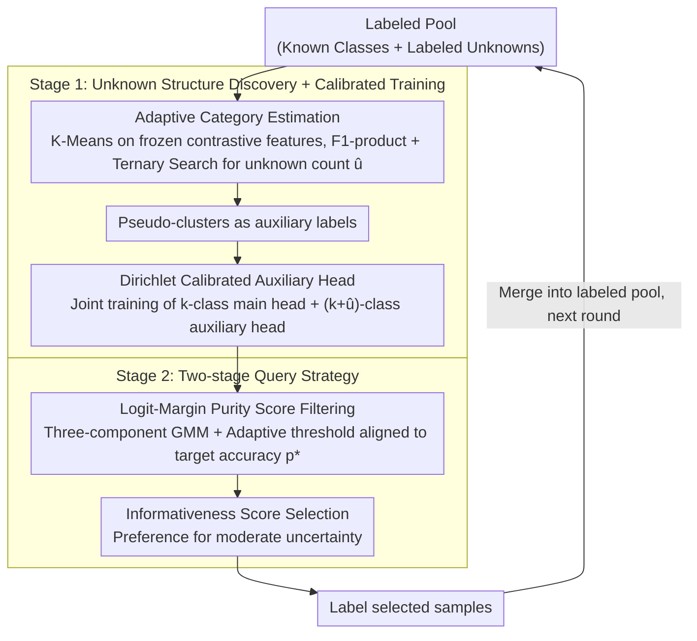

<!-- 由 src/gen_stubs.py 自动生成 -->
# Revisiting Unknowns: Towards Effective and Efficient Open-Set Active Learning

**Conference**: CVPR2026  
**arXiv**: [2603.07898](https://arxiv.org/abs/2603.07898)  
**Code**: [github.com/chenchenzong/E2OAL](https://github.com/chenchenzong/E2OAL)  
**Area**: Social Computing  
**Keywords**: open-set active learning, Dirichlet calibration, unknown class exploitation, adaptive querying, detector-free

## TL;DR

Ours proposes E2OAL, a detector-free open-set active learning framework that discovers latent structures of unknown classes via label-guided clustering, jointly models known and unknown categories using a Dirichlet-calibrated auxiliary head, and designs a two-stage adaptive querying strategy to simultaneously achieve high accuracy, high query purity, and high training efficiency across multiple benchmarks.

## Background & Motivation

1.  **Closed-set assumption of active learning is invalid**: Traditional active learning assumes all samples in the unlabeled pool belong to known categories. However, in safety-critical scenarios such as autonomous driving and medical diagnosis, unlabeled data often contains unseen categories.
2.  **Unknown samples "contaminate" queries**: Conventional AL strategies (based on uncertainty/diversity) tend to misidentify unknown samples as high-information samples and oversample them, severely degrading learning efficiency.
3.  **Existing OSAL relies on independently trained detectors**: Methods like LfOSA, MQNet, EOAL, BUAL, and EAOA require training additional OOD detection networks, introducing significant computational overhead.
4.  **Labeled unknown samples are wasted**: Existing methods ignore the supervisory value within samples labeled as "unknown," failing to feed this information back into the learning of known classes.
5.  **Latent structures exist within unknown classes**: Pilot studies indicate that utilizing the true labels of unknown classes (preserving their internal category structure) for training yields better results than simply merging them into a single "unknown" class.
6.  **Softmax overconfidence problem**: Standard softmax exhibits translation invariance, leading to misleadingly high confidence for semantically ambiguous or anomalous inputs, which is detrimental to confidence estimation under open-set conditions.

## Method

### Overall Architecture

E2OAL aims to build a detector-free open-set active learning framework that utilizes previously discarded "labeled unknown samples." It proceeds in two stages: the first stage identifies the latent structure of unknown classes in a frozen contrastive learning feature space and trains the model with Dirichlet-calibrated auxiliary supervision for more reliable confidence; the second stage performs query selection by first filtering a high-purity candidate pool of "likely known classes" using a purity score, and then selecting the most informative samples within that pool. These stages are repeated in each active learning round, with labeled samples flowing back into the labeled pool.

### Key Designs

**1. Adaptive Category Estimation: Counting unknown classes from clustering without a detector**

Merging all unknown samples into a single "unknown" class loses their internal structure, whereas pilot studies show that preserving this structure during training is more effective. However, the number of unknown classes is unknown a priori. E2OAL performs K-Means on all labeled samples using frozen CLIP features (also compatible with MoCo/SimCLR). The candidate number of unknown classes $\hat{u} \in \{k+1, \ldots, \hat{u}_{\max}\}$ is determined via ternary search to maximize a structure-aware F1-product.

The F1-product is the product of F1-scores for all categories, calculated after performing a one-to-one matching between clusters and the $k$ known classes plus one unified unknown class using the Hungarian algorithm. It naturally penalizes two extremes: underestimating $\hat{u}$ forces different known classes into the same cluster, while overestimating $\hat{u}$ fragments a single class into multiple clusters. Both cases lower the F1-scores of certain classes and thus the product, allowing the search to converge to a reasonable category count.

**2. Dirichlet Calibrated Auxiliary Head: Addressing Softmax "Translation Invariance → Overconfidence"**

Standard softmax has translation invariance, which can produce misleadingly high confidence for ambiguous or anomalous inputs—a fatal flaw in open-set scenarios. E2OAL first modifies softmax to a translation-aware version $P(y|x) = \frac{e^{o_y} + \gamma}{\sum_c (e^{o_c} + \gamma)}$, using a constant $\gamma$ to break translation invariance. It then applies Evidential Deep Learning (EDL) to model predictive probabilities as a Dirichlet distribution $\text{Dir}(\boldsymbol{\alpha})$, where $\boldsymbol{\alpha} = g(\boldsymbol{o})/\gamma + 1$.

The main and auxiliary heads divide the work: the auxiliary head covers $k + \hat{u}$ categories (known classes plus estimated unknown classes) and absorbs the supervisory value of unknown samples; the main head covers only the $k$ known classes for final classification. Thus, "labeled unknowns" are no longer wasted, and they do not contaminate the category space of the main classifier.

**3. Two-stage Query Strategy: Purity filtering followed by informativeness selection with adaptive thresholds**

Conventional uncertainty/diversity queries often oversample unknown samples as high-information instances, contaminating the query and reducing efficiency. E2OAL splits "whether to select" into two steps. First, it uses a Logit-Margin purity score to measure the separation between known and unknown evidence, filtering a high-purity candidate pool:

$$S_{\text{purity}}(x) = \max_{c \in \mathcal{C}_k} o_c - \max_{c \in \mathcal{C}_{\hat{u}}} o_c$$

Second, it selects samples within the pool using an OSAL-specific informativeness score that suppresses both highly ambiguous (near uniform) and highly certain (near one-hot) samples, favoring moderate uncertainty:

$$S_{\text{info}}(x) = \text{JS}(\mathbf{p} \| \mathbf{u}) \cdot \text{JS}(\mathbf{p} \| \mathbf{p}^{\max})$$

The purity threshold is adaptive: a three-component GMM fits the distribution of purity scores to dynamically adjust the candidate pool size, aligning it with the target query accuracy $p^*$, and calibrating via observed accuracy feedback $\hat{p}^*_{t+1} = \text{clip}(\hat{p}^*_t + (p^* - \bar{p}^*_t), 0, 1)$. By combining purity filtering, informativeness selection, and adaptive thresholds, the "mis-sampling of unknowns" is suppressed without introducing additional tunable hyperparameters.

### Loss & Training

The total loss combines main head classification with auxiliary head evidential learning:

$$\mathcal{L} = \mathcal{L}_{\text{CE}} + \mathcal{L}_{\text{EDL}} = \mathcal{L}_{\text{CE}} + (\mathcal{L}_{\text{NLL}} + \mathcal{L}_{\text{KL}})$$

- $\mathcal{L}_{\text{CE}}$: Cross-entropy loss for the main head, optimized only on known classes.
- $\mathcal{L}_{\text{NLL}}$: Negative log-likelihood for the auxiliary head, encouraging high confidence for correct labels.
- $\mathcal{L}_{\text{KL}}$: Regularization of the Dirichlet distribution for incorrect categories toward a uniform prior, suppressing erroneous evidence.

## Key Experimental Results

### Main Results

Evaluations on CIFAR-10, CIFAR-100, and Tiny-ImageNet using a ResNet-50 backbone, with 10 rounds of active learning and 1500 samples queried per round.

| Method | CIFAR-10 (30%) | CIFAR-100 (30%) | Tiny-ImageNet (15%) |
|------|:-:|:-:|:-:|
| **E2OAL (Ours)** | **Best** | **Best** | **Best** |
| Ours* (No unknown exploitation) | 95.94 | 67.54 | 60.44 |
| EAOA | 95.88 | 67.14 | 57.31 |
| BUAL | 95.04 | 63.73 | 56.09 |
| EOAL | 93.64 | 63.69 | 56.13 |

Even without exploiting labeled unknown samples (Ours*), the query strategy alone outperforms all baselines, particularly showing a gain of 3+ percentage points on Tiny-ImageNet.

### Ablation Study

| Variant | CIFAR-10 | CIFAR-100 | Tiny-ImageNet |
|------|:-:|:-:|:-:|
| **Full E2OAL** | **97.52** | **72.10** | **64.02** |
| w/o ClassExp (Unknowns merged as one class) | 97.17 | 70.73 | 62.67 |
| $S_{\text{purity}}$ only | 96.73 | 72.00 | 61.93 |
| $S_{\text{info}}$ only | 96.00 | 68.20 | 57.60 |

- Dirichlet calibration (EDL) significantly improves purity over CE: CIFAR-10 9495 vs 9394 (total known samples queried).
- Informativeness metric outperforms EAOA: CIFAR-100 65.73 vs 61.95.
- Insensitive to target accuracy $p^*$: Small performance fluctuations for $p^* \in \{0.4, 0.5, 0.6, 0.7\}$.

### Key Findings

The equivalent training time of E2OAL is comparable to lightweight baselines such as Random, MSP, Coreset, and Uncertainty, with only marginal additional costs after removing the independent detector.

## Highlights & Insights

- **Detector-free design**: Eliminates the need for training additional OOD detection networks; unknown class discovery, calibrated training, and query selection are all completed within a unified framework.
- **Turning waste to treasure**: First systematic transformation of labeled unknown samples into effective supervisory signals; pilot studies clearly demonstrate the benefits of preserving internal structures of unknown classes.
- **Principled calibration**: Dirichlet-based EDL provides theoretically sounder confidence estimation, addressing the overconfidence caused by softmax translation invariance.
- **Adaptive and parameter-free**: The two-stage query strategy dynamically adjusts the purity threshold via observational feedback, requiring no additional hyperparameter tuning.
- **Thorough evaluation**: Covers three datasets, multiple mismatch ratios, and extensive ablations, with open-source code.

## Limitations & Future Work

- Validation is limited to image classification; not yet extended to more complex vision tasks like detection or segmentation.
- Clustering relies on frozen pre-trained features (CLIP/MoCo), which may fail when the pre-training distribution differs significantly from the target domain.
- The F1-product objective may be overly sensitive to minority classes in cases of extreme class imbalance.
- The three-component GMM assumes a specific distribution structure for purity scores, which might not be robust under extreme mismatch ratios.
- Adapting to continual learning in online/incremental scenarios has not been explored.

## Related Work & Insights

| Method | Requires Detector | Utilizes Labeled Unknowns | Adaptive Purity Control | Calibration Mechanism |
|------|:-:|:-:|:-:|:-:|
| LfOSA | ✓ | ✗ | ✗ | — |
| MQNet | ✓ (meta-net) | ✗ | ✗ | — |
| EOAL | ✓ | ✗ | ✗ | — |
| BUAL | ✓ | ✗ | ✗ | — |
| EAOA | ✓ | ✗ | ✓ (Fixed step) | — |
| **E2OAL** | **✗** | **✓** | **✓ (Adaptive)** | **Dirichlet EDL** |

## Rating

- Novelty: ⭐⭐⭐⭐ — Converting labeled unknown samples from "waste" to supervision is a novel idea; the combination of Dirichlet calibration and two-stage querying is elegantly designed.
- Experimental Thoroughness: ⭐⭐⭐⭐ — Comprehensive coverage across three datasets, multiple mismatch ratios, full ablations, efficiency analysis, and sensitivity analysis.
- Writing Quality: ⭐⭐⭐⭐ — Clear structure, natural motivation through pilot studies, and coherent formulas.
- Value: ⭐⭐⭐⭐ — Provides a unified and efficient solution for open-set active learning; highly practical with open-source code.

<!-- RELATED:START -->

## Related Papers

- [\[NeurIPS 2025\] Active Slice Discovery in Large Language Models](../../NeurIPS2025/social_computing/active_slice_discovery_in_large_language_models.md)
- [\[AAAI 2026\] Bias Association Discovery Framework for Open-Ended LLM Generations](../../AAAI2026/social_computing/bias_association_discovery_framework_for_open-ended_llm_generations.md)
- [\[ACL 2026\] Building Arabic NLP from the Ground Up: Twenty Years of Lessons, Failures, and Open Problems](../../ACL2026/social_computing/building_arabic_nlp_from_the_ground_up_twenty_years_of_lessons_failures_and_open.md)
- [\[CVPR 2026\] Learning from Synthetic Data via Provenance-Based Input Gradient Guidance](learning_from_synthetic_data_via_provenance-based_input_gradient_guidance.md)
- [\[ICLR 2026\] SAGE: Spatial-visual Adaptive Graph Exploration for Efficient Visual Place Recognition](../../ICLR2026/social_computing/sage_spatial-visual_adaptive_graph_exploration_for_efficient_visual_place_recogn.md)

<!-- RELATED:END -->
