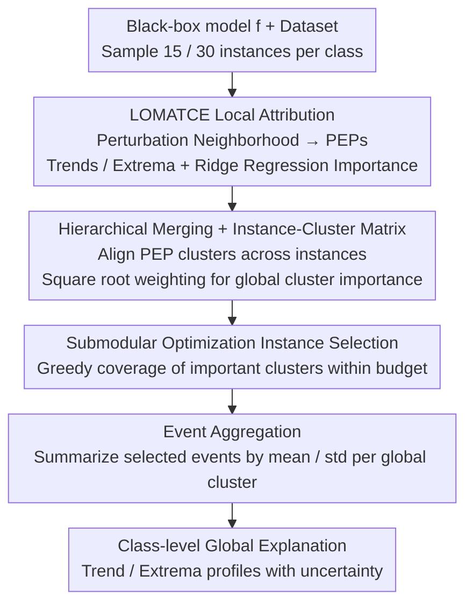

# L2GTX: From Local to Global Time Series Explanations

**Conference**: CVPR 2026  
**arXiv**: [2603.13065](https://arxiv.org/abs/2603.13065)  
**Code**: None  
**Area**: Time Series  
**Keywords**: Time Series Interpretability, Global Explanation, Parameterized Event Primitives, Model-Agnostic, Local-to-Global Aggregation

## TL;DR

L2GTX proposes a completely model-agnostic local-to-global explanation method. By extracting Parameterized Event Primitives (trends/extrema) from LOMATCE local explanations, it merges redundant clusters across instances and selects representative instances via submodular optimization. Finally, it aggregates these into concise class-level global explanations, maintaining stable global fidelity across six time-series classification datasets.

## Background & Motivation

**Background**: Deep learning has achieved high accuracy in time series classification (TSC), widely used in finance, sensor monitoring, and healthcare. However, these models are essentially black boxes, outputting predictions for input sequences without explaining the underlying decision criteria.

**Limitations of Prior Work**: Existing XAI methods face three key limitations: (i) model-agnostic methods designed for image and tabular data (e.g., LIME/SHAP) are difficult to extend directly to time series due to strong temporal dependencies and non-independent observations; (ii) research on synthesizing global explanations for time series is severely lacking, with most methods only providing local explanations (marking the importance of specific time steps or subsequences for a single prediction); (iii) the few existing global methods are usually tied to specific model architectures (e.g., depending on CAM or LRP), failing to achieve architecture-neutral interpretability.

**Key Challenge**: Local explanations only explain individual instance predictions and cannot reveal systematic decision-making behavior at the class level. Directly extracting global features from within the model is limited by specific architectures. A general method is needed that does not depend on model internal structures but can synthesize class-level global understanding from local temporal patterns.

**Goal**: (a) How to obtain high-quality local temporal explanations without accessing model internals? (b) How to merge similar temporal events across instances to reduce redundancy? (c) How to select the most representative instances under a limited budget? (d) How to aggregate local events into concise class-level global explanations?

**Key Insight**: The authors observe that LOMATCE local explanations already provide semantically rich local explanations in the form of Parameterized Event Primitives (PEP)—describing temporal behaviors such as "increasing trend," "decreasing trend," "local maximum," and "local minimum." These primitives are more human-interpretable than raw time-step importance and can be structurally compared and merged across instances.

**Core Idea**: Aggregate local events into class-level global time series explanations by merging cross-instance parameterized event primitives through hierarchical clustering and selecting representative instances that maximize coverage via submodular optimization.

## Method

### Overall Architecture

L2GTX takes a trained black-box TSC model $f$ and a dataset $\mathcal{X}$, ultimately producing a global explanation for each class—presented as a statistical summary of PEPs describing "which trends and extrema typically cause samples of this class to be classified as such." The core mechanism is to "align, de-duplicate, and aggregate" scattered per-instance local explanations into a class-level panoramic view. This process is entirely external to the model, without touching internal weights or activations.

Specifically, the method first uses LOMATCE to generate local explanations for sampled instances, obtaining each instance's own PEP clusters and importance scores. Next, semantically similar PEP clusters from different instances are merged hierarchically and aligned into shared global clusters. An instance-cluster matrix is constructed to measure the overall importance of each global cluster. Representative instances are then selected using submodular greedy optimization under a budget to avoid noise from aggregating all samples. Finally, event attributes of these instances are summarized into mean/standard deviation statistics by global cluster to form class-level explanations. For class balance, $n_{\text{inst}}=15$ instances are sampled per class for small/medium datasets, and $n_{\text{inst}}=30$ for large datasets.

### Key Designs

**1. LOMATCE Local Attribution: Upgrading "where it is important" to "what kind of temporal behavior is important"**

Per-time-step importance (like that given by LIME/SHAP) only indicates "step t is important," which lacks semantics and is hard to compare across instances. L2GTX uses LOMATCE to generate PEPs for each instance $X_i$. It constructs $S$ neighborhood samples by randomly perturbing time segments and extracts four types of parameterized events: increasing trends, decreasing trends (parameters: start_time, duration, avg_gradient), local maxima, and local minima (parameters: time, value). Each "important segment" is thus described as a human-readable trend or extremum rather than just a coordinate.

To quantify contributions, the method performs K-means clustering independently for each PEP type (with $K$ selected by silhouette coefficient), encodes neighborhood samples into an event matrix $\mathbf{Z}_i \in \mathbb{R}^{S \times K}$, and trains a weighted ridge regression surrogate to fit black-box predictions. This yields importance coefficients $\hat{\beta}_i \in \mathbb{R}^K$ for each cluster, with only the top-$n$ clusters retained. This serves as the raw material for global aggregation.

**2. Hierarchical Merging and Instance-Cluster Matrix: Aligning disparate local clusters into a shared coordinate system**

Since local PEP clusters are computed independently, an "early-stage increasing trend cluster" in instance A might not share the same label as a similar trend in instance B. L2GTX performs agglomerative hierarchical clustering on all cluster centroids of the same PEP type. Using a user-defined merging percentile $p$ to determine the cut-off distance, semantically similar local clusters are merged into global clusters $\mathcal{G}_e$. A larger $p$ results in coarser merging and fewer global clusters, providing a single knob to adjust explanation granularity.

After alignment, an instance-cluster matrix $\mathbf{M} \in \mathbb{R}^{N \times |\mathcal{G}|}$ is built, where $M_{i,j} = \sum_{C_{i,k} \in G_j} I(C_{i,k})$ aggregates the local importance of instance $i$ for global cluster $j$. The overall importance of each global cluster follows the square-root weighting strategy from SP-LIME:

$$I_j = \sqrt{\sum_{i=1}^N |M_{i,j}|}$$

This rewards events that appear repeatedly across instances while using the square root to prevent a few high-scoring instances from dominating, resulting in a robust ranking of critical temporal behaviors.

**3. Submodular Optimization for Instance Selection: Covering the most important events with few samples**

Directly averaging events from all instances introduces redundancy and noise. L2GTX models "selecting representative instances" as a weighted coverage problem: within a budget $B$, it greedily picks instances that provide the maximum weighted coverage gain for "not-yet-covered global clusters." Since the coverage function is submodular, this greedy choice approximates the optimal coverage at a low cost, ensuring representativeness while controlling the explanation size.

**4. Event Aggregation and Global Explanation Generation: Class-level profiling from aligned events**

After selecting representative instances, the method discards the intermediate local cluster structure and puts all PEP events of the selected instances into their respective global clusters to calculate mean and standard deviation for each attribute. Trends use (start_time, duration) to characterize "where and how long a key trend occurs," while extrema use (time, value) to characterize "when and at what magnitude a key peak occurs." The result is a concise, readable, class-level explanation with uncertainty.

### Loss & Training

L2GTX is a post-hoc explanation method and does not involve end-to-end training. The only optimized sub-objective is the weighted ridge regression surrogate in Step 1. The core metric for explanation quality is **Global Fidelity** (GF), defined as the average local surrogate fidelity over the selected instance set:

$$\text{GF}(\mathcal{S}) = \frac{1}{|\mathcal{S}|} \sum_{x_i \in \mathcal{S}} F(x_i)$$

where $F(x_i)$ is the $R^2$ score of the local ridge surrogate for instance $x_i$. A higher GF indicates that the local explanations of the instances selected to represent the global explanation are more trustworthy. Experiments are repeated with 3 random seeds, reporting macro-average GF and 95% confidence intervals.

## Key Experimental Results

### Main Results

On 6 UCR time series datasets using FCN and LSTM-FCN architectures:

| Dataset | Model | GF (p=25) | GF (p=50) | GF (p=75) | GF (p=95) |
|--------|------|-----------|-----------|-----------|-----------|
| ECG200 | FCN | 0.784 | 0.788 | 0.780 | 0.792 |
| GunPoint | FCN | 0.593 | 0.599 | 0.601 | 0.597 |
| Coffee | FCN | 0.683 | 0.678 | 0.678 | 0.678 |
| FordA | FCN | 0.674 | 0.672 | 0.673 | 0.672 |
| FordB | FCN | 0.675 | 0.679 | 0.673 | 0.673 |
| CBF | FCN | 0.625 | 0.626 | 0.633 | 0.625 |
| ECG200 | LSTM-FCN | 0.828 | 0.832 | 0.829 | 0.831 |
| FordB | LSTM-FCN | 0.661 | 0.656 | 0.651 | 0.655 |
| CBF | LSTM-FCN | 0.519 | 0.508 | 0.519 | 0.502 |

### Ablation Study

| Configuration | Key Metric | Description |
|------|---------|------|
| Merging percentile p=25 to 95 | GF stable, CI overlaps | Strong compression does not sacrifice fidelity |
| Increasing p | Number of global clusters monotonically decreases | More compact explanation space |
| FCN vs LSTM-FCN | High importance in same regions | Method captures architecture-agnostic decision cues |
| ECG200 Case Study | Normal vs Infarction consistent with medicine | Infarction signals dominated by few significant deflections |
| Coffee Case Study | Robusta high peak vs Arabica low peak | Consistent with coffee spectroscopy literature |

### Key Findings

- **Cluster merging does not lose fidelity**: GF remains stable and confidence intervals overlap as $p$ increases from 25 to 95.
- **Cross-architecture consistency**: FCN and LSTM-FCN produce structurally consistent explanations, sharing decision-making temporal cues.
- **Alignment with domain knowledge**: Infarction class in ECG200 is dominated by significant deflections; Robusta in Coffee is dominated by high-intensity maxima.
- **Lower GF for LSTM-FCN on CBF** (approx. 0.5): This may reflect the approximation limits of the local linear surrogate.

## Highlights & Insights

- **First fully model-agnostic local-to-global explanation method for time series**. Does not rely on model internal structures, applicable to any black-box TSC classifier.
- **Parameterized Event Primitives provide semantic explanations**. Using trends and extrema to describe temporal patterns is more meaningful than "step t is important" and naturally supports cross-instance alignment.
- **Greedy submodular optimization balances coverage and budget**. Maximizes coverage of the most important global clusters with a minimal number of instances.
- **Adjustable granularity via merging percentile**. Users can control explanation compactness through parameter $p$ while maintaining stable fidelity.

## Limitations & Future Work

- **Computational overhead**: LOMATCE event clustering is a bottleneck, especially for long time series.
- **Univariate time series only**: Multi-variable scenarios would require handling cross-channel interactions.
- **Lack of human-centric evaluation**: No subjective assessment by domain experts.
- **Relatively low GF on some datasets**: e.g., CBF (~0.5), GunPoint (~0.6), limited by the local linear surrogate.
- **Lack of quantitative comparison with other global explanation methods**.

## Related Work & Insights

- **vs SP-LIME**: Selects representative instances but does not aggregate. L2GTX adds cross-instance merging and global statistical aggregation.
- **vs GLocalX**: Local-to-global aggregation for tabular data. L2GTX adapts to the parameterized event structure of time series.
- **vs LOMATCE**: The foundations for L2GTX's local explanations. The contribution lies in the systematic local-to-global path.
- **vs CAM/LRP series**: Dependent on internal model representations and architecture-specific. L2GTX is more general but relies on indirect inference.

## Rating

- **Novelty**: ⭐⭐⭐⭐ A new attempt for local-to-global aggregation in Time Series XAI, though individual components lack methodological breakthroughs.
- **Experimental Thoroughness**: ⭐⭐⭐⭐ 6 datasets + 2 models + multiple percentiles, but lacks quantitative comparisons with other global methods.
- **Writing Quality**: ⭐⭐⭐⭐⭐ Clear structure, complete formulas, and persuasive case studies.
- **Value**: ⭐⭐⭐⭐ Fills a gap in global interpretability for time series, though discussion on application scenarios could be deeper.

<!-- RELATED:START -->

## Related Papers

- [\[CVPR 2026\] STCast: Adaptive Boundary Alignment for Global and Regional Weather Forecasting](stcast_adaptive_boundary_alignment_for_global_and_regional_weather_forecasting.md)
- [\[CVPR 2026\] Towards Uncertainty-aware Unsupervised Domain Adaptation for Videos and Time-Series with Causal Optimal Transport](towards_uncertainty-aware_unsupervised_domain_adaptation_for_videos_and_time-ser.md)
- [\[CVPR 2026\] Real-Time Long Horizon Air Quality Forecasting via Group-Relative Policy Optimization](real-time_long_horizon_air_quality_forecasting_via_group-relative_policy_optimiz.md)
- [\[CVPR 2026\] SATTC: Structure-Aware Label-Free Test-Time Calibration for Cross-Subject EEG-to-Image Retrieval](sattc_structure-aware_label-free_test-time_calibration_for_cross-subject_eeg-to-.md)
- [\[CVPR 2026\] PFGNet: A Fully Convolutional Frequency-Guided Peripheral Gating Network for Efficient Spatiotemporal Predictive Learning](pfgnet_a_fully_convolutional_frequency-guided_peripheral_gating_network_for_effi.md)

<!-- RELATED:END -->
