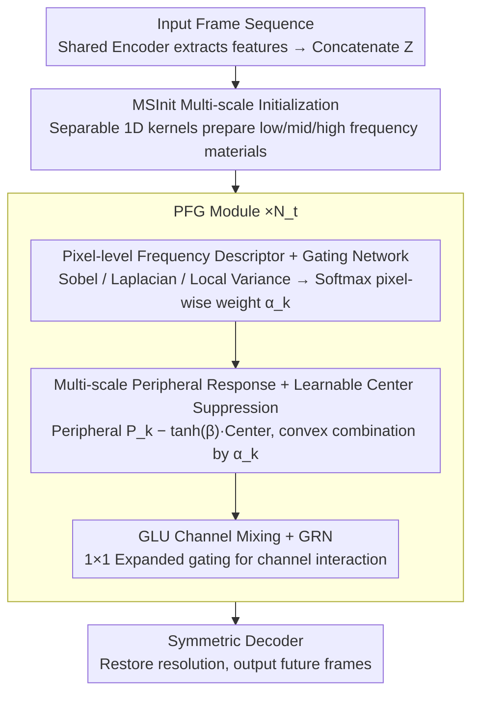

# PFGNet: A Fully Convolutional Frequency-Guided Peripheral Gating Network for Efficient Spatiotemporal Predictive Learning

**Conference**: CVPR 2026  
**arXiv**: [2602.20537](https://arxiv.org/abs/2602.20537)  
**Code**: [fhjdqaq/PFGNet](https://github.com/fhjdqaq/PFGNet)  
**Area**: Time Series  
**Keywords**: Spatiotemporal predictive learning, Large kernel convolution, Frequency-guided gating, center-surround suppression, Pure convolutional architecture  

## TL;DR

PFGNet is a pure convolutional spatiotemporal prediction framework that dynamically modulates multi-scale large-kernel peripheral responses via Pixel-level Frequency-guided Gating (PFG) and applies learnable center suppression. Mimicking the center-surround band-pass filtering mechanism of biological vision, it achieves SOTA or near-SOTA performance on Moving MNIST, TaxiBJ, KTH, and Human3.6M benchmarks with minimal parameters and computational cost.

## Background & Motivation

**Spatiotemporal Predictive Learning (STPL)** aims to predict future frames from historical sequences, widely applied in weather nowcasting, autonomous driving, traffic flow prediction, and human motion forecasting.

**Recurrent models** (ConvLSTM, PredRNN series, SwinLSTM, VMRNN) possess strong temporal modeling capabilities, but their autoregressive inference leads to poor parallelism and high latency.

**Pure convolutional models** (SimVP, TAU, STLight) offer full parallelism and scalability, but fixed uniform receptive fields (RF) cannot adapt to spatially varying motion patterns.

**Large kernel convolutional networks** (RepLKNet, SLaK, UniRepLKNet) demonstrate that sufficiently large RFs allow CNNs to approximate global context, yet they still employ uniform kernels, ignoring the need for pixel-level variation in RF size.

**Biological inspiration**: The center-surround antagonistic RFs in the retina and primary visual cortex are essentially spatial band-pass filters that selectively enhance mid-frequencies (edges, textures) while suppressing low-frequencies (uniform regions) and high-frequencies (noise).

**Key Challenge**: Existing works lack pixel-level frequency guidance and explicit center suppression. Channel-level or band-level gating cannot adapt to local textures; uniform large kernels waste computation in uniform regions. No prior work has unified biological center-surround mechanisms, frequency-domain filtering, and adaptive large-kernel fusion within a pure convolutional STPL framework.

## Method

### Overall Architecture

PFGNet addresses specific limitations: while pure convolutional predictors are parallel and fast, their uniform RFs fail to adapt to non-uniform spatial motion. Dense textures require large RFs for long-range context, while flat backgrounds waste computation and amplify redundant low-frequency signals using large kernels. PFGNet adopts the "Encoder-Translator-Decoder" backbone of SimVP, placing all innovation within the Translator. Specifically, input frames are processed by a shared spatial encoder $\mathbf{F}_t = \text{Enc}(\mathbf{I}_t)$ and concatenated along the time dimension to form $\mathbf{Z} \in \mathbb{R}^{C' \times H' \times W'}$ ($C' = T_{\text{in}} \cdot C$). The Translator first uses **MSInit** to provide a multi-scale foundation covering low/mid/high frequencies, followed by $N_t$ **PFG modules** for frequency-guided adaptive spatiotemporal modeling. Finally, a symmetric decoder restores resolution to output the future sequence. The core innovation lies in the PFG module's ability to "select the receptive field based on the frequency characteristics of each pixel."

### Key Designs

**1. Multi-scale Initialization (MSInit): Preparing multi-scale materials at minimal cost**

The PFG module selects among responses at different scales. If only single-scale features are provided, the gating mechanism face a dilemma: either lack sufficient context or trigger full-scale computation every time. MSInit is designed to cheaply prepare low, mid, and high-frequency responses before the PFG module. It approximates $k_m \times k_m$ convolutions using pairs of separable 1D kernels ($1 \times k_m$ followed by $k_m \times 1$) for each scale $m$, with an auxiliary $3 \times 3$ depthwise convolution to enhance mid-frequency sensitivity and an identity connection to preserve gradient flow. Branches for $k_m \in \{3, 5, 7\}$ are projected via $1 \times 1$ convolutions and concatenated. This ensures the subsequent gating receives pre-segmented frequency materials with negligible overhead.

**2. Pixel-level Frequency Descriptor and Gating Network: Letting each pixel "request its own RF size"**

Texture-rich regions require wide RFs for long-range information, while uniform regions should suppress redundant low-frequency responses. This requirement varies per pixel, making channel-level or band-level gating too coarse. PFG calculates a 3D frequency descriptor for each pixel: fixed depthwise convolutions extract Sobel gradient magnitude $\mathbf{f}_1$ (edge intensity), Laplacian absolute value $\mathbf{f}_2$ (curvature), and $3 \times 3$ local variance $\mathbf{f}_3$ (texture complexity). Channel means are concatenated into $\mathbf{F} \in \mathbb{R}^{3 \times H' \times W'}$, providing a stable frequency-aware signal. The gating network uses a $1 \times 1$ convolution to map this into per-pixel, per-scale logits, followed by softmax to obtain normalized weights $\alpha_k(h,w)$. This forces a differentiable, per-pixel soft selection (convex combination) among $K$ scales.

**3. Multi-scale Peripheral Response with Learnable Center Suppression: Large kernels as motion-amplifying band-pass filters**

This is where the biological center-surround concept is implemented. For each scale $k \in \mathcal{K} = \{9, 15, 31\}$, the peripheral response is calculated via separable 1D convolutions $\mathbf{P}_k = \mathbf{v}_k * (\mathbf{h}_k * \mathbf{X})$, reducing complexity from $\mathcal{O}(k^2)$ to $\mathcal{O}(2k)$. A $3 \times 3$ depthwise convolution captures the center response $\mathbf{C} * \mathbf{X}$, and the modulated center is subtracted from the periphery:

$$\mathbf{Y}_k = \mathbf{P}_k - \tanh(\boldsymbol{\beta}_k) \odot (\mathbf{C} * \mathbf{X})$$

where $\boldsymbol{\beta}_k \in \mathbb{R}^{C'}$ is a per-channel learnable parameter. The "large kernel minus small kernel" structure serves as a circular band-pass filter (similar to Difference of Gaussians - DoG), amplifying mid-frequency motion components while suppressing DC low-frequency backgrounds and high-frequency noise. Using $\tanh$ instead of sigmoid allows for bi-directional modulation of feature maps containing both positive and negative values. Finally, responses are fused:

$$\text{PFG}(\mathbf{X}) = \sum_{k \in \mathcal{K}} \boldsymbol{\alpha}_k \odot \mathbf{Y}_k$$

A pixel on a sharp edge will favor large kernels for long-range context, while a pixel in a flat background will favor smaller kernels and be further pruned by center suppression.

**4. GLU Channel Mixing and GRN Normalization: Complementary channel interaction**

After spatial adaptation via PFG, channel-wise feature reorganization is performed. A $1 \times 1$ convolution expands channels from $C'$ to $2E$ ($E = 4C'$), split into $\mathbf{U}$ and $\mathbf{V}$. A GLU-style gating $\sigma(\mathbf{U}) \odot \text{DW}_{3\times3}(\mathbf{V})$ is applied before projecting back to $C'$, stabilized by Global Response Normalization (GRN) and LayerScale. GLU provides lightweight channel selection that complements the spatial adaptation of PFG.

### Loss & Training

Following the OpenSTL evaluation framework, the training target is the standard MSE loss. Specifically, the Adam optimizer is used with varying learning rates (Moving MNIST 1e-3, TaxiBJ 2e-3, KTH 2e-4/1e-4, Human3.6M 1.5e-3). DropPath regularization (0.1) is applied for TaxiBJ, KTH, and Human3.6M. Speed efficiency stems from decomposing all large kernels into separable 1D convolutions; for $k=31$, parameters and MACs are reduced by 15x compared to standard 2D convolutions.

## Key Experimental Results

### TaxiBJ Dataset

| Method | Type | Params | FLOPs | MSE ↓ | MAE ↓ | SSIM ↑ |
|------|------|--------|-------|-------|-------|--------|
| VMRNN | Recurrent | 2.6M | 0.9G | 0.2887 | 14.69 | 0.9858 |
| SwinLSTM | Recurrent | 2.9M | 1.3G | 0.3026 | 15.00 | 0.9843 |
| SimVP | Non-recurrent | 13.8M | 3.6G | 0.3282 | 15.45 | 0.9835 |
| TAU | Non-recurrent | 9.6M | 2.5G | 0.3108 | 14.93 | 0.9848 |
| **PFGNet** | **Ours** | **1.9M** | **0.6G** | **0.2881** | **14.75** | **0.9857** |

PFGNet outperforms both recurrent and non-recurrent baselines with only **1.9M parameters and 0.6G FLOPs**, using roughly 1/7 the parameters of SimVP and 1/5 of TAU.

### Moving MNIST + Human3.6M

| Method | Moving MNIST MSE ↓ | Moving MNIST SSIM ↑ | H3.6M Params | H3.6M FLOPs | H3.6M MAE ↓ | H3.6M SSIM ↑ |
|------|---------------------|---------------------|--------------|-------------|-------------|--------------|
| SimVP | 23.8 | 0.948 | 41.2M | 197.0G | 1511.5 | 0.9822 |
| TAU | 19.8 | 0.957 | 37.6M | 182.0G | 1390.7 | 0.9839 |
| VMRNN | 16.5 | 0.965 | — | — | — | — |
| **PFGNet** | **15.2** | **0.967** | **7.3M** | **58.3G** | **1392.4** | **0.9838** |

On Moving MNIST, PFGNet achieves the best MSE of 15.2. On Human3.6M, it reaches near-SOTA performance with only 7.3M parameters (1/5 of TAU).

### Ablation Study

| Ablation Item | TaxiBJ MSE ↓ | Key Insight |
|--------|--------------|------|
| W/o MSInit | 0.3119 | Multi-scale initialization is critical for gating effectiveness |
| Mean fusion instead of softmax | 0.3033 | Pixel-level adaptive weighting is superior to fixed weighting |
| Fixed β=0 (No suppression) | 0.2993 | Center suppression further reduces error |
| Fixed β=±1 | 0.3209/0.3286 | Learnable β is significantly better than fixed values |
| Sigmoid instead of tanh | 0.3142 | tanh's dual-directional modulation fits feature maps better |
| **Complete PFGNet** | **0.2881** | Optimal synergy of all components |

## Highlights & Insights

1.  **Bio-Mathematical Unity**: Formulates large-kernel center suppression as a learnable circular band-pass filter (DoG approximation), providing a frequency-domain theoretical basis for CNN RF design beyond simple bio-inspiration.
2.  **Extreme Efficiency**: All large kernels (up to 31×31) are decomposed into 1D convolutions, reducing parameters and MACs by 15x at $k=31$.
3.  **Complementary Frequency Cues**: Gradient magnitude, Laplacian, and local variance capture edge intensity, curvature, and texture complexity respectively; ablation confirms all are necessary.
4.  **Pure Convolution without Attention**: No attention mechanisms or recurrent structures are used, allowing full parallelism for real-time deployment.
5.  **Best SSIM on KTH**: While PSNR is slightly lower than SwinLSTM, the highest SSIM indicates better structural preservation (limb outlines, joint trajectories).

## Limitations & Future Work

1.  **Fixed Frequency Cues**: Sobel, Laplacian, and local variance are hand-crafted operators; learnable frequency feature extraction could be explored.
2.  **Limited Benchmarks**: Lacks validation on more complex real-world scenarios like WeatherBench or nuScenes.
3.  **Fixed Center Kernel Size**: Only compared 3×3 and 5×5; dynamic center kernel sizes were not explored.
4.  **Long-term Prediction**: Performance on very long sequences (100+ frames) beyond the 40 frames in KTH remains unverified.
5.  **Comparison with SSMs**: Lacks direct comparison with the latest State Space Models for STPL beyond the Mamba components in VMRNN.
6.  **Interpretability**: While argmax visualizations are provided, deeper quantitative analysis of gating behavior across different scenes is needed.

## Related Work & Insights

- **SimVP** [Gao et al., 2022]: The base pipeline for PFGNet, proving strong spatial backbones can implicitly model temporal evolution.
- **UniRepLKNet** [Ding et al., 2024]: The "see wide without going deep" philosophy, verifying large kernels approximate global attention with linear complexity.
- **PeLK** [Chen et al., 2024]: Demonstrates peripheral convolutions can extend kernels to 100+, but lacks frequency guidance.
- **Octave Convolution** [Chen et al., 2019]: Processes features by frequency groups but requires explicit frequency domain transforms.
- **DoG Model**: Classic center-surround model; PFGNet generalizes it to per-channel learnable and per-pixel adaptive selection.

## Rating

- **Novelty**: ⭐⭐⭐⭐ — Combining bio-inspired center-surround mechanisms with band-pass filtering theory is novel; pixel-level frequency gating is a first in STPL.
- **Experimental Thoroughness**: ⭐⭐⭐⭐ — Comprehensive benchmarks, detailed ablations, and efficiency comparisons using the OpenSTL framework.
- **Writing Quality**: ⭐⭐⭐⭐⭐ — Smooth narrative from biological motivation to mathematical formulation and experimentation.
- **Value**: ⭐⭐⭐⭐ — High practicality due to pure convolution and extreme efficiency; the PFG module is a potential plug-and-play component.

<!-- RELATED:START -->

## Related Papers

- [\[NeurIPS 2025\] Simple and Efficient Heterogeneous Temporal Graph Neural Network](../../NeurIPS2025/time_series/simple_and_efficient_heterogeneous_temporal_graph_neural_network.md)
- [\[ICLR 2026\] Improving Extreme Wind Prediction with Frequency-Informed Learning](../../ICLR2026/time_series/improving_extreme_wind_prediction_with_frequency-informed_learning.md)
- [\[ICML 2025\] TQNet: Temporal Query Network for Efficient Multivariate Time Series Forecasting](../../ICML2025/time_series/temporal_query_network_for_efficient_multivariate_time_series_forecasting.md)
- [\[ICLR 2026\] Towards Generalizable PDE Dynamics Forecasting via Physics-Guided Invariant Learning](../../ICLR2026/time_series/towards_generalizable_pde_dynamics_forecasting_via_physics-guided_invariant_lear.md)
- [\[ICML 2026\] Spatiotemporal Imputation with Graph-Informed Flow Matching](../../ICML2026/time_series/spatiotemporal_imputation_with_graph-informed_flow_matching.md)

<!-- RELATED:END -->
