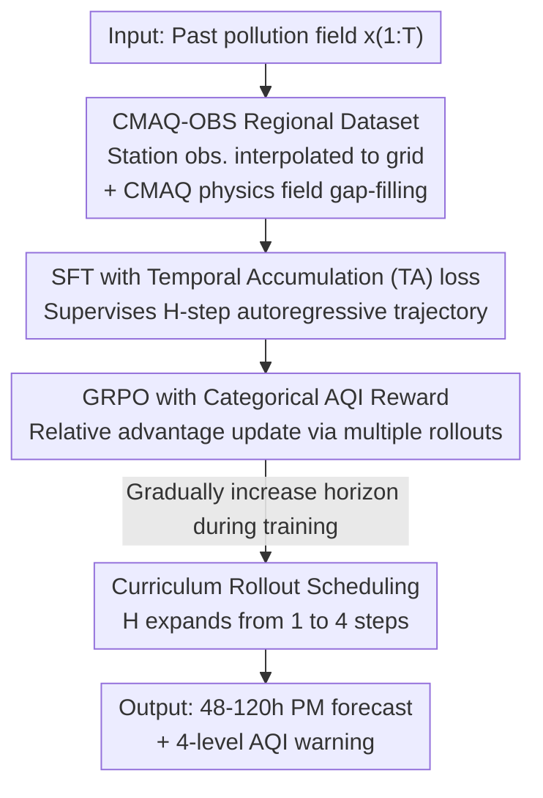

# Real-Time Long Horizon Air Quality Forecasting via Group-Relative Policy Optimization

**Conference**: CVPR 2026  
**Paper**: [CVF Open Access](https://openaccess.thecvf.com/content/CVPR2026/html/Kang_Real-Time_Long_Horizon_Air_Quality_Forecasting_via_Group-Relative_Policy_Optimization_CVPR_2026_paper.html)  
**Code**: https://github.com/kaist-cvml/FAKER-Air  
**Area**: Time-series Forecasting / Reinforcement Learning Alignment  
**Keywords**: Air Quality Forecasting, GRPO, Long-horizon Spatiotemporal Prediction, Categorical Reward, Curriculum Rollout

## TL;DR
This paper addresses long-horizon (48–120 hours) PM concentration forecasting in East Asia. It first releases CMAQ–OBS, a regional dataset aligned with observations, and then employs a two-stage training framework (FAKER-Air) consisting of "SFT with temporal accumulation loss + GRPO with categorical AQI rewards." This aligns the inherent "over-forecasting and high false alarm" issues of MSE training with actual operational costs, reducing the False Alarm Rate (FAR) by 47.3% relative to the SFT baseline while maintaining a competitive F1 score.

## Background & Motivation
**Background**: Current mainstream data-driven weather/air quality forecasting relies on foundation models like Aurora, GraphCast, and Pangu-Weather, which learn global atmospheric dynamics from global reanalysis data such as ERA5 and CAMS. Among these, Aurora is the only open-source model that explicitly includes PM prediction, making it the primary baseline for this study.

**Limitations of Prior Work**: Global models struggle in East Asia. First, **regional accuracy is low**—CAMS exhibits an average bias of up to 52.66 µg/m³ relative to ground observations in China and South Korea. Second, there is a **lack of real-time capability**—global reanalysis data has an update delay of several days, preventing timely warnings. The root cause is data imbalance: East Asia accounts for less than 15% of the global training coverage but contributes over 60% of heavy pollution exposure; thus, global models inevitably underfit local dynamics.

**Key Challenge**: Even when migrating models to local data for supervised training, long-horizon prediction faces two deep contradictions. First, long-horizon forecasting requires continuous 6-hour autoregressive rollouts, but teacher forcing training only provides ground truth. The model never encounters its own predictions, leading to train-test mismatch (exposure bias) where early small errors accumulate and amplify over time. Second, Mean Squared Error (MSE) is **cost-symmetric**, whereas air quality decision-making is **asymmetric**—the cost of missing a heavy pollution event (Bad/VeryBad) is far higher than a false alarm during clean weather (Good/Moderate); MSE tends to over-predict in uncertain intervals, resulting in SFT models having high over-prediction and false alarm rates.

**Goal**: Achieve stable long-horizon PM forecasting in East Asia with classification results reliable enough to directly drive real-time early warning systems.

**Key Insight**: The authors shift the perspective from "point-wise regression" to "decision alignment." Prediction quality should not be judged solely by MSE but by its operational reliability in AQI-tiered warnings. Since the goal is to align with a verifiable, asymmetric cost, Reinforcement Learning (RL) via policy optimization is introduced.

**Core Idea**: First, build a foundation for long-term consistency using SFT with "temporal accumulation loss." Then, use "GRPO with categorical AQI rewards + curriculum rollouts" to align the policy with operational priorities. This is the first instance of introducing policy optimization into spatiotemporal forecasting.

## Method

### Overall Architecture
FAKER-Air (Forecast Alignment via Knowledge-guided Expected-Reward) is a **two-stage training framework** built on an Aurora-style 3D encoder-decoder backbone, preceded by a data layer. The input is the gridded pollution field $x_{1:T}$ of previous steps, and the output is the PM concentration field for the next 48–120 hours at 6-hour intervals, which finally maps to 4-level AQI warnings.

The pipeline consists of three parts: ① **Data Layer**—Constructs and aligns the CMAQ–OBS regional dataset by interpolating sparse station observations onto a 27 km grid and filling spatial gaps with physics-driven CMAQ, ensuring regional accuracy and supporting hourly real-time initialization; ② **Stage 1 (SFT)**—Supervised fine-tuning on this dataset, using "temporal accumulation loss" to supervise the $H$-step autoregressive trajectory instead of a single step to suppress exposure bias; ③ **Stage 2 (GRPO)**—Starting from the SFT policy, multiple rollouts are sampled for the same state. These are converted into intra-group relative advantages using categorical AQI rewards to update the policy, with curriculum rollouts gradually extending the prediction horizon from short to long.

### Key Designs

**1. CMAQ–OBS Regional Dataset: Filling Gaps in Sparse Observations with Physics Fields for Real-time Capability**

To solve the dual pain points of global models (low regional accuracy and lack of real-time capability), the authors constructed a regional dataset for East Asia covering 2016–2023 (8+ years). It combines two complementary signals: sparse but accurate **Station Observations (OBS)**—6-hourly PM2.5/PM10/O3 measurements from 532 stations in South Korea and 1,290–1,781 stations in China; and dense but bias-prone **CMAQ Physical Reanalysis**—a 27 km resolution grid field customized for East Asian meteorology and emissions. Point observations are spatially interpolated into the CMAQ grid, serving as both input features and ground truth.

The value of this combination lies in reducing the average error of CMAQ relative to ground truth to 21.33 µg/m³, a **59.5%** improvement over CAMS (52.66). More importantly, it can be initialized from local observations within an hour, bypassing the multi-day delay of global reanalysis to meet real-time warning constraints. The multi-variable spatial continuity of CMAQ provides physically consistent priors, mitigating distribution shift during autoregressive rollouts.

**2. Temporal Accumulation Loss (TA loss): Suppressing Error Accumulation via Multi-step Autoregressive Supervision**

To address exposure bias caused by teacher forcing, Stage 1 no longer supervises only a single step. Standard SFT minimizes the next-step MSE: $L_{\text{SFT}} = \mathbb{E}_{x,y}\big[\lVert f_\theta(x_{1:T}) - y_{T+1}\rVert_2^2\big]$, which treats each lead time independently, meaning the model never encounters its own rollout errors during training. TA loss instead supervises an $H$-step autoregressive trajectory, where the prediction at step $i$ is explicitly conditioned on the model's own previous outputs:

$$\hat{y}_{T+i} = f_\theta\big(x_{1:T},\, \hat{y}_{T+1:T+i-1}\big), \quad i = 1,\dots,H.$$

The loss at each step $\ell_i(\theta)$ is a weighted MSE across variable groups, with step weights $w_i = b + (1-b)\frac{i-1}{H-1}$ ($b\in(0,1]$) linearly increasing to emphasize distant horizons. These are normalized and aggregated: $L_{\text{TA}}(\theta) = \sum_{i=1}^{H} \tilde{w}_i\,\ell_i(\theta),\ \tilde{w}_i = w_i / \sum_j w_j$. By exposing the model to multi-step error accumulation during training, the distribution shift between teacher-forced training and autoregressive inference is reduced, stabilizing long-term consistency.

**3. GRPO with Categorical AQI Reward: Replacing Cost-Symmetric MSE with Decision-Aligned Asymmetric Costs**

While TA loss improves stability, it still optimizes for cost-symmetric squared error, which is mismatched with operational costs (where missing a heavy pollution event is worse than a false alarm). Stage 2 reformulates prediction as a policy optimization problem: the model $f_\theta$ defines a stochastic policy $\pi_\theta(a_t\mid s_t)$, where state $s_t$ encodes spatiotemporal inputs, action $a_t$ is the predicted concentration field for $t{+}1$, and the goal is to maximize the expected task reward $J(\theta)=\mathbb{E}_{\pi_\theta}\big[\sum_t r(s_t,a_t)\big]$.

The reward follows an RLVR-style verifiable binary categorical reward: given $\hat{c}_t=\text{AQI}(a_t)$ and $c_t=\text{AQI}(y_t)$, then $R(a_t,y_t)=1$ if $\hat{c}_t=c_t$, and 0 otherwise. The key to GRPO is that it does not use absolute rewards; instead, it samples $G$ trajectories for the same state (using $a=\mu+\sigma\epsilon, \epsilon\sim\mathcal{N}(0,I)$ with antithetic sampling to reduce variance) and normalizes the rewards $r_t^{(g)}$ via softmax into relative advantages:

$$A_g = \frac{\exp(r_t^{(g)}/\tau)}{\sum_{j=1}^{G}\exp(r_t^{(j)}/\tau)}.$$

The policy is then updated using this advantage-weighted log-likelihood: $L_{\text{GRPO}} = -\,\mathbb{E}_{(a_t^{(g)},r_t^{(g)})\in \mathcal{G}_t}\big[A_g \log \pi_\theta(a_t^{(g)}\mid s_t)\big]$. This "intra-group ranking" design requires neither a critic nor a separate reward model. It shifts probability towards trajectories that perform better within the group while penalizing unreliable ones—aligned with categorical AQI rewards, this naturally guides the policy toward operational priorities: "fewer false alarms in clean weather, guaranteed recall for heavy pollution." ⚠️ Note: The main text uses a binary 0/1 reward (Eq. 7), while the introduction describes heavier penalties for Good/Moderate false alarms and Bad/VeryBad missed alarms; follow the original text for exact implementation.

**4. Curriculum Rollout Scheduling (CR): Gradual Expansion from Short to Long Horizons to Stabilize Policy Learning**

Directly performing GRPO on long horizons leads to high reward estimation variance and weak credit assignment; furthermore, later states depend on the model's own predictions, where early errors can push the state distribution off the manifold. CR gradually increases the rollout horizon $H$ with training epochs: $H_e = \min\big(H_{\max},\ \lfloor H_{\min}+\kappa e\rfloor\big)$, starting at 1 step and expanding to 4. $\kappa$ controls the expansion rate. This allows the model to master short-term dynamics before tackling uncertain long-term horizons, significantly reducing gradient noise. Since GRPO updates via the policy gradient of the entire trajectory (rather than stepwise SFT snapshots), it implicitly encourages temporal consistency, allowing the model to capture long-range dependencies in aerosol transport and accumulation.

### Loss & Training
Two-stage training is conducted on East Asian data: Stage 1 utilizes an Aurora-style 3D encoder-decoder, batch size 8, 30 epochs, one-cycle LR, and a 4-step autoregressive rollout loss. Stage 2 (GRPO) uses batch size 1, 4 epochs, with 4 trajectories per input via paired (shared noise) sampling, optimizing categorical rewards based on discrete AQI thresholds. Data is partitioned into 2016–2021 for training, 2022 for validation, and 2023 for testing. Training is performed using distributed data parallel across 2 H200 GPUs with random seed 42.

## Key Experimental Results

### Main Results
Comparison of various GRPO configurations for long-horizon prediction (PM2.5, 120h, binary + 4-level AQI metrics). Higher Acc/F1/Prec and lower FAR are better; Bias≈1 is optimal.

| Model | Reward | CR | Acc | F1 | FAR↓ | Bias | F1-macro | F1-micro |
| :--- | :--- | :--- | :--- | :--- | :--- | :--- | :--- | :--- |
| Aurora (baseline) | – | – | 68.93 | 16.06 | 2.24 | 0.13 | 23.43 | 34.03 |
| FAKER-Air SFT | – | – | 69.62 | 59.90 | 32.86 | 1.52 | 41.59 | 44.03 |
| FAKER-Air GRPO | MSE | ✘ | 74.50 | 48.44 | 10.54 | 0.64 | 37.57 | 43.73 |
| FAKER-Air GRPO | AQI | ✘ | 71.40 | 56.28 | 24.19 | 1.17 | 40.75 | 42.26 |
| **FAKER-Air GRPO** | **AQI** | **✔** | **74.51** | **56.72** | **17.32** | **0.96** | **41.90** | **45.16** |

The full model reduces FAR from 32.86 (SFT baseline) to 17.32 (relative **−47.3%**). F1 slightly decreases from 59.90 to 56.72 (still competitive), while Bias improves from 1.52 (significant over-forecasting) to 0.96 (close to 1, well-calibrated). Both F1-micro and F1-macro show improvements. Compared to Aurora, F1 is improved by approximately **3.5×** (16.06→56.72).

### Ablation Study
Contribution of each component to long-horizon F1 in the SFT stage (PM2.5, overall F1).

| OBS | CMAQ | TA(T=2) | TA(T=4) | Overall F1 | Description |
| :--- | :--- | :--- | :--- | :--- | :--- |
| – | – | – | – | 16.06 | Aurora baseline |
| ✔ | ✘ | ✘ | ✘ | 50.74 | Local OBS only: massive leap over Aurora |
| ✔ | ✔ | ✘ | ✘ | 54.40 | Add CMAQ physics: more stable long-term |
| ✔ | ✔ | ✔ | ✘ | 57.65 | Add TA(T=2) |
| ✔ | ✔ | ✘ | ✔ | **59.90** | TA(T=4): largest gain in distant horizons |

### Key Findings
- **Data layer provides the strongest contribution**: Merely switching training data from global to local OBS resulted in PM2.5 F1 jumping from 16.06 to 50.74 and PM10 from 4.73 to 41.63. This confirms that "regional data imbalance" is the primary reason global models fail in East Asia. CMAQ physics fields further stabilize autoregression at long lead times.
- **TA loss yields higher gains at longer horizons**: Compared to no rollout loss, TA(T=4) shows more significant improvements at later lead times (+48h onwards, ~+8.5 to +10.5 for PM2.5), aligning with its design goal of suppressing error accumulation.
- **GRPO is a specialized "false alarm reducer" but at a cost to F1**: GRPO with pure MSE reward suppresses FAR to 10.54 but slashes F1 to 48.44 (sacrificing recall). Switching to categorical AQI rewards + CR achieves a balance between FAR (17.32) and F1 (56.72), with a Bias closest to 1, indicating that categorical rewards and curriculum scheduling jointly correct the "over-forecasting" bias.

## Highlights & Insights
- **First application of policy optimization to spatiotemporal forecasting**: Reformulating "prediction concentration fields" as "policy actions" and using verifiable AQI classification rewards instead of continuous value estimation bypasses reward models and critics. This provides a reusable path for migrating RLVR/GRPO from LLMs to Earth science forecasting.
- **Addressing the "Metric ≠ Decision" contradiction**: The "aha!" moment is the realization that the cost-symmetry of MSE fundamentally conflicts with the cost-asymmetry of air quality warnings. High prediction accuracy can still result in high false alarm rates. Encoding asymmetric costs via rewards is a strategy transferable to any warning task where missed/false alarm costs are vastly different (floods, earthquakes, medical screening).
- **Curriculum Rollout as a practical trick for stable long-horizon RL**: Gradually releasing the prediction horizon from short to long to reduce gradient variance is a valuable lesson for any setting involving autoregressive generation + RL fine-tuning (including long-form text or video).

## Limitations & Future Work
- **The F1 vs. FAR trade-off is not entirely broken**: While FAR is reduced, F1 still drops by about 3 points relative to SFT. GRPO acts more like a "correction for over-prediction bias" rather than a pure performance booster; actual deployment requires weighting based on warning tolerance.
- **Inconsistent reward design description**: The main text uses a binary 0/1 reward, while the introduction describes weighted penalties by AQI category. These intensity structures differ, so source code should be consulted for replication (⚠️ follow original text).
- **Region and time period constraints**: Data only covers China/South Korea (2016–2023) and relies on customized CMAQ reanalysis. The replicability of the data layer's advantage in regions lacking high-quality regional reanalysis is uncertain.
- **GRPO training cost**: With a batch size of 1 and 4 rollouts per input, sampling costs for long-horizon tasks are significant. Scalability to longer horizons or higher resolutions remains to be verified.

## Related Work & Insights
- **vs. Aurora / GraphCast / Pangu-Weather**: These focus on global scales using ERA5/CAMS. Ours focuses on regional scales + real-time using CMAQ–OBS. Aurora was chosen as the baseline as it is the only open-source model with PM parameters; Ours achieves ~3.5× its F1.
- **vs. Pure SFT / Teacher Forcing**: SFT uses stepwise MSE. Ours uses TA loss to supervise multi-step trajectories to suppress exposure bias, then layers GRPO to align with decision costs, upgrading "prediction accuracy" to "warning reliability."
- **vs. RLHF / PPO / DPO**: RLHF/PPO require online RL and are unstable; DPO removes reward models but remains a preference classifier. This paper chooses GRPO for its intra-group relative ranking instead of absolute rewards, removing the need for critics and reward models and migrating from linguistic alignment to decision alignment in spatiotemporal forecasting.

## Rating
- Novelty: ⭐⭐⭐⭐⭐ First introduction of GRPO/Policy Optimization to spatiotemporal forecasting, aligning asymmetric operational costs with categorical rewards.
- Experimental Thoroughness: ⭐⭐⭐⭐ Comprehensive multi-horizon, multi-metric, and two-stage SFT/GRPO ablation, though cross-regional generalization is missing.
- Writing Quality: ⭐⭐⭐⭐ Clear motivational chain, though there is a minor inconsistency between reward formulas and introductory descriptions.
- Value: ⭐⭐⭐⭐⭐ High engineering value through the release of a regional dataset and a deployable real-time long-horizon warning framework.

<!-- RELATED:START -->

## Related Papers

- [\[AAAI 2026\] AirDDE: Multifactor Neural Delay Differential Equations for Air Quality Forecasting](../../AAAI2026/time_series/airdde_multifactor_neural_delay_differential_equations_for_air_quality_forecasti.md)
- [\[AAAI 2026\] Optimal Look-back Horizon for Time Series Forecasting in Federated Learning](../../AAAI2026/time_series/optimal_look-back_horizon_for_time_series_forecasting_in_federated_learning.md)
- [\[ICLR 2026\] Rating Quality of Diverse Time Series Data by Meta-learning from LLM Judgment](../../ICLR2026/time_series/rating_quality_of_diverse_time_series_data_by_meta-learning_from_llm_judgment.md)
- [\[ICLR 2026\] Towards Robust Real-World Multivariate Time Series Forecasting: A Unified Framework](../../ICLR2026/time_series/towards_robust_real-world_multivariate_time_series_forecasting_a_unified_framewo.md)
- [\[AAAI 2026\] Detecting the Future: All-at-Once Event Sequence Forecasting with Horizon Matching](../../AAAI2026/time_series/detecting_the_future_all-at-once_event_sequence_forecasting_with_horizon_matchin.md)

<!-- RELATED:END -->
