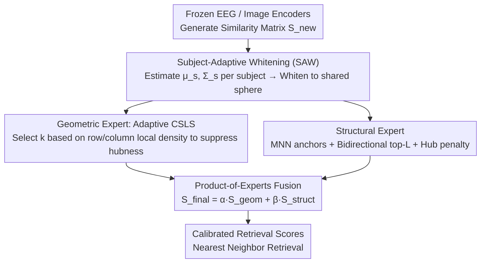

# SATTC: Structure-Aware Label-Free Test-Time Calibration for Cross-Subject EEG-to-Image Retrieval

**Conference**: CVPR 2026  
**arXiv**: [2603.20738](https://arxiv.org/abs/2603.20738)  
**Code**: [https://github.com/QunjieHuang/SATTC-CVPR2026](https://github.com/QunjieHuang/SATTC-CVPR2026)  
**Area**: Time Series  
**Keywords**: EEG decoding, Cross-subject retrieval, Label-free calibration, hubness mitigation, Similarity matrix

## TL;DR

SATTC is proposed as a label-free test-time calibration head. By employing a Product-of-Experts (PoE) fusion of a geometric expert (subject-adaptive whitening + adaptive CSLS) and a structural expert (mutual nearest neighbors + bidirectional top-k ranking + category popularity), it operates directly on the similarity matrix of frozen EEG and image encoders. This approach significantly enhances Top-1 accuracy and alleviates the hubness effect in cross-subject EEG-to-image retrieval.

## Background & Motivation

1. **Background**: EEG-to-image retrieval maps EEG signals into a shared embedding space, utilizing nearest neighbor search to find corresponding images. Recent studies (e.g., ATM) have developed robust EEG encoders through contrastive learning, achieving competitive zero-shot retrieval performance on the THINGS-EEG benchmark.
2. **Limitations of Prior Work**: Current pipelines suffer from three test-time constraints: (1) Lack of structure-aware label-free calibration, where inference is simplified to basic nearest neighbor search; (2) Absence of subject-adaptive, density-aware hubness mitigation, as globally fixed CSLS neighborhood sizes cannot accommodate local density variations across different queries and categories; (3) Underutilization of structural cues, such as mutual nearest neighbors and bidirectional ranking, to diagnose and rectify the quality of small-k shortlists.
3. **Key Challenge**: During cross-subject deployment, the EEG feature distributions (mean, variance, and covariance structures) of different subjects exhibit significant statistical shifts (subject shift). Coupled with the hubness effect in high-dimensional embedding spaces—where a few "popular" images dominate the top-k lists of most queries—this results in highly unreliable small-k shortlists, which is a critical failure in practical neural decoding applications.
4. **Goal**: Under the strict constraints of frozen encoders and no target domain labels, the objective is to calibrate retrieval rankings solely by manipulating the EEG-image similarity matrix.
5. **Key Insight**: Cross-subject retrieval is redefined as a "similarity matrix calibration" problem. Instead of modifying encoder weights, the similarity structure itself is adjusted. This is approached from two complementary perspectives: the geometric perspective (density-aware local scaling) and the structural perspective (consistency patterns within ranking relationships).
6. **Core Idea**: A geometric expert is used to mitigate hubness caused by non-uniform density, while a structural expert identifies high-confidence matches and penalizes popular hub categories. The two are fused via product fusion to generate calibrated retrieval scores.

## Method

### Overall Architecture

This paper addresses the "unreliable test-time ranking" problem in cross-subject EEG-to-image retrieval. When a new subject is introduced, it is impractical to re-label data or fine-tune networks. SATTC redefines the task as calibrating a similarity matrix. Given a frozen EEG encoder $f_{\text{eeg}}$ and an image encoder $f_{\text{img}}$, a similarity matrix $S_{\text{new}}$ of size $|Q| \times |C|$ is generated (rows represent queries, columns represent candidate image categories). SATTC acts as an operator $F: S_{\text{new}} \mapsto S_{\text{final}}$ on this matrix without modifying any network weights.

The matrix undergoes three stages: First, Subject-Adaptive Whitening (SAW) aligns the EEG features of different subjects into a shared statistical coordinate system. Next, a "geometric expert" performs adaptive CSLS scaling based on local density, while a "structural expert" extracts reliable matches and identifies spurious hubs from ranking relationships. Finally, the two experts are fused in the logit space as $S_{\text{final}} = \alpha S_{\text{geom}} + \beta S_{\text{struct}}$ to output the calibrated retrieval scores. This process is label-free, training-free, and agnostic to the underlying encoders.

### Key Designs

**1. Subject-Adaptive Whitening (SAW): Aligning different subjects to the same sphere without labels**

The primary obstacle in cross-subject retrieval is subject shift, where the feature distributions (mean, variance, covariance) of different individuals vary significantly. SAW estimates the mean $\mu_s$ and covariance $\Sigma_s$ for each subject $s$ independently and constructs a regularized whitening transform $W_s = (\Sigma_s + \lambda I)^{-1/2}$. Subject-specific EEG embeddings are centered, whitened by $W_s$, and L2-normalized. An optional global whitening is applied to the image side. Post-whitening, features for each subject approximate zero mean, unit covariance, and unit norm, effectively mapping them to a shared sphere. This geometrically eliminates distribution shifts without requiring target domain labels. SAW provides the largest single performance gain, increasing Top-5 accuracy from 30.5% to 36.4%.

**2. Adaptive CSLS Geometric Expert: Tailoring neighborhoods to local density to suppress hubness**

High-dimensional embedding spaces suffer from the hubness effect, where a few "hub" images dominate the top-k results of many queries. While classic CSLS uses a fixed global neighborhood $k$ for density penalty, EEG embeddings are highly non-uniform. Fixed $k$ over-penalizes sparse regions and under-penalizes dense hubs. The adaptive version maps row density $\rho_{\text{row}}(q)$ to a query-specific $k_{\text{row}}(q) \in [k_{\min}, k_{\max}]$ and column density $\rho_{\text{col}}(c)$ to $k_{\text{col}}(c)$. The CSLS score remains:

$$S_{\text{geom}}(q,c) = 2s(q,c) - r_q(q) - r_c(c)$$

However, the neighborhood mean terms $r_q$ and $r_c$ are calculated using these adaptive neighborhood sizes. This eliminates the need to tune a global $k$ for the entire dataset.

**3. Structural Expert: Reinforcing reliable matches and suppressing false hubs from ranking consistency**

While the geometric expert focuses on density, the structural expert analyzes ranking relationships. It computes row/column rankings from $S_{\text{new}}$ to identify three types of signals: (1) Anchors, defined as Mutual Nearest Neighbors (MNN@1) where $r_{\text{row}}(q,c)=r_{\text{col}}(c,q)=1$, receive a positive bias $+\lambda_{\text{anchor}}$; (2) Bidirectional top-L pairs serve as relaxed consistency matches; (3) Hub candidates, which have low row rank but high column rank (appearing frequently in top-k lists), receive a negative penalty $-\lambda_{\text{pen}} h(c)$ based on a normalized hubness score $h(c)$. Mutual nearest neighbors are highly reliable in cross-domain retrieval as both samples identify each other as the best match. Conversely, categories appearing excessively in various top-k lists are likely hubs and are actively suppressed. The structural matrix is computed once and remains fixed to prevent feedback loops where hubs might reinforce themselves.

### Loss & Training

SATTC does not involve training; all operations are performed at test time. The underlying EEG encoder is trained using the AdamW optimizer with a batch size of 1024, a learning rate of $5 \times 10^{-4}$, and a temperature $\tau=1.0$. Fusion is controlled by a scalar $\beta$ (default 1.9), with $\alpha$ fixed at 1.

## Key Experimental Results

### Main Results

200-way cross-subject retrieval on the THINGS-EEG dataset (LOSO protocol, averaged over all folds and 3 seeds):

| Method | Top-5 (%)↑ | Top-1 (%)↑ |
|------|-----------|-----------|
| ATM (Original) | 20.0 | 5.5 |
| Standardized Baseline (cosine+L2+CW) | 30.5 | 9.2 |
| + SAW | 36.4 | 13.7 |
| + SAW + CW | 36.8 | 13.5 |
| + SAW + CW + CSLS (fixed k=12) | 38.1 | 14.1 |
| + SAW + CW + Ada-CSLS | 38.8 | 13.9 |
| **SATTC (Full)** | **38.4** | **14.8** |

Plug-and-play generalization across encoders (SATTC as a general calibration layer):

| Encoder | Top-5 Baseline → +SATTC | Top-1 Baseline → +SATTC |
|--------|-------------------|-------------------|
| ATM | 30.5 → 38.4 (+7.9) | 9.2 → 14.8 (+5.6) |
| EEGNetV4 | 20.5 → 34.8 (+14.3) | 5.4 → 10.8 (+5.4) |
| EEGConformer | 11.6 → 23.2 (+11.6) | 2.5 → 6.9 (+4.4) |
| ShallowFBCSPNet | 14.6 → 30.8 (+16.2) | 3.5 → 11.1 (+7.6) |

### Ablation Study

| Configuration | Top-5 (%) | Top-1 (%) | Description |
|------|-----------|-----------|------|
| Standardized Baseline | 30.5 | 9.2 | cosine+L2+CW |
| + SAW | 36.4 | 13.7 | Largest single gain (+6.2/+4.5) |
| + SAW + CW | 36.8 | 13.5 | Limited extra gain from CW |
| + Ada-CSLS | 38.8 | 13.9 | Geometric calibration |
| + Structural PoE (SATTC) | 38.4 | 14.8 | Significant Top-1 improvement |

### Key Findings
- SAW is the primary performance contributor, with a 6.2 percentage point absolute increase in Top-5, indicating that cross-subject statistical shift is the main barrier.
- The structural expert mainly improves Top-1 (13.9 → 14.8) without degrading Top-5, demonstrating precision in identifying correct matches.
- Adaptive CSLS is comparable to fixed CSLS in accuracy but produces a more uniform hubness distribution (flatter category popularity curves).
- SATTC is effective across four architectural styles (CSP, CNN, Transformer), confirming encoder-agnosticism.
- $\beta$ is stable over a wide range; the default 1.9 is within 0.1% of the optimal setting.

## Highlights & Insights
- **Refinement of Problem**: Restructuring cross-subject retrieval as a "test-time similarity matrix calibration" problem, rather than a training problem, decouples the method from the encoder. It can be applied to any existing encoder to yield immediate improvements.
- **Complementary Expert Design**: The geometric expert addresses hubness via density, while the structural expert addresses it via ranking consistency. Their fusion in logit space is simple yet effective.
- **Rigorous Experimental Design**: The use of nested LOSO prevents data leakage. The hyperparameter selection strategy (using specific subject tiers) avoids overfitting and demonstrates true generalization across encoders.

## Limitations & Future Work
- Validation is currently limited to the THINGS-EEG dataset; generalization to other EEG-image datasets remains to be confirmed.
- The structural expert relies on manually designed heuristics (ranking, MNN, popularity); learnable enhancements could be explored.
- The current implementation requires pre-computing the full similarity matrix, hindering online streaming inference (though SAW and CSLS components could be adapted).
- Lack of integration with training-time domain adaptation (e.g., adversarial training), which might provide complementary gains.
- Absolute Top-1 accuracy (14.8%) remains low, highlighting the inherent difficulty of EEG-to-image retrieval.

## Related Work & Insights
- **vs ATM**: ATM uses non-standardized dot-product similarity. Simply switching to cosine, L2, and whitening improves Top-5 from 20% to 30.5%, showing that inference pipeline standardization is often overlooked.
- **vs Standard CSLS (Lample et al., 2018)**: Used for cross-lingual word embedding alignment with fixed neighborhoods; SATTC’s adaptive version removes the need to tune $k$.
- **vs Training-time DA (e.g., MS-MDA)**: While DA aligns distributions during training, SATTC calibrates at test time. The two are complementary.

## Rating
- **Novelty**: ⭐⭐⭐⭐ Combines retrieval calibration and cross-subject EEG perspectives, though individual components (whitening, CSLS, MNN) are established.
- **Experimental Thoroughness**: ⭐⭐⭐⭐ Extensive multi-encoder validation and ablation, though tested on only one dataset.
- **Writing Quality**: ⭐⭐⭐⭐ Clear derivations and logical contrastive experiments demonstrate the contribution of each component.
- **Value**: ⭐⭐⭐⭐ An encoder-agnostic plug-and-play calibration layer is highly practical, despite the niche application area.

<!-- RELATED:START -->

## Related Papers

- [\[AAAI 2026\] Task-Aware Retrieval Augmentation for Dynamic Recommendation](../../AAAI2026/time_series/task-aware_retrieval_augmentation_for_dynamic_recommendation.md)
- [\[NeurIPS 2025\] Learning with Calibration: Exploring Test-Time Computing of Spatio-Temporal Forecasting](../../NeurIPS2025/time_series/learning_with_calibration_exploring_test-time_computing_of_spatio-temporal_forec.md)
- [\[ICLR 2026\] Free Energy Mixer](../../ICLR2026/time_series/free_energy_mixer.md)
- [\[CVPR 2026\] Towards Uncertainty-aware Unsupervised Domain Adaptation for Videos and Time-Series with Causal Optimal Transport](towards_uncertainty-aware_unsupervised_domain_adaptation_for_videos_and_time-ser.md)
- [\[ACL 2026\] Test of Time: Rethinking Temporal Signal of Benchmark Contamination](../../ACL2026/time_series/test_of_time_rethinking_temporal_signal_of_benchmark_contamination.md)

<!-- RELATED:END -->
