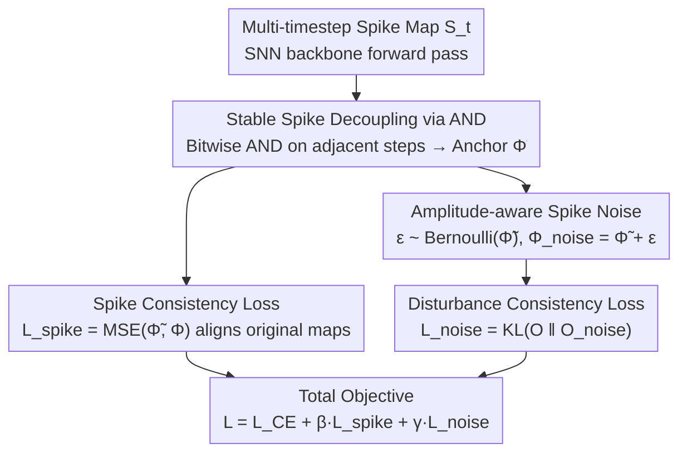

# Stable Spike: Dual Consistency Optimization via Bitwise AND Operations for Spiking Neural Networks

**Conference**: CVPR2026  
**arXiv**: [2603.11676](https://arxiv.org/abs/2603.11676)  
**Code**: To be confirmed  
**Area**: Time Series  
**Keywords**: Spiking Neural Networks, Timestep Consistency, Bitwise AND, Stable Spike Skeleton, Amplitude-aware Noise, Neuromorphic Recognition, Low-latency Inference

## TL;DR

Ours proposes the Stable Spike dual consistency optimization framework, which utilizes hardware-friendly bitwise AND operations to decouple stable spike skeletons from multi-timestep spike maps and injects amplitude-aware spike noise to enhance generalization. It improves neuromorphic object recognition accuracy by up to 8.33% under ultra-low latency ($T=2$).

## Background & Motivation

**Low-power Advantage of SNNs**: Spiking Neural Networks (SNNs) transmit information through sparse binary spikes. On neuromorphic chips, they only require addition operations, resulting in power consumption significantly lower than traditional ANNs, making them an important paradigm for low-power AI.

**Timestep Inconsistency Problem**: Differences in neuron states and input currents across different timesteps lead to excessive variance in spike maps between timesteps, severely affecting representation quality and prediction stability.

**Chaos in Early Timesteps**: Since membrane potentials are typically initialized to zero, outputs at early timesteps are more chaotic than those at later ones, which is particularly detrimental in low-latency inference scenarios.

**Limitations of Prior Work**: Methods such as MPS promote consistency indirectly by modifying neuron dynamics. However, these require alterations to the neuron model, making them difficult to deploy generally on neuromorphic chips where neuron models are often pre-configured.

**Special Requirements for SNN Noise**: Unlike ANNs that can use Gaussian noise, the binary discrete nature of SNNs requires discrete noise to avoid training-inference precision mismatch. Furthermore, spike firing rates are highly sensitive to noise amplitudes.

**Demand for Ultra-low Latency**: Neuromorphic object recognition pursues low-latency ($T \leq 4$) inference, but existing methods usually require $10+$ timesteps to achieve good performance. There is an urgent need for performance enhancement under low-latency constraints.

## Method

### Overall Architecture

Stable Spike aims to resolve the high variance between SNN spike maps and the chaos in early timesteps under low latency. Rather than modifying neuron dynamics, it introduces **dual consistency optimization** during training: one path uses bitwise AND operations on adjacent spike maps to extract a "stable spike skeleton" as an anchor for alignment; the other path injects discrete noise into the stable firing rates to force consistent predictions under perturbation. Both objectives are combined for training, with no extra structural overhead during inference: $\mathcal{L}_{total} = \mathcal{L}_{CE} + \beta \mathcal{L}_{spike} + \gamma \mathcal{L}_{noise}$.

### Key Designs

**1. Stable Spike Decoupling via Bitwise AND: Extracting Consistent Semantic Skeletons as Anchors**

To address the chaotic nature of early timesteps, the authors perform bitwise AND operations on spike maps of adjacent timesteps $t$ and $t+1$, retaining only positions where both fire: $\tilde{S}_{i,t} = S_{i,t} \mathbin{\&} S_{i,t+1}$. From $T$ spike maps, $T-1$ stable maps are extracted and averaged into a stable firing rate $\tilde{\Phi} = \frac{1}{T-1}\sum_{t=0}^{T-2}\tilde{S}_t$ as the feature skeleton. Bitwise AND is critical because it only retrieves $(1,1)$ pairs, naturally filtering out noise spikes occurring in single steps. In contrast, OR includes both consistent and inconsistent spikes, while XOR keeps only inconsistent ones. These operations are natively supported by neuromorphic chips, allowing plug-and-play deployment.

**2. Amplitude-aware Spike Noise: Firing-rate Dependent Perturbations**

SNNs cannot use Gaussian noise due to their binary nature, and firing rates are sensitive to noise amplitudes. The authors set the noise probability proportional to the stable firing rate: $\varepsilon_{c,i,j} = \text{Bernoulli}(\tilde{\Phi}_{c,i,j})$. Elements with higher firing rates are more likely to be perturbed to promote generalization, while low-rate elements remain largely unchanged to preserve key semantics. Since the noise is binary, it matches the spike data format. The perturbed firing rate $\Phi_{noise} = \tilde{\Phi} + \varepsilon$ is passed forward to obtain $O_{noise}$, which is then constrained to be consistent with the original prediction.

### Loss & Training

| Loss | Formula | Function |
|------|------|------|
| Spike Consistency Loss | $\mathcal{L}_{spike} = \text{MSE}(\tilde{\Phi}, \Phi)$ | Guides original spike maps to converge toward the stable skeleton |
| Disturbance Consistency Loss | $\mathcal{L}_{noise} = \alpha^2 \text{KL}(O \| O_{noise})$ | Encourages consistent predictions under noise perturbation |
| Classification Loss | $\mathcal{L}_{CE}$ | Standard Cross-Entropy |

The temperature parameter $\alpha=2$, and balance coefficients $\beta=\gamma=1.0$. Stable spikes are calculated only for backbone features, with the only extra overhead being a single forward pass of the classifier.

## Key Experimental Results

### Main Results

**Neuromorphic Datasets (Low Latency $T=4$)**:

| Method | Architecture | T | CIFAR10-DVS | DVS-Gesture | N-Caltech101 |
|------|------|---|-------------|-------------|--------------|
| TAB (ICLR'24) | VGG-9 | 4 | - | 87.50 | - |
| SLT (AAAI'24) | VGG-9 | 4 | - | 88.19 | - |
| CLIF (ICML'24) | VGG-9 | 4 | - | 89.58 | - |
| **Ours** | **VGG-9** | **4** | **77.1** | **94.44** | **83.92** |
| QKFormer (NeurIPS'24) | QKFormer | 4 | 81.2 | 93.75 | - |
| **Ours** | **QKFormer** | **4** | **82.9** | **95.49** | - |

**ImageNet ($T=4$, ResNet-34)**: Achieves 70.59%, surpassing MPS (69.03%) and STAA-SNN (70.40%).

### Ablation Study

**Dual Loss Combinations (VGG-9, $T=4$)**:

| Configuration | CIFAR10-DVS | DVS-Gesture |
|------|-------------|-------------|
| Baseline | 72.9 | 87.15 |
| +$\mathcal{L}_{spike}$ | 75.2 (+2.4) | 91.32 (+4.17) |
| +$\mathcal{L}_{noise}$ | 75.4 (+2.6) | 94.09 (+6.94) |
| +Both | **77.1 (+4.2)** | **94.44 (+7.29)** |

**Bitwise Operation Selection**: AND outperforms OR (DVS-Gesture: 94.44 vs 88.54) and XOR (89.58). OR suffers degradation by retrieving both consistent and inconsistent spikes.

**Noise Design Ablation**: Fixed-probability spike noise ($88.89\%$ at $p=0.5$) or continuous Gaussian noise ($91.67\%$ at $std=0.5$) are significantly inferior to amplitude-aware spike noise ($94.44\%$).

### Key Findings

- **Significant Ultra-low Latency Advantage**: At $T=2$, DVS-Gesture performance increases by 8.33% ($83.68 \to 92.01$). Improvements are more pronounced as latency decreases.
- **Power Reduction**: Except for the first layer, spike firing rates are lower across all layers, reducing total power from 189.83 to 181.02 ($\times 10^6$ pJ).
- **Smoother Loss Landscape**: Eliminates sharp local minima, showing a trend toward a single global optimum, making optimization more stable.
- **Compatibility**: Can be combined with Knowledge-Transfer, reaching 94.25% on N-Caltech101.

## Highlights & Insights

- The concept of decoupling stable spikes via bitwise AND is simple yet effective, hardware-friendly, and requires no modifications to neurons or architectures.
- Amplitude-aware spike noise elegantly addresses the dual constraints of SNN discreteness and noise sensitivity.
- Performance gains are extremely significant in ultra-low latency ($T=2$) scenarios, directly advancing the practicality of SNNs.
- Extensive validation across architectures (VGG/ResNet/Transformer) and data types (neuromorphic/static).

## Limitations & Future Work

- Requires at least $T \geq 2$ timesteps for AND calculations; not applicable for $T=1$.
- Balance coefficients $\beta, \gamma$ impact performance ($92.01\% \sim 95.14\%$) and require tuning per dataset.
- Evaluated only on classification; not yet extended to downstream tasks like detection or segmentation.
- Gains on static datasets are less significant than on neuromorphic datasets.

## Related Work & Insights

- **MPS (ICLR'25)**: Promotes consistency via membrane potential smoothing and logit distillation across timesteps; requires neuron dynamics modification.
- **Knowledge-Transfer (AAAI'24)**: Transfers knowledge from static to neuromorphic data; complementary to this work.
- **QKFormer (NeurIPS'24)**: Transformer-style SNN architecture; this method can further enhance its performance.
- **STAA-SNN (CVPR'25)**: Focuses on spatio-temporal attention; achieves comparable performance on ImageNet.
- **EnOF-SNN / BKDSNN**: Promotes spatial consistency through distillation or contrastive learning but lacks a stable anchor in the temporal dimension.

## Rating

- Novelty: ⭐⭐⭐⭐ — Decoupling stable spikes via AND is a novel perspective; amplitude-aware noise is cleverly designed.
- Experimental Thoroughness: ⭐⭐⭐⭐⭐ — Covers multiple architectures and datasets, with ablations on bitwise logic, noise, hyperparameters, and power.
- Writing Quality: ⭐⭐⭐⭐ — Clear motivation, complete derivation, and rich visualizations.
- Value: ⭐⭐⭐⭐ — A plug-and-play SNN enhancement; significant low-latency gains drive neuromorphic computing toward practical applications.

<!-- RELATED:START -->

## Related Papers

- [\[ICLR 2026\] DeNOTS: Stable Deep Neural ODEs for Time Series](../../ICLR2026/time_series/denots_stable_deep_neural_odes_for_time_series.md)
- [\[ICLR 2026\] Weight-Space Linear Recurrent Neural Networks](../../ICLR2026/time_series/weight-space_linear_recurrent_neural_networks.md)
- [\[ICLR 2026\] Tuning the burn-in phase in training recurrent neural networks improves their performance](../../ICLR2026/time_series/tuning_the_burn-in_phase_in_training_recurrent_neural_networks_improves_their_pe.md)
- [\[AAAI 2026\] Urban Incident Prediction with Graph Neural Networks: Integrating Government Ratings and Crowdsourced Reports](../../AAAI2026/time_series/urban_incident_prediction_with_graph_neural_networks_integrating_government_rati.md)
- [\[CVPR 2026\] Real-Time Long Horizon Air Quality Forecasting via Group-Relative Policy Optimization](real-time_long_horizon_air_quality_forecasting_via_group-relative_policy_optimiz.md)

<!-- RELATED:END -->
