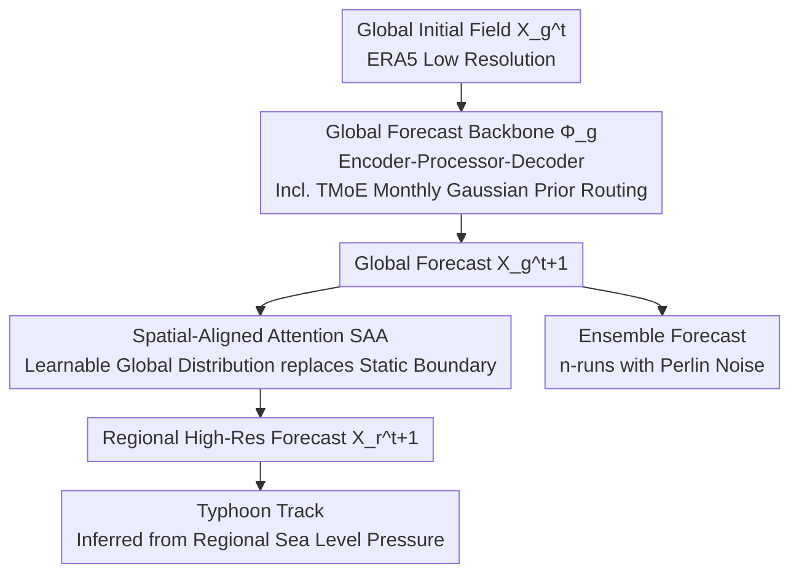

# STCast: Adaptive Boundary Alignment for Global and Regional Weather Forecasting

**Conference**: CVPR 2026  
**arXiv**: [2509.25210](https://arxiv.org/abs/2509.25210)  
**Code**: None  
**Area**: Spatiotemporal Prediction / Weather Forecasting  
**Keywords**: weather forecasting, spatial-aligned attention, temporal MoE, global-regional coupling, adaptive boundary  

## TL;DR

The STCast framework is proposed, which replaces static boundaries with learnable global-regional distributions through Spatial-Aligned Attention (SAA) to adaptively fuse global atmospheric information into regional forecasts. It utilizes Temporal Mixture-of-Experts (TMoE) with monthly dynamic routing to enhance temporal modeling, outperforming existing methods across four tasks: global forecasting, high-resolution regional forecasting, typhoon track prediction, and ensemble forecasting.

## Background & Motivation

**Background**: Accurate regional weather forecasting requires support from global atmospheric dynamics—Siberian cold surges can trigger East Asian cold waves, and surface heating of the Tibetan Plateau can simultaneously alter the East Asian monsoon and North American jet streams. Therefore, the true "boundary" of a regional forecast is not the adjacent area, but the entire Earth.

**Limitations of Prior Work**: Traditional NWP methods forecast by solving PDEs on fine grids, which is computationally expensive. Data-driven methods (e.g., Pangu-Weather, GraphCast) significantly reduce costs but face two core problems: (1) training a high-resolution (~1km, 0.01°) global model directly is computationally infeasible (requiring a 19980×39960 grid); (2) existing global-regional coupling methods use only **static adjacent regions** as boundaries—such as OneForecast directly concatenating neighbor crops, which violates atmosphere-ocean-land-biosphere coupling theories.

**Novelty**: (1) Static neighborhood boundaries are replaced with learnable global-regional distributions, initialized based on great-circle distance and adaptively optimized during training; (2) MoE expert routing is guided by month-specific Gaussian priors to explicitly model atmospheric variation characteristics across different months.

## Method

### Overall Architecture

The **Key Challenge** STCast addresses is that high-resolution regional forecasting depends on global atmospheric dynamics, yet training a high-resolution global model (~1km, 0.01°) is computationally impossible. The approach decomposes the task into a coupling chain: a backbone network performs global forecasting at low resolution, and the regional model adaptively "borrows" information from the global field via SAA for high-resolution regional forecasting. Subsequently, typhoon tracks are inferred from regional sea-level pressure, and ensemble forecasts are generated by injecting Perlin noise into the global initial field and averaging multiple simulations. The backbone uses an Encoder-Processor-Decoder structure, where the Processor alternates between window attention and self-attention to balance local details and global correlations. The four tasks share a unified global-regional-temporal coupling representation: global forecasting is denoted as $X_g^{t+1} = \Phi_g(X_g^t)$, and regional forecasting as $X_r^{t+1} = \Phi_r(X_r^t, X_g^t)$.

### Key Designs

**1. Spatial-Aligned Attention (SAA): Replacing Static Boundaries with Learnable Global Distributions**

The true "boundary" for regional forecasting is the entire Earth. Methods like OneForecast that simply concatenate neighboring crops fix boundaries as static local regions, losing long-range teleconnections. SAA implements this coupling as cross-attention: using global features as Query and Key, and regional features as Value, allowing the regional field to actively aggregate relevant information from the global field.

The attention weights are modulated by a physical prior. For each global grid point, the great-circle distance $d(\phi,\lambda)$ to the target region is calculated, and a global-regional distribution map is constructed using exponential decay $f(\phi,\lambda)=\exp(-\alpha\cdot d^2)$, applied via Hadamard product:

$$f(\phi,\lambda)=\exp\!\big(-\alpha\cdot d(\phi,\lambda)^2\big)$$

This prior encodes the intuition that "atmospheric influence decays with distance but never reaches zero," biasing the model toward local information without severing long-range links. Since the distribution is optimized during training, the model learns teleconnections beyond pure distance decay. To maintain computational feasibility, SAA utilizes $O(n)$ linear attention for this aggregation.

**2. Temporal Mixture-of-Experts (TMoE): Explicitly Partitioning Experts with Monthly Gaussian Priors**

Atmospheric variables vary significantly by month (e.g., summer convection vs. winter radiation). While standard MoE lets the router learn temporal patterns implicitly, experts tend to polarize or fail to capture temporal specificity. TMoE assigns a discrete Gaussian distribution to each month, with peaks rotated to align with the input month, ensuring that "months further from the current month have monotonically lower activation probabilities." During routing, month embeddings $M\in\mathbb{R}^{12\times1}$ are added to the routing logits before the softmax selection of Top-K experts:

$$I=\text{Softmax}\big(\text{Conv}(X^t)+M\big)$$

This provides a clear "time signal" to the router, resulting in experts specialized by month at low computational cost.

**3. Unified Four-Task Framework: Shared Coupling Representations**

Typhoon track prediction and ensemble forecasting are direct derivatives of the backbone output. Typhoon tracks are inferred from the sea-level pressure field of the regional forecast, while ensemble forecasts inject Perlin noise into the global initial state $X_g^t$ to characterize uncertainty. This unified framework allows long-range coupling benefits to propagate to all downstream tasks.

### Loss & Training

Global and regional models are trained separately using the AdamW optimizer with a learning rate of 0.0002, batch size of 16, for 100 epochs. Data is sourced from ERA5 (1979–2019, 0.25° resolution, 721×1440 grid, 70 variables), utilizing 16× NVIDIA A100 GPUs.

## Key Experimental Results

### Main Results

**Global Forecasting (ERA5, Normalized RMSE↓ / ACC↑)**:

| Method | 1-Day RMSE↓ | 4-Day RMSE↓ | 7-Day RMSE↓ | 10-Day RMSE↓ |
|------|---------|---------|---------|----------|
| Pangu-Weather | 0.1571 | 0.3380 | 0.5092 | 0.6215 |
| GraphCast | 0.1304 | 0.2861 | 0.4597 | 0.6009 |
| OneForecast | 0.1231 | 0.2732 | 0.4468 | 0.5918 |
| **Ours (STCast)** | **0.1197** | **0.2578** | **0.4348** | **0.5763** |

### Ablation Study

| Configuration | Key Impact | Description |
|------|---------|------|
| W/o SAA (Direct Concatenation) | Regional forecast dropped significantly | Static boundaries are insufficient |
| W/o TMoE (Standard MoE) | Temporal generalization weakened | Monthly specificity lost |
| Fixed Distance Prior (No Update) | Medium performance | Learnable prior is superior |
| Euclidean instead of Great Circle | Slightly worse | Spherical distance is more accurate |

### Key Findings

- SAA's adaptive boundaries outperform OneForecast's neighborhood concatenation and direct training strategies across all regional variables.
- The month embeddings in TMoE effectively prevent expert homogenization; experts for different months learn distinct atmospheric patterns.
- STCast shows a greater advantage in 10-day long-term forecasts (RMSE 0.5763 vs 0.5918), indicating that global-regional coupling is more beneficial for long-range predictions.
- Typhoon track and ensemble forecasting demonstrate the generalization capabilities of the unified framework.

## Highlights & Insights

- The prior design using Great Circle distance + exponential decay is physically intuitive—it encodes the law of distance decay while allowing the model to learn teleconnection patterns. This "physical prior initialization + data-driven optimization" paradigm is highly transferable to other Earth science applications.
- Using discrete Gaussian distributions for monthly routing in TMoE provides high rewards for low cost by providing explicit temporal signals.

## Limitations & Future Work

- Regional forecasting is currently validated only in East Asia; its effectiveness in other regions (e.g., Equator, Poles) remains to be verified.
- Uncertainty quantification is achieved only through Perlin noise ensembles, lacking formal probability calibration analysis.
- Computational Cost: Training for 100 epochs on 16× A100 GPUs is still relatively high for resource-constrained research groups.

## Related Work & Insights

- **vs OneForecast**: The most direct competitor. OneForecast uses neighborhood concatenation for global-regional coupling, while STCast uses SAA for adaptive distribution learning, consistently outperforming OneForecast across all tasks.
- **vs GraphCast/FuXi**: These methods focus on global forecasting. STCast extends to high-resolution regional forecasting via SAA, filling a critical gap in AI weather forecasting.

## Rating

- Novelty: ⭐⭐⭐⭐ Physical motivation for SAA's prior and TMoE's month embedding is strong.
- Experimental Thoroughness: ⭐⭐⭐⭐ Four tasks with multiple baselines and thorough ablation.
- Writing Quality: ⭐⭐⭐ Framework description is clear, though some details are in the appendix.
- Value: ⭐⭐⭐⭐ Achieving SOTA across four tasks within a unified framework is valuable for the AI meteorology community.

<!-- RELATED:START -->

## Related Papers

- [\[ICCV 2025\] VA-MoE: Variables-Adaptive Mixture of Experts for Incremental Weather Forecasting](../../ICCV2025/time_series/va-moe_variables-adaptive_mixture_of_experts_for_incremental_weather_forecasting.md)
- [\[CVPR 2026\] L2GTX: From Local to Global Time Series Explanations](l2gtx_from_local_to_global_time_series_explanations.md)
- [\[NeurIPS 2025\] Graph-based Neural Space Weather Forecasting](../../NeurIPS2025/time_series/graph-based_neural_space_weather_forecasting.md)
- [\[ICML 2026\] U-Cast: A Surprisingly Simple and Efficient Frontier Probabilistic AI Weather Forecasting](../../ICML2026/time_series/u-cast_a_surprisingly_simple_and_efficient_frontier_probabilistic_ai_weather_for.md)
- [\[AAAI 2026\] Revitalizing Canonical Pre-Alignment for Irregular Multivariate Time Series Forecasting](../../AAAI2026/time_series/revitalizing_canonical_pre-alignment_for_irregular_multivariate_time_series_fore.md)

<!-- RELATED:END -->
