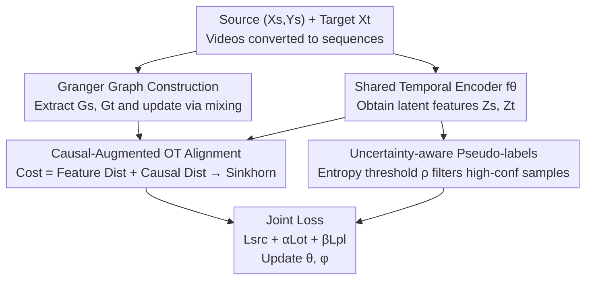

# Towards Uncertainty-aware Unsupervised Domain Adaptation for Videos and Time-Series with Causal Optimal Transport

**Conference**: CVPR 2026  
**Paper**: [CVF Open Access](https://openaccess.thecvf.com/content/CVPR2026/html/Mishra_Towards_Uncertainty-aware_Unsupervised_Domain_Adaptation_for_Videos_and_Time-Series_with_CVPR_2026_paper.html)  
**Code**: TBD (Paper mentions CausalOT/README.md, no public repository provided)  
**Area**: Time-Series / Video Unsupervised Domain Adaptation  
**Keywords**: Unsupervised Domain Adaptation, Optimal Transport, Granger Causality, Pseudo-labeling, Uncertainty Calibration

## TL;DR
This paper proposes Causal-OT, which embeds inter-channel Granger causality graphs into the Optimal Transport (OT) cost matrix for cross-domain alignment. It simultaneously employs entropy-based uncertainty filtering for pseudo-labels to ensure that time-series and video domain adaptation preserves temporal-causal structures without being biased by overconfident pseudo-labels. It achieves an average accuracy improvement of 4.5% across 6 time-series benchmarks and 2.5% across 4 video benchmarks.

## Background & Motivation
**Background**: Unsupervised Domain Adaptation (UDA) aims to transfer a labeled source domain model to an unlabeled target domain. In 1D time-series (human activity recognition, sensor signals, sleep staging, etc.) and video action recognition, mainstream approaches either use Optimal Transport (OT) / Maximum Mean Discrepancy (MMD) for distribution alignment or directly adapt image-domain pseudo-label self-training.

**Limitations of Prior Work**: Both categories have significant flaws. Distribution alignment methods (e.g., OT-based TransPL, MMD methods) typically treat channels as independent, time-invariant features for matching, losing dependencies that evolve over time—which are inherently causal. Pseudo-labeling methods rely heavily on class probabilities predicted by the model, but time-series models often exhibit **overconfidence** under domain shift (high confidence despite incorrect predictions). These noise labels are reinforced during self-training, leading to confirmation bias. Figure 1 provides empirical evidence: the baseline TransPL shows an ECE (Expected Calibration Error) as high as 13.55 on SSC, indicating a severe misalignment between confidence and true accuracy.

**Key Challenge**: Existing methods optimize **temporal alignment** and **uncertainty suppression** as two independent objectives. This fragmentation fails to capture inter-channel causal dependencies and ignores how prediction uncertainty can degrade alignment quality. Consequently, representation transferability is limited, and training remains unstable.

**Goal**: To address distribution alignment, causal structure preservation, and prediction uncertainty within a unified framework, as these aspects were only partially covered in previous works (refer to Table 1).

**Key Insight**: The author assumes that the truly invariant component across domains is not the numerical distribution of specific channels, but the **causal mechanisms** between channels (e.g., the gravity component of an accelerometer remains stable across users, whereas gyroscope/EMG signals change drastically with device placement). Thus, rather than aligning "what features look like," it is better to align "the causal structure between features."

**Core Idea**: Embed the Granger causality graph directly into the OT cost matrix as a domain-invariant inductive prior, ensuring the transport plan aligns both feature distributions and causal structures. Simultaneously, use an entropy threshold to filter unreliable pseudo-labels and avoid noise reinforcement.

## Method

### Overall Architecture
Causal-OT takes labeled source domain time-series $(X_s, Y_s)$ and unlabeled target domain time-series $X_t$ as input (videos are converted into fixed-length depth feature sequences). The process begins by extracting Granger causality graphs $(G_s, G_t)$ for both domains from the raw signals. A shared temporal encoder $f_\theta$ maps samples to latent space features $(Z_s, Z_t)$. A **cost matrix $C$ containing both feature and causal graph distances** is constructed to solve for the entropy-regularized OT transport plan $\gamma^*$ for cross-domain alignment. The classification head $h_\phi$ is trained supervised on the source domain and generates pseudo-labels for target samples, retaining only low-entropy (high-confidence) samples for training. Finally, $\mathcal{L}_{total}=\mathcal{L}_{src}+\alpha\mathcal{L}_{OT}+\beta\mathcal{L}_{PL}$ is used for end-to-end joint updates of $\theta$ and $\phi$.

For videos, the core model remains unchanged, only the input interface is modified:Each video is segmented into $T$ segments (optimally $T=5$). Each segment uses ResNet-101 (TA3N style) or a 3D backbone to extract segment-level embeddings, followed by source domain statistical normalization + PCA to compress into $X\in\mathbb{R}^{d\times T}$ (default $d=2048$). Subsequent causal graph extraction, OT alignment, and pseudo-labeling follow the time-series setup.

### Key Designs

**1. Granger Causality Graph Construction + Hybrid Updates: Using "Channel Causal Structure" as an Invariant Prior**

The limitation is that aligning multi-channels as independent features loses dependencies that evolve over time. However, estimating the causal graph only once on the raw signal leads to a mismatch as the encoder features $Z=f_\theta(X)$ drift during training. The authors use Granger causality to calculate a directed graph $G=(V,E,W)$ for each domain, where nodes $V$ are $d$ channels and the adjacency matrix $W\in\mathbb{R}^{d\times d}$ stores Granger influence scores. For robustness, the Augmented Dickey-Fuller test is used for signal stationarity, and BIC selects the optimal lag $p$ for the VAR model. Only edges with p-value < 0.05 are retained, and $W$ is row-normalized. The graph Laplacian $L=D-W$ is decomposed to obtain causal descriptors $\phi_i=\Phi(G)[i]$ from the top $k$ non-trivial eigenvectors.

The "Hybrid Update" strategy is key: $\{G_s, G_t\}$ are initialized on the raw signal $X$. After a warm-up of $W_{init}$ epochs, the causal graph is re-estimated on the current latent features $Z^{(t)}$ every $T$ epochs and fused with the original graph via $A^{(t)}=\alpha A_X+(1-\alpha)A_Z^{(t)}$, where $\alpha\in[0.6, 0.9]$ favors the stable raw signal structure. This ensures the causal term evolves with training and actively influences the transport coupling $\gamma$.

**2. Causality-Augmented Optimal Transport Cost + Sinkhorn Alignment: Embedding "Causal Structural Distance" into the OT Cost Matrix**

Aligning only the geometric relationships of feature pairs (standard OT) is insufficient. The authors require the alignment to respect high-order temporal dependencies. Thus, the pairwise cost between source and target samples is defined as the weighted sum of feature distance and causal descriptor distance:

$$C_{ij}=\|f_s(x_i^s)-f_t(x_j^t)\|_2^2+\lambda\|\phi_i^s-\phi_j^t\|_2^2$$

The first term represents latent feature similarity, and the second term represents the difference in causal embeddings between the two samples, with $\lambda$ controlling the weight. Since $C_{ij}$ is differentiable, the entire setup is end-to-end optimizable. Entropy-regularized OT is then solved on this cost matrix:

$$\gamma^*=\arg\min_{\gamma\in\Pi(\mu_s,\mu_t)}\langle\gamma,C\rangle+\varepsilon H(\gamma)$$

Where $\Pi(\mu_s,\mu_t)$ is the set of couplings with fixed marginals, $H(\gamma)=\sum_{ij}\gamma_{ij}\log\gamma_{ij}$ is the entropy regularization term, and Sinkhorn iteration is used for efficient solving. Because $C_{ij}$ depends on causal terms, the causal structure **actively modulates** the optimal coupling, mapping source/target features to "causally consistent" locations.

**3. Uncertainty-aware Pseudo-labeling: Filtering Overconfident Error Samples Using Prediction Entropy**

Pseudo-labels are highly noisy in early training or under strong domain shift. The authors calculate soft predictions $\hat y_t^j=h_\phi(Z_t^j)\in\Delta^K$ and measure uncertainty using the entropy of the prediction distribution:

$$U_t^j=-\sum_{k=1}^K \hat y_{t,j}^{(k)}\log \hat y_{t,j}^{(k)}$$

Only samples with entropy below threshold $\rho$ (set to $\rho=0.5$) are kept in the trusted index set $I=\{j\mid U_t^j<\rho\}$. These high-confidence samples are used as pseudo-labels for loss calculation. This reduces label noise and focuses training on reliable samples. Notably, pseudo-labels are calculated on **causally consistent features after OT alignment**.

### Loss & Training
The total objective is a weighted sum:

$$\mathcal{L}_{total}=\mathcal{L}_{src}+\alpha\mathcal{L}_{OT}+\beta\mathcal{L}_{PL}$$

- **Source Classification Loss** $\mathcal{L}_{src}$: Supervised cross-entropy for source samples.
- **Causal OT Loss** $\mathcal{L}_{OT}$: Alignment using the causality-augmented cost matrix.
- **Uncertainty Pseudo-label Loss** $\mathcal{L}_{PL}$: Cross-entropy calculated only on the filtered set $I$.

Hyperparameters: Causal regularization coefficient 1.0, Sinkhorn regularization 0.01, entropy threshold 0.5, $\alpha=\beta=1.0$, learning rate $1\times10^{-3}$, weight decay $1\times10^{-4}$. The backbone is a shared CNN+TCN+LSTM structure.

The authors also provide theoretical support (**Proposition 1**), where target risk is bounded by source risk, feature distance, causal structural mismatch, and hypothesis discrepancy.

## Key Experimental Results

### Main Results
Time-series testing was performed on 6 benchmarks (UCIHAR, WISDM, HHAR, SSC, MFD, Boiler). Video testing used UCF101, HMDB51, Kinetics-600, and Gameplay.

Average accuracy comparison on WISDM and UCIHAR (selected baselines):

| Dataset | Metric | No Adapt | TransPL | CoDATS | SHOT | Ours (Causal-OT) |
|--------|------|----------|---------|--------|------|----------------|
| WISDM | Acc% | 59.8 | 64.0 | 63.7 | 62.2 | **68.03** |
| UCIHAR | Acc% | 57.0 | 69.0 | 62.7 | 67.8 | **73.97** |

Video Results UCF101↔HMDB51:

| Method | U→H | H→U | Average |
|------|-----|-----|------|
| Source Only | 73.9 | 71.7 | 72.8 |
| TA3N | 78.3 | 81.8 | 80.1 |
| TransferAttn | 88.1 | 88.3 | 88.2 |
| Ours (Causal-OT) | **90.2** | **89.5** | **89.85** |

Compared to TransPL, UCIHAR improved by +4.97%. Video tasks exceeded TransferAttn by approximately 1.6%.

### Ablation Study

| Configuration | Key Metric (HHAR alignment) | Description |
|------|------------------------|------|
| Sinkhorn OT Solver | 0.84 | Best alignment, default |
| Greenkhorn | 0.81 | Slight drop |
| Unbalanced OT | 0.79 | Lowest |
| w/o Uncertainty Modeling | See Supp Fig. 18 | Performance drop on WISDM |

### Key Findings
- **OT Solver**: Sinkhorn provides the highest alignment quality (0.84).
- **Significant Improvement in Calibration**: Figure 1 shows ECE dropped from 13.55 (SSC) to 11.23, indicating more reliable confidence levels.
- **Negative Correlation**: Uncertainty and F1 score are approximately linearly negatively correlated, proving entropy is a valid proxy for prediction quality.
- **Transferable Distance Loss**: Consistently decreases across epochs, reflecting robust training.

## Highlights & Insights
- **Shifting Alignment Priority**: The core insight is that inter-channel causal mechanisms are the true invariants. By transforming the OT cost matrix with causal descriptors, the framework forces structural consistency.
- **Hybrid Updates for Latent Features**: Initializing on raw signals and periodically re-estimating on latent features avoids the trap of using a static graph that becomes decoupled from evolving representations.
- **Alignment-First Pseudo-labeling**: Calculating pseudo-labels on post-alignment features ensures that uncertainty filtering operates on cleaner representations.
- **Modality-Agnostic Framework**: Video data is processed as a temporal sequence, allowing the model to generalize to video UDA without architectural changes.

## Limitations & Future Work
- **Static Hyperparameters**: The authors acknowledge that future work should explore adaptive thresholds and smoothing for causal structures, as $\rho$ and $\alpha$ are currently fixed.
- **Granger Assumptions**: Granger causality relies on linear VAR and stationarity assumptions, which may not capture strong non-linear or long-range dependencies.
- **Reproducibility**: Discrepancies exist between the contribution text (Frobenius alignment) and the methodology section (OT cost modification). The lack of a public repository link increases the barrier to replication.

## Related Work & Insights
- **vs TransPL**: TransPL utilizes OT + Transformer but lacks causal modeling and uncertainty handling, resulting in poor calibration (ECE 13.55). This work improves accuracy and calibration by adding causal costs and entropy filtering.
- **vs CauDiTS**: CauDiTS focuses on causal disentangled representation but does not perform distribution alignment. Causal-OT unifies both.
- **vs RAINCOAT**: RAINCOAT addresses feature/label shifts via distribution alignment but ignores causal structures. Causal-OT is the first to cover distribution alignment, causal preservation, and uncertainty.

## Rating
- Novelty: ⭐⭐⭐⭐ Embedding Granger graphs into OT costs + entropy-aware labeling is a novel combination with theoretical backing.
- Experimental Thoroughness: ⭐⭐⭐ Comprehensive across modalities; however, many key results are relegated to the supplementary material.
- Writing Quality: ⭐⭐⭐ Logical flow is clear, though some implementation details show minor inconsistencies.
- Value: ⭐⭐⭐⭐ Significant for time-series and sensor-based UDA where calibration and causal consistency are critical.

<!-- RELATED:START -->

## Related Papers

- [\[ICML 2025\] TransPL: VQ-Code Transition Matrices for Pseudo-Labeling of Time Series Unsupervised Domain Adaptation](../../ICML2025/time_series/transpl_vq-code_transition_matrices_for_pseudo-labeling_of_time_series_unsupervi.md)
- [\[CVPR 2026\] SATTC: Structure-Aware Label-Free Test-Time Calibration for Cross-Subject EEG-to-Image Retrieval](sattc_structure-aware_label-free_test-time_calibration_for_cross-subject_eeg-to-.md)
- [\[AAAI 2026\] Optimal Look-back Horizon for Time Series Forecasting in Federated Learning](../../AAAI2026/time_series/optimal_look-back_horizon_for_time_series_forecasting_in_federated_learning.md)
- [\[AAAI 2026\] Interpreting Fedspeak with Confidence: A LLM-Based Uncertainty-Aware Framework Guided by Monetary Policy Transmission Paths](../../AAAI2026/time_series/interpreting_fedspeak_with_confidence_a_llm-based_uncertainty-aware_framework_gu.md)
- [\[AAAI 2026\] ProbFM: Probabilistic Time Series Foundation Model with Uncertainty Decomposition](../../AAAI2026/time_series/probfm_probabilistic_time_series_foundation_model_with_uncertainty_decomposition.md)

<!-- RELATED:END -->
