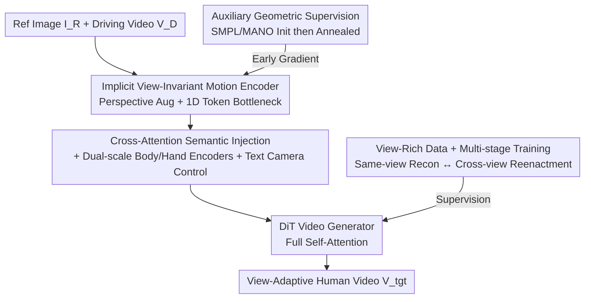

# 3D-Aware Implicit Motion Control for View-Adaptive Human Video Generation

**Conference**: CVPR 2026  
**Paper**: [CVF Open Access](https://openaccess.thecvf.com/content/CVPR2026/html/Fang_3D-Aware_Implicit_Motion_Control_for_View_Adaptive_Human_Video_Generation_CVPR_2026_paper.html)  
**Code**: [Project Page](https://hjrphoebus.github.io/3DiMo) (Repository not yet available)  
**Area**: Video Generation / Diffusion Models / Human Animation  
**Keywords**: Human Motion Control, Implicit Motion Representation, 3D Awareness, Video Diffusion, Text-to-Camera Control

## TL;DR
3DiMo shifts human motion control from "relying on external SMPL reconstruction" to "jointly learning a set of view-invariant implicit motion tokens end-to-end with the video generator." By leveraging cross-attention semantic injection and multi-view rich data supervision, the model recovers genuine 3D motion from 2D driving frames. This allows for faithful action reproduction while supporting free camera viewpoint control via text, with results significantly exceeding 2D pose and SMPL baselines in motion fidelity and image quality.

## Background & Motivation
**Background**: Human image animation (driving a reference image with the motion from a driving video) currently focuses on feeding "explicit motion signals" to the generator. One category uses 2D poses/DensePose (AnimateAnyone, MimicMotion) injected via pixel alignment; another uses parametric 3D meshes like SMPL(-X) (Uni3C, MTVCrafter), which are rendered or projected into 2D for control.

**Limitations of Prior Work**: 2D poses strictly couple the motion to the **driving viewpoint**—the generated video is essentially a 2D projection of the driving view, making it impossible to change perspectives or perform cinematic camera movements. Explicit 3D methods like SMPL seemingly introduce geometry, but parametric reconstruction suffers from depth ambiguity (errors in forward leaning, limb contact, and Z-axis motion distortion) and inaccurate dynamics. Worse, when these **biased 3D signals are imposed on the generator via rigid projection alignment**, they **suppress the inherent 3D priors of the large model**, leading to less reasonable motion.

**Key Challenge**: Large-scale video generators already possess strong 3D spatial and motion reasoning capabilities. Controlling them with "externally reconstructed explicit constraints" is equivalent to making a 3D-aware model follow an unaware teacher, causing conflict between the two.

**Goal**: To enable the model to **implicitly recover underlying 3D motion** from 2D driving frames while decoupling camera control to be freely directed by text.

**Key Insight**: The authors advocate for two principles: (1) The motion encoder should be **jointly trained end-to-end** with the generator so that motion representations naturally align with the generator's spatial priors, rather than relying on rigid projections. (2) To force true 3D awareness, **cross-view supervision** must be used, as reconstruction within the same viewpoint only leads the model to learn 2D projection rules.

**Core Idea**: Replace "external SMPL reconstruction" with "view-invariant implicit motion tokens learned jointly with the generator," and enforce cross-view motion consistency using view-rich data, allowing 3D awareness and text-based camera control to emerge naturally.

## Method

### Overall Architecture
Given a reference image $I_R$ and a driving video $V_D=\{I_D^t\}$, 3DiMo transfers the motion—which **inherently exists in 3D space** in the driving video—to the reference subject while maintaining the camera trajectory specified by text. The pipeline is as follows: driving frames undergo random perspective transformation augmentation → fed into motion encoders (body encoder $E_b$ + hand encoder $E_h$) to be distilled into compact 1D motion tokens → injected into a pre-trained DiT video generator via cross-attention to interact with reference image tokens and text tokens in full self-attention → the generator outputs the target video $V_{tgt}$, where the reference subject performs the same 3D motion while the camera follows the text instructions.

Training involves two parallel supervisory goals: **same-view reconstruction** (outputting the driving video itself) and **cross-view reenactment** (outputting a video of the same action captured from a different perspective/camera trajectory). This is driven by a view-rich dataset covering single-view, multi-view, and moving-camera samples. In early stages, a lightweight geometric decoder is attached to regress motion features to SMPL/MANO parameters for initialization, which is then annealed to zero during training. During inference, the encoder extracts motion tokens directly from 2D driving frames to drive any reference character.

### Key Designs

**1. Implicit View-Invariant Motion Encoder: Using 1D Token Bottleneck to Discard 2D Layouts**

The pain point is that 2D poses bind motion to the driving perspective. The authors solve this by designing the motion encoder as a Transformer-based 1D tokenizer: each frame is patchified into visual tokens, concatenated with $K=5$ learnable latent tokens, and processed through several attention layers. **Only the output latent tokens** are kept as the motion representation. This "compression into minimal 1D tokens" creates a semantic bottleneck that forces the removal of 2D structural information—discarding appearance details and view-specific pose layouts, leaving only the intrinsic semantics of 3D spatial motion. To further enforce view-invariance, **random perspective transformations** (motion-invariant augmentation) are applied to driving frames before encoding to decouple spatial motion from its view-specific 2D projection; color jittering and other appearance augmentations are added to prevent identity leakage from the driving frames. Compared to works like X-Nemo or X-UniMotion that also use implicit representations, the critical difference is that the latter remain in 2D spatial modes and cannot generalize to true 3D motion or camera control, whereas the 1D bottleneck + perspective augmentation + joint training form the combination required to achieve 3D awareness.

**2. Cross-Attention Semantic Injection + Dual-Scale Encoding + Text Camera Control: Decoupling Motion and Camera**

To avoid using explicit camera parameters to convert motion into view-dependent 2D aligned control, the authors inject motion tokens directly via **cross-attention**: a cross-attention layer is added after each full self-attention in the DiT, where **video tokens only attend to motion tokens, while text tokens remain unchanged**. This makes the motion interaction "semantic" rather than a rigid spatial constraint. Consequently, the generator's native capability for text-driven camera control is preserved—to change the perspective, one simply adds a camera movement description to the text (e.g., "the camera arcs left"), utilizing the original DiT text-to-visual pathway. In other words, motion control follows the cross-attention path while camera control follows the text path, naturally decoupling the two. Camera control becomes a byproduct of 3D awareness and a litmus test for "whether true 3D was learned." Since a single compact representation struggles to capture both full-body macro-motions and fine-grained hand movements, the authors use a **dual-scale** approach with two encoders—a body encoder $E_b$ for coarse-grained torso motion and a hand encoder $E_h$ for detailed gestures. The tokens are concatenated as $z=[z_b; z_h]$ for unified control.

**3. View-Rich Data + Multi-Stage Training: Forcing True 3D via Cross-View Supervision**

A 1D bottleneck alone is insufficient: if only **same-view reconstruction** is performed, the model can cheat by learning "view-dependent 2D motion patterns," as same-view reenactment does not require true spatial reasoning. The authors counter this by constructing a view-rich dataset with three types of samples: (1) Same-view reconstruction (self-supervised learning of expressive motion dynamics); (2) Multi-view reenactment (synchronous multi-view videos of the same action to force cross-view motion consistency); (3) Reenactment under a moving camera (different camera trajectories for the same action to decouple motion from viewpoint). The data sources include ~600K internet videos (large-scale, diverse motion but single-view), ~60K UE5 renders (precise motion + diverse camera trajectories but with domain gap), and ~100K real multi-view/moving-camera captures (true 3D supervision). Text descriptions for camera views/movements are annotated using Qwen2.5-VL. Training follows a **progressive multi-stage** strategy: Stage 1 uses only single-view data for self-reconstruction to stabilize the motion learning; Stage 2 introduces a balanced mix of reconstruction and cross-view reenactment to transition representation from 2D dynamics to 3D spatial semantics; Stage 3 exclusively uses multi-view and moving-camera data to strengthen view-invariance and compatibility with text-based camera control. Notably, the reference image is taken from the first frame of the supervision target, automatically aligning the generated motion with the orientation of the reference subject.

**4. Auxiliary Geometric Supervision Annealing: Using SMPL as a Scaffold**

Direct end-to-end training is slow and unstable, especially with cross-view supervision. This is because diffusion loss is uniformly distributed across pixels and lacks specific emphasis on motion semantics; moreover, the powerful DiT backbone tends to rely on its own priors to generate plausible-looking videos from a single image, resulting in weak gradient feedback for the motion representation. The authors attach a lightweight MLP geometric decoder $D_g$ to regress the concatenated motion representation $z=[z_b; z_h]$ to pose parameters $\theta=[\theta_b; \theta_h]$, with pseudo-labels provided by off-the-shelf SMPL/MANO estimators. **Crucially, global root orientation is excluded** during supervision to ensure view-invariant learning. Although SMPL has depth ambiguities, as an "optimizable lightweight auxiliary decoder," it efficiently injects robust 3D human priors for good initialization. This supervision is applied only during Stage 1 and the early part of Stage 2, with its weight **gradually annealed** and completely removed thereafter. This allows the model to evolve from "geometry-guided initialization" to "motion representation aligned with DiT's perception and generation," eventually outgrowing external estimators to develop genuine 3D awareness.

### Loss & Training
The primary objective is the v-prediction reconstruction loss for flow-based diffusion (applied to both same-view and cross-view target videos). The auxiliary geometric loss is the regression from motion features to SMPL/MANO pose parameters, with the weight annealed to zero over time. The three stages run for 10K / 15K / 5K steps respectively, using 121 frames at 480×854 resolution, batch size 64, Adam optimizer with lr 1e-5, and complete in approximately three days.

## Key Experimental Results

### Main Results
Evaluated on 50 TikTok videos and 100 internet videos, with baselines including 2D pose-based (AnimateAnyone, MimicMotion) and 3D SMPL-based (Uni3C, MTVCrafter) methods. Since most baselines do not support camera manipulation, 3DiMo is tested with a "static camera" prompt for these comparisons.

| Method | SSIM↑ | PSNR↑ | LPIPS↓ | FID↓ | FVD↓ |
|------|-------|-------|--------|------|------|
| AnimateAnyone (2D) | 0.7325 | 17.21 | 0.2754 | 68.72 | 862.5 |
| MimicMotion (2D) | 0.7051 | 16.83 | 0.3286 | 62.45 | 628.2 |
| MTVCrafter (SMPL) | 0.7489 | 18.03 | 0.2542 | 57.21 | 379.6 |
| Uni3C (SMPL) | 0.7185 | 17.53 | 0.2639 | 41.28 | 321.9 |
| **Ours (3DiMo)** | 0.7390 | 17.96 | **0.2206** | **36.92** | **297.4** |

3DiMo leads significantly in LPIPS, FID, and FVD. Although SSIM/PSNR are slightly lower than MTVCrafter, the authors explain this is **expected**: these pixel-level metrics are sensitive to slight view shifts, and some evaluation videos contain unintended camera movements. While 2D baselines mimic these shifts due to their alignment paradigm, 3DiMo's "static camera" prompt suppresses such drift to maintain geometric consistency, leading to better perception but higher pixel-level ground truth variance. User studies (30 participants, 5-point Likert scale) ranked 3DiMo first in all four dimensions, particularly in motion naturalness (4.18) and 3D physical plausibility (4.05).

### Ablation Study

| Configuration | SSIM↑ | PSNR↑ | LPIPS↓ | FID↓ | FVD↓ | Note |
|------|-------|-------|--------|------|------|------|
| w/ SMPL ctrl. | 0.724 | 17.1 | 0.238 | 39.7 | 348.2 | Uses SMPL poses as rep; reproduces depth errors |
| w/ stage 1 only | 0.745 | 18.3 | 0.220 | 40.5 | 305.4 | Only same-view recon; collapses to 2D projections |
| w/ stage 1 & 2 | 0.723 | 17.9 | 0.221 | 38.2 | 314.5 | Missing stage 3; camera only moves background |
| w/ channel concat. | 0.703 | 16.8 | 0.304 | 48.2 | 395.6 | Channel concat instead of cross-attn; poor control |
| w/o geo. superv. | 0.684 | 15.8 | 0.347 | 51.3 | 383.1 | No geo supervision; motion control collapses |
| w/o hand enc. | 0.726 | 17.5 | 0.234 | 38.1 | 298.7 | No hand encoder; fine gestures lost |
| **Full Model** | 0.739 | 18.0 | **0.221** | **36.9** | **297.4** | Complete model |

### Key Findings
- **Geometric supervision is most critical**: Removing it caused LPIPS to jump from 0.221 to 0.347 and FID from 36.9 to 51.3. This confirms that early SMPL initialization is indispensable for stable convergence.
- **Condition injection mechanism matters**: Replacing cross-attention with channel concatenation worsened FVD from 297.4 to 395.6, suggesting semantic interaction is superior to rigid concatenation for motion representation.
- **Implicit vs. Explicit 3D**: In a "hand on hip" driving action seen from the side, SMPL variants lose the physical contact between hand and hip, whereas the implicit representation maintains it correctly, demonstrating stronger 3D spatial awareness.
- **Multi-stage training is for 3D awareness, not just metrics**: While Stage 1 only results show slightly better visual metrics, the model fails to follow camera prompts. The "True 3D understanding" gained in later stages is the core capability that standard metrics may not fully capture.

## Highlights & Insights
- **The paradigm shift is insightful**: Instead of using inaccurate external 3D to constrain a natively 3D-aware generator, it is better to align motion representations with the generator's internal priors. This turns "camera controllability" from an explicit goal into an emergent byproduct of true 3D learning.
- **1D token semantic bottleneck is a transferable trick**: Forcing the removal of 2D structures using minimal latent tokens to isolate motion semantics is a powerful strategy for any conditional generation task seeking to decouple content from viewpoint.
- **Pragmatic auxiliary supervision annealing**: Acknowledging SMPL's inaccuracy but using it as an "optimizable scaffold" to break the cold-start problem, then removing it to avoid bias contamination, is a robust training strategy.
- **Using "text-to-camera control" as a probe for 3D awareness**: This smartly transforms a hard-to-quantify goal (3D learning) into an observable behavioral signal.

## Limitations & Future Work
- **Dependence on a strong DiT backbone**: The method relies on the "built-in 3D prior of the pre-trained generator." Whether this holds for backbones with weaker 3D priors is not discussed. ⚠️ The paper does not specify the exact scale/source of the backbone.
- **High data costs**: High-quality multi-view arrays and moving-camera captures are expensive. Single-view internet data cannot provide 3D supervision, making the reproduction barrier high.
- **Pixel-level metric trade-offs**: Lagging behind SMPL baselines in SSIM/PSNR means this method may not be optimal for scenarios requiring strict pixel-level adherence to driving views.
- **Separate hand encoder**: The need for a separate encoder suggests a single representation cannot yet capture both body and fine-grained hand movements elegantly.

## Related Work & Insights
- **vs. AnimateAnyone / MimicMotion (2D Pose)**: These bind motion to the driving view via 2D pixel alignment, losing depth and causing limb ordering errors. 3DiMo uses view-invariant tokens to recover 3D motion and allow view changes.
- **vs. Uni3C / MTVCrafter (SMPL Explicit 3D)**: These rely on external SMPL reconstruction and rigid projection, suffering from depth ambiguity and prior suppression. 3DiMo uses SMPL only for initialization and then anneals it, aligning better with the generator's internal priors. While Uni3C emphasizes precise trajectory control, 3DiMo focuses on modeling 3D motion from 2D observations.
- **vs. X-Nemo / X-UniMotion (Implicit Representation)**: These remain in 2D spatial modes. 3DiMo advances to true 3D through perspective augmentation, view-rich supervision, and joint training.

## Rating
- **Novelty**: ⭐⭐⭐⭐⭐ High. Reversing motion control from "external constraint" to "internal alignment" is a fresh paradigm.
- **Experimental Thoroughness**: ⭐⭐⭐⭐ Good main experiments and ablations, though backbone details and quantitative error analysis are missing.
- **Writing Quality**: ⭐⭐⭐⭐⭐ Excellent. The derivation of motivations—why SMPL suppresses priors and why same-view recon is insufficient—is very clear.
- **Value**: ⭐⭐⭐⭐ Provides a practical paradigm for 3D-aware human video generation, despite high data requirements.

<!-- RELATED:START -->

## Related Papers

- [\[CVPR 2026\] CineScene: Implicit 3D as Effective Scene Representation for Cinematic Video Generation](cinescene_implicit_3d_as_effective_scene_representation_for_cinematic_video_gene.md)
- [\[CVPR 2026\] Pantheon360: Taming Digital Twin Generation via 3D-Aware 360° Video Diffusion](pantheon360_taming_digital_twin_generation_via_3d-aware_360_video_diffusion.md)
- [\[CVPR 2026\] Generative Video Motion Editing with 3D Point Tracks](generative_video_motion_editing_with_3d_point_tracks.md)
- [\[CVPR 2026\] Let Your Image Move with Your Motion! – Implicit Multi-Object Multi-Motion Transfer](let_your_image_move_with_your_motion_--_implicit_multi-object_multi-motion_trans.md)
- [\[CVPR 2026\] Endless World: Real-Time 3D-Aware Long Video Generation](endless_world_real-time_3d-aware_long_video_generation.md)

<!-- RELATED:END -->
