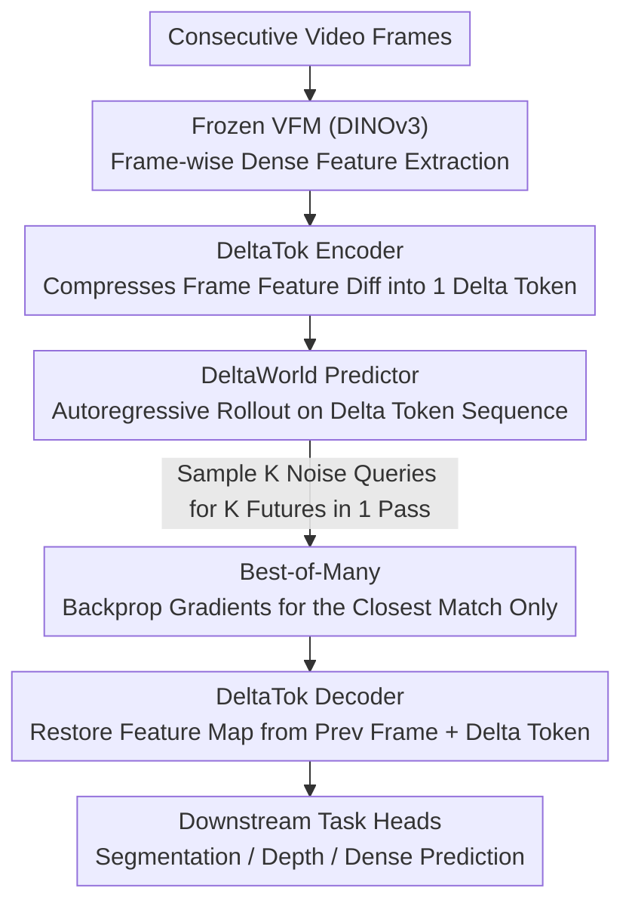

# A Frame is Worth One Token: Efficient Generative World Modeling with Delta Tokens

**Conference**: CVPR 2026  
**arXiv**: [2604.04913](https://arxiv.org/abs/2604.04913)  
**Code**: [deltatok.github.io](https://deltatok.github.io)  
**Area**: Video Generation  
**Keywords**: World models, Delta token, video prediction, frame-difference compression, Best-of-Many training

## TL;DR
The paper introduces DeltaTok, which compresses the VFM feature differences between consecutive frames into a single delta token. Combined with Best-of-Many training, DeltaWorld efficiently generates diverse future predictions in a single forward pass. With only 1/35 the parameters and 1/2000 the FLOPs of Cosmos, it outperforms existing models in dense prediction tasks.

## Background & Motivation
**Background**: World models must predict future states to support autonomous decision-making (e.g., autonomous driving). As the future is inherently uncertain, models need to generate multiple plausible future scenarios.

**Limitations of Prior Work**:
   - **Discriminative World Models**: Produce single deterministic predictions that collapse to the conditional mean under uncertainty, failing to capture diverse futures.
   - **Existing Generative World Models** (e.g., Cosmos): Suffer from inefficiency because: (i) they are optimized for pixel reconstruction rather than semantic understanding; (ii) they require multiple forward passes to generate a single hypothesis; (iii) they fail to exploit spatio-temporal redundancy between frames.

**Key Insight**: In natural videos, differences between consecutive frames are structured and generally low-dimensional—backgrounds remain static while only a small portion of the scene changes. Representing the entire frame as a dense feature map results in significant redundancy.

**Core Idea**: Encode only the changes (delta) between frames instead of the entire frame, compressing the video from a 3D spatio-temporal representation into a 1D time series.

## Method

### Overall Architecture
The core problem addressed is how to make generative world models produce multiple possible futures without being prohibitively slow. The pipeline is built on the observation that differences between consecutive frames are structured and low-dimensional. Instead of representing every frame as a dense feature map, the model encodes what changed from the previous frame. Specifically, a frozen VFM (DINOv3) extracts features for each frame, and DeltaTok compresses the feature difference between adjacent frames into a single delta token. A video is thus compressed from a 3D spatio-temporal tensor into a 1D time series. The DeltaWorld predictor performs generative forecasting on this delta token sequence, providing $K$ future hypotheses in a single forward pass, which are then decoded back into spatial feature maps for downstream task heads.

### Key Designs

**1. DeltaTok: Compressing Entire Feature Map Redundancy into One Delta Token**

Representing a full frame as a dense feature map of $32 \times 32 = 1024$ tokens wastes information on static backgrounds. DeltaTok retains only the "change": the encoder $z_t = g(x_{t-1}, x_t, z_{\text{init}}) \in \mathbb{R}^D$ compresses two adjacent frame features into a single delta token, and the decoder $\hat{x}_t = h(x_{t-1}, z_t)$ reconstructs the current frame using the previous frame and this delta. The system is trained via MSE reconstruction loss $L_{\text{tok}} = \|x_t - \hat{x}_t\|^2$. At a resolution of $512 \times 512$, this equates to a $1024\times$ compression. This high compression ratio is possible because deltas are inherently low-dimensional—"no change" corresponds to simply retaining the previous frame.

**2. Best-of-Many Training: Sampling Multiple Futures in One Forward Pass**

To handle future uncertainty, where discriminative models collapse to mean values and generative models often require iterative denoising, BoM samples $K$ Gaussian noise queries $q^k \sim \mathcal{N}(\mu, \Sigma)$. The model generates $K$ futures simultaneously in one forward pass, and gradients are backpropagated only for the one closest to the ground truth:

$$k^\star = \arg\min_k \sum_{h,w} \ell(x_{t+1,h,w}, \hat{x}^k_{t+1,h,w}), \qquad L_{\text{BoM}} = \sum_{h,w} \ell(x_{t+1,h,w}, \hat{x}^{k^\star}_{t+1,h,w})$$

Since the model operates on the compressed single-token delta sequence, the overhead for sampling hundreds of hypotheses is negligible, making multi-hypothesis prediction the default setting.

**3. DeltaWorld: Autoregressive Future Rollout via Delta Tokens**

The predictor operates directly on the delta token sequence, $\hat{z}_{t+1} = f(q^k, Z_{1:t}, T_{1:t}, \tau_{t+1})$, and the BoM loss is calculated in the delta token space. The predictor accounts for only about 0.5% of the total inference FLOPs, with most computation spent on the frozen VFM. Generation follows an autoregressive rollout, appending predicted delta tokens to the context window. The first frame is handled by computing its difference against a black background frame to represent absolute features.

### Loss & Training
- DeltaTok trained separately for 50K iterations.
- DeltaWorld predictor trained for 300K iterations + 5K low-learning-rate fine-tuning.
- $K = 256$ (samples during BoM training), 20 samples during evaluation.
- VFM: DINOv3 ViT-B; Predictor: ViT-B.

## Key Experimental Results

### Main Results

| Method | GFLOPs↓ | VSPW mIoU (Mid) | Cityscapes mIoU (Mid) | KITTI RMSE (Mid) |
|------|---------|------|------|------|
| DINO-world (Discrim.) | 5.8K | 47.9 | 49.8 | 4.07 |
| Cosmos-4B | 60M | 47.0 (44.5) | 49.1 (48.4) | 4.08 (4.14) |
| Cosmos-12B | 64M | 47.7 (45.5) | 53.3 (51.2) | 4.01 (4.14) |
| **DeltaWorld** | **31K** | **50.1 (46.7)** | **55.4 (51.3)** | **3.88 (4.17)** |

*Values in parentheses are mean; others are best-of-20.*

### Ablation Study

| Step | GFLOPs | VSPW best(mean) | Cityscapes best(mean) | Description |
|------|--------|------|------|------|
| (0) Discrim. Baseline | 959 | 44.8 | 45.4 | Mean prediction |
| (1) +BoM | 12013 | 47.0 (39.4) | 46.8 (31.1) | Best improves, mean collapses |
| (2) +Frame Comp. | 6315 | 45.7 (40.3) | 42.7 (35.5) | Efficient but lacks accuracy |
| (3) +Delta Comp. | 6721 | **46.8 (44.4)** | **48.7 (45.5)** | Mean recovers to baseline |

### Key Findings
- DeltaWorld's "best" prediction outperforms Cosmos (both 4B and 12B) while using 1/2000 of the FLOPs.
- Delta vs Frame Compression: Mean mIoU recovered from 35.5 to 45.5 on Cityscapes, proving delta capacity is far more efficient than whole-frame encoding.
- Natural Delta Prior: Predicting "no change" = keep previous frame; the model does not need to re-encode static backgrounds.
- Increasing $K$ in BoM improves the "best" score without sacrificing the "mean" (stabilizes after $K=64$).
- The predictor in delta space accounts for only 0.5% of total inference FLOPs.

## Highlights & Insights
- **Extreme Compression + Quality**: $512 \times 512$ frames compressed to 1 token ($1024\times$) with high reconstructibility.
- **Diversity in Single Forward Pass**: Completely bypasses the iterative denoising steps of diffusion models.
- **Elegant Delta Prior**: The low-dimensional structure of consecutive frame differences matches world modeling requirements perfectly.
- **Mean Recovery**: Recovering the mean to discriminative levels is a crucial validation that diversity is not achieved at the cost of plausibility.

## Limitations & Future Work
- Under severe scene changes (e.g., cuts), a single delta token might be insufficient.
- Error accumulation may occur during autoregressive rollout.
- Verified at the 15M parameter scale; performance on larger models is unexplored.
- Focused on metrics; lacks qualitative analysis of generated diversity.

## Related Work & Insights
- Delta encoding draws from classical video coding (inter-frame compression) but applies it to VFM feature space.
- The advantage of BoM over diffusion is the single forward pass—critical for real-time systems.
- The progression from DINO-world to DeltaWorld provides a clear roadmap from discriminative to efficient generative modeling.

## Rating
- Novelty: ⭐⭐⭐⭐⭐ Combining Delta tokenization + BoM addresses core requirements for efficient generative world models.
- Experimental Thoroughness: ⭐⭐⭐⭐⭐ Progressive ablation across 3 datasets and efficiency analysis is exhaustive.
- Writing Quality: ⭐⭐⭐⭐⭐ Extremely clear presentation of the path from discriminative to efficient generative modeling.
- Value: ⭐⭐⭐⭐⭐ Provides a practical multi-hypothesis prediction solution for scenarios like autonomous driving.

<!-- RELATED:START -->

## Related Papers

- [\[CVPR 2026\] GT-SVJ: Generative-Transformer-Based Self-Supervised Video Judge For Efficient Video Reward Modeling](gt-svj_generative-transformer-based_self-supervised_video_judge.md)
- [\[CVPR 2026\] Towards Holistic Modeling for Video Frame Interpolation with Auto-regressive Diffusion Transformers](towards_holistic_modeling_for_video_frame_interpolation_with_auto-regressive_dif.md)
- [\[CVPR 2026\] YOSE: You Only Select Essential Tokens for Efficient DiT-based Video Object Removal](yose_you_only_select_essential_tokens_for_efficient_dit-based_video_object_remov.md)
- [\[CVPR 2026\] TempoMaster: Efficient Long Video Generation via Next-Frame-Rate Prediction](tempomaster_efficient_long_video_generation_via_next-frame-rate_prediction.md)
- [\[CVPR 2026\] STARFlow-V: End-to-End Video Generative Modeling with Autoregressive Normalizing Flows](starflow-v_end-to-end_video_generative_modeling_with_autoregressive_normalizing_.md)

<!-- RELATED:END -->
