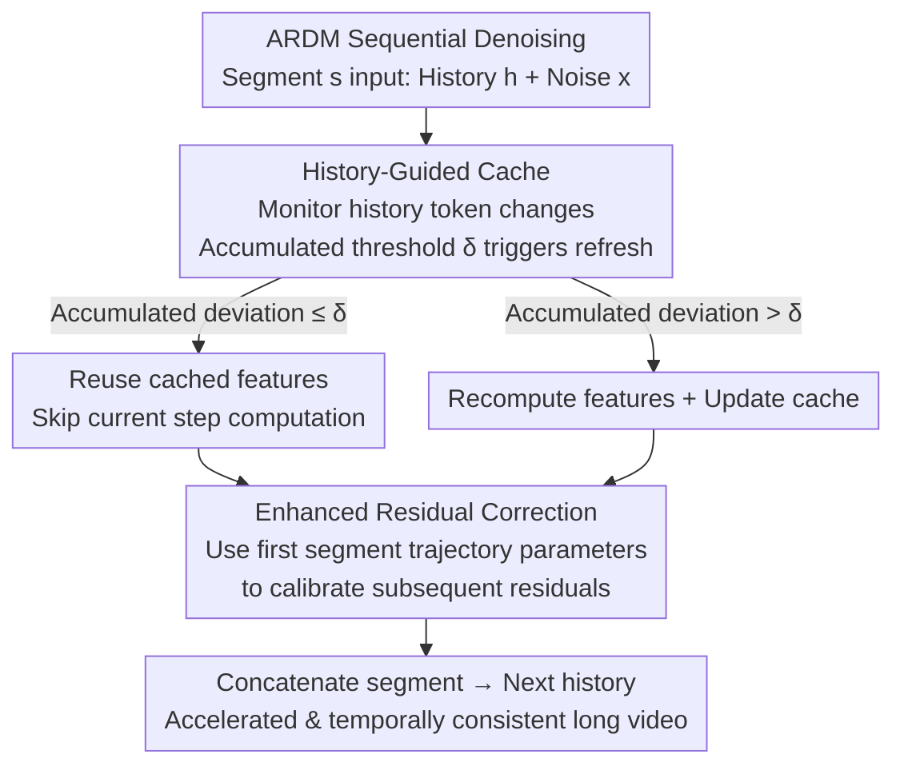

# Accelerating Autoregressive Video Diffusion via History-Guided Cache and Residual Correction

**Conference**: CVPR 2026  
**Paper**: [CVF Open Access](https://openaccess.thecvf.com/content/CVPR2026/html/Nan_Accelerating_Autoregressive_Video_Diffusion_via_History-Guided_Cache_and_Residual_Correction_CVPR_2026_paper.html)  
**Code**: To be confirmed  
**Area**: Video Generation / Diffusion Model Acceleration  
**Keywords**: Autoregressive Video Diffusion, Feature Caching, Error Accumulation, Training-free Acceleration, Residual Correction  

## TL;DR
To address the critical issue in Autoregressive Video Diffusion Models (ARDMs) where "cache approximation errors accumulate and amplify over time" during segment-by-segment generation, this paper proposes the training-free ARCache. It uses History-Guided Cache to schedule caching based on changes in history tokens (suppressing intra-segment errors) and Enhanced Residual Correction to calibrate subsequent segments using the clean residual trajectory of the first segment (preventing inter-segment drift). It achieves up to $3.13\times$ acceleration across three ARDMs with nearly lossless image quality.

## Background & Motivation

**Background**: Video generation is shifting from standard diffusion models (SDMs, generating fixed-length videos at once) to Autoregressive Diffusion Models (ARDMs, such as FramePack-F1, SkyReels-V2, Matrix-Game). The latter decompose long videos into multiple segments, where each segment is synthesized sequentially conditioned on previously generated content (history tokens). This enables variable-length generation, fine-grained temporal control, and interactive world modeling. However, ARDM inference is slow, limiting real-time applications.

**Limitations of Prior Work**: One of the most effective ways to accelerate diffusion is "feature caching"—leveraging feature redundancy between adjacent denoising steps to cache features from one step and reuse them in subsequent steps, thereby skipping redundant computations (e.g., DeepCache, FORA, PAB, TeaCache, TaylorSeer). These methods have been successful in SDMs and are designed to be "paradigm-agnostic," appearing seamlessly integrable into ARDMs. However, the authors found that **directly applying them to ARDMs leads to collapse**—severe artifacts and temporal breakage occur in later segments.

**Key Challenge**: The root cause lies in the fundamental difference between the computation graphs of SDMs and ARDMs. In SDMs, all frames are generated jointly, and approximation errors from caching are confined within a single inference. In ARDMs, each segment depends on the output of the previous segment; **approximation errors introduced in early segments propagate through history conditions and amplify hierarchically** (error accumulation), leading to severe quality degradation in later segments. The speed gained from caching is outweighed by quality loss due to error drift.

**Goal**: Design a caching acceleration framework **tailored for the sequential nature of ARDMs** to suppress error accumulation from two dimensions: ① suppressing approximation errors within a single segment (intra-segment), and ② blocking error propagation across segments (inter-segment).

**Key Insight**: The authors made two critical observations. First, quantitative correlation analysis (Spearman correlation) shows that in ARDMs, **output variation correlates much more strongly with "changes in history tokens" than with "current noise tokens" or "total input."** History tokens are the reliable signal for determining when to refresh the cache, whereas previous methods (like TeaCache) monitor the total input, which is the wrong signal. Second, PCA analysis shows that **residual feature trajectories in non-accelerated ARDMs are highly similar and stable across segments**, and the first segment is particularly clean (free of historical error).

**Core Idea**: Replace "total input monitoring" with "history token monitoring" to decide when to reuse features (HGC), and then use the "clean residual trajectory of the first segment" to calibrate the residuals of subsequent polluted segments (ERC). Together, these accelerate the model while preventing error accumulation from snowballing.

## Method

### Overall Architecture

ARCache is a training-free caching framework that integrates into the denoising loop of any ARDM. ARDMs generate segments sequentially: for segment $s$ at denoising step $t$, the input consists of history tokens $h_t^s$ (encoding previously generated segments) and current noise tokens $x_t^s$. After $T$ denoising steps, the segment is concatenated and serves as history for the next segment. A naive cache (baseline, e.g., PAB) reuses activations at fixed intervals $F([h_{t-k}^s, x_{t-k}^s]) := F([h_t^s, x_t^s])$, which theoretically provides $(N{+}1)\times$ acceleration but causes artifacts to accumulate across segments.

ARCache replaces this naive scheme with two complementary modules: **History-Guided Cache (HGC)** handles "when it is safe to reuse"—it adaptively decides cache refresh timing by monitoring history token variation to minimize intra-segment error; **Enhanced Residual Correction (ERC)** handles "how to prevent drift after reuse"—it uses stable residual trajectory parameters from the first segment to calibrate compromised residuals in subsequent segments, blocking inter-segment error propagation. The pipeline is shown below:

### Key Designs

**1. History-Guided Cache (HGC): Monitoring "History Token Variation" for Cache Timing**

Methods like naive caching and TeaCache judge whether to reuse features by looking at fluctuations in all model inputs. In ARDMs, this is a mismatch. Through Spearman correlation analysis, the authors found that step-by-step output variation is highly correlated with **history token** variation (significantly higher than the "noise token—output" correlation). Once history tokens change, new context is injected, causing an output shift; if history tokens remain static, the output is stable, making reuse safe.

HGC defines a **history deviation metric** to measure the normalized change in history tokens between adjacent denoising steps:

$$\Delta(h_t^s) = \frac{\lVert h_t^s - h_{t+1}^s \rVert_1}{\lVert h_{t+1}^s \rVert_1}$$

It introduces an **accumulation threshold mechanism**: let $t_{ref}$ be the most recent cache refresh step. As long as the accumulated history deviation from $t_{ref}$ does not exceed a tunable threshold $\delta$, feature reuse continues. Once the deviation crosses $\delta$, a refresh is triggered, and $t_{ref}$ is updated to the current step:

$$\sum_{i=t+1}^{t_{ref}} \Delta(h_i^s) \le \delta < \sum_{i=t}^{t_{ref}} \Delta(h_i^s)$$

$\delta$ directly controls the speed-quality trade-off. HGC aligns cache refreshing with the injection of new content, reducing intra-segment approximation errors. In ablation, HGC outperforms IGC (TeaCache-style input monitoring) and CGC (current segment monitoring) at the same speed levels.

**2. Enhanced Residual Correction (ERC): Calibrating Subsequent Segments via First Segment Trajectory**

While HGC solves intra-segment issues, history errors still propagate across segments. A natural thought is to use TaylorSeer, which models features and their derivatives as stable trajectories to predict/correct cached features. However, TaylorSeer operates on layer-wise features, incurring massive memory and computation overhead (leading to OOM on long sequences). More importantly, the authors found that **directly using TaylorSeer to correct subsequent segments leads to further divergence**: PCA shows that accelerated residual trajectories in later segments (e.g., segment 7) deviate from their non-accelerated stable paths because the trajectories themselves are already polluted by history errors.

ERC's breakthrough comes from a PCA observation: residual trajectories of non-accelerated ARDMs are **highly similar and stable across different segments**, and the first segment (which lacks historical error and is purified by HGC) is closest to the ideal trajectory. Thus, ERC replaces polluted current-segment trajectories with **trajectory parameters from the first segment** for all subsequent segments. Specifically, residuals are approximated using a first-order trajectory formula ($r_{t_a}^s, r_{t_b}^s$ are residuals at the two most recent recomputation steps, $t_a < t_b$, $\lambda_t^s$ is the trajectory parameter):

$$r_t^s = r_{t_b}^s + \lambda_t^s\,(r_{t_a}^s - r_{t_b}^s)$$

Since $\lambda_t^s$ becomes unreliable for later segments ($s>1$) due to error accumulation, ERC replaces it with the **stable parameter calculated from the first segment** $\lambda_t^1$:

$$\lambda_t^s = \lambda_t^1 = \frac{L1_{rel}(r_t^1, r_{t_b}^1)}{L1_{rel}(r_{t_a}^1, r_{t_b}^1)},\quad s>1$$

This correction ensures that every segment is pulled back toward a "clean and stable reference," suppressing drift and maintaining temporal consistency. ERC operates only on residuals (not per-layer features), making its overhead negligible—in ablations, adding ERC only increased latency from 96.40s to 96.74s while improving PSNR from 24.13 to 24.79.

## Key Experimental Results

### Main Results

Evaluated on three representative ARDMs (FramePack-F1 for I2V, SkyReels-V2 for T2V, Matrix-Game for interactive world models). Fidelity is measured by PSNR/SSIM/LPIPS (relative to original non-accelerated video) and task-specific benchmarks (VBench / VBench-I2V / GameWorld Score). ARCache provides slow (high quality) and fast (high speed) modes.

| Model | Method | Speedup↑ | PSNR↑ | SSIM↑ | LPIPS↓ | Task Score↑ |
|------|------|---------|-------|-------|--------|-------------|
| FramePack-F1 | PAB (I=2) | 2.86× | 21.19 | 0.6673 | 0.1887 | 88.33% |
| | TeaCache-fast | 2.54× | 22.91 | 0.7110 | 0.1554 | 88.62% |
| | TaylorSeer | 2.03× | 21.36 | 0.6619 | 0.2023 | 88.65% |
| | **ARCache-slow** | 1.51× | **28.13** | **0.8408** | **0.0770** | **88.82%** |
| | **ARCache-fast** | **2.88×** | 24.34 | 0.7659 | 0.1254 | 88.81% |
| SkyReels-V2 | TeaCache-slow | 1.40× | 26.65 | 0.8575 | 0.1048 | 77.28% |
| | TaylorSeer | OOM | OOM | OOM | OOM | OOM |
| | **ARCache-slow** | 1.53× | **29.10** | **0.8835** | **0.0852** | 77.47% |
| | **ARCache-fast** | **1.87×** | 25.70 | 0.8389 | 0.1223 | 77.04% |
| Matrix-Game | TeaCache-fast | 3.06× | 18.41 | 0.6775 | 0.3282 | 78.95% |
| | TaylorSeer | OOM | OOM | OOM | OOM | OOM |
| | **ARCache-slow** | 1.63× | **22.77** | **0.7811** | **0.2306** | **79.39%** |
| | **ARCache-fast** | **3.13×** | 19.37 | 0.7093 | 0.3016 | 79.07% |

**Key Findings:** ① ARCache-slow yields the best PSNR/SSIM/LPIPS across all models; ② ARCache-fast provides $2.88\times$ / $1.87\times$ / $3.13\times$ speedup while remaining competitive; ③ TaylorSeer suffers from OOM on long sequences, and PAB's static cache collapses on SkyReels-V2 (PSNR 14.77), highlighting the unreliability of static scheduling for dynamic content.

### Ablation Study (FramePack-F1, 200 random samples)

| Configuration | Value | Speedup | PSNR↑ | SSIM↑ | LPIPS↓ |
|------|------|--------|-------|-------|--------|
| IGC (=TeaCache) | δ=0.10 | 1.49× | 22.93 | 0.7953 | 0.1323 |
| CGC (Current Segment) | δ=0.10 | 1.49× | 22.80 | 0.7870 | 0.1382 |
| **HGC (History, Ours)** | δ=0.10 | 1.52× | **24.13** | **0.8169** | **0.1159** |
| HGC | δ=0.20 | 2.59× | 22.93 | 0.7991 | 0.1265 |
| HGC | δ=0.30 | 2.88× | 20.89 | 0.7413 | 0.1815 |
| HGC w/o ERC | δ=0.10 | 1.52× | 24.13 | 0.8169 | 0.1159 |
| **HGC w/ ERC** | δ=0.10 | 1.51× | **24.79** | **0.8266** | **0.1117** |

### Key Findings
- **History monitoring is correct**: At $\delta=0.10$, HGC outperforms IGC (TeaCache) by 1.2 PSNR, validating that ARDM output is more dependent on history tokens.
- **$\delta$ is a clean speed knob**: Increasing $\delta$ from 0.10 to 0.30 boosts speedup from $1.52\times$ to $2.88\times$ with a controllable quality drop.
- **ERC is nearly free**: Adding ERC barely changed latency (96.40s to 96.74s) while improving PSNR by +0.66, effectively suppressing drift.

## Highlights & Insights
- **Identifies "error accumulation" as the fundamental bottleneck** for ARDM cache acceleration and solves it by distinguishing intra- and inter-segment issues (HGC + ERC). This intra/inter perspective is transferable to any sequential generation + caching scenario.
- **"Monitoring history tokens instead of full input" is a cheap yet effective signal shift**: Changing the monitoring target from $x$ to $h$ significantly improves quality at zero cost, backed by solid correlation analysis.
- **"Borrowing the clean trajectory of the first segment" is clever**: Instead of trying to fix a polluted current trajectory, it leverages ARDM's cross-segment residual similarity to reuse the "clean reference" of the first segment throughout the video.
- **Completely training-free**: Plug-and-play compatibility with multiple ARDMs like FramePack-F1, SkyReels-V2, and Matrix-Game.

## Limitations & Future Work
- **Reliance on manual threshold $\delta$**: A core limitation is that $\delta$ requires manual tuning for different models/content. Future work should explore threshold-free adaptive caching.
- **Visible degradation in fast mode**: In high-speed settings (large $\delta$), PSNR/SSIM drop significantly (e.g., PSNR 24.34 in fast mode vs 28.13 in slow mode). It is not "lossless," but rather superior to baselines.
- **ERC Assumption**: ERC assumes the first segment is clean and trajectories across segments are similar. If the first segment is poor or if scene cuts create extreme differences, the calibration effectiveness might decrease (not extensively discussed in the paper).

## Related Work & Insights
- **vs TeaCache**: TeaCache monitors all model input fluctuations (IGC in ablations), ignoring ARDM's unique history-output correlation. ARCache outperforms it by focusing on history tokens.
- **vs TaylorSeer**: TaylorSeer uses per-layer Taylor corrections, causing OOM on long sequences and amplifying errors on polluted trajectories. ARCache uses only negligible-overhead residual correction via stable first-segment parameters.
- **vs PAB**: PAB uses fixed-interval static caching, which fails on dynamic content. ARCache's adaptive scheduling is better suited for ARDM's dynamic history.

## Rating
- Novelty: ⭐⭐⭐⭐ First training-free cache framework specifically for ARDMs; intra/inter error decomposition + history signaling + first-segment trajectory calibration are insightful.
- Experimental Thoroughness: ⭐⭐⭐⭐ Three tasks, three models, four baseline categories, and extensive ablation studies. Lacks comparison with training-based methods.
- Writing Quality: ⭐⭐⭐⭐ Clear logic from motivation to analysis to method; figures provide strong empirical support.
- Value: ⭐⭐⭐⭐ Addresses real-time video generation/world model bottlenecks; high engineering value due to its plug-and-play nature.

<!-- RELATED:START -->

## Related Papers

- [\[AAAI 2026\] FilmWeaver: Weaving Consistent Multi-Shot Videos with Cache-Guided Autoregressive Diffusion](../../AAAI2026/video_generation/filmweaver_weaving_consistent_multi-shot_videos_with_cache-guided_autoregressive.md)
- [\[CVPR 2026\] RFDM: Residual Flow Diffusion Models for Video Editing](rfdm_residual_flow_diffusion_models_for_video_editing.md)
- [\[CVPR 2026\] DisCa: Accelerating Video Diffusion Transformers with Distillation-Compatible Learnable Feature Caching](disca_accelerating_video_diffusion_transformers_wi.md)
- [\[CVPR 2026\] Accelerating Diffusion-based Video Editing via Heterogeneous Caching: Beyond Full Computing at Sampled Denoising Timestep](accelerating_diffusion-based_video_editing_via_heterogeneous_caching_beyond_full.md)
- [\[ICML 2026\] Light Forcing: Accelerating Autoregressive Video Diffusion via Sparse Attention](../../ICML2026/video_generation/light_forcing_accelerating_autoregressive_video_diffusion_via_sparse_attention.md)

<!-- RELATED:END -->
