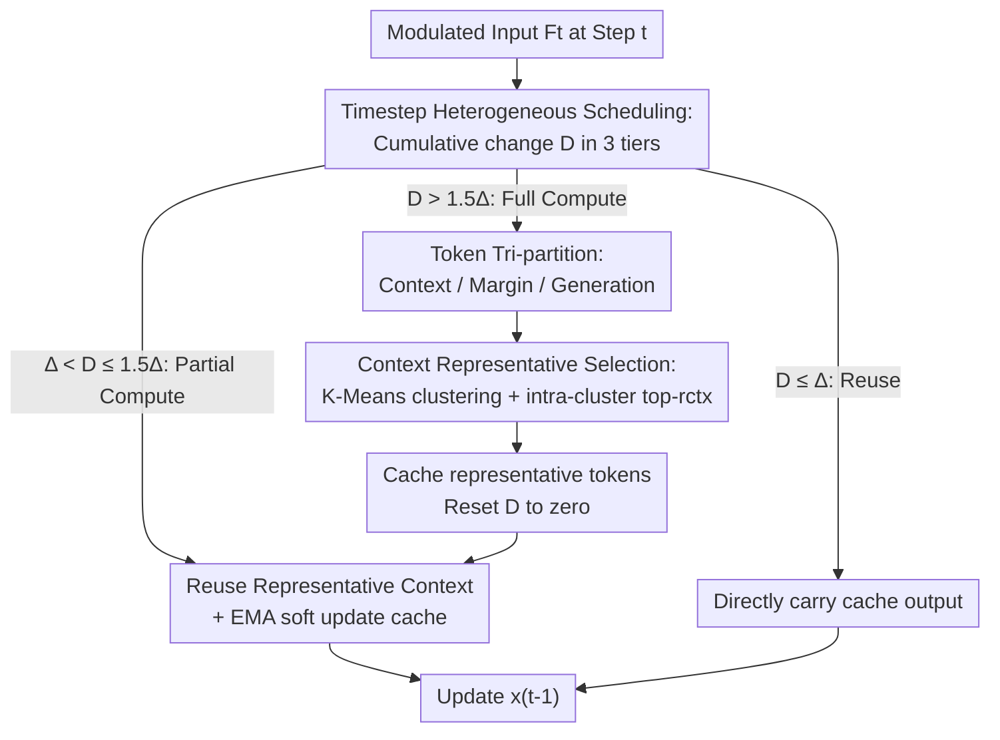

# Accelerating Diffusion-based Video Editing via Heterogeneous Caching: Beyond Full Computing at Sampled Denoising Timestep

**Conference**: CVPR 2026  
**Paper**: [CVF Open Access](https://openaccess.thecvf.com/content/CVPR2026/html/Liu_Accelerating_Diffusion-based_Video_Editing_via_Heterogeneous_Caching_Beyond_Full_Computing_CVPR_2026_paper.html)  
**Code**: To be confirmed  
**Area**: Video Generation / Diffusion Model Acceleration  
**Keywords**: Video Editing, Diffusion Transformer, Feature Caching, Token Heterogeneity, Training-free Acceleration  

## TL;DR
For masked video editing (MV2V) tasks, this paper proposes HetCache, a training-free framework: it categorizes denoising steps into "full, partial, or reuse" based on cumulative change across timesteps, and partitions tokens into "context, margin, or generation" based on mask spatial priors within a single step. By performing attention only on the most semantically representative context tokens, it achieves a 2.67× speedup on Wan2.1-VACE with almost no drop in visual quality.

## Background & Motivation

**Background**: Diffusion models (especially Diffusion Transformers or DiTs) have become the mainstream for high-quality video editing, offering flexibility in tasks such as mask completion, object replacement, and text-guided editing. However, two characteristics make DiT inference extremely slow: first, denoising requires dozens or hundreds of iterations, with a forward pass per step; second, dense self-attention between spatio-temporal tokens inside each step results in complexity that grows quadratically with the number of tokens.

**Limitations of Prior Work**: Existing training-free acceleration methods almost exclusively focus on redundancy in the **timestep dimension**—caching and reusing intermediate features from adjacent denoising steps (e.g., TeaCache, PAB, AdaCache). They ignore redundancy **within the DiT architecture**: much of the attention calculation between spatio-temporal tokens is repetitive and contributes negligibly to the final output. In other words, while steps are saved, the full set of tokens is still computed in any active step.

**Key Challenge**: Video editing (MV2V) naturally involves a "Region of Interest (ROI)"—the masked area is the content to be generated, while the unmasked area provides reference context. The importance of these two token types is highly unbalanced: masked (generation) tokens must be fully updated at each step to ensure editing fidelity, while unmasked (context) tokens only need to provide **sparse but strong** semantic guidance. Applying **uniform** caching/reuse to all tokens in a timestep, as in general video generation, damages reconstruction quality in the masked region.

**Key Insight**: The authors observe a critical obstacle—the "representativeness" of context tokens and their "interaction intensity with the generation region" can only be observed **after computing attention**. One cannot know which context tokens are worth keeping beforehand. Thus, a mechanism is needed: measure the importance of these tokens during a full computation step, cache them, and directly reuse this representative subset in subsequent steps.

**Core Idea**: Both denoising timesteps and context tokens contribute **heterogeneously** to the final quality. Since they are unequal, selective caching should be performed "by dimension and by category" rather than applying uniform reuse or random sampling.

## Method

### Overall Architecture

HetCache is a training-free caching framework. Given a masked video editing task (latent $x_T$, text/structural conditions), it outputs the denoised $x_0$. The acceleration occurs during the sampling loop without modifying model weights. It synergizes "computation savings" across two orthogonal dimensions:

- **Timestep Dimension (Step Scheduling)**: A lightweight proxy estimates the "magnitude of output change" for each denoising step, categorizing steps into **Full-compute / Partial-compute / Reuse** modes. Full computation is reserved for steps with large changes, while stable steps reuse caches.
- **Token Dimension (Intra-step Selection)**: In full-compute steps, spatial priors from the mask partition spatio-temporal tokens into **Context / Margin / Generation**. The redundant context tokens are filtered to a small representative subset based on "semantic representativeness + interaction intensity with generation tokens" for reuse in subsequent partial-compute steps.

The synergy lies in: step scheduling determines **when** to save, while token selection determines **what** to save. Caches are established in full-compute steps, updated softly via EMA in partial-compute steps, and directly carried over in reuse steps. The flowchart below illustrates the switching between the three modes and the token tri-partition within a full-compute step.

### Key Designs

**1. Timestep Heterogeneous Scheduling: Classifying steps into Full/Partial/Reuse using cumulative "Modulated Input Change"**

Timestep redundancy stems from the fact that adjacent steps often change minimally. HetCache follows the observation that changes in the modulated noise input are strongly correlated with changes in model output. It calculates single-step relative change as a lightweight proxy: let the modulated input be $F_t = T_t \odot x_t$ (where $x_t$ is the latent and $T_t$ is the timestep embedding), then the difference is:

$$L_1^{rel}(F,t) = \frac{\lvert F_t - F_{t+1}\rvert_1}{\lvert F_{t+1}\rvert_1}.$$

Crucially, it **accumulates** these differences over consecutive steps: $D_{a\to b} = \sum_{t=a}^{b-1} L_1^{rel}(F,t)$. Given a threshold $\Delta$, it classifies step $b$ into: ① **Full Compute** ($D > 1.5\Delta$), where a complete forward pass refreshes the cache; ② **Partial Compute** ($\Delta < D \le 1.5\Delta$), where only a subset of tokens is recomputed and the cache is updated via EMA; ③ **Reuse** ($D \le \Delta$), where the cached output is used directly. This adaptively allocates the budget based on actual trajectory changes.

**2. Mask Spatial Prior Token Tri-partition: Distinguishing "Must-Update" from "Sampleable" tokens**

Inside a single step, editing tasks have unbalanced token importance. Using the spatial prior from the mask $M$, tokens are divided into: **Generation tokens** (masked area, core for editing), **Margin tokens** (unmasked area adjacent to the mask, crucial for boundary smoothness), and **Context tokens** (unmasked area far from the mask, providing global consistency). While Generation and Margin tokens are vital for fidelity and local fusion, the dense **Context-Context** interactions dominate the $O(X^2)$ complexity but contribute little. Thus, Generation and Margin tokens are fully preserved, while Context tokens are designated for sampling.

**3. Context Representative Selection: Identifying key tokens via Clustering + Attention Importance**

The challenge is selecting representative context tokens without damaging semantic guidance. HetCache performs lightweight K-Means clustering on the context set $X_{ctx}$ to get $K$ semantic clusters $\{S_k\}$. It then estimates importance using the **cached sparse context-to-generation attention scores**:

$$\alpha_i = \frac{1}{|X_{gen}|}\sum_{j\in X_{gen}} \bar{A}_{i,j},$$

where $\alpha_i$ indicates the contribution of context token $i$ to the ROI. The top-$r_{ctx}$ proportion of tokens within **each cluster** are selected for the representative set $X^\star_{ctx}$. This reduces context token count from $X_l$ to $r_{ctx}X_l$ and attention complexity to $O((r_{ctx}X_l+X_m+X_n)^2)$. Clustering within groups ensures broad semantic coverage compared to uniform or random sampling.

## Key Experimental Results

Experiments used Wan-2.1-VACE as the backbone. HetCache was compared against TeaCache. "Slow" and "fast" modes correspond to thresholds $\Delta=0.05$ and $0.02$, with $r_{ctx}=0.7$ and $K=16$.

### Main Results

VACE-Benchmark Video Inpainting (Relative to 100-step Wan2.1-VACE baseline):

| Method | FLOPs(P)↓ | Latency(s)↓ | Speedup↑ | PSNR↑ | VFID↓ | VBench(%)↑ |
|------|-----------|----------|-------|-------|-------|-----------|
| Wan2.1-VACE (100 steps) | 145.21 | 445.52 | 1.00× | 16.06 | 57.18 | 76.54 |
| TeaCache-fast | 36.30 | 186.45 | 2.53× | 16.51 | 54.86 | 76.80 |
| HetCache-slow | 30.68 | 176.31 | 2.53× | 16.50 | 54.73 | 76.58 |
| **HetCache-fast** | **23.60** | **166.81** | **2.67×** | **16.58** | **54.51** | 75.88 |

At similar speedup tiers, HetCache reduces FLOPs by ~35% compared to TeaCache-fast (23.60 vs 36.30) with slightly better PSNR/VFID, indicating it prunes genuine redundancy.

### Ablation Study

Removing components of token-level caching (VACE-Benchmark):

| Configuration | Context | Correlation | Speedup↑ | PSNR↑ | VFID↓ | VBench↑ |
|------|:--:|:--:|-------|-------|-------|---------|
| HetCache-- | ✗ | ✗ | 3.13× | 16.60 | 54.54 | 76.19 |
| HetCache- (Context only) | ✓ | ✗ | 2.93× | 16.54 | 54.75 | 75.80 |
| HetCache- (Correlation only) | ✗ | ✓ | 2.51× | 16.60 | 55.36 | 76.24 |
| **HetCache (Full)** | ✓ | ✓ | 2.67× | 16.58 | **54.51** | **76.29** |

### Key Findings
- **Synergy is Required**: Using only Context or Correlation results in worse VFID (54.75 / 55.36 vs 54.51). Uniform/random sampling (HetCache--) achieve higher speedup (3.13x) but weaken semantic guidance, confirming that low-quality context tokens drag down the target area.
- **Large Context is Safer**: Larger $r_{ctx}$ (retaining more context tokens) leads to more robust performance.
- **K is Not "Larger is Better"**: $K$ affects PSNR non-monotonically, suggesting an effective capacity for the semantic structure of context.

## Highlights & Insights
- **Dual-Dimension Redundancy**: Traditional caching only saves at the timestep level. HetCache is the first to orthogonally combine step scheduling and intra-step token selection for additive gains.
- **ROI-Driven Token Tri-partition**: Utilizing the "free prior" of the edit mask to prioritize tokens ensures that acceleration occurs where it hurts fidelity the least.
- **Training-free & Plug-and-play**: It requires no weight modification or retraining, making it compatible with various DiT backbones like Wan and LTX.
- **Transferable Logic**: The "cluster then intra-cluster top-k by interaction" strategy can be applied to other ROI-based tasks like image inpainting or controllable generation.

## Limitations & Future Work
- **Dependency on Mask Priors**: Specifically designed for MV2V; its advantages diminish in general video generation without clear context/generation splits.
- **Manual Hyperparameters**: $\Delta$, $r_{ctx}$, and $K$ are hand-tuned. Adaptive mechanisms based on attention entropy or cumulative change could be more robust.
- **Quality Trade-offs**: In "fast" modes, some metrics (e.g., VBench 75.88) show slight regression compared to the baseline, a common trade-off for extreme acceleration.

## Related Work & Insights
- **vs. TeaCache**: While TeaCache estimates output change for step-level reuse, it treats all tokens as a homogeneous block. HetCache introduces heterogeneous token selection, achieving lower FLOPs at the same speedup tier.
- **vs. Pruning/Quantization**: Architecture-level optimizations typically require fine-tuning or calibration; HetCache is purely inference-time.
- **vs. Sampler Acceleration**: Methods like high-order ODE solvers or step distillation reduce step count and are orthogonal to HetCache’s intra-step caching.

## Rating
- Novelty: ⭐⭐⭐⭐ Orthogonal synergy of temporal and spatial redundancy with ROI-aware selection is innovative.
- Experimental Thoroughness: ⭐⭐⭐⭐ Solid coverage across tasks, backbones, and ablations.
- Writing Quality: ⭐⭐⭐⭐ Clear motivation and methodology; pseudo-code is helpful.
- Value: ⭐⭐⭐⭐ High practical value for enabling real-time interactive video editing on DiT models.

<!-- RELATED:START -->

## Related Papers

- [\[ICLR 2026\] BWCache: Accelerating Video Diffusion Transformers through Block-Wise Caching](../../ICLR2026/video_generation/bwcache_accelerating_video_diffusion_transformers_through_block-wise_caching.md)
- [\[ICML 2026\] WorldCache: Accelerating World Models for Free via Heterogeneous Token Caching](../../ICML2026/video_generation/worldcache_accelerating_world_models_for_free_via_heterogeneous_token_caching.md)
- [\[CVPR 2026\] DisCa: Accelerating Video Diffusion Transformers with Distillation-Compatible Learnable Feature Caching](disca_accelerating_video_diffusion_transformers_wi.md)
- [\[CVPR 2026\] Accelerating Autoregressive Video Diffusion via History-Guided Cache and Residual Correction](accelerating_autoregressive_video_diffusion_via_history-guided_cache_and_residua.md)
- [\[ICLR 2026\] Flow Caching for Autoregressive Video Generation](../../ICLR2026/video_generation/flow_caching_for_autoregressive_video_generation.md)

<!-- RELATED:END -->
