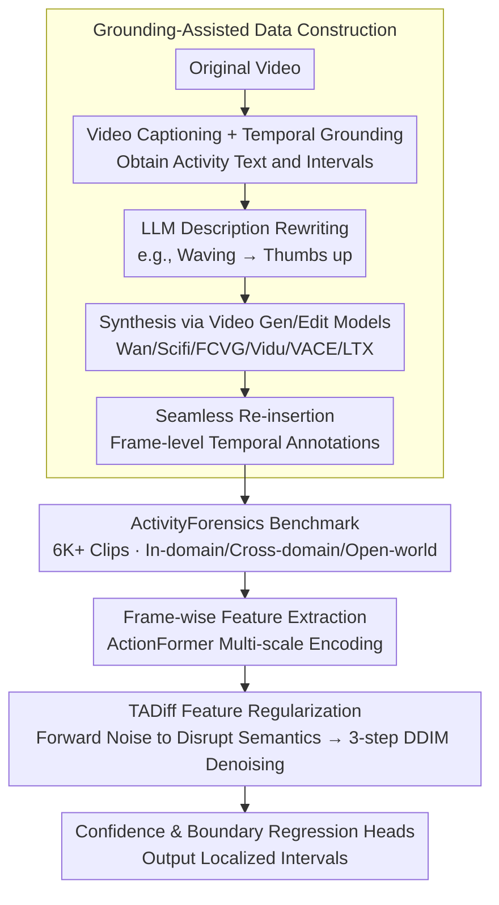

# ActivityForensics: A Comprehensive Benchmark for Localizing Manipulated Activity in Videos

**Conference**: CVPR 2026  
**arXiv**: [2604.03819](https://arxiv.org/abs/2604.03819)  
**Code**: [https://activityforensics.github.io](https://activityforensics.github.io)  
**Area**: Video Generation  
**Keywords**: Video Manipulation Detection, Activity-level Forgery, Temporal Localization, Diffusion Feature Regularization, Video Forensics

## TL;DR
This paper introduces the activity-level video forgery localization task and the ActivityForensics large-scale benchmark (6K+ forged clips). It utilizes a grounding-assisted automated data construction pipeline to create highly realistic activity manipulations and proposes the Temporal Artifact Diffuser (TADiff) baseline, which amplifies forgery clues through diffusion-based feature regularization.

## Background & Motivation

**Background**: Video manipulation localization aims to identify forged segments within untrimmed videos. Existing benchmarks (ForgeryNet, Lav-DF, AV-Deepfake1M, TVIL) primarily focus on appearance-level forgeries, such as face replacement or object removal.

**Limitations of Prior Work**: With the rapid advancement of video generation technologies (Wan, Sora, VACE, etc.), activity-level forgery has emerged as a new threat. This involves modifying a person's actions to distort event semantics (e.g., changing a politician's neutral stance into inappropriate behavior). Such forgeries are highly realistic and deceptive, posing a serious threat to media authenticity. However, there is currently no benchmark specifically for activity-level forgery localization.

**Key Challenge**: The detection logic for appearance-level and activity-level forgeries is fundamentally different. The former relies on pixel-level texture anomalies, while the latter requires an understanding of semantic changes in actions and temporal consistency. Directly transferring action localization models to forgery detection leads to an over-reliance on semantic information.

**Key Insight**: The first activity-level forgery localization benchmark is constructed by leveraging video captioning and temporal grounding for automated data generation, avoiding high manual costs. A specialized baseline method is also proposed.

**Core Idea**: (1) A grounding-assisted automated data pipeline seamlessly embeds forged segments into original videos; (2) TADiff suppresses semantic bias by injecting noise perturbations and subsequently amplifies forgery artifact clues through diffusion denoising.

## Method

### Overall Architecture

The paper provides two parallel outputs: an automated data pipeline capable of manufacturing activity-level forged videos, and a detection baseline, TADiff, tailored for such forgeries. On the data side, original videos pass through video captioning and temporal grounding models to obtain text descriptions and time intervals of "what the person is doing." An LLM then rewrites these descriptions into semantically manipulated versions (e.g., changing "waving" to "thumbs up"). Video generation/editing models synthesize corresponding clips based on the new descriptions, which are seamlessly inserted back into the original videos, resulting in coherent videos with hidden semantic changes and frame-level temporal annotations.

On the detection side, TADiff follows a standard temporal action localization backbone: frame-wise feature extraction, multi-scale Transformer encoding via ActionFormer into temporal feature sequences, followed by diffusion-based regularization on these features. Finally, forgery confidence and boundary regression heads output the localized forgery intervals. The novelty lies entirely in the intermediate feature regularization step.

### Key Designs

**1. Grounding-Assisted Data Construction: Reducing costs using captioning and localization models**
Activity-level forgery data is difficult to scale manually—finding suitable videos, identifying segments to modify, and synthesizing visually coherent forgeries are labor-intensive steps. This pipeline automates the entire link: captioning models describe the video content, temporal grounding models localize activity segments, and an LLM modifies descriptions to semantically different but contextually plausible versions. Video generation/editing models (Wan, Scifi, FCVG, Vidu, VACE, LTX) generate new segments based on the rewritten text. Since forgeries are generated following the original video's structure, the boundaries remain natural, making them far more deceptive than simple concatenation.

**2. ActivityForensics Benchmark Composition: A large-scale dataset across multiple generators**
The pipeline results in the ActivityForensics benchmark, utilizing 6 manipulation methods to produce 6K+ forged clips with uniform distribution (Vidu is reserved for testing). The localization challenge is intentionally high: over 60% of forged segments occupy less than 30% of the total video duration. Evaluation is conducted across three settings: In-domain (same method for train/test), Cross-domain (train on one, test on another), and Open-world (mixed methods), covering fitting, generalization, and hybrid training scenarios.

**3. Temporal Artifact Diffuser (TADiff): Amplifying suppressed forgery artifacts via diffusion**
Directly applying action localization models to forgery detection is problematic: these models encode high-level semantics to recognize actions. Since activity-level forgeries are semantically "plausible," the actual flaws lie in low-level artifacts—texture inconsistencies and motion discontinuities—to which localization features are least sensitive. TADiff decouples these by applying regularization between the ActionFormer encoder and the prediction heads. The forward process injects Gaussian noise into the temporal feature sequence:

$$x_s = \sqrt{\bar{\alpha}_s}\, f + \sqrt{1-\bar{\alpha}_s}\, \epsilon$$

This step intentionally pushes features away from the semantic manifold, disrupting the "semantically plausible" shell. The reverse process uses a lightweight temporal convolutional denoiser (FiLM-conditioned on diffusion step $s$) to pull the features back via DDIM updates:

$$x_{s-1} = \sqrt{\bar{\alpha}_{s-1}}\,\hat{x}_0 + \sqrt{1-\bar{\alpha}_{s-1}-\sigma_s^2}\,\hat{\epsilon} + \sigma_s z$$

Denoising is performed for only 3 steps. The key insight is that while noise suppresses dominant semantic signals, the denoising process retains and strengthens low-level signals sensitive to forgery, making it easier for the heads to capture manipulation boundaries.

### Loss & Training
$\mathcal{L} = \mathcal{L}_{cls} + \mathcal{L}_{reg}$: Focal loss for forgery confidence and Smooth L1 loss for boundary regression. The model is trained end-to-end using the AdamW optimizer with $batch\_size=16$ and $lr=0.001$.

## Key Experimental Results

### Main Results (In-domain and Open-world)

| Setting | Method | AP@0.75 | AP@0.95 | avg AP | avg AR |
|------|------|---------|---------|--------|--------|
| In-domain | ActionFormer | 86.29 | 46.79 | 70.67 | 74.31 |
| | UMMAFormer | 87.02 | 48.55 | 71.94 | 75.74 |
| | DiGIT | 78.61 | 44.92 | 64.69 | 70.43 |
| | **TADiff (Ours)** | **87.52** | **56.57** | **75.05** | **77.15** |
| Open-world | ActionFormer | 89.81 | 57.08 | 77.82 | 83.31 |
| | UMMAFormer | 91.13 | 57.57 | 78.79 | 84.15 |
| | **TADiff (Ours)** | **92.35** | **69.06** | **83.64** | **87.92** |

### Cross-domain Results (Transfer between different manipulation methods)

| Direction | Method | avg AP | avg AR |
|------|------|--------|--------|
| A→B | ActionFormer | 67.18 | 72.14 |
| | **TADiff (Ours)** | **69.63 (+2.45)** | **74.91 (+2.77)** |
| B→A | ActionFormer | 37.14 | 51.03 |
| | **TADiff (Ours)** | **40.89 (+3.75)** | **52.56 (+1.53)** |

### Ablation Study
Module ablation (noise = forward injection, denoise = reverse denoising):

| Setting | noise | denoise | avg AP | avg AR | Notes |
|------|-------|---------|--------|--------|------|
| In-domain | ✗ | ✗ | 70.67 | 74.31 | ActionFormer baseline |
| In-domain | ✓ | ✗ | 70.38 | 74.01 | Noise-only decreases AP by 0.29 |
| In-domain | ✗ | ✓ | 73.52 | 76.22 | Denoise-only shows stable gain |
| In-domain | ✓ | ✓ | **75.05** | **77.15** | Full TADiff |
| Open-world | ✗ | ✗ | 77.82 | 83.31 | Baseline |
| Open-world | ✓ | ✗ | 79.75 | 84.82 | Noise-only +1.93 AP |
| Open-world | ✗ | ✓ | 80.10 | 85.58 | Denoise-only |
| Open-world | ✓ | ✓ | **83.64** | **87.92** | Full TADiff |

### Key Findings
- **Significant improvement at high IoU thresholds (AP@0.95)**: TADiff gains +9.78 in In-domain and +11.98 in Open-world, proving diffusion regularization effectively aids precise boundary localization.
- **Complementarity of noise and denoise**: Noise-only drops performance slightly in In-domain but improves Open-world performance by breaking semantic coupling (+1.93 AP). Combining both is optimal—noise pushes the model away from semantic bias, while denoising reconstructs artifact-sensitive representations.
- **Denoising Steps**: Performance peaks at 3 steps (75.05% AP) in In-domain. Open-world peaks later (4 steps, 83.99% AP), as longer denoising helps adapt to distribution shifts from unseen commercial models.
- **Feature Separability (t-SNE)**: Without TADiff, real/fake features overlap heavily (Fisher score 1.74). With TADiff, clusters separate significantly (score 2.64), validating the "suppress semantics, amplify artifacts" motivation.
- Cross-domain results indicate B→A is much harder than A→B (avg AP 40 vs 70), highlighting generalization across manipulation methods as a core challenge.
- DiGIT (an activity localization method) performs poorly, verifying the fundamental difference between activity-level and appearance-level forgery detection.

## Highlights & Insights
- **New Task Definition**: First to formalize the activity-level forgery localization task, complementing appearance-level forgery detection.
- **Automated Pipeline**: The grounding-assisted construction avoids high manual labeling costs and ensures visual consistency, making it scalable to future video generation models.
- **Diffusion Feature Regularization**: The core insight of TADiff—disrupting semantic encoding via noise and amplifying artifact signals via denoising—is concise, effective, and transferable to other low-level sensitive tasks.

## Limitations & Future Work
- Current manipulation methods are limited to 6 types; models without controlled start/stop frames (like Sora) are not yet included.
- TADiff is a lightweight refinement of ActionFormer; deeper architectural designs (e.g., integrating optical flow or frequency analysis) warrant exploration.
- Detection currently relies on visual artifacts; as generation quality nears perfection, the field must move toward detecting higher-level temporal-semantic inconsistencies.

## Related Work & Insights
- **vs. ForgeryNet/Lav-DF**: These focus on face deepfakes (appearance), whereas this work focuses on activity forgery (semantics).
- **vs. TVIL**: TVIL focuses on temporal inpainting (object removal), while this work focuses on activity modification.
- **vs. ActionFormer**: Standard action localization architectures suffer from semantic bias; TADiff addresses this via feature regularization.

## Rating
- Novelty: ⭐⭐⭐⭐ First benchmark for activity-level forgery localization.
- Experimental Thoroughness: ⭐⭐⭐⭐⭐ Comprehensive evaluation across three protocols and multiple SOTA baselines.
- Writing Quality: ⭐⭐⭐⭐⭐ Clear motivation, well-described pipeline and method.
- Value: ⭐⭐⭐⭐⭐ High timeliness; the importance of this task will grow alongside video AI generation capabilities.

<!-- RELATED:START -->

## Related Papers

- [\[CVPR 2026\] VABench: A Comprehensive Benchmark for Audio-Video Generation](vabench_a_comprehensive_benchmark_for_audio-video_generation.md)
- [\[ICML 2026\] Explainable Forensics of Manipulated Segments in Untrimmed Long Videos](../../ICML2026/video_generation/explainable_forensics_of_manipulated_segments_in_untrimmed_long_videos.md)
- [\[CVPR 2026\] VideoRealBench: A Chain-of-Thought Realism Evaluation Benchmark for Generated Human-Centric Videos](videorealbench_a_chain-of-thought_realism_evaluation_benchmark_for_generated_hum.md)
- [\[ICML 2026\] V2V-Bench: A Comprehensive Benchmark for Video-to-Video Generation Evaluation](../../ICML2026/video_generation/v2v-bench_a_comprehensive_benchmark_for_video-to-video_generation_evaluation.md)
- [\[CVPR 2026\] SemVideo: Reconstructs What You Watch from Brain Activity via Hierarchical Semantic Guidance](semvideo_reconstructs_what_you_watch_from_brain_activity_via_hierarchical_semant.md)

<!-- RELATED:END -->
