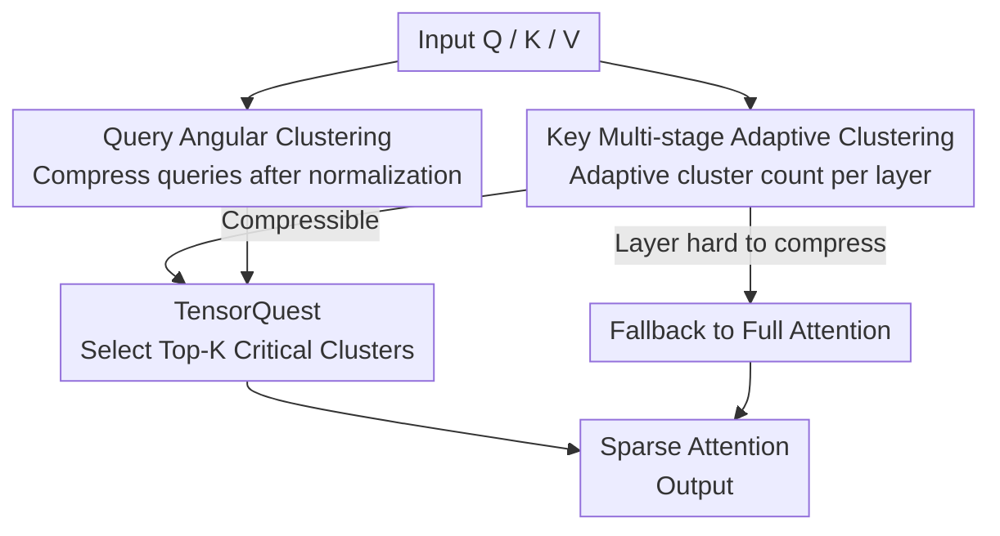

# AdaCluster: Adaptive Query-Key Clustering for Sparse Attention in Video Generation

**Conference**: CVPR 2026  
**arXiv**: [2604.18348](https://arxiv.org/abs/2604.18348)  
**Code**: https://github.com/USTC-MLSys-Team/Adacluster (Available)  
**Area**: Video Generation / Diffusion Models / Inference Acceleration / Sparse Attention  
**Keywords**: Video DiT, Sparse Attention, Token Clustering, Training-free Acceleration, Top-K Attention

## TL;DR
AdaCluster is a training-free sparse attention framework that designs specific strategies for the distinct roles of queries and keys in video DiTs. It uses "angular clustering" to compress queries and "layer-wise adaptive multi-stage K-means" to cluster keys. Combined with TensorQuest, which identifies key clusters via Tensor Cores, it achieves 1.67×–4.31× end-to-end acceleration on CogVideoX-2B / HunyuanVideo / Wan-2.1 with nearly lossless visual quality (up to 30.99 PSNR).

## Background & Motivation

**Background**: Video Diffusion Transformers (DiT) have become the mainstream paradigm for high-fidelity video generation. However, inference is extremely slow due to attention complexity growing quadratically with sequence length. In video generation, sequence length equals "frames × height × width," often reaching 70K–180K tokens. Benchmarks show that generating an 81-frame 720p video with CogVideoX-2B on a single A40 takes 1691 seconds, with attention accounting for 75% of the time. Reducing attention computation is critical for DiT deployment.

**Limitations of Prior Work**: Existing sparse attention methods generally follow two paths. "Block-based" methods (e.g., SpargeAttn) partition continuous tokens into fixed-length blocks and use block averages as representatives—but continuous tokens may not be semantically similar in embedding space, leading to inaccurate estimations. "Clustering-based" methods (e.g., SVG2) use clustering to ensure higher intra-group similarity, which is theoretically more accurate. However, SVG2 treats queries and keys identically using Euclidean clustering and uses a fixed number of clusters (e.g., 100 query clusters and 500 key clusters for all layers/models).

**Key Challenge**: The authors observe two overlooked facts. First, queries and keys play different roles and have distinct distributions—queries only need to preserve the "relative ranking" of scores, while the direction and length of keys directly affect Top-K results; thus, they should not use the same clustering strategy. Second, token distribution compactness varies significantly across layers (as shown by compactness scores in Fig. 2/4). Highly dispersed layers require more clusters or are unsuitable for clustering, while concentrated layers need fewer clusters. A uniform cluster count leads to either insufficient precision or wasted computation, ultimately degrading image quality.

**Goal**: Without training or modifying weights, the objective is to: (1) design role-aware clustering strategies for queries/keys to improve compression, (2) enable layer-wise adaptive cluster counts for keys, and (3) efficiently select critical tokens after clustering without omission.

**Key Insight**: A **role-aware redesign** of the "cluster-then-select" pipeline: angular clustering for queries achieves high compression, layer-wise adaptive multi-stage clustering for keys preserves Euclidean compactness, and critical cluster selection is accelerated via the mathematically equivalent TensorQuest on Tensor Cores.

## Method

### Overall Architecture

AdaCluster receives $Q, K, V$ for an attention layer and processes queries and keys through two distinct clustering paths. Attention is only computed on a few selected "critical clusters," reducing $O(L^2)$ complexity to sparse computation. Specifically: queries are normalized and then clustered via standard K-means (angular clustering); keys undergo multi-stage K-means, which also determines if a layer is "compressible." For compressible layers, TensorQuest estimates the importance of each key cluster relative to current queries and selects Top-K clusters for attention computation. For "hard-to-compress" layers where tokens are not compact, the system falls back to FlashAttention (full attention) to preserve accuracy. This entire process is training-free and makes dynamic decisions per layer during inference.

### Key Designs

**1. Query Angular Clustering: Normalizing to the unit sphere for higher compression**

A major pain point is that query vectors are distributed in high-dimensional space with significant magnitude variances, making direct clustering difficult and limiting compression ratios. The authors utilize a key property: for any query $q$, the **relative ranking** of query-key scores $s$ is independent of the magnitude of $q$. Thus, direction alone determines which keys are important. Based on this, AdaCluster normalizes queries to a unit sphere before measuring key importance. Post-normalization, query distributions become much more compact (Fig. 3), allowing for extreme compression. Essentially, this replaces "Euclidean clustering" with "angular (cosine) clustering": tokens with similar angles are grouped together. This is more efficient than SVG2’s Euclidean approach for queries, requiring only 65 query clusters in experiments.

**2. Key Multi-stage Adaptive Clustering: Layer-wise dynamic cluster counts**

Keys cannot use the same simplification because both their direction and magnitude affect Top-K results; **Euclidean similarity** must be preserved. This is supported by an upper bound: if $c(k)$ is the centroid of $k$, then for any $q$:

$$q^{\top}c(k) - q^{\top}k \le \|q\| \cdot \|k - c(k)\|$$

If intra-cluster tokens are sufficiently compact ($\|k-c(k)\|$ is small), the centroid score $q^{\top}c(k)$ accurately approximates the real score $q^{\top}k$, allowing for "cluster-level comparison" instead of "key-level comparison." However, distribution density varies by layer, making uniform cluster counts ineffective. The authors quantify layer-wise compactness: for each head, the reconstruction error is $\mathrm{MSE}^{i}_{l}=\frac{1}{N}\sum \|k^{i}_{l}-c(k^{i}_{l})\|_2^2$, with compactness defined as $\mathrm{Comp}_l = 1/\mathrm{MSE}_l$. Dispersed layers are assigned more clusters. This is implemented via **multi-stage K-means** (Algorithm 1): an initial clustering is performed; outliers exceeding a threshold $\tau$ are extracted and re-clustered with additional centroids. This repeats until all tokens are in compact clusters. If the cluster count exceeds a limit $N_{\max}$, the layer is deemed "hard to compress" and falls back to full attention. To accelerate this, **stride initialization** is used: since token distributions change minimally between adjacent denoising steps (Fig. 6), the full multi-stage clustering is only run during the first step to fix cluster counts, while subsequent steps use previous centroids for warm-start initialization.

**3. TensorQuest: Shifting critical cluster selection from CUDA Cores to Tensor Cores**

Once clustered, the system must quickly identify critical clusters. The authors adapt the Quest method from LLM decoding, which uses attention weight upper-bounds to estimate key importance:

$$\text{Quest}(q,K)=\sum_{d=1}^{D}\max\big(q^{d}\cdot\max(K^{d}),\, q^{d}\cdot\min(K^{d})\big)$$

However, the per-dimension max/min operations in Quest can only run on CUDA Cores. Given that attention computation in diffusion denoising is much heavier than in LLM decoding, direct usage causes unacceptable latency. AdaCluster proposes **TensorQuest**: by decomposing queries and keys into positive and negative components $q^{+}=\max(q,0),\,q^{-}=\min(q,0)$ (similarly for keys), the formula is rewritten as two equivalent matrix multiplications:

$$\text{Quest}(q,K)=\text{matmul}(q^{+},k^{+})+\text{matmul}(q^{-},k^{-})$$

Aside from lightweight splitting, the main computation becomes matrix multiplication, fully utilizing the high-throughput capabilities of Tensor Cores. This is numerically identical to the original Quest but accelerates Top-K selection by up to ~5× on the longest sequences. After scoring, tokens from the Top-K clusters ($K^{*}, V^{*}$) are gathered for sparse attention calculation.

### Loss & Training
The method is entirely **training-free**, requiring no fine-tuning or additional training. It is implemented as an inference-time operator. Key hyperparameters: query clusters are fixed at 65; key clusters are dynamically adjusted per layer; threshold $\tau$ is set to 1.5× the "mean token-to-centroid distance" from the first step; approximately 15% of the most dispersed layers (determined by $k_{\max}$) use full attention. Operators are custom-implemented using Triton and FlashInfer. HunyuanVideo uses 30 denoising steps, while other models use 50.

## Key Experimental Results

### Main Results
On the PenguinVideoBenchmark prompt set, similarity to full attention is measured via PSNR/SSIM/LPIPS, and image quality is measured via VBench on a single A40.

| Model | Method | PSNR↑ | SSIM↑ | LPIPS↓ | Gain (Speedup)↑ |
|-------|--------|-------|-------|--------|-----------------|
| CogVideoX-2B (720×480) | SpargeAttn | 28.189 | 0.517 | 0.618 | 1.23× |
| CogVideoX-2B | **AdaCluster** | **30.989** | **0.767** | **0.231** | **1.67×** |
| Wan-2.1-1.3B (832×480) | SpargeAttn | 28.292 | 0.437 | 0.599 | 1.81× |
| Wan-2.1-1.3B | SVG2 | 28.230 | 0.358 | 0.679 | 1.61× |
| Wan-2.1-1.3B | **AdaCluster** | **29.083** | **0.571** | **0.393** | **1.85×** |
| HunyuanVideo (1280×720) | SpargeAttn | 28.155 | 0.490 | 0.596 | 1.33× |
| HunyuanVideo | SVG2 | 29.319 | 0.794 | 0.308 | 1.57× |
| HunyuanVideo | **AdaCluster** | **30.580** | **0.835** | **0.203** | **1.68×** |

AdaCluster outperforms SpargeAttn and SVG2 across all three models in similarity metrics (PSNR/SSIM/LPIPS) while achieving the highest speedup, effectively being "the fastest with the least degradation."

### Efficiency vs. Sequence Length
Using HunyuanVideo with 81 frames and varying resolutions to observe speedup scaling.

| Token Count | AdaCluster | SpargeAttn | SVG2 |
|-------------|------------|------------|------|
| 28.3K | 1.53× | 1.28× | 1.46× |
| 176.4K | 4.31× | 1.78× | N/A |

As sequence length increases, the potential for sparsity grows. AdaCluster reaches 4.31× acceleration at 176.4K tokens. SVG2 fails at sequences above ~101.1K due to VRAM overhead for metadata caching.

### Ablation Study
Based on HunyuanVideo 1280×720, 81 frames (75.6K tokens).

| Configuration | PSNR↑ | SSIM↑ | LPIPS↓ | ImgQual↑ | Description |
|---------------|-------|-------|--------|----------|-------------|
| AdaClus (Adaptive Per-Layer) | 30.580 | 0.835 | 0.203 | 65.11% | Full Model |
| AvgClus (Uniform Clusters, Avg=412) | 29.007 | 0.724 | 0.378 | 64.79% | No Adaptive Clusters |
| TensorQuest | 30.580 | 0.835 | 0.203 | 65.11% | Full Model |
| w/o Quest (Mean Estimation) | 28.941 | 0.687 | 0.410 | 64.06% | No TensorQuest |

### Key Findings
- **Adaptive cluster counts are crucial**: In a fair comparison where the average cluster count is matched (AvgClus), the adaptive approach (AdaClus) yields ~1.57 dB higher PSNR and reduces LPIPS from 0.378 to 0.203, proving that allocating clusters based on dispersion preserves critical tokens.
- **TensorQuest outperforms mean-based selection**: Using Quest upper-bounds for cluster importance is ~1.64 dB better in PSNR than using cluster centroids (w/o Quest), as centroids can miss critical tokens at cluster boundaries.
- **TensorQuest improves speed**: By offloading computation to Tensor Cores, the Top-K selection step is accelerated by up to 5× on long sequences, contributing significantly to end-to-end gains.
- **CogVideoX is a weak point**: CogVideoX has the lowest baseline quality; both AdaCluster and SpargeAttn show significant image quality drops on it, which the authors attribute to the model's inherent sensitivity.

## Highlights & Insights
- **Role-awareness is the core insight**: Queries care about "relative ranking" (independent of magnitude) $\rightarrow$ aggressive angular clustering. Keys care about both direction and magnitude $\rightarrow$ Euclidean compactness is mandatory. Highlighting this asymmetry is the key differentiator from SVG2’s uniform treatment.
- **Adaptive clustering includes a natural exit strategy**: When the required cluster count exceeds a limit, the system falls back to full attention. This avoids quality loss in unsuitable layers and lets data determine when to apply compression, resulting in a clean engineering design.
- **The positive-negative decomposition in TensorQuest is ingenious**: The $\max(q^d\max K^d, q^d\min K^d)$ logic is natively incompatible with matrix multiplication. Reformulating it into two `matmul` calls allow the use of Tensor Cores—a general trick transferable to other bound-estimation scenarios.
- **Stride cluster reuse**: By exploiting the prior that DiT distributions change smoothly during denoising, clustering overhead is mitigated by fixing clusters after the first step and utilizing warm-starts.

## Limitations & Future Work
- **Dependency on long sequences**: Speedup is modest (1.53×) for short sequences (28.3K tokens) and only becomes significant (4.31×) for ultra-long sequences; benefits are limited for low-resolution/short videos.
- **Image quality metrics are unreliable**: The authors note anomalies where SpargeAttn results occasionally "outperform" the original model in VBench. Quality assessment remains an open problem, so "lossless" claims rely more on similarity metrics than absolute image quality scores.
- **Empirical hyperparameters**: Thresholds like $\tau=1.5\times$ and the 15% fallback ratio are set empirically. Sensitivity analyses are provided, but stability across more models/resolutions requires further validation.
- **Degradation on CogVideoX**: Sparsification exposes issues more easily in weaker models; the method's performance partially depends on the base model's robustness.

## Related Work & Insights
- **vs. SVG2**: Both use clustering-based sparse attention, but SVG2 uses uniform Euclidean clustering and fixed cluster counts. AdaCluster uses role-aware splitting and adaptive counts, yielding better similarity and speed without SVG2's VRAM limitations on long sequences.
- **vs. SpargeAttn**: SpargeAttn detects sparsity at a block level based on continuous tokens, ignoring semantic similarity. AdaCluster ensures intra-cluster similarity, resulting in much higher speedups (4.31× vs. 1.78×) and better quality on long sequences.
- **vs. Quest**: Quest is designed for LLM decoding to select KV pages via upper bounds but only runs on CUDA Cores. TensorQuest reformulates this for matrix multiplication on Tensor Cores, making it suitable for compute-intensive diffusion denoising.
- **vs. Training-based methods (VSA / DSV / RadialAttention)**: These require expensive retraining or LoRA fine-tuning; AdaCluster is entirely training-free and plug-and-play.
- **vs. Diffusion Quantization (PTQD / SVDQuant)**: Quantization reduces numerical precision and is orthogonal to this work; AdaCluster reduces computational volume. They can be combined.

## Rating
- Novelty: ⭐⭐⭐⭐ Clear combination of "role-aware clustering + adaptive cluster counts + TensorQuest."
- Experimental Thoroughness: ⭐⭐⭐⭐ Covers three DiTs, multiple resolutions, and dual-dimension evaluation (similarity and quality), though image metrics are inherently noisy.
- Writing Quality: ⭐⭐⭐⭐ Solid motivation (distribution analysis, upper-bound derivation) and clear algorithm description.
- Value: ⭐⭐⭐⭐⭐ Training-free, plug-and-play, with significant acceleration for long-sequence video DiT deployment.

<!-- RELATED:START -->

## Related Papers

- [\[ICML 2026\] Attention Sparsity is Input-Stable: Training-Free Sparse Attention for Video Generation via Offline Sparsity Profiling and Online QK Co-Clustering](../../ICML2026/video_generation/attention_sparsity_is_input-stable_training-free_sparse_attention_for_video_gene.md)
- [\[CVPR 2026\] Free-Lunch Long Video Generation via Layer-Adaptive O.O.D Correction](free-lunch_long_video_generation_via_layer-adaptive_ood_correction.md)
- [\[ICML 2026\] DFSAttn: Dynamic Fine-Grained Sparse Attention for Efficient Video Generation](../../ICML2026/video_generation/dfsattn_dynamic_fine-grained_sparse_attention_for_efficient_video_generation.md)
- [\[ICML 2026\] VEDA: Scalable Video Diffusion via Distilled Sparse Attention](../../ICML2026/video_generation/veda_scalable_video_diffusion_via_distilled_sparse_attention.md)
- [\[CVPR 2026\] Efficient Long-Context Modeling in Diffusion Language Models via Block Approximate Sparse Attention](efficient_long-context_modeling_in_diffusion_language_models_via_block_approxima.md)

<!-- RELATED:END -->
