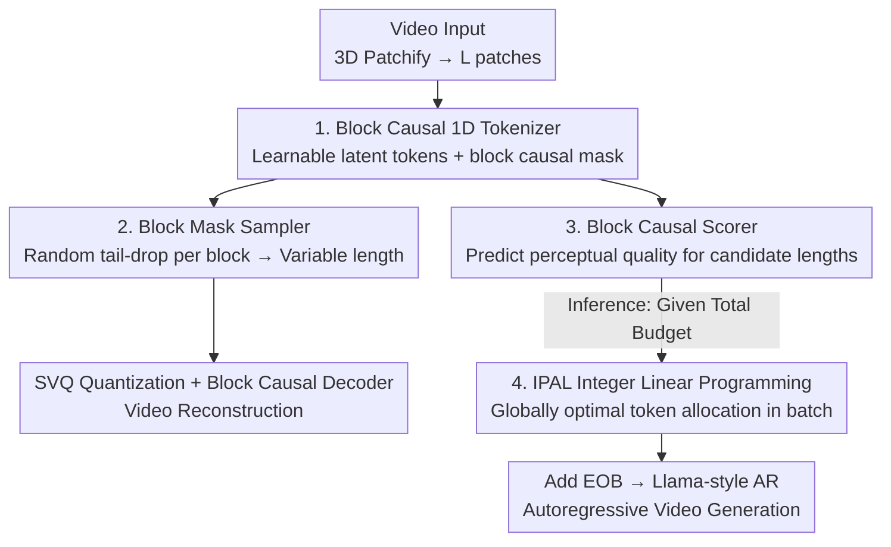

# AdapTok: Learning Adaptive and Temporally Causal Video Tokenization in a 1D Latent Space

**Conference**: CVPR 2026  
**Paper**: [CVF Open Access](https://openaccess.thecvf.com/content/CVPR2026/html/Li_AdapTok_Learning_Adaptive_and_Temporally_Causal_Video_Tokenization_in_a_CVPR_2026_paper.html)  
**Code**: https://github.com/VisionXLab/AdapTok  
**Area**: Video Generation / Video Tokenizer  
**Keywords**: Video tokenization, 1D latent space, temporal causality, adaptive token allocation, integer programming  

## TL;DR
AdapTok encodes video into a **temporally causal 1D discrete token sequence**. During training, it learns "variable-length" representations by randomly dropping tail tokens in blocks. During inference, a scorer predicts "reconstruction quality for $N$ tokens," and Integer Linear Programming (ILP) dynamically allocates tokens to different frames or samples under a fixed total budget. This achieves rFVD=28 reconstruction on UCF-101 with fewer tokens and significantly improves autoregressive video generation quality.

## Background & Motivation
**Background**: As LLMs establish autoregressive (AR) generation as a universal cross-modal paradigm, video generation has followed the path of "quantizing video into discrete tokens, then predicting them autoregressively using causal transformers." Unlike images, video exhibits **inter-frame temporal causality**. Consequently, various works (Cosmos-Tokenizer, MAGVIT series, etc.) introduce causal convolutions or causal attention masks to ensure encoding/decoding depends only on past frames, supporting online streaming and improving throughput.

**Limitations of Prior Work**: Most causal tokenizers **allocate a fixed number of tokens to every frame**, ignoring significant temporal redundancy—a nearly static scene consumes the same budget as one with intense motion, which is wasteful and limits expressiveness. Prior attempts at variable length (e.g., ElasticTok, the first to allocate different token counts per frame within the same video) suffer from two main issues: tokens retain 2D spatial priors (local spatio-temporal blocks rather than a unified 1D sequence), leading to poor results when concentrating information at the head; and they rely on a **fixed threshold** for block-wise decisions, lacking global planning to achieve optimal allocation under a "total video budget" constraint.

**Key Challenge**: To build an efficient video tokenizer, three requirements must be met simultaneously, whereas existing methods satisfy only one or two: (1) **Temporal causality** (streaming-capable); (2) **1D latent space** (decoupling token allocation from spatial structure for uniform information density); (3) **Adaptive allocation** (globally optimal token count adjustment based on sample complexity).

**Goal / Core Idea**: A transformer framework that addresses all three points: compressing 3D video patches into **1D causal tokens decoupled from spatial structure**, learning variable lengths via tail-dropping, training a **scorer** to predict the budget-quality curve, and modeling global token allocation as an **Integer Linear Programming (ILP)** problem.

## Method

### Overall Architecture
AdapTok consists of two main components: a transformer-based **VQ tokenizer** (encoder + block mask sampler + quantizer + decoder) and a **block-causal scorer**.

**Training Stage**: Videos undergo 3D patching, flattened into $L$ patch embeddings (e.g., $16{\times}128{\times}128$ video with $4{\times}8{\times}8$ patches results in $L=1024$), divided into $K=4$ blocks. A block-causal encoder uses learnable latent tokens to transform these patches into 1D latent sequences. The block mask sampler randomly drops a variable number of tail tokens per block. Remaining tokens are quantized via SVQ and reconstructed by the block-causal decoder. The scorer is trained separately to predict perceptual quality for different token lengths.

**Inference Stage**: Given a total token budget, the scorer predicts quality scores for each candidate length per sample in a mini-batch. IPAL (Integer Programming-based Allocation) solves for the optimal token count per sample to maximize batch-wide reconstruction quality, achieving **sample-level, content-aware, and temporally dynamic** allocation. The allocated sequence (with `<EOB>` markers) is fed into a Llama-style transformer for AR generation.

### Key Designs

**1. Block Causal 1D Tokenizer: Decoupling Spatial Structure from Latent Sequences**
To address the issue of fixed 2D spatial priors, AdapTok does not quantize patches directly. Instead, it introduces learnable latent tokens $q_{enc}\in\mathbb{R}^{N\times d}$, concatenated with $L$ video tokens $e$. The output $\tilde{z}=E(e\oplus q_{enc})_{L:(L+N)}$ serves as the latent representation. This (inspired by TiTok/LARP) decouples token count from the spatial grid, yielding a **1D sequence** with uniform spatial information density. Causality is enforced via a **block-causal attention mask**, where tokens only attend to the current or preceding blocks, enabling online streaming. Ablations (Table 4) show that 1D latents significantly outperform 2D (rFVD 73.4 vs 173.99 at 1024 tokens) and degrade gracefully when tokens are halved.

**2. Block Mask Sampler (Tail-drop): Learning Multi-rate Reconstruction**
Adaptive allocation requires the tokenizer to decode reasonable video regardless of whether 32 or 512 tokens are used. AdapTok employs a tail-drop strategy: for each block $i$, a retention length $\omega_i$ is sampled (truncated Gaussian, $\mu=256, \sigma=128$, range $[32, 512]$) to create a binary mask. This "block-wise tail-drop" forces **head tokens to capture global context and tail tokens to refine details** (confirmed by attention maps in Fig. 5). Consequently, quality improves monotonically as tokens increase—the foundation for effective ILP optimization.

**3. Block Causal Scorer: Predicting the Quality Curve**
To allocate tokens optimally, the model must know the "quality-per-token" utility. AdapTok trains a transformer-based block-causal scorer $S_\theta$ which, in a **single forward pass**, predicts quality scores $\hat{s}$ for all candidate lengths. Ground-truth scores are generated by sampling a target block $q$ and calculating the **perceptual loss $L_P$** for different mask lengths. Results (Table 7) show that using perceptual loss as a metric yields the best correlation with overall quality (including rFVD).

**4. IPAL: Globally Optimal Allocation via Integer Linear Programming**
With quality curves for each block, allocation becomes a constrained optimization problem. Unlike the heuristic thresholds in ElasticTok, AdapTok employs **Integer Linear Programming (ILP)**. For each sample $k$ and candidate length $j$ in a mini-batch, a binary variable $b_{kj}\in\{0,1\}$ indicates selection. The objective is to minimize the total predicted perceptual loss:

$$\min_{b}\sum_{k,j}\hat{s}_{kj}\cdot b_{kj},\quad \text{s.t.}\ \sum_j b_{kj}=1\ \forall k,\ \sum_{k,j} j\cdot b_{kj}=B\cdot N_b$$

The first constraint ensures one length per sample; the second fixes the total batch budget to $B \cdot N_b$. Solving for $b^*$ dynamically allocates more tokens to complex videos while strictly adhering to the global budget. Due to the single-pass scorer and efficient ILP solver, inference is **11× faster** than ElasticTok (Table 8).

### Loss & Training
The tokenizer uses a composite objective $L=L_R+L_{VQ}+L_P+L_G+L_{prior}$ (L1, quantization, perceptual, adversarial, and AR prior losses). The scorer uses MSE. The AR generator uses standard cross-entropy. Training was conducted on UCF-101 / Kinetics-600 for 250 epochs with a batch size of 128 using Adam. Notably, **no additional image data** was used; training involved less than 0.5M videos.

## Key Experimental Results

### Main Results
UCF-101 Video Reconstruction (Causal tokenizers only):

| Method | Training Data | Token Count | rFVD ↓ | PSNR ↑ | LPIPS ↓ |
|------|---------|---------|--------|--------|---------|
| ElasticTok | 356M | 2,048 | 93 | 28.31 | 0.154 |
| Cosmos-DV | 100M | 1,280 | 140 | 26.20 | 0.187 |
| OmniTokenizer† | <0.5M | 1,280 | 94 | 26.19 | 0.124 |
| CausalTok† (Baseline) | <0.5M | 1,024 | 37 | 25.91 | 0.111 |
| **Ours** | <0.5M | 512 | 60 | 24.06 | 0.144 |
| **Ours** | <0.5M | 1,024 | 36 | 25.72 | 0.114 |
| **Ours** | <0.5M | 2,048 | **28** | 26.37 | 0.103 |

Ours significantly outperforms existing causal tokenizers with less data: rFVD=28 at 2048 tokens and rFVD=36 at 1024 tokens (**1.8× fewer tokens** than CausalTok for similar quality).

Video Generation (gFVD):

| Method | Params | Tokens | K600 ↓ | UCF ↓ |
|------|------|-------|--------|-------|
| OmniTokenizer | 650M | 1280 | 32.9 | 191 |
| MAGVIT-v2-AR | 840M | 1280 | / | 109 |
| CausalTok | 633M | 1024 | / | 80 |
| **Ours-AR** | 633M | 1024 | **11** | **67** |

### Ablation Study
Contribution of Adaptive Training (Sampler) and Adaptive Inference (Scorer):

| Tokens | Sampler | Scorer | rFVD ↓ | PSNR ↑ | LPIPS ↓ |
|-------|--------|--------|--------|--------|---------|
| 1024 | ✗ | ✗ | 37.13 | 25.92 | 0.111 |
| 1024 | ✓ | ✗ | 38.79 | 25.29 | 0.122 |
| 1024 | ✓ | ✓ | **36.36** | 25.72 | 0.114 |
| 512 | ✗ | ✗ | 509.95 | 14.38 | 0.368 |
| 512 | ✓ | ✗ | 121.88 | 22.89 | 0.170 |
| 512 | ✓ | ✓ | **59.96** | 24.06 | 0.144 |

Comparison of allocation strategies (Avg. 1024 tokens):

| Strategy | rFVD ↓ | PSNR ↑ | LPIPS ↓ |
|------|--------|--------|---------|
| Fixed | 38.79 | 25.29 | 0.122 |
| BiThr (Binary Threshold) | 42.12 | 25.23 | 0.120 |
| **ILP (IPAL)** | **36.36** | **25.72** | **0.114** |

### Key Findings
- **Dual adaptive mechanisms are critical**: At 512 tokens, rFVD collapses to 510 without these mechanisms but improves to 60 with both.
- **ILP outperforms heuristics**: Global optimization via ILP consistently beats fixed or threshold-based allocation.
- **Perceptual loss is the optimal scoring metric**: It demonstrates the strongest correlation with overall perceptual quality.
- **Tail-dropping creates hierarchical representations**: Head tokens capture global context while tail tokens refine details.

## Highlights & Insights
- **From Heuristics to Optimization**: Upgrading "how many tokens to use" from a heuristic threshold to a solvable optimization problem (Scorer + ILP) is a clean, efficient paradigm.
- **Synergy of Tail-drop and 1D Latents**: Tail-dropping proves much more effective when paired with a 1D latent space decoupled from spatial grids.
- **Transferable Framework**: The approach of batch-level ILP for resource allocation can be extended to image tokenization, KV cache management, or mixed-precision inference.

## Limitations & Future Work
- The current implementation uses a **discrete** VQ tokenizer; future work could explore continuous latent versions.
- Generalization is limited by the current scale of training data (<0.5M videos).
- Global optimization is currently batch-level, meaning the allocation for a specific video depends on other samples in the same batch during inference.

## Related Work & Insights
- **vs. ElasticTok**: ElasticTok uses 2D spatial priors and heuristic thresholds. Ours uses 1D transformer decoupling and ILP for global optimality, resulting in significantly better rFVD (36 vs 230) and 11× faster inference.
- **vs. CausalTok**: These use fixed lengths. Ours introduces adaptive allocation while maintaining causality, saving ~1.8× tokens for comparable quality.

## Rating
- Novelty: ⭐⭐⭐⭐⭐ First to combine temporal causality, 1D latents, and ILP-based adaptive allocation.
- Experimental Thoroughness: ⭐⭐⭐⭐⭐ Comprehensive evaluations across reconstruction, generation, and multi-dimensional ablations.
- Writing Quality: ⭐⭐⭐⭐ Clear motivations and diagrams, though the scorer label construction section is dense.
- Value: ⭐⭐⭐⭐⭐ High practical value for world models and long-video generation where token efficiency is paramount.

<!-- RELATED:START -->

## Related Papers

- [\[CVPR 2026\] FlashPortrait: 6× Faster Infinite Portrait Animation with Adaptive Latent Prediction](flashportrait_6x_faster_infinite_portrait_animation_with_adaptive_latent_predict.md)
- [\[CVPR 2026\] Chain of Event-Centric Causal Thought for Physically Plausible Video Generation](chain_of_event-centric_causal_thought_for_physically_plausible_video_generation.md)
- [\[CVPR 2025\] Learning Temporally Consistent Video Depth from Video Diffusion Priors](../../CVPR2025/video_generation/learning_temporally_consistent_video_depth_from_video_diffusion_priors.md)
- [\[ICCV 2025\] NormalCrafter: Learning Temporally Consistent Normals from Video Diffusion Priors](../../ICCV2025/video_generation/normalcrafter_learning_temporally_consistent_normals_from_video_diffusion_priors.md)
- [\[CVPR 2026\] OneStory: Coherent Multi-Shot Video Generation with Adaptive Memory](onestory_coherent_multi-shot_video_generation_with_adaptive_memory.md)

<!-- RELATED:END -->
