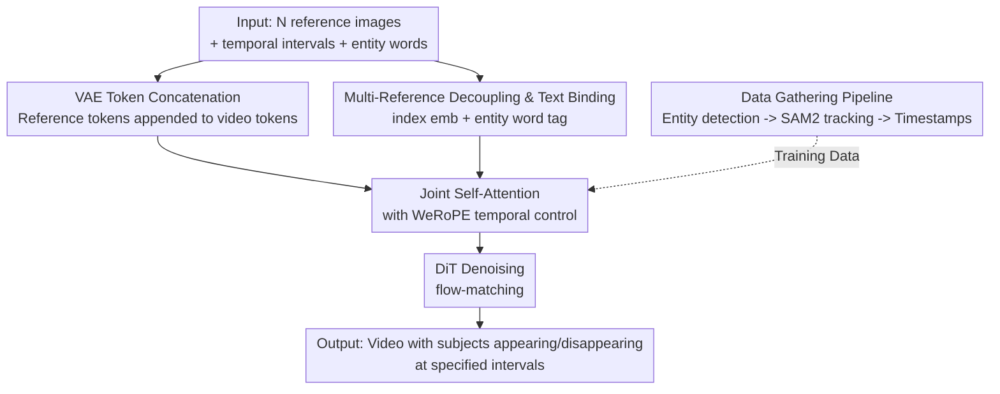

# AlcheMinT: Fine-grained Temporal Control for Multi-Reference Consistent Video Generation

**Conference**: CVPR 2026  
**Paper**: [CVF Open Access](https://openaccess.thecvf.com/content/CVPR2026/html/Girish_AlcheMinT_Fine-grained_Temporal_Control_for_Multi-Reference_Consistent_Video_Generation_CVPR_2026_paper.html)  
**Code**: None (Project page https://snap-research.github.io/Video-AlcheMinT)  
**Area**: Video Generation / Subject-driven Personalization  
**Keywords**: Subject-to-Video Generation, Timestamp Control, RoPE, Multi-reference Consistency, DiT

## TL;DR
AlcheMinT introduces "temporal dimension" control to subject-driven video generation. It utilizes the same VAE to directly encode reference images into tokens and appends them to the video token stream (without any extra cross-attention). It then employs a weighted mixture of RoPE frequency positional encoding (WeRoPE) to ensure each reference subject is strongly attended to by video tokens only within user-specified time intervals. This allows precise control over when multiple subjects appear and disappear in the video while maintaining a video quality on par with existing state-of-the-art personalization methods.

## Background & Motivation
**Background**: Large-scale diffusion video models are already capable of generating high-fidelity videos from text/images and support various conditions such as pose, depth, camera, and even "subject reference"—injecting user-provided people, faces, objects, or backgrounds into the generated video for personalized content. Subject-to-Video (S2V) generation has seen notable works including Video Alchemist, SkyReels-A2, Concept Master, and MAGREF.

**Limitations of Prior Work**: These methods apply the reference subjects across the **entire video**, meaning the subjects appear continuously from start to finish. However, real-world videos are composed of different events and shots where various subjects appear at specific time points (e.g., a logo appearing at a specific second in an advertisement, or characters entering and exiting based on a storyboard script). Existing S2V models lack a direct interface for "timestep conditioning," relying instead on text prompts (e.g., "a dog appears at the 3rd second") to hint at temporal dynamics. Current video models completely fail to strictly follow such temporal descriptions, and the reference mechanism instead forces the generation to lean towards "the subject occupying the entire frame and duration."

**Key Challenge**: To achieve temporal control, existing time-aware schemes run into bottlenecks regarding conditioning mechanisms. For instance, MiNT utilizes ReRoPE to make attention time-aware, but it requires **rescaling the video token RoPE** based on the event interval length. Consequently, it can only handle **non-overlapping** event sequences and is incompatible with MM-DiT-style (pure self-attention) conditioning injection. Conversely, in multi-subject scenarios, reference intervals naturally overlap (two objects need to be present simultaneously), and leveraging "token concatenation" in an MM-DiT-style injection is highly desirable to maximize the reuse of pre-trained video priors. These two requirements are fundamentally in conflict.

**Goal**: (1) Introduce independent and potentially overlapping temporal interval control for each reference subject without disrupting the feature space of the pre-trained video model; (2) Inject identities in the most lightweight manner, avoiding extra cross-attention parameters; (3) Resolve identity confusion among multiple similar subjects (e.g., man/woman); (4) Construct datasets and establish an evaluation benchmark.

**Key Insight**: RoPE is a relative positional encoding where attention scores decay as the distance between tokens increases—which inherently serves as a **natural, controllable attention decay mechanism**. If the temporal frequencies of reference tokens can be designed to "center on the interval and naturally decay towards both sides," video tokens within the interval will strongly attend to the reference, while those outside will smoothly fade out.

**Core Idea**: Directly encode reference images using the same VAE and concatenate the tokens for identity injection (zero extra parameters), and construct the temporal RoPE for reference tokens using a "weighted sum of the interval midpoint frequency and boundary edge frequencies" (WeRoPE). This encodes temporal intervals directly into the positional frequencies, achieving overlapping multi-subject temporal control.

## Method

### Overall Architecture
AlcheMinT is built upon a pre-trained "3D VAE + DiT" text-to-video backbone (trained with rectified-flow / flow-matching). The model input consists of $N$ triplets $[(I_n, [t_0^n, t_1^n], w_n)]_{n=1}^N$: reference image $I_n$, its corresponding appearance time interval $[t_0^n,t_1^n]$, and the entity word $w_n$ (e.g., dog, man) describing the subject. The pipeline is as follows: **Video-VAE** encodes each reference image into a number of tokens equal to a "single video latent frame." These reference tokens are then **sequentially concatenated** following the video tokens and fed into the DiT's Joint Self-Attention. Within this self-attention layer, the temporal positions of reference tokens do not use standard RoPE, but instead use **WeRoPE** with frequencies set according to their respective temporal intervals, thereby encoding "when to appear" into the attention decay curve. Simultaneously, each reference is assigned a learnable index embedding to decouple identities, and the entity word is incorporated via a text encoder + MLP to bind with the video caption. The training data is automatically produced by an **entity detection $\rightarrow$ segmentation $\rightarrow$ tracking** pipeline that generates timestamped multi-subject video pairs.

### Key Designs

**1. VAE Token Concatenation for Identity Injection: Discarding cross-attention to share the feature space between references and video**

Addressing the limitation that existing methods use semantic encoders like DINO/CLIP/ArcFace + IP-Adapter/Q-former/extra attention blocks for identity injection (which introduces structural complexity, doubles parameters, and misses certain image attributes depending on the encoder type), the authors do the opposite. They directly employ the backbone's native **3D VAE** to encode reference images into latent tokens—where the number of tokens for each reference image is equal to that of a **single video latent frame**. These tokens are then **sequentially concatenated** to the end of the video token stream and fed into the pre-existing spatiotemporal self-attention. This identity injection requires **zero extra parameters**: there are no new cross-attention modules, and the reference and video tokens lie in the **same VAE feature space**, ensuring natural alignment. Consequently, identity preservation is stronger than in cross-attention architectures, which are often limited by the encoder type and miss fine-grained attributes. Furthermore, since DiT natively supports variable token lengths, the model gracefully handles arbitrary numbers of reference views. This "token concatenation" design is also a prerequisite for the subsequent temporal control—since the reference is treated as standard tokens, their attention can be modulated simply by altering their RoPE frequencies.

**2. WeRoPE: Encoding Temporal Intervals into RoPE Frequencies for Overlapping, Smooth Entry/Exit Control**

This is the core of the paper. First, consider a naive solution, MidRoPE: setting the temporal frequency of the reference token to the interval midpoint $t_m=(t_0+t_1)/2$, yielding $\hat r_{xy}=\mathrm{RoPE}(r,x,y,t_{mid})$ (where $t_{mid}$ acts as the center). It centers the reference and decays to both sides, but **fails to control the decay rate**—the intervals $[8, 10]$ and $[1, 17]$ share the same midpoint, causing MidRoPE to yield almost identical attention curves. As a result, the model cannot distinguish between a "brief appearance" and "occupying almost the entire video." WeRoPE resolves this by applying a weighted superposition of the **midpoint frequency** and the **boundary edge frequencies**. Defining the left and right boundary timestamps as $t_l=t_0/2$ and $t_r=(T-t_1)/2$ ($T$ is the number of latent frames), and exploiting the linearity of RoPE:

$$\hat r_{xy}=R\big(r_{xy},\, w_p\theta_{xy t_{mid}}+w_n(\theta_{xy t_l}+\theta_{xy t_r})\big)=w_p R(r_{xy},\theta_{xy t_{mid}})+w_n\sum_{t_i\in\{t_l,t_r\}}R(r_{xy},\theta_{xy t_i})$$

Setting a positive midpoint weight $w_p$ and a negative boundary weight $w_n$ (empirically $w_p=1.67,\ w_n=-0.33$ in the paper) superimposes multiple RoPE decay curves into a single curve characterized by "high attention inside the interval and smooth roll-off outside." Because this only alters the frequencies of the **reference tokens** and leaves the video tokens' RoPE untouched, it completely preserves the feature space of the pre-trained model. It also **allows multiple reference intervals to overlap** (by simply setting frequencies independently) and remains compatible with MM-DiT-style pure self-attention injection—perfectly bypassing the two hard limitations of MiNT/ReRoPE, which require rescaling video RoPE and can only handle non-overlapping sequences. In practice, the subject is strongly attended to within the interval and naturally fades in and out frame-by-frame outside it, yielding a smooth transition as subjects enter and exit the scene.

**3. Multi-Reference Decoupling + Text Binding: Unraveling Similar Subjects via Index Embeddings and Entity Word Tags**

Multiple references can introduce ambiguity: when there are two similar entities (such as a man and a woman) in the caption, the network can fail to distinguish both the identities of different references and which reference a token at a given spatial position belongs to. The authors introduce two components. First, each reference is assigned a **learnable index embedding** to decouple tokens that share the same spatial position but originate from different references. Second, the **entity word tag** (e.g., man/woman) of each reference is encoded using the same text encoder as the main caption. After projecting via a small MLP (since the text feature space differs from the video/reference latents), it is input as extra tokens. These word tags are assigned the **same index embedding as their corresponding references**, thereby binding the "word" and "image." The word tags follow a diagonal Spatial RoPE (similar to MM-DiTs such as Qwen-Image) and maintain a temporal WeRoPE aligned with their reference, before undergoing cross-attention with the video caption. This helps the network align "doctor" in the caption with the reference word "man" and its corresponding reference image. Ablations show that this word tag binding is crucial for **decoupling similar identities**—without it, attributes of different subjects (e.g., man/woman) bleed into each other, causing facial artifacts.

**4. Automated Data Collection Pipeline: Extracting Timestamped Multi-Subject Annotations from Videos**

Since timestamp-conditioned training data is scarce, the authors developed a pipeline. Starting from "text-video pairs" (including global captions describing the entire scene and timestamped dense captions), they first employ an **LLM** to extract word tags pointing to different entities from the captions (filtering out body parts, entity groups, unsegmentable background scenes, and forcing unique tags to resolve ambiguity). For each entity, **Grounding DINO** detects bounding boxes across multiple timestamps (multi-frame detection ensures high recall), retaining the box with the highest CLIP similarity to the entity word. **SAM2** is then used for forward and backward tracking to obtain the mask track of each entity. During training, for a given reference, the temporal interval is computed using "the first and last frames where the mask pixels exceed a threshold." Crucially, they **specifically sample masks from frames outside the sampled video frames** as the reference image—this forces the reference to differ significantly from the target frames in terms of pose, lighting, and position. Combined with augmentations such as blur/zoom/color jitter/centered cropping, this **prevents the model from simply copy-pasting the reference** (even though references and video share the same VAE encoding and RoPE has spatial position bias, centered cropping effectively disrupts this spatial shortcut).

### Loss & Training
The model uses rectified-flow / flow-matching in the latent space. Under latent $z$, noise $\epsilon\sim\mathcal N(0,I)$, and diffusion time $t\sim U(0,1)$, a linear interpolation $z_t=(1-t)z+t\epsilon$ is constructed. The DiT predicts the velocity field $v^\star=\epsilon-z$, aiming to minimize the objective $L_{flow}=\mathbb E\,\|v_\theta(z_t,t,c_{text})-(\epsilon-z)\|_2^2$. The base T2V DiT is **fully fine-tuned**, introducing extra subject index embeddings, a text MLP, and a parallel cross-attention branch using ReRoPE for dense captions. The learning rates are set to $1.0\times10^{-4}$ and $3.0\times10^{-5}$ respectively, with $1\text{K}$ warmup steps. Training is conducted on 16×80GB H100 GPUs with a batch size of 32 for $30\text{K}$ steps (with an extra $10\text{K}$ steps in experiments to improve timestamp following). To support CFG, both image and text reference conditions are randomly discarded, but the corresponding temporal intervals are **not** zeroed out (running unconditional passes by altering WeRoPE introduces artifacts). Inference utilizes 40-step rectified-flow sampling with a time-shift of 5.66, applying distinct CFG values for images, text, and both.

## Key Experimental Results

### Main Results
The authors constructed their own benchmark, **S2VTime** (a timestamped S2V evaluation): an LLM extracts up to 2 entities from the prompt and assigns reasonable timestamps, and a T2I model generates reference images. During evaluation, Grounding DINO + SAM2 are used to track the entities and obtain the predicted intervals, which are compared against the ground-truth (GT) intervals using **t-IOU** (interval IoU, $\uparrow$) and **t-L2** (normalized L2 error of start/end frames, $\downarrow$). Identity preservation is evaluated using CLIP text similarity (**CLIPtext**, $\uparrow$) and CLIP image similarity (**CLIPref**, $\uparrow$).

| Setup | Method | t-L2 ↓ | t-IOU ↑ | CLIPtext ↑ | CLIPref ↑ |
|------|------|--------|---------|------------|-----------|
| Single Ref | MinT | 0.283 | 0.469 | 0.246 | 0.748 |
| Single Ref | MAGREF | 0.285 | 0.520 | 0.231 | 0.728 |
| Single Ref | VACE | 0.262 | 0.537 | 0.229 | 0.744 |
| Single Ref | Alchemist | 0.298 | 0.479 | 0.250 | 0.774 |
| Single Ref | **AlcheMinT** | **0.220** | **0.574** | **0.259** | **0.787** |
| Dual Ref | MAGREF | 0.283 | 0.525 | 0.230 | 0.730 |
| Dual Ref | Alchemist | 0.298 | 0.477 | 0.250 | 0.764 |
| Dual Ref | **AlcheMinT** | **0.235** | **0.552** | **0.260** | **0.776** |

AlcheMinT consistently outperforms competitors across both single-reference and dual-reference scenarios in timestamp metrics (t-L2 / t-IOU) and identity metrics (CLIPref / CLIPtext).

User study (1–5 scale):

| Method | Overall ↑ | ID ↑ | Motion ↑ | Timestamp ↑ |
|------|-----------|------|----------|-------------|
| SkyReels | 3.506 | 4.255 | 3.816 | 3.427 |
| MAGREF | 3.864 | 4.293 | **4.204** | 3.454 |
| Alchemist | 3.662 | 4.069 | 3.677 | 3.509 |
| **Ours** | **3.996** | **4.300** | 4.188 | **3.673** |

Overall quality, ID preservation, and timestamp-following are superior, while motion quality is on par with MAGREF.

### Ablation Study
> ⚠️ Note: The ablation table is evaluated on a variant using "concatenated global and dense captions without the dense cross-attention branch" on a 2-reference subset, meaning absolute values are not directly comparable to the main table.

| Configuration | t-L2 ↓ | t-IOU ↑ | CLIPtext ↑ | CLIPref ↑ |
|------|--------|---------|------------|-----------|
| w/o Reference Text Embedding | 0.139 | 0.751 | 0.216 | 0.718 |
| w/ Reference Text Embedding | 0.135 | 0.755 | **0.214** | **0.724** |
| MidRoPE | 0.300 | 0.453 | 0.227 | 0.715 |
| WeRoPE | **0.288** | **0.469** | 0.216 | 0.691 |

### Key Findings
- **WeRoPE vs MidRoPE**: WeRoPE outperforms MidRoPE in t-L2 ($0.300 \rightarrow 0.288$) and t-IOU ($0.453 \rightarrow 0.469$), demonstrating that the "midpoint + boundary weighted sum" compensates for the interval length information missing in MidRoPE, albeit at a slight expense of CLIP scores. Qualitatively, MidRoPE tends to generate a bird at the very beginning of the video only for it to disappear in the designated interval, whereas WeRoPE allows the bird to naturally fly in around the start of the interval (4.58s).
- **Reference Text Embedding**: Incorporating this embedding improves CLIPref ($0.718 \rightarrow 0.724$) while slightly decreasing CLIPtext—since the generated masks remain roughly aligned with the reference text but lean more closely towards the reference image at a fine-grained level. Its greatest value lies in **decoupling similar identities**: omitting it results in attribute bleeding between "man" and "woman" and causes facial artifacts.
- **Unsuccessful baselines**: MAGREF, SkyReels, etc., fail to follow the input timestamps, tending to keep the subjects continuously present and resulting in relatively static videos. AlcheMinT, by contrast, accommodates subject motion, camera motion, or their coexistence, producing smooth entry and exit transitions.

## Highlights & Insights
- **Reformulating "temporal control" as "positional encoding design"**: Without adding extra modules or modifying video tokens, simply altering the RoPE frequencies of reference tokens achieves temporal interval control. This is an elegant design that leverages RoPE's relative distance decay as a built-in attention gating mechanism.
- **The linear superposition trick of WeRoPE is highly transferable**: By utilizing the linearity of RoPE, multiple anchor frequencies (midpoint and boundaries) are linearly combined to shape a specific decay curve. This "multi-anchor frequency weighting" approach is applicable to any task where RoPE needs to encode intervals or regions of interest rather than single points.
- **Minimalism of "Direct VAE encoding + token concatenation"**: While many prior works rely on semantic encoders and complex cross-attentions, this work demonstrates that standard VAE encoding paired with sequential token concatenation is sufficient. Ensuring that references and video reside in the exact same feature space yields stronger identity preservation with zero parameter overhead.
- **Using "masks sampled outside the interval as references" to prevent copy-paste**: The training scheme cleverly uses tracked masks outside the target video frames as a natural source of hard augmentation. This effectively prevents the model from relying on spatial copy-paste shortcuts when reference and video tokens share the same VAE space.

## Limitations & Future Work
- **Code and weights have not been released**, and the dependency on an internal T2V base model and full fine-tuning on 16×H100 GPUs makes reproduction difficult.
- **While WeRoPE improves timestamp metrics, CLIP scores drop** (CLIPref drops from 0.715 to 0.691 in the ablation), indicating a trade-off between temporal precision and image/text alignment. The weights $w_p/w_n$ require manual tuning to balance these factors.
- **Self-produced, self-assessed benchmark**: In S2VTime, reference images are synthesized by a T2I model, GT intervals are generated by an LLM, and evaluations depend on Grounding DINO + SAM2 tracking. This highly homogeneous evaluation pipeline may overestimate performance on real-world distributions. The benchmark is also limited to at most 2 reference entities.
- **Future directions for improvement**: Dynamically adapting the weights $w_p/w_n$ based on interval lengths, and scaling the temporal control to continuous storyboard generation for long videos.

## Related Work & Insights
- **vs MiNT / ReRoPE**: Both works address temporal control. MiNT utilizes ReRoPE to introduce temporal awareness in cross-attention but requires rescaling video tokens' RoPE based on event length, which prevents handling overlapping events and is incompatible with self-attention-based MM-DiT. AlcheMinT modifies only the reference token frequencies, bypassing these limitations.
- **vs Video Alchemist (Alchemist)**: Alchemist uses specialized modules to blend reference images with subject text for multi-subject personalization but lacks temporal control (subjects exist throughout the video). AlcheMinT introduces detailed temporal control and outperforms Alchemist in timestamp metrics.
- **vs MAGREF**: MAGREF uses region-aware masks to combine multiple references into a single composite image before VAE encoding. AlcheMinT decouples multiple subjects using separate tokens and index embeddings, yielding better temporal control and on-par motion quality in user studies.
- **vs Concept Master / SkyReels-A2 / Tora2**: These works introduce complex identity injection and text-binding architectures (e.g., gated self-attention). AlcheMinT demonstrates that simple sequence concatenation with learnable index embeddings is sufficient, shifting the core innovation to temporal control.

## Rating
- **Novelty**: ⭐⭐⭐⭐⭐ (WeRoPE elegant frequency superposition represents a clean, effective way to encode interval bounds directly in RoPE)
- **Experimental Thoroughness**: ⭐⭐⭐⭐ (Comprehensive evaluation with custom benchmark, user studies, and ablations, but benchmark relies on automated metrics with up to 2 references)
- **Writing Quality**: ⭐⭐⭐⭐ (Clear motivation and excellent explanation of the WeRoPE formulation; some implementation details are deferred to the supplementary materials)
- **Value**: ⭐⭐⭐⭐ (Provides a practical, lightweight approach to temporal control for industrial applications like advertising or storyboarding)

<!-- RELATED:START -->

## Related Papers

- [\[CVPR 2026\] Rethinking Position Embedding as a Context Controller for Multi-Reference and Multi-Shot Video Generation](rethinking_position_embedding_as_a_context_controller_for_multi-reference_and_mu.md)
- [\[CVPR 2026\] MultiShotMaster: A Controllable Multi-Shot Video Generation Framework](multishotmaster_a_controllable_multi-shot_video_generation_framework.md)
- [\[NeurIPS 2025\] DenseDPO: Fine-Grained Temporal Preference Optimization for Video Diffusion Models](../../NeurIPS2025/video_generation/densedpo_finegrained_temporal_preference_optimization_for_vi.md)
- [\[AAAI 2026\] MotionCharacter: Fine-Grained Motion Controllable Human Video Generation](../../AAAI2026/video_generation/motioncharacter_fine-grained_motion_controllable_human_video_generation.md)
- [\[ICML 2026\] DFSAttn: Dynamic Fine-Grained Sparse Attention for Efficient Video Generation](../../ICML2026/video_generation/dfsattn_dynamic_fine-grained_sparse_attention_for_efficient_video_generation.md)

<!-- RELATED:END -->
