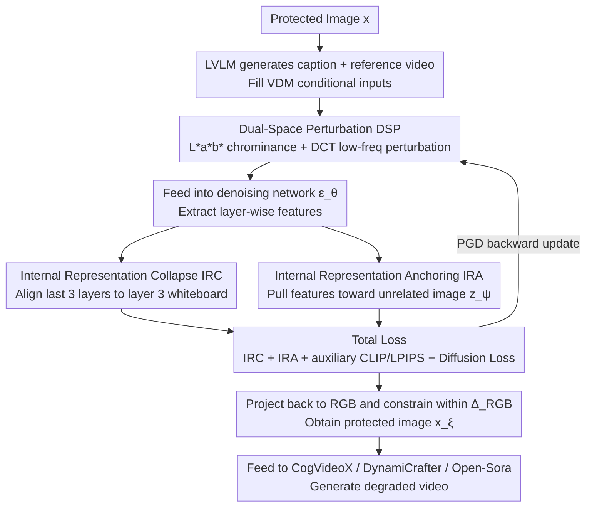

# Anti-I2V: Safeguarding your photos from malicious image-to-video generation

**Conference**: CVPR 2026  
**arXiv**: [2603.24570](https://arxiv.org/abs/2603.24570)  
**Code**: None  
**Area**: Video Generation  
**Keywords**: Adversarial Attack, Video Diffusion Model, Image Protection, Dual-space Perturbation, Deep Feature Collapse

## TL;DR
Anti-I2V proposes a defense method against malicious image-to-video generation by optimizing perturbations in the L\*a\*b\* and frequency dual-spaces and designing Internal Representation Collapse (IRC) and Anchoring (IRA) losses to disrupt semantic feature propagation in denoising networks, achieving SOTA protection across CogVideoX, DynamiCrafter, and Open-Sora.

## Background & Motivation
**Background**: Video Diffusion Models (VDMs) are evolving rapidly. Models like CogVideoX and Open-Sora can generate realistic videos from a single photo and text, posing a serious risk of deepfake abuse.

**Limitations of Prior Work**:
   - Existing defenses mainly target text-to-image generation or specific architectures (e.g., SVD); effectiveness on large DiT/MMDiT architectures remains unverified.
   - RGB space perturbations are easily eliminated during the denoising process, leading to insufficient robustness.
   - Most methods only attack the final output (VAE encoding or the end of the denoising network), ignoring intermediate feature propagation.

**Key Challenge**: Since VDMs have larger capacities and stronger temporal modeling, traditional perturbation methods fail to provide effective interference—how can one design deeper interference strategies?

**Key Insight**: A two-pronged approach—optimizing perturbations in more robust non-RGB spaces and identifying semantic-rich layers within the network to specifically disrupt feature propagation.

**Core Idea**: L\*a\*b\* + frequency domain dual-space perturbation + deep-to-shallow feature collapse + cross-layer semantic anchoring = effective attack against large-scale VDMs.

## Method

### Overall Architecture
Anti-I2V aims to add a protective perturbation to an image $x$ that is nearly imperceptible to the human eye but causes image-to-video models to fail. The pipeline revolves around the image $x$: first, an LVLM generates a caption and a reference video to fulfill the conditional input requirements for VDM inference. Then, the core perturbation optimization loop begins—instead of modifying RGB pixels directly, it iteratively updates noise in the L\*a\*b\* color space and the DCT frequency domain. The optimization objective is driven by two types of internal losses: IRC degrades semantic features from the deep layers of the denoising network to shallow layers, while IRA actively pulls these features toward an unrelated image. When combined with auxiliary CLIP/LPIPS losses and a negative diffusion loss, the perturbation is projected back to RGB to obtain the protected image $x_\xi$. Photos produced this way appear virtually unchanged to the eye but generate severely degraded videos when fed into models like CogVideoX, DynamiCrafter, or Open-Sora.

### Key Designs

**1. Dual-Space Perturbation (DSP): Preventing perturbation removal by denoising**

RGB pixel-level adversarial noise suffers from a weakness: the multi-step denoising of diffusion models acts as a denoiser itself, easily smoothing out high-frequency per-pixel noise during sampling. Anti-I2V addresses this by operating in more robust spaces. The L\*a\*b\* stage modifies only the chrominance channels $a^*$ and $b^*$ while leaving lightness $L^*$ untouched. Because L\*a\*b\* is more perceptually uniform, chrominance perturbations are less visible to humans and avoid attenuation by lightness-focused denoising. The DCT stage injects noise into low-frequency coefficients, which carry structural and textural "skeleton" information. Perturbing these is more persistent than perturbing high-frequency details and better affects deep network representations.

**2. Internal Representation Collapse (IRC): Forcing deep semantics back to a shallow "whiteboard" state**

Most existing defenses only attack final outputs, allowing intermediate layers to silently reconstruct meaningful structures. By visualizing features across layers using PCA, the authors found that semantics emerge hierarchically: high-level semantics appear after layer 19 in Open-Sora and after layer 27 in CogVideoX, while layer 3 remains a "whiteboard" with little semantic content. IRC forces early-to-late feature alignment:

$$\mathcal{L}_{IRC}^{i,j} = \mathbb{E}\big\|\epsilon_\theta^j(z_t, z_\xi, t, y) - \epsilon_\theta^i(z_t, z_\xi, t, y)\big\|_2^2$$

where $i$ is layer 3 and $j$ are the final 3 layers. Once deep semantics are flattened, the denoising process loses the ability to reconstruct structures. The attention mechanism in VDMs cascades this collapse across the temporal dimension, contaminating all frames of the generated video.

**3. Internal Representation Anchoring (IRA): Misleading semantics toward incorrect targets**

While IRC "destroys" semantics by flattening them, IRA "misleads" them by pointing features in an incorrect direction. It anchors the features of the protected image $z_\xi$ to the corresponding features of an unrelated target image $z_\psi$ across the denoising module and VAE:

$$\mathcal{L}_{IRA} = \underbrace{\big\|\epsilon_\theta^m(z_t, z_\xi, t, y) - \epsilon_\theta^m(z_t, z_\psi, t, y)\big\|_2^2}_{\text{Denoising Module Layer-wise}} + \underbrace{\big\|E^n(z_\xi) - E^n(z_\psi)\big\|_2^2}_{\text{VAE Layer-wise}}$$

This dual approach of "flattening + misleading" makes recovery harder; the network cannot find the original structure and is continuously steered toward irrelevant content.

### Loss & Training
Four items comprise the total objective:

$$\mathcal{L}_{Anti-I2V} = \mathcal{L}_{IRC} + \mathcal{L}_{IRA} + \mathcal{L}_{auxiliary} - \mathcal{L}_{DM}$$

The auxiliary loss $\mathcal{L}_{auxiliary}$ maximizes CLIP feature distance and LPIPS perceptual distance. The negative diffusion loss $-\mathcal{L}_{DM}$ performs reverse optimization of the denoising target, pushing the perturbation toward a state that is harder to denoise correctly. The entire suite is solved using PGD-style iterative optimization.

## Key Experimental Results

### Main Results (CelebV-Text Dataset)

| Model | Method | ISM↓ | C-FIQA↓ | Q-A(F)↓ | Q-A(V)↓ | DINO↓ |
|-------|--------|------|---------|---------|---------|-------|
| CogVideoX | Clean | 0.721 | 0.522 | 0.746 | 0.802 | 0.828 |
| CogVideoX | MIST | 0.561 | 0.463 | 0.476 | 0.577 | 0.750 |
| CogVideoX | **Anti-I2V** | **0.448** | **0.433** | **0.447** | **0.532** | **0.722** |
| DynamiCrafter | Clean | 0.528 | 0.467 | 0.724 | 0.794 | 0.622 |
| DynamiCrafter | AdvDM | 0.269 | 0.370 | 0.167 | 0.207 | 0.397 |
| DynamiCrafter | **Anti-I2V** | **0.151** | **0.303** | **0.032** | **0.047** | **0.167** |

### Ablation Study

| Configuration | ISM↓ | Q-A(V)↓ | Description |
|---------------|------|---------|-------------|
| RGB Perturbation only | 0.583 | 0.543 | Baseline (similar to AdvDM) |
| + L\*a\*b\* | 0.521 | 0.511 | Color space perturbation is more effective |
| + DCT | 0.498 | 0.496 | Frequency domain provides further gain |
| + IRC | 0.472 | 0.558 | Semantic collapse is effective |
| + IRA | 0.460 | 0.540 | Anchoring loss adds value |
| Full Anti-I2V | **0.448** | **0.532** | All components achieve optimal synergy |

### Key Findings
- Effectiveness is most significant on DynamiCrafter (UNet architecture), where Q-A(V) dropped from 0.794 to 0.047.
- It is equally effective on CogVideoX (DiT architecture), verifying cross-architecture generalization.
- Simple layer selection strategies (last 3 layers → layer 3) are universal across different architectures.

## Highlights & Insights
- **The first systemic study of adversarial perturbation optimization in non-RGB spaces**, identifying the L\*a\*b\* + frequency combination as a robust new direction.
- The IRC loss is theoretically supported by PCA analysis of denoising network layer features.
- Applicable to UNet, DiT, and MMDiT architectures, demonstrating strong practical utility.

## Limitations & Future Work
- Perturbation optimization still requires white-box access to the target model; black-box transferability is not fully explored.
- Robustness against image preprocessing (JPEG compression, blurring) requires further analysis.
- Operational efficiency: The computational cost of PGD iterative optimization for perturbations is high.

## Related Work & Insights
- Similar to MIST's textual loss but extended to the layer level.
- DSP concepts can be generalized to other adversarial attack/defense scenarios.

## Rating
- Novelty: ⭐⭐⭐⭐ Innovative combination of dual-space perturbation and hierarchical feature collapse.
- Experimental Thoroughness: ⭐⭐⭐⭐ Covers three VDM architectures across two datasets with thorough ablation.
- Writing Quality: ⭐⭐⭐⭐ Detailed technical explanations with intuitive PCA analysis.
- Value: ⭐⭐⭐⭐ Highly significant for AI security and privacy protection.

<!-- RELATED:START -->

## Related Papers

- [\[CVPR 2026\] Let Your Image Move with Your Motion! – Implicit Multi-Object Multi-Motion Transfer](let_your_image_move_with_your_motion_--_implicit_multi-object_multi-motion_trans.md)
- [\[CVPR 2026\] Attention Surgery: An Efficient Recipe to Linearize Your Video Diffusion Transformer](attention_surgery_an_efficient_recipe_to_linearize_your_video_diffusion_transfor.md)
- [\[ICCV 2025\] TIP-I2V: A Million-Scale Real Text and Image Prompt Dataset for Image-to-Video Generation](../../ICCV2025/video_generation/tip-i2v_a_million-scale_real_text_and_image_prompt_dataset_for_image-to-video_ge.md)
- [\[CVPR 2026\] Are Image-to-Video Models Good Zero-Shot Image Editors?](are_image-to-video_models_good_zero-shot_image_editors.md)
- [\[ICCV 2025\] RealCam-I2V: Real-World Image-to-Video Generation with Interactive Complex Camera Control](../../ICCV2025/video_generation/realcam-i2v_real-world_image-to-video_generation_with_interactive_complex_camera.md)

<!-- RELATED:END -->
