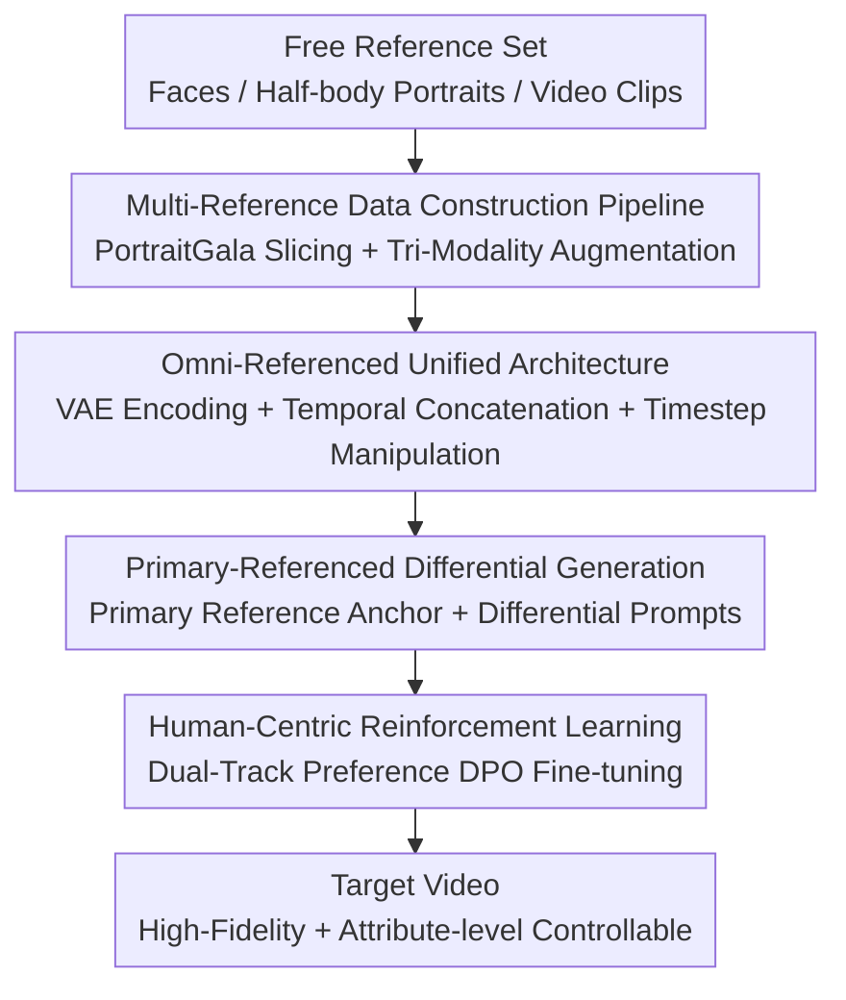

# AnyID: Ultra-Fidelity Universal Identity-Preserving Video Generation from Any Visual References

**Conference**: CVPR 2026  
**Paper**: [CVF Open Access](https://openaccess.thecvf.com/content/CVPR2026/html/Wang_AnyID_Ultra-Fidelity_Universal_Identity-Preserving_Video_Generation_from_Any_Visual_References_CVPR_2026_paper.html)  
**Code**: Project page https://johnneywang.github.io/AnyID-webpage (code to be confirmed)  
**Area**: Video Generation / Diffusion Models  
**Keywords**: Identity-preserving video generation, multi-reference, differential prompts, Diffusion Transformer, DPO

## TL;DR
AnyID extends "identity-preserving video generation" from "one face only" to "accepting arbitrary multiple faces/half-body portraits/video clips". It uses a pre-trained VAE to uniformly encode these heterogeneous references into a DiT, designates one primary reference as an anchor, and pairs it with a differential prompt describing only "changes" to achieve precise attribute control. Synthesized with human preference DPO fine-tuning, it substantially outperforms existing single-reference methods in both identity fidelity and prompt controllability.

## Background & Motivation

**Background**: Identity-preserving video generation allows users to place their favorite characters into various new scenes. Technologically, it has evolved from early tuning-based workflows (which fine-tune the model for every new identity) to current mainstream encoder-based workflows—using a face expert encoder (such as ArcFace/CLIP) to inject identity features of a reference image into a DiT, training generalized identity modeling capabilities on meticulously constructed datasets to eliminate the need for identity-specific fine-tuning.

**Limitations of Prior Work**: Almost all of these methods assume **the input has only one reference face image**. This assumption brings two issues. First, poor creative flexibility: real users have a collection of photos, half-body portraits, or even video clips, but models only accept a single face image, making it impossible to feed multiple sources. Second, and more fundamentally, a single 2D snapshot represents an **ill-posed problem**: a person's identity is defined by both 3D facial structure and expression dynamics, which a single static frontal portrait cannot fully capture. Consequently, when the generated face rotates to other angles or expresses different emotions, significant "identity drift" occurs.

**Key Challenge**: The single-reference paradigm naturally suffers from information deficiency, forcing the model to make a binary choice between "faithfully replicating the reference" and "adapting to a new context". It either rigidly "copies and pastes" the reference image (sacrificing controllability) or generates freely but suffers from identity drifting (sacrificing fidelity).

**Goal**: (1) Enable the model to accept an arbitrary number and modality (photos/half-body portraits/videos) of free references; (2) achieve precise, attribute-level (hairstyle/clothes/background...) controllable editing under multi-reference configurations; (3) overcome the issue where pixel-level MSE training fails to align with human perception.

**Key Insight**: The authors believe that the key to breaking the ill-posed nature of this problem in single-reference generation is to **embrace multiple free references**—multiple images or video clips allow the model to infer 3D shapes and dynamic patterns from different angles and motions. Moreover, this perfectly aligns with real user behaviors (users naturally possess existing collections of images and videos).

**Core Idea**: Use "omni-referenced unified encoding + primary reference anchoring + differential prompt" to replace the "single-face expert encoder". Multiple heterogeneous references are encoded into a single sequence using an all-purpose VAE, a primary reference is designated as the "standard answer" (anchor) for static attributes, and the prompts only specify "what to change relative to the primary reference".

## Method

### Overall Architecture
The input to AnyID is a **reference set $R=\{r_i\}_{i=1}^N$** (consisting of $N$ mixed-modality visual references, where static images are processed as single-frame videos) and a **target prompt $d$**, while the output is a video that preserves the identity and complies with the prompt. The overall pipeline is trained in two stages, supplied by a dataset pipeline: first, **supervised training** is conducted (achieving both omni-referenced unified encoding and primary-referenced differential control simultaneously in this stage), followed by **human-centric reinforcement learning** (fine-tuning with DPO according to human preferences). All training samples are synthesized from the PortraitGala dataset via a **multi-reference data construction pipeline**.

Specifically, in a forward pass: all references $r_i$ are individually encoded into latents by the same pre-trained VAE and concatenated along the temporal dimension into a unified condition $y$. The target video is encoded into $z_0$ and diffused with noise to obtain $z_t$. The clean reference latents and the noisy target latents are concatenated again along the temporal dimension into a long sequence and fed into the DiT. A key technique is **timestep manipulation**: the timesteps of all reference latents are fixed to $t=0$ (denoting zero noise), while the target latent uses the sampled $t>0$. Thus, the network naturally distinguishes "which is reference, and which is the target to be denoised", calculating the loss only on the output corresponding to the target. At the control level, a primary reference $r_1$ is designated as the anchor and paired with a differential prompt describing only "changes" to perform attribute-level editing.

### Key Designs

**1. Omni-Referenced Unified Architecture: Swallow all heterogeneous references with a general VAE, bypassing the face expert encoder**

To address the limitation of "only accepting a single face image, where the expert encoder acts as an architectural bottleneck", the authors abandon external visual experts like ArcFace/CLIP. Instead, they directly reuse the pre-trained VAE native to the generative model to inject identity. The input standardization process is as follows: all references (interpreting static images as single-frame videos) are padded to a uniform resolution $H\times W$ preserving their original aspect ratio, and then individually encoded by the VAE. They are then concatenated along the temporal dimension to form a unified condition $y=\mathrm{Concat}(\{E(I(r_i))\}_{i=1}^N)$, where $I(\cdot)$ denotes the resize-and-pad operations. During training, the clean reference latents and noisy target latents $z_t$ are also concatenated along the temporal dimension. Through **timestep manipulation** (pinning the reference timesteps at $t=0$ and setting the target timestep at $t>0$), the model distinguishes between them, discards outputs corresponding to zero-timestep references, and calculates the Rectified Flow loss $L_{RF}(\theta)=\|v_\theta(z_t,y,t,c)-(z_0-\epsilon)\|_2^2$ solely on the target output. The advantage is simplicity, scalability, and flexibility regarding the reference count and modality—more references simply lead to longer concatenated sequences without needing specialized encoders designed for each modality. Furthermore, to avoid the huge computational overhead of "unconditional inference for each condition separately" in multi-condition generation, the authors guide the generation using a **unified empty condition**: feeding the zero pixel latent $y_\varnothing$ visually and the empty prompt $c_\varnothing$ semantically, simultaneously nullifying all modalities in one go. This maintains an efficient inference speed $\hat v_t=(1-g)\cdot v_\theta(z_t,y_\varnothing,t,c_\varnothing)+g\cdot v_\theta(z_t,y,t,c)$, omitting redundant inference passes.

**2. Primary-Referenced Generation + Differential Prompts: Designate a primary reference as an anchor, and the prompt only describes "what to change"**

Multiple references bring context conflicts—different images might have conflicting representations of the same attribute in terms of lighting, makeup, or background (e.g., hair tied in one photo vs. hair down in another). The authors resolve this with a **primary-referenced paradigm**: designating a single primary reference $r_1$ as the "standard answer/anchor" for all static attributes. Given a fixed anchor, the traditional prompting method of "using absolute, holistic descriptions for the target scene" is no longer suitable—it is tedious and prone to unintended modifications in unspecified areas. Therefore, **differential prompts** are introduced: the prompt only describes "what changes occurred from the primary reference to the target content", and everything unmentioned is kept consistent with the primary reference by default. This precisely focuses the model's attention on the "specified changes", while the primary reference provides a stable foundation for all unchanged attributes. Technically, the portrait video is dissected into 7 predefined elements (camera shot, hairstyle, clothing, accessories, expression, action, background). A two-stage pipeline is used to generate differential prompts: first, a VLM generates detailed textual descriptions for each element in both the primary reference and the target video (obtaining $d_{ref}$ and $d_{tar}$). Then, an LLM compares semantic similarity element-by-element; elements with similarity exceeding a threshold $\gamma$ are classified as "unchanged" and pruned from $d_{tar}$, leaving the remaining parts as the final differential prompt $d$. The authors emphasize that the core contribution is the concept of "differential prompting", rather than the specific extraction workflow (the two-stage design is because a single VLM doing it in one shot tends to hallucinate or miss details; future stronger VLMs might achieve this in one step).

**3. Human-Centric Reinforcement Learning: DPO via decoupled dual-track human preference to compensate for the limitations of MSE in aligning with human perception**

While pixel-level MSE in the supervised stage establishes a strong baseline, it is fundamentally misaligned with high-level human perception—MSE tends to produce over-smoothed outputs, which inadvertently degrades the fine-grained features essential for identity fidelity and prompt controllability. The authors utilize **human-centric RL** to bridge this gap: extracting a large collection of inputs from the training set, sampling two video clips with the trained model for each input to form a pair, and then evaluating them along **two decoupled tracks**—omni-referenced identity fidelity (annotators receive all clips from the source ID-group as the complete reference and select which clip better preserves the "dynamic identity") and primary-referenced prompt controllability (annotators view the primary reference and differential prompt, choosing which clip better fits the "specified changes" while maintaining consistency in unmentioned aspects). A sample pair is considered valid for training only if one clip is **strictly superior along both axes** (i.e., achieves Pareto dominance). This collects 1,000 valid win-lose pairs used for preference fine-tuning via the Diffusion-DPO objective $L_{Flow\text{-}DPO}(\theta)=\log\sigma(-\beta(s(z_t^+,t,c,\theta)-s(z_t^-,t,c,\theta)))$. Ablations show that RL primarily refines subtle details affecting subjective fidelity, such as hair gloss, textures, and facial shadows.

**4. Multi-Reference Data Construction Pipeline: Synthesizing "Primary + Multi-Modality Assistant + Target" training instances from PortraitGala**

For the model to learn "identity invariance across diverse complex scenes", it requires a dataset that reflects such invariance. The authors build a large-scale portrait metadata pool based on PortraitGala, where videos are already grouped by identity (ID-group). Strict filtering is applied: first, face detection is performed to keep only single-subject clips, and low-quality samples (such as motion blur or extreme head poses) are filtered out. Face and human bounding boxes are annotated for each video, eventually obtaining a metadata pool of 100k ID-groups and 300k video clips. However, these clean clips are too "homogeneous" to represent diverse real inputs. Thus, **data augmentation is performed to synthesize multi-modality references**: drawing $N$ reference videos and one target video $x$ from an ID-group, and randomly converting each reference video to one of three modalities: face image (cropping the facial area from a random frame), half-body portrait (cropping a wider or tighter human area from a random frame), or video reference (drawing a random clip and cropping out the unified human area). Each run yields a complete training instance: one primary reference + a set of multi-modality assistant references + a target video. This "heterogeneous mix-and-match" data structure empowers the model to handle arbitrary reference inputs.

### Loss & Training
During the supervised stage, Rectified Flow loss is used (formula as shown above, pinning reference latents to $t=0$ and backpropagating only on the target output); during the RL stage, the Diffusion-DPO objective is used to fine-tune on 1,000 Pareto-dominant preference pairs. The implementation is based on Wan-5B, with a resolution of $1280\times704$ and 121 frames (approx. 5 seconds of 720p). During training and inference, the number of references $N$ varies between 1 and 5. The empty condition probability is $p_\varnothing=0.1$ and the guidance scale is $g=5.0$. Both the supervised and RL stages are trained using LoRA, taking approximately 4,500 A100 GPU hours in total.

## Key Experimental Results

### Main Results
Evaluations are conducted on a self-built benchmark: defining two tasks, IPT2V (identity preservation only) and IEPT2V (identity preservation + specific elements), and collecting 5 free references each for 50 celebrities. The LLM generates 50 IPT2V and 50 IEPT2V prompts. Metrics cover four dimensions: identity fidelity (Holi-Arc / Holi-Cur, average normalized cosine similarity across all reference faces), element consistency (Ele-CLIP / Ele-DINO, comparing elements segmented by Grounded-SAM), prompt controllability (App. Appearance / Mot. Motion / Bg. Background, scored by VLM), and visual quality (Sta. Static / Dyn. Dynamic, mimicking VBench). Note that baselines do NOT support multi-reference and are only fed the primary reference.

| Method | Holi-Arc | Holi-Cur | Ele-CLIP | Ele-DINO | App. | Mot. | Bg. | Sta. | Dyn. |
|------|----------|----------|----------|----------|------|------|-----|------|------|
| ConsisID-5B | 68.92 | 65.07 | - | - | 66.56 | 51.88 | 78.54 | 74.75 | 75.37 |
| FantasyID-5B | 69.60 | 65.03 | - | - | 73.12 | 58.74 | 82.50 | 73.81 | 82.81 |
| Phantom-14B | 70.01 | 64.01 | 66.01 | 75.90 | 61.88 | 54.37 | 83.12 | 77.62 | 83.54 |
| SkyReels-A2-14B | 69.12 | 64.89 | **78.14** | **79.87** | 50.19 | 58.75 | 54.37 | 78.62 | 78.25 |
| **AnyID-5B (Ours)** | **73.22** | **67.52** | 68.78 | 69.50 | **86.56** | **60.31** | **84.79** | **82.03** | **91.12** |

AnyID with only 5B parameters sweeps first place in identity fidelity (Holi-Arc 73.22, Holi-Cur 67.52), prompt controllability (App. 86.56 / Mot. 60.31 / Bg. 84.79), and visual quality (Sta. 82.03 / Dyn. 91.12), significantly outperforming the 14B models Phantom and SkyReels-A2. While SkyReels-A2 shows higher Ele-CLIP/DINO metrics, the authors note this is a byproduct of severe "copy-pasting" behavior (retaining even the reference background), which explains its extremely low App. score of 50.19. Phantom's Ele-CLIP and Ele-DINO metrics diverge, likely because its stylization tendency alters high-frequency information (captured by CLIP, missed by DINO).

### Ablation Study
Three ablation models: removing primary reference & differential prompt design (w/o P&D, using standard prompts instead), removing RL (w/o RL), and removing assistant references during inference (w/o AR, degrading to single-reference).

| Config | Holi-Arc | Ele-DINO | App. | Dyn. | Description |
|------|----------|----------|------|------|------|
| AnyID w/o P&D | 72.58 | 64.03 | 80.82 | 89.39 | Without primary reference + differential prompt, element consistency Ele-DINO drops to 64.03, and controllability drops |
| AnyID w/o RL | 72.61 | 65.96 | 80.77 | 90.44 | Without RL, details like hair gloss/texture degrade, Dyn. drops to 90.44 |
| AnyID w/o AR | 72.38 | 69.55 | 86.19 | 91.11 | Without assistant references during inference, identity fidelity Holi-Arc drops to 72.38 |
| **AnyID (Full)** | **73.22** | 69.50 | **86.56** | **91.12** | Full Model |

### Key Findings
- **P&D (Primary Reference & Differential Prompt) contributes most significantly to "attribute-level controllability/element consistency"**: Without it, Ele-DINO plummets from 69.50 to 64.03, and App. drops from 86.56 to 80.82; qualitatively, it fails to resolve hairstyle conflicts across multiple references.
- **AR (Assistant References) is directly related to identity fidelity**: If only the primary reference is presented during inference, Holi-Arc drops from 73.22 to 72.38—the assistant references provide extra facial dynamics, helping the model model identity invariance accurately under diverse facial motions.
- **RL refines "subtle details"**: Without it, metrics drop slightly (Dyn. 91.12 $\rightarrow$ 90.44); it corrects fine details like hair gloss, texture, and facial shadows that MSE tends to smooth out but significantly affect subjective fidelity.
- In the user study (20 users, 40 pairs of 1-to-1 comparisons), AnyID Wins $>70\%$ of matchups in identity fidelity and prompt controllability, and $>60\%$ in element consistency and visual quality. The win in element consistency was somewhat unexpected; follow-up interviews indicated that many users factored "naturalness" into their subjective assessments.

## Highlights & Insights
- **"Reusing the VAE rather than using an expert encoder" is one of the most elegant and general moves**: Identity injection historically relied on auxiliary ArcFace/CLIP experts. AnyID instead lets VAE + temporal concatenation + timestep manipulation take care of everything. Having more references simply leads to a slightly longer sequence, natively supporting any number and modality (face/half-body/video) of targets—such a "less is more" architectural choice is highly transferable to other multi-condition controllable generation tasks.
- **Differential prompting is a highly reusable interaction paradigm**: Changing from "absolutely describing the entire scene" to "describing only relative changes to a primary reference" not only reduces user burden but also minimizes description noise. In essence, it provides a stable "coordinate system" for generative models. This scheme can be applied to any task like image editing, virtual try-on, and style transfer that operates relative to a primary anchor.
- **Decoupling human preferences into two orthogonal tracks (Fidelity vs. Controllability) and enforcing Pareto dominance** is cleaner than a single-score metric—a sample is only designated as positive when it is superior along both axes, avoiding preference data corruption from samples that are "highly faithful but disobey instructions" or "highly obedient but look like a different person".

## Limitations & Future Work
- **Differential prompt extraction relies on a two-stage VLM+LLM pipeline**, which the authors acknowledge is prone to hallucinations/omissions when using a single VLM in one step, making it currently less stable; the threshold $\gamma$ and the 7-element division are manually designed, and might not generalize to non-portrait content.
- **Heavy dependence on PortraitGala**: Learning identity invariance is established on this single data source. Although 100k ID-groups is a large quantity, they all follow a specific distribution of portrait videos; outstanding cross-domain capabilities (anime characters, strong occlusions, crowded scenes) remain unproven (⚠️ subject to the original text, as such evaluations were not conducted in the paper).
- **Evaluation is not entirely on a level playing field**: The baselines do not support multi-reference inputs and were only fed the primary reference. AnyID benefits from the additional information of multiple references, so the conclusion "5B beats 14B" should be contextualized within a task setup that inherently favors multi-reference methods.
- The evaluation uses only 50 celebrities $\times$ (50+50) prompts, and the user study involves only 20 participants, which are relatively small scales; the RL phase utilizes only 1,000 pairs of preference data, leaving the generalization capability across sufficient preference coverage to be further validated.

## Related Work & Insights
- **vs ConsisID / FantasyID (Single-reference methods based on CogVideoX-5B)**: They inject identity from a single face using face expert encoders, suffering from identity drift when the head rotates or facial expressions change. AnyID mitigates this ill-posed issue using multiple free references + VAE unified encoding, achieving significantly higher identity fidelity.
- **vs Phantom / SkyReels-A2 (Single-reference methods based on Wan-14B)**: Phantom exhibits a stylization tendency that alters high-frequency element information, degrading identity fidelity; SkyReels-A2 is heavily biased towards the reference image, resulting in a "copy-paste" effect where even the background is copied (resulting in artificially high Ele metrics but extremely low App. score). AnyID decouples "what should change" from "what should be preserved" via differential prompts, obtaining a better balance between controllability and consistency.
- **vs Diffusion-DPO**: This work inherits the implicit reward modeling of DPO but explicitly decouples preference into "identity fidelity" and "prompt controllability" tracks, selecting only Pareto-dominant samples for training—a customized DPO tailor-made for identity-preserving video tasks.

## Rating
- Novelty: ⭐⭐⭐⭐⭐ Upgrades single-reference identity preservation to "arbitrary free references". Both the omni-referenced unified encoding and the differential prompting designs are solid and highly transferable.
- Experimental Thoroughness: ⭐⭐⭐⭐ Relatively complete with a self-built benchmark, four-dimensional metrics, ablation studies, and user studies, but the baselines do not operate on a level playing field and the evaluation scale is relatively small.
- Writing Quality: ⭐⭐⭐⭐⭐ The derivation of motivations (ill-posed problem $\rightarrow$ multi-reference) is clear, methods are well-sectioned, and text-to-figure correspondences are exceptionally detailed.
- Value: ⭐⭐⭐⭐⭐ Highly practical, catering to the real-world user scenario of "having a collection of photos/videos", and demonstrating 5B beating 14B.

<!-- RELATED:START -->

## Related Papers

- [\[CVPR 2026\] EvoID: Reinforced Evolution for Identity-Preserving Video Generation](evoid_reinforced_evolution_for_identity-preserving_video_generation.md)
- [\[CVPR 2026\] ConsID-Gen: View-Consistent and Identity-Preserving Image-to-Video Generation](consid-gen_view-consistent_and_identity-preserving_image-to-video_generation.md)
- [\[CVPR 2026\] PLACID: Identity-Preserving Multi-Object Compositing via Video Diffusion with Synthetic Trajectories](placid_identity-preserving_multi-object_compositing_via_video_diffusion_with_syn.md)
- [\[CVPR 2025\] Identity-Preserving Text-to-Video Generation by Frequency Decomposition](../../CVPR2025/video_generation/identity-preserving_text-to-video_generation_by_frequency_decomposition.md)
- [\[CVPR 2026\] EffectMaker: Unifying Reasoning and Generation for Customized Visual Effect Creation](effectmaker_unifying_reasoning_and_generation_for_customized_visual_effect_creat.md)

<!-- RELATED:END -->
