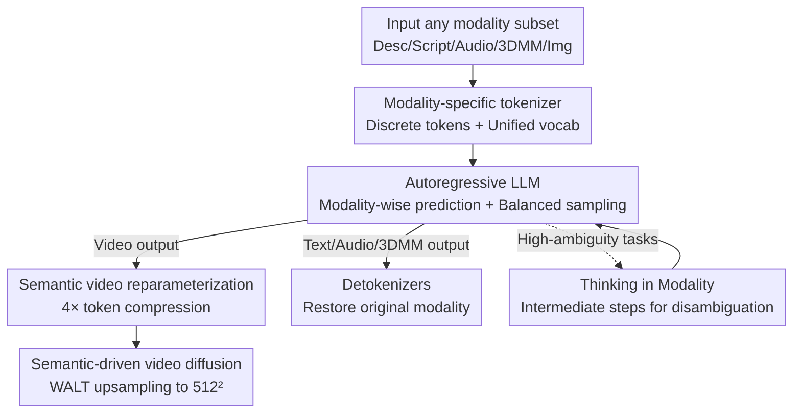

# Archon: A Unified Multimodal Model for Holistic Digital Human Generation

**Conference**: CVPR 2026  
**arXiv**: [2605.30311](https://arxiv.org/abs/2605.30311)  
**Code**: Project Page https://zju3dv.github.io/archon/ (No open source code yet)  
**Area**: Video Generation / Multimodal VLM / Digital Human  
**Keywords**: Digital Human Generation, Unified Multimodal Model, Autoregression, Semantic Video, Thinking in Modality

## TL;DR
Archon discretizes seven modalities involved in digital humans (description, text script, speech, 3DMM animation, semantic video, image, and video) into tokens. A single autoregressive large model is pre-trained on 72 tasks to achieve any-to-any modality generation, understanding, and editing. It addresses token explosion in high-frame-rate talking videos using a $4\times$ semantic video token compression and semantic-driven diffusion decoding. Furthermore, it stabilizes quality for high-ambiguity tasks like speech-to-video through "Thinking in Modality," which decomposes the process into modality-by-modality intermediate steps.

## Background & Motivation
**Background**: Current digital human systems (talking heads, audio-driven video, face reenactment, etc.) primarily follow the "expert model" route—training specialized models for each sub-task or single modality, such as independent models for audio-to-video or image-conditioned TTS.

**Limitations of Prior Work**: The expert model approach has two fundamental flaws. First, fragmentation and inefficiency: models are trained on different datasets with mismatched distributions, making multi-expert systems brittle for new tasks. Each expert must independently learn shared task knowledge, leading to redundant capacity and poor scalability. Second, the cost of adding new modalities is high, requiring new models to be trained from scratch or non-trivial fine-tuning.

**Key Challenge**: Existing "unified multimodal models" are not truly holistic in the digital human context. MLLMs (like Flamingo or Kosmos) are limited to text output. Unified generative models can produce text, images, or video but generally do not support speech or only produce non-speech audio like music or ambient sounds. Crucial digital human tasks—such as parsing speech, 3DMM animation, and cross-temporal identity preservation—have rarely been studied within a multimodal model framework.

**Goal**: To build an any-to-any human-centric unified generative framework covering all sensory modalities of digital humans, reusing knowledge through shared representations without needing individual pre-training for new tasks. Sub-problems include: (1) integrating heterogeneous modalities into a single token space; (2) managing token explosion for high-frame-rate videos; (3) stabilizing quality for high-ambiguity cross-modal tasks (e.g., speech-to-video).

**Key Insight**: Since discrete tokens and autoregressive transformers have proven effective for unifying perception and generation in shared token spaces, this approach is applied to the digital human domain. Exclusive tokenizers are assigned to each digital human modality, and the joint distribution is modeled using a single autoregressive model.

**Core Idea**: Seven digital human modalities are unified into discrete tokens for joint distribution pre-training across 72 synchronous tasks using a native autoregressive multimodal model. Token overhead is reduced by replacing RGB videos with "semantic videos," and ambiguity is minimized through a "Thinking in Modality" chain.

## Method

### Overall Architecture
Archon takes any subset of modalities as input and output. The pipeline begins with modality-specific tokenizers encoding descriptions, scripts, speech, 3DMM animations, images, and semantic videos into discrete integer tokens within a unified vocabulary ($550\text{K}$). These tokens are concatenated into a structured "natural language key-value serialized" prompt and fed into a PaLM2 autoregressive backbone for cross-modal reasoning, predicting output tokens modality-by-modality. Output tokens are then restored via corresponding detokenizers. A special path exists for video: the model generates low-cost "semantic video" tokens instead of high-dimensional RGB tokens to avoid context window explosion. These are ultimately upsampled into high-definition video by a semantic-driven video diffusion model (WALT). During inference, Thinking in Modality can be enabled to decompose ambiguous tasks into a chain of intermediate modality generation.

### Key Designs

**1. Modality-specific tokenizers + Unified vocabulary: Unifying 7 heterogeneous signals**

Digital human signals vary significantly (continuous audio, 3D mesh parameters, pixel videos, natural language). Archon assigns a tokenizer to each modality, balancing reconstruction fidelity and sequence length to produce discrete integer tokens. These are merged into a unified vocabulary where different modalities occupy continuous, non-overlapping index ranges (e.g., text: 0–256127, video: 256128–518272), each with independent learnable embeddings. Specifically: images use a pre-trained MAGVIT-v2 (lookup-free, codebook $2^{18}$) to compress $256\times256$ images into $16\times16$ tokens; audio uses SoundStream RVQ (25 fps, first 4 residual layers, 1024 codes per layer); animation uses residual VQVAEs for 3DMM parameters (shape: 8 layers $\times$ 512, expression: 8 layers $\times$ 2048, pose: 6 layers $\times$ 512); and text uses the T5 tokenizer. This unifies heterogeneous modalities into integer sequences for joint distribution modeling.

**2. Semantic video reparameterization + Semantic-driven diffusion decoding: Bypassing token explosion**

High-frame-rate talking videos are massive token consumers: a 5-second, 30 fps, $256\times256$ video requires $9\text{K}$ tokens using standard tokenizers, exceeding the $~8\text{K}$ context window of TPUv6. Furthermore, video tokens would dominate the data compared to the $940$ tokens required for audio of the same length, causing training bias. Archon decomposes video into "one reference image + one semantic video." The semantic video consists of 21 discrete semantic categories (eyelids, eyebrows, nose, etc.) from a facial segmentation model, preserving structure and motion while discarding texture. This significantly increases information density. The semantic video tokenizer (fine-tuned MAGVIT-v2, codebook $2^{10}$) compresses $L\times128\times128$ into $(\frac{L-1}{4}+1)\times8\times8$ tokens, achieving a $4\times$ reduction. Finally, a semantic-driven video diffusion model (modified WALT, $\mathbf{v}$-prediction + MSE loss) uses the semantic masks, reference image, and text description as conditions to upsample the semantic video into $512\times512$ high-definition video.

**3. Recursive task restructuring + Difficulty-balanced sampling: Managing 72 tasks**

Generating remaining modalities based on an arbitrary subset of conditions leads to a combinatorial explosion of tasks. Archon reformulates the generation process recursively: Step 1 uses conditional modalities $\mathcal{D}_{\mathrm{cond}}$ to generate $d_1$; subsequent steps $T_j$ use the "conditions + already generated $d_1,\dots,d_{j-1}$" as conditions to generate $d_j$. This predicts one modality at a time while maintaining the expressiveness of the joint distribution. Instead of special tokens, the prompt uses a "structured serialization of natural language key-values" (similar to JSON/HTML) to explicitly label modality types, states, inputs, and outputs. To address sampling biases (model bias, distribution bias, and difficulty variance), tasks are sampled with weights $S(i)=\frac{\log(p_i)}{N_{m(i)}}$, where $p_i$ is the task perplexity estimated from a uniform-sampling baseline model (measuring difficulty) and $N_{m(i)}$ is the total number of tasks for output modality $m(i)$.

**4. Thinking in Modality: Modality-wise chain of thought for disambiguation**

Direct cross-modal conversions like speech-to-video involve high ambiguity, requiring the extraction of explicit information (gender) and the synthesis of missing details (appearance, expression), resulting in much higher perplexity than 3DMM-to-video. Archon introduces "Thinking in Modality" during inference: instead of jumping directly to the target, the model generates a chain of intermediate modalities with smooth semantic transitions. For example, speech-to-video is processed as $\{d_{\mathrm{sph}},d_{\mathrm{img}}\}\rightarrow[d_{\mathrm{shp}},d_{\mathrm{exp}},d_{\mathrm{sem}},d_{\mathrm{dsc}},d_{\mathrm{vid}}]$, generating 3DMM shapes/expressions, semantic videos, and descriptions first. This allows the model to "think step-by-step" through modalities to reduce uncertainty without requiring retraining.

## Key Experimental Results

### Main Results
The model was trained on 6,000 hours of public monologue videos. The language model was trained on 256 TPUv6 for 20 days, and the diffusion model on 128 TPUv6 for 10 days. Evaluation utilized CelebV-HQ and HDTF (200 random samples each), neither of which were in the training set. Archon was evaluated under **zero-shot** conditions.

Speech-driven video generation (Table 1, ↓ lower is better / ↑ higher is better; ∗ denotes training on the benchmark):

| Dataset | Method | FID↓ | FVD↓ | Sync-C↑ | Sync-D↓ | IQA↑ |
|--------|------|------|------|---------|---------|------|
| CelebV-HQ | AniPortrait∗ | 39.73 | 160.7 | 3.493 | 10.982 | 3.833 |
| CelebV-HQ | EchoMimic∗ | 56.81 | 236.9 | 4.463 | 9.575 | 3.601 |
| CelebV-HQ | Hallo3 | 15.67 | 105.5 | **5.429** | 9.158 | 3.722 |
| CelebV-HQ | **Ours** | **6.818** | **93.81** | 5.210 | **8.998** | 3.794 |
| HDTF | AniPortrait | 42.03 | 162.8 | 2.879 | 10.889 | 3.813 |
| HDTF | EchoMimic∗ | 45.90 | 241.6 | 5.467 | 9.36 | 3.743 |
| HDTF | Hallo3∗ | 12.78 | 96.51 | **6.376** | 9.131 | 3.83 |
| HDTF | **Ours** | **5.779** | **81.64** | 6.198 | **8.822** | **3.94** |

Archon leads in FID, FVD, and Sync-D. While Hallo3 has a higher Sync-C, the paper notes that Hallo3 achieves this through exaggerated expressions at stressed syllables, often looking unnatural.

### Ablation Study
Ablation of Thinking in Modality on CelebV-HQ and HDTF (Table 3):

| Dataset | Configuration | FID↓ | FVD↓ | Sync-C↑ | Sync-D↓ | IQA↑ |
|--------|------|------|------|---------|---------|------|
| CelebV-HQ | w/o Unified Model | 7.279 | 170 | 3.209 | 10.143 | 3.695 |
| CelebV-HQ | w/o Thinking | 13.76 | 128.1 | 3.088 | 10.209 | 3.593 |
| CelebV-HQ | Full Model | **6.818** | **93.81** | **5.210** | **8.998** | **3.794** |

- **w/o Unified Model**: Replacing the unified model with specialized experts (same parameters/training) results in performance drops across all metrics, proving that joint learning in a shared architecture is more effective.
- **w/o Thinking**: Removing the intermediate chain significantly degrades FID and Sync-C, confirming that intermediate modalities are essential for stability.

### Key Findings
- Omitting "Thinking in Modality" significantly harms FID, suggesting that decomposing ambiguous tasks is a primary quality driver rather than a minor optimization.
- The unified model outperforms an ensemble of experts within the same parameter budget, validating the efficiency of joint token space training.
- Zero-shot performance rivals or exceeds specialized baselines (EchoMimic∗/Hallo3∗), demonstrating strong generalization.

## Highlights & Insights
- **The "Semantic Video" representation is a clever pivot**: It shifts the token explosion problem from compression algorithms to representation selection. By having the LM reason about discrete semantic structures (21 labels) and leaving texture to downstream diffusion, a $4\times$ compression is achieved while ensuring signals are more suitable for autoregressive modeling.
- **Recursive Task Restructuring** reduces an exponential task space to linear complexity, and the use of natural language prompts over special tokens makes adding new modalities nearly costless.
- **Thinking in Modality as Multi-modal CoT**: Just as text CoT provides intermediate reasoning, this generates intermediate modalities to reduce end-to-end uncertainty without requiring retraining.

## Limitations & Future Work
- **Dependency on specialized components**: The semantic video relies on facial segmentation, binding Archon to "talking head" scenarios. Extension to full-body movement or hand gestures would require redesigning the semantic category system.
- **Audio Fidelity**: Audio performance (MCD-DTW) lags behind specialized models like FaceTTS, likely due to the use of a lightweight universal detokenizer instead of a heavy-duty specialized audio diffusion model.
- **Computational Barrier**: The requirement for hundreds of TPUv6s for several weeks makes replication difficult for academia.
- **Manual Chain Design**: The Thinking in Modality chains are currently hand-crafted; there is no mechanism yet for automatically discovering or learning the optimal chain for a given task.

## Related Work & Insights
- **Compared to Expert Models (AniPortrait, EchoMimic, Hallo3, FaceTTS)**: These address single sub-tasks and require target benchmark training. Archon covers multiple tasks zero-shot via a unified model, though dedicated decoders may still edge it out in single-modality metrics like audio fidelity.
- **Compared to Human Foundation Models (Sapiens, OmniHuman)**: While those models capture poses and geometry at scale, their I/O is often modality-specific. Archon uses a discrete token interface to enable true any-to-any translation.
- **Compared to Unified Multimodal LMs (VideoPoet, Gemini, AudioLM)**: Archon brings the "single transformer, shared token space" paradigm specifically to the digital human domain, filling gaps in speech, 3DMM animation, and temporal identity consistency.

## Rating
- **Novelty**: ⭐⭐⭐⭐⭐ First to unify 7 digital human modalities into an autoregressive framework with clever semantic video and thinking chain designs.
- **Experimental Thoroughness**: ⭐⭐⭐⭐ Solid main task comparisons and ablations, though most of the 72 tasks are only qualitatively demonstrated.
- **Writing Quality**: ⭐⭐⭐⭐ Logic flows well from motivation to method, though definitions are quite dense.
- **Value**: ⭐⭐⭐⭐⭐ Provides a truly holistic any-to-any paradigm for digital humans; the semantic video tokenization has broad applicability.

<!-- RELATED:START -->

## Related Papers

- [\[CVPR 2026\] Soul: Breathe Life into Digital Human for High-fidelity Long-term Multimodal Animation](soul_breathe_life_into_digital_human_for_high-fidelity_long-term_multimodal_anim.md)
- [\[CVPR 2026\] U-Mind: A Unified Framework for Real-Time Multimodal Interaction with Audiovisual Generation](u-mind_a_unified_framework_for_real-time_multimodal_interaction_with_audiovisual.md)
- [\[CVPR 2026\] VGA-Bench: A Unified Benchmark and Multi-Model Framework for Video Aesthetics and Generation Quality Evaluation](vga-bench_a_unified_benchmark_and_multi-model_framework_for_video_aesthetics_and.md)
- [\[CVPR 2026\] M4V: Multimodal Mamba for Efficient Text-to-Video Generation](m4v_multimodal_mamba_for_efficient_text-to-video_generation.md)
- [\[CVPR 2026\] HoloCine: Holistic Generation of Cinematic Multi-Shot Long Video Narratives](holocine_holistic_generation_of_cinematic_multi-shot_long_video_narratives.md)

<!-- RELATED:END -->
