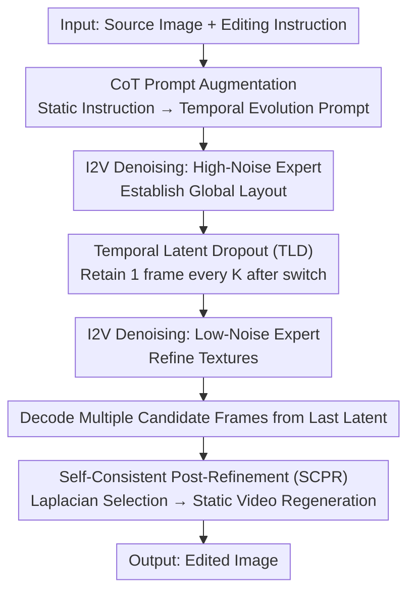

# Are Image-to-Video Models Good Zero-Shot Image Editors?

**Conference**: CVPR 2026  
**Paper**: [CVF Open Access](https://openaccess.thecvf.com/content/CVPR2026/html/Zhang_Are_Image-to-Video_Models_Good_Zero-Shot_Image_Editors_CVPR_2026_paper.html)  
**Code**: Not provided in the paper  
**Area**: Video Generation / Image Editing / Diffusion Models  
**Keywords**: Image Editing, Image-to-Video Diffusion, Training-free, Temporal Priors, Chain-of-Thought Prompting

## TL;DR
This paper proposes IF-Edit, a **training-free** framework that directly utilizes pre-trained Image-to-Video (I2V) diffusion models as zero-shot image editors. By rewriting static editing instructions into "evolution over time" descriptions using Chain-of-Thought (CoT) prompting, employing Temporal Latent Dropout (TLD) to prune redundant frames for denoising acceleration, and using Self-Consistent Post-Refinement (SCPR) to select and regenerate a "static video" for clarity, IF-Edit demonstrates strong performance in non-rigid deformation and reasoning-based editing tasks.

## Background & Motivation
**Background**: Mainstream text-guided image editing models tasks as image-to-image translation, either being training-free (relying on inversion + attention manipulation) or fine-tuned on large-scale paired data (e.g., Step1X-Edit, UltraEdit). Multimodal systems like GPT-Image and Nano-Banana can perform some reasoning-based editing but are either closed-source or rely on expensive fine-tuning.

**Limitations of Prior Work**: These methods are constrained by a **single-frame representation**, lacking explicit temporal or causal priors. This makes it difficult to handle large viewpoint changes, long-range physical reasoning, and self-consistency under significant geometric deformations (e.g., "what happens after an hour" or "being smashed by a hammer").

**Key Challenge**: High-quality video diffusion models (e.g., Wan 2.2) have demonstrated strong **world simulation** capabilities—generating physically plausible and object-consistent sequences with "chain-of-frames" reasoning. However, utilizing them as image editors faces three obstacles: (1) **Redundant computation**: Video models generate dozens of frames while editing only requires one, wasting significant compute; (2) **Inefficient frame selection**: Multiple frames may satisfy the instruction, and current methods (like F2F) rely on repeated VLM calls or manual selection, introducing latency; (3) **Lack of systematic understanding**: There has been no systematic evaluation of how off-the-shelf I2V models perform on general vs. reasoning-based editing.

**Goal**: Can off-the-shelf I2V diffusion models be converted into efficient, general-purpose zero-shot image editors **without any fine-tuning**?

**Key Insight**: The authors observe a clear division of labor in Wan 2.2’s MoE dual-experts: high-noise experts quickly establish global layout in early stages, while low-noise experts refine textures later. Furthermore, retaining only the first frame and a few intermediate frames is sufficient to maintain global consistency and detail (Fig. 3). This suggests that **temporal reasoning and global layout primarily occur during the early denoising stages, and most intermediate temporal latents are redundant**.

**Core Idea**: Instead of designing a new editor, the authors "revisit the editing pipeline" using three lightweight modules to address prompt misalignment, redundant temporal latents, and late-stage frame blur, squeezing video priors into a training-free image editor.

## Method

### Overall Architecture
IF-Edit takes a source image and an editing instruction as input and outputs an edited image. It reformulates "editing" as "generating a short video starting from the source image using an I2V model, then taking the final state as the result." The pipeline connects three lightweight components reusing the same Wan 2.2 model with zero additional training:

First, a VLM rewrites the static instruction into a **temporal Chain-of-Thought reasoning prompt** (solving prompt misalignment). During denoising, **Temporal Latent Dropout (TLD)** is applied after the expert switch point, retaining only key latents every $K$ frames (solving redundant computation). Finally, from several candidate frames decoded from the last latent, the sharpest frame is selected via Laplacian score and fed back into the same model to generate a "static video" for **Self-Consistent Post-Refinement (SCPR)** (solving late-stage blur), with the clearest frame from this segment serving as the final output.

### Key Designs

**1. CoT Prompt Augmentation: Translating "What to Change" into "How it Evolves Over Time"**

Design Motivation: Video diffusion models are trained on "temporal captions," while standard editing instructions (e.g., "take the paper out of her hand") are static and ambiguous, failing to trigger the model's world simulation priors. The authors use a VLM (Qwen3-VL-30B-A3B) to observe both the image and the instruction, rewriting it into a **Chain-of-Thought temporal reasoning prompt**. This explicitly describes how elements move/appear/disappear while maintaining identity and style (e.g., "She releases her grip → the card floats out of frame → hands become empty, lighting and pose unchanged"). Ablations show that removing this drops the CLIP-T from 0.65 to 0.59.

**2. Temporal Latent Dropout (TLD): Pruning Redundant Intermediate Frames After Layout is Set**

Following the observation that temporal structures are fixed early, TLD performs a **one-time temporal downsampling** once the denoising process passes the expert switch point (i.e., enters the low-noise expert, $t \le T_{th}$). Given a latent $z_t \in \mathbb{R}^{C\times F\times H\times W}$:

$$\tilde{z}_t = D_K(z_t) = z_t[:,\{0, K, 2K, \dots, F-1\},:,:]$$

It retains the first frame and every $K$-th latent, discarding redundant temporal tokens. This reduces temporal computation from $O(F)$ to approximately $O(F/K)$. With $K=3$, inference time drops from 21s to 12s with negligible quality loss.

**3. Self-Consistent Post-Refinement (SCPR): Using the Model as its Own "Deblurring Agent"**

Video diffusion inherently introduces varying degrees of motion blur. Existing methods rely on expensive VLM scoring to select frames. SCPR is a two-step deterministic process: first, it calculates the **Laplacian sharpness score** $s_i = \frac{1}{HW}\sum_{u,v}\nabla^2 x_i(u,v)$ for decoded frames $\{x_i\}$ and picks the sharpest frame $x^* = \arg\max_i s_i$. Then, instead of an external model, it feeds $x^*$ back into the same I2V model with a "static video" prompt (e.g., "A perfectly still video with enhanced clarity...") to generate a refined output $\hat{x}$. This uses temporal priors for self-alignment and texture enhancement.

### Loss & Training
**Training-free**. The framework reuses the pre-trained Wan2.2-A14B I2V model (27B MoE, 14B active per step) with Lightning-LoRA acceleration. Prompt augmentation uses Qwen3-VL-30B-A3B-Instruct. Inference involves 32 frames, 8 denoising steps, a dropout threshold of 0.9, and a temporal stride $K=3$. Each edit takes ~12 seconds on a single NVIDIA H100 80GB.

## Key Experimental Results

### Main Results
Evaluated across four benchmarks: TEdBench/ByteMorph (non-rigid/motion), RISEBench (reasoning), and ImgEdit (general).

TEdBench (Non-rigid deformation):

| Method | Source | LPIPS↓ | CLIP-I↑ | CLIP-T↑ |
|------|------|--------|---------|---------|
| LEDITS++ | CVPR24 | 0.23 | 0.87 | 0.63 |
| F2F | CVPR25 | 0.22 | 0.89 | 0.63 |
| FlowEdit | ICCV25 | 0.22 | 0.89 | 0.61 |
| **IF-Edit (Ours)** | - | **0.19** | **0.96** | **0.65** |

IF-Edit significantly improves CLIP-I from 0.89 to 0.96, showing superior image consistency.

RISEBench (Reasoning-based, GPT-4.1 Accuracy %):

| Model | Temporal | Causal | Spatial | Logic | Overall |
|------|------|------|------|------|------|
| Nano-Banana (Comm.) | 25.9 | 47.8 | 37.0 | 18.8 | 32.8 |
| GPT-Image-1 (Comm.) | 34.1 | 32.2 | 37.0 | 10.6 | 28.9 |
| Qwen-Image-Edit | 4.7 | 10.0 | 17.0 | 2.4 | 8.9 |
| Step1X-Edit | 0.0 | 2.2 | 2.0 | 3.5 | 1.9 |
| **IF-Edit (Ours)** | 5.8 | **21.1** | 12.0 | 4.7 | **11.1** |

Ours achieves the highest overall accuracy (11.1) among **open-source** models, particularly in temporal/causal reasoning, though a gap still remains compared to closed-source commercial models.

### Ablation Study

| Configuration | CLIP-T↑ | CLIP-I↑ | LPIPS↓ | Sharpness↑ | Latency(s)↓ |
|------|---------|---------|--------|---------|----------|
| w/o Prompt Augment | 0.59 | 0.95 | 0.20 | 981 | 10 |
| w/o Post-Refinement | 0.63 | 0.94 | 0.23 | 840 | 7 |
| K=1 (No Dropout) | 0.65 | 0.96 | 0.17 | 983 | 21 |
| **K=3 (Ours)** | **0.65** | **0.96** | **0.19** | 983 | **12** |
| VLM Frame Selection | 0.64 | 0.95 | 0.21 | 895 | 37 |

### Key Findings
- **Prompting for Alignment**: Removing CoT prompts drops CLIP-T by 0.06, proving temporal prompts are vital for aligning video priors with editing targets.
- **TLD for Efficiency**: Switching from $K=1$ to $K=3$ nearly halves the time while maintaining quality.
- **SCPR for Balance**: It ensures high sharpness (983 vs 840) without the massive latency overhead of VLM-based selection (12s vs 37s).
- **Strengths vs. Weaknesses**: Strong in non-rigid and reasoning tasks, but lags behind specialized editors in general attribute/style editing because I2V models exhibit an "overall dynamic" bias, sometimes treating local edits as global scene updates.

## Highlights & Insights
- **Redefining Editing as "Evolution"**: Treating editing as the final state of a micro-world evolution allows the model to generate large deformations as a coherent process rather than a forced single-frame modification.
- **Transferable TLD Insight**: The MoE video model's division between global layout and local detail is quantitatively utilized. Sparsifying temporal tokens *after* structural determination is an optimization strategy applicable to broader video diffusion tasks.
- **Self-Refinement via same Model**: SCPR avoids external deblurring networks by using a "static video" prompt to trick the model into refining its own output.
- **Systematic Diagnosis**: The paper provides a clear roadmap of where I2V-based editing excels and where it fails, serving as a guide for future unified video-image editing research.

## Limitations & Future Work
- **Weak in General Instruction Editing**: Without task-specific fine-tuning, local or abstract edits (e.g., "replace rabbit with pineapple") often fail as video priors prefer physically plausible transformations.
- **High VRAM Usage**: Despite TLD acceleration, processing multiple frames still requires >40GB VRAM.
- **Evaluator Bias**: Results mostly rely on VLM/GPT-4.1 scoring across different benchmarks, making horizontal comparisons difficult. Reasoning-based editing overall remains far from practical utility (11.1% accuracy).

## Related Work & Insights
- **vs. F2F (CVPR25)**: Both are training-free and use video models, but F2F relies heavily on VLM filtering (high latency). IF-Edit uses TLD and SCPR to eliminate VLM dependencies, significantly improving efficiency.
- **vs. ChronoEdit**: ChronoEdit fine-tunes video models for editing; IF-Edit occupies the "middle ground" by remaining training-free while competing in performance.
- **vs. Specialized Editors**: Tools like Step1X-Edit are superior for local/attribute edits. IF-Edit trades off local precision for superior non-rigid/causal reasoning.

## Rating
- Novelty: ⭐⭐⭐⭐ Re-purposing I2V world simulation for training-free editing is systematic; TLD and SCPR directly solve practical video-to-image conversion pain points.
- Experimental Thoroughness: ⭐⭐⭐⭐ Covers four benchmarks across various dimensions with clear ablations, though variance for single-seed runs is not reported.
- Writing Quality: ⭐⭐⭐⭐ The structure (3 obstacles → 3 modules) is clean, and the strengths/weaknesses are honestly discussed.
- Value: ⭐⭐⭐⭐ Provides a simple, reproducible recipe for unified video-image reasoning and editing.

<!-- RELATED:START -->

## Related Papers

- [\[CVPR 2025\] Zero-1-to-A: Zero-Shot One Image to Animatable Head Avatars Using Video Diffusion](../../CVPR2025/video_generation/zero-1-to-a_zero-shot_one_image_to_animatable_head_avatars_using_video_diffusion.md)
- [\[CVPR 2026\] Improving Motion in Image-to-Video Models via Adaptive Low-Pass Guidance](improving_motion_in_image-to-video_models_via_adaptive_low-pass_guidance.md)
- [\[CVPR 2026\] StoryTailor: A Zero-Shot Pipeline for Action-Rich Multi-Subject Visual Narratives](storytailora_zero-shot_pipeline_for_action-rich_multi-subject_visual_narratives.md)
- [\[CVPR 2026\] VidPrism: Heterogeneous Mixture of Experts for Image-to-Video Transfer](vidprism_heterogeneous_mixture_of_experts_for_image-to-video_transfer.md)
- [\[CVPR 2026\] MultiAnimate: Pose-Guided Image Animation Made Extensible](multianimate_pose-guided_image_animation_made_extensible.md)

<!-- RELATED:END -->
