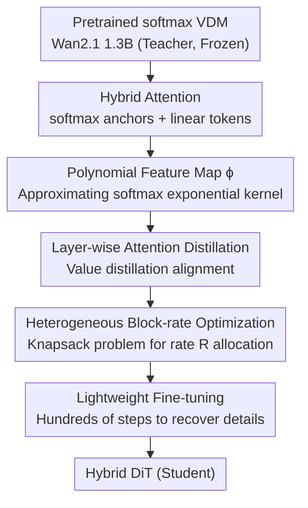

# Attention Surgery: An Efficient Recipe to Linearize Your Video Diffusion Transformer

**Conference**: CVPR 2026  
**Paper**: [CVF Open Access](https://openaccess.thecvf.com/content/CVPR2026/html/Ghafoorian_Attention_Surgery_An_Efficient_Recipe_to_Linearize_Your_Video_Diffusion_CVPR_2026_paper.html)  
**Code**: None (Qualcomm AI Research, not public)  
**Area**: Video Generation / Diffusion Model Efficiency  
**Keywords**: Video Diffusion Models, Linear Attention, Hybrid Attention, Attention Distillation, Mobile Acceleration

## TL;DR
The authors replace the expensive softmax self-attention in pretrained Video Diffusion Transformers (Wan2.1) with a hybrid attention mechanism consisting of "a few softmax anchor tokens + majority linear tokens." By employing a "surgical" pipeline comprising layer-wise distillation, knapsack-based block-rate selection, and lightweight fine-tuning, the model is linearized to near-original quality in **less than 0.4k GPU hours**. This achieves approximately 6× faster inference for single attention blocks on long videos.

## Background & Motivation
**Background**: Current SOTA video generation models almost exclusively utilize Diffusion Transformer (DiT) architectures—such as Wan2.1, CogVideoX, and HunyuanVideo—performing global self-attention on spatiotemporal patches. These models significantly outperform early U-Net designs in visual quality and temporal consistency.

**Limitations of Prior Work**: Self-attention exhibits quadratic complexity relative to sequence length (Time $O(N^2d)$, VRAM $O(N^2)$). The number of video tokens (spatial patches × frames) easily scales into the tens of thousands. Profiling results show that in Wan2.1 1.3B, **over 76% of Transformer block computation is consumed by self-attention**. Even with FlashAttention, quadratic scaling remains a bottleneck for high-resolution, long-duration, and multi-shot videos.

**Key Challenge**: Linear attention (sub-quadratic) exists but is rarely applied to video diffusion for three reasons: ① Training a SOTA video model from scratch requires hundreds of thousands to millions of GPU hours and massive datasets; ② There is no established method to **distill** softmax attention into linear attention efficiently—the exponential kernel in softmax is difficult to approximate accurately without infinite-dimensional feature maps; ③ Linear attention has weaker expressivity, leading to significant degradation in video quality, particularly for complex temporal dynamics.

**Goal**: To "locally retrofit" a pretrained softmax VDM into a linear/hybrid attention version **without training from scratch**, maintaining visual quality while drastically reducing computational costs.

**Key Insight**: Drawing from recent practices in Large Language Models—if a **small subset of tokens retains full softmax attention as global anchors** while the remaining tokens use linear attention, the model can preserve global structure and fine-grained dependencies where needed while scaling efficiently elsewhere.

**Core Idea**: A surgical pipeline consisting of "hybrid attention + layer-wise distillation + budget-constrained block-rate optimization + lightweight fine-tuning" to linearize existing VDMs at low cost.

## Method

### Overall Architecture
The input is a **frozen pretrained softmax VDM teacher** (Wan2.1 1.3B, 30 DiT blocks), and the output is a **Hybrid DiT student model**. The "Attention Surgery" pipeline decomposes the transformation into three serial steps: first, distilling each layer's softmax attention into a new hybrid attention module (training only the new feature map $\phi$ while freezing the rest); second, using **knapsack optimization** under a given compute budget to select a hybrid rate $R$ for each block; and finally, performing **hundreds of steps of lightweight fine-tuning** on the entire network to recover fine details. The hybrid attention module itself consists of two components—token separation (softmax anchors vs. linear) and a learnable polynomial feature map $\phi$.

### Key Designs

**1. Hybrid Attention: Small Softmax Anchors for Global Context, Linear for Others**

Replacing all tokens with linear attention results in quality loss due to the loss of exponential kernel expressivity, while full softmax offers no computational savings. This work decouples the set of tokens $T=\{1\dots N\}$ into a softmax token subset $T_S$ and a linear token set $T_L = T \setminus T_S$. For each query token $i$, the output is a weighted fusion:

$$\hat{y}_i = \frac{\sum_{j\in T_S}\exp\!\big(q_ik_j^\top/\sqrt{D}-c_i\big)v_j \;+\; \phi_q(q_i)\sum_{j\in T_L}\phi_k(k_j)^\top v_j}{\sum_{j\in T_S}\exp\!\big(q_ik_j^\top/\sqrt{D}-c_i\big) \;+\; \phi_q(q_i)\sum_{j\in T_L}\phi_k(k_j)^\top}$$

where $c_i$ is the max exponent term for numerical stability. The critical difference lies in how $T_S$ is selected: unlike LLMs that use **local windows** around the query, this work uses **uniform sub-sampling** based on the rate $R$—$T_S = \{i \in T \mid i \bmod R = 1\}$. This distributes high-quality softmax tokens evenly across the spatiotemporal span, acting as global anchors to maintain motion coherence and prevent temporal drift common in local windows. $R$ serves as the core trade-off knob: at $R=2$, half the tokens use quadratic complexity with reconstruction closest to softmax; at $R=8$, only 1/8 of tokens use quadratic attention, maximizing speed but reducing fidelity. Note that only the $T_S$ term retains $O(|T_S|^2)$ cost, while the linear term can be cached.

**2. Polynomial Feature Map $\phi$: Approximating Exponential Kernels**

The core of linear attention involves replacing the similarity $\text{sim}(q_i,k_j)=e^{q_ik_j^\top}$ with a decomposable $\phi(q_i)\phi(k_j)^\top$ to push the summation outside for linear complexity:

$$y_i = \frac{\phi(q_i)\sum_{j=1}^N \phi(k_j)^\top v_j}{\phi(q_i)\sum_{j=1}^N \phi(k_j)^\top}$$

The classic approach uses $\phi(x)=1+\mathrm{elu}(x)$, but its gap with the actual exponential kernel is too large. This work designs **independent learnable** feature maps $\phi_q,\phi_k: \mathbb{R}^D \to \mathbb{R}^{P\times D'}$. Input passes through a lightweight per-head embedding network ($1\times1$ group convolution + non-linearity), the output is split into $P$ parts, and the $i$-th part is raised to the $i$-th power: $\phi(x)=[(\psi_1(x))^1,(\psi_2(x))^2,\dots,(\psi_P(x))^P]^\top$. This **polynomial expansion** approximates the large dynamic range of the exponential kernel more accurately than ELU. Experiments found a 2-layer MLP with a degree-2 polynomial is sufficient, adding only ~2.4M parameters per modified block.

**3. Layer-wise Attention Distillation: Low-cost Value Distillation**

To minimize compute, Attention Surgery performs distillation **independently per block**. Each block is distilled separately (parallelizable), freezing the teacher and training only the student’s $\phi$. Only **a single set of prompts** is needed. While the most direct objective is matching attention scores ($L_{ad}$), the authors recommend **value distillation loss** ($L_{vd}$) to align the **weighted hidden states**:

$$L_{vd} = \big\|y - \hat{y}\big\|_1$$

where $y$ is the teacher softmax output and $\hat{y}$ is the student hybrid output. Ablations show that value distillation results in significantly higher motion range (Dyn. Deg. 66.1 vs. 37.5 for attention score distillation), whereas attention score distillation tends to produce "cartoonish" visuals. The entire distillation process costs less than 0.4k GPU hours.

**4. Heterogeneous Block-rate Optimization: Knapsack Formulation**

Different DiT blocks have varying sensitivities to linearization. Some blocks maintain low reconstruction error at $R=8$, while others require low $R$ or full softmax. The authors formalize the selection of $r$ for $B$ blocks as a **Multi-choice Knapsack Problem**:

$$\min_{\{z_{ir}\}}\ \sum_{i=1}^{B}\sum_{r\in R} e_{ir}z_{ir} \quad \text{s.t.}\ \sum_{i=1}^{B}\sum_{r\in R} c_{ir}z_{ir}\le\beta,\ \ \sum_{r\in R}z_{ir}=1\ \forall i$$

where $z_{ir}$ is a binary variable, $e_{ir}$ is the error estimated during distillation, and $c_{ir}$ is the compute cost. This allows for an **heterogeneous** optimal configuration across layers. This optimization consistently outperforms the simple baseline of converting a fixed percentage of blocks.

## Key Experimental Results

Experiments are based on **Wan2.1 1.3B** (30 DiT blocks), evaluated on VBench and VBench-2.0, with mobile latency measured on Snapdragon 8-Gen 4 and a 562-pair human preference blind test.

### Main Results: Comparison with SOTA Efficient VDMs (VBench, 81×480×832)

| Model | Params | Total↑ | Quality↑ | Semantic↑ |
|-------|--------|--------|----------|-----------|
| CogVideoX 5B | 5B | 81.91 | 83.05 | 77.33 |
| SANA-Video | ≤2B | 83.71 | 84.35 | 81.35 |
| Wan2.1 1.3B (Original) | 1.3B | 83.31 | 85.23 | 75.65 |
| Wan2.1 1.3B\* (Replicated) | 1.3B | 83.10 | 85.10 | 75.12 |
| **+ Attention Surgery (15×R2)** | 1.3B | **83.21** | **85.19** | **75.25** |

The 15×R2 variant (15 blocks converted to hybrid, rate 2) **nearly matches the original Wan2.1\***, with only ~0.1 difference in VBench Total. It also outperforms CogVideoX-1.5 5B (53.4) on VBench-2.0.

### Efficiency Gains

| Metric | Result |
|--------|--------|
| Self-attention share of block compute | >76% (Wan2.1 1.3B) |
| Single DiT block inference speedup (7.5s, 320×480) | ~6× faster |
| Total surgery training cost | <0.4k GPU hours |
| Additional params per modified block | ~2.4M (2-layer MLP + degree-2 poly) |
| Mobile device long video | Original VDM OOMs; Ours scales |

### Key Findings
- **Distillation is critical**: Pure linearization without distillation is nearly unusable (59.7 score). Hybrid attention is more robust than pure linear even without distillation (77+) because uniform softmax anchors preserve global structure.
- **Value Distillation > Attention Distillation**: Aligning **output hidden states** preserves motion dynamics (66.1 vs. 37.5) and prevents cartoonish artifacts.
- **$\phi$ efficiency**: A 2-layer MLP with a degree-2 polynomial reaches the Pareto front, matching the performance of much larger configurations.
- **Heterogeneous configuration**: Solving the knapsack problem for block-rate allocation consistently provides better quality-throughput trade-offs than homogeneous scaling.

## Highlights & Insights
- **Uniform Sub-sampling vs. Local Window**: Replacing local windows with uniform sampling across the entire spatiotemporal volume is a key modification specifically for video temporal consistency.
- **Architecture Search as a Knapsack Problem**: Formulating layer-wise configuration as a constrained optimization problem avoids searching exponential combinations and provides a clean template for quantization or pruning.
- **Two-stage alignment**: Decoupling alignment into independent block-wise distillation followed by whole-network fine-tuning is the engineering core of achieving SOTA results in <0.4k GPU hours.

## Limitations & Future Work
- The method was primarily validated on **Wan2.1 1.3B**; generalization to 14B models or other DiT families (CogVideoX, HunyuanVideo) is expected but not tested.
- The "linearize" claim in the title refers to "partial hybridizing" at the best quality point; the **quality-acceleration trade-off remains real** at more aggressive rates (e.g., 25×R4).
- Human preferences show a "no preference" majority (39.7%), suggesting the gap is small but the surgery is not a strict "free lunch" across all consistency metrics.

## Related Work & Insights
- **vs. SANA / LinGen**: These require large-scale training from scratch; this work retrofits pretrained models.
- **vs. M4V (Mamba) / SSM**: Changing block structures (Transformer to SSM) requires massive distillation data; this work **retains the block structure**, lowering costs.
- **vs. Token Merging / Tiling**: Tiling skips tokens; hybrid attention **attends to all tokens** (via softmax anchors + linear terms), making it better for long-range dependencies.

## Rating
- Novelty: ⭐⭐⭐⭐ Composing hybrid attention, knapsack optimization, and layer-wise distillation into a recipe for linearizing VDMs without expensive retraining.
- Experimental Thoroughness: ⭐⭐⭐⭐ Comprehensive evaluation on VBench and mobile hardware, though limited to a single model family.
- Writing Quality: ⭐⭐⭐⭐ Clear motivation, complete formulas, and well-explained three-stage process.
- Value: ⭐⭐⭐⭐ Highly practical for industrial deployment on mobile devices for long-form video.

<!-- RELATED:START -->

## Related Papers

- [\[CVPR 2026\] ReHyAt: Recurrent Hybrid Attention for Video Diffusion Transformers](rehyat_recurrent_hybrid_attention_for_video_diffusion_transformers.md)
- [\[CVPR 2026\] VMonarch: Efficient Video Diffusion Transformers with Structured Attention](vmonarch_efficient_video_diffusion_transformers_with_structured_attention.md)
- [\[CVPR 2026\] Let Your Image Move with Your Motion! – Implicit Multi-Object Multi-Motion Transfer](let_your_image_move_with_your_motion_--_implicit_multi-object_multi-motion_trans.md)
- [\[ICLR 2026\] SANA-Video: Efficient Video Generation with Block Linear Diffusion Transformer](../../ICLR2026/video_generation/sana-video_efficient_video_generation_with_block_linear_diffusion_transformer.md)
- [\[CVPR 2026\] RAPID: Reusing Attention Sparsity with Inter-step Adaptation for Efficient Video Diffusion](rapid_reusing_attention_sparsity_with_inter-step_adaptation_for_efficient_video_.md)

<!-- RELATED:END -->
