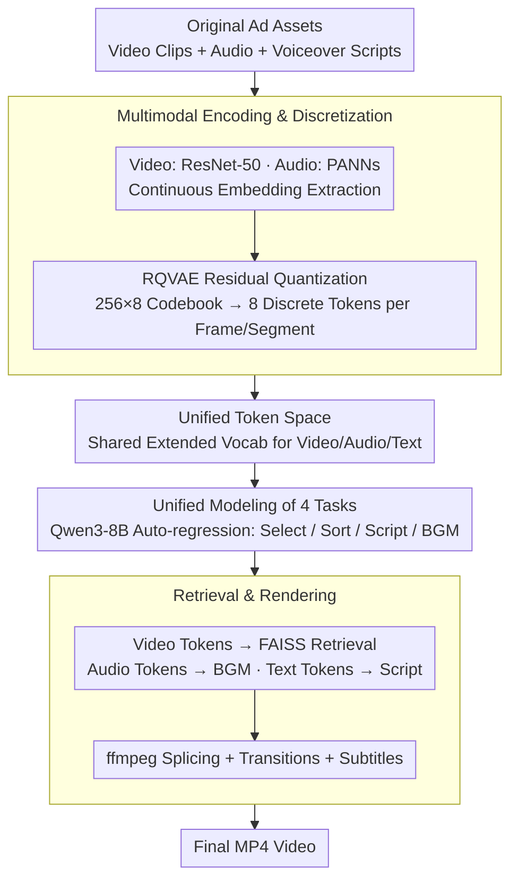

# AutoCut: End-to-end Advertisement Video Editing Based on Multimodal Discretization and Controllable Generation

**Conference**: CVPR 2026  
**arXiv**: [2603.28366](https://arxiv.org/abs/2603.28366)  
**Code**: [https://github.com/AdAutoCut/Autocut](https://github.com/AdAutoCut/Autocut)  
**Area**: Video Understanding / Video Editing  
**Keywords**: video editing, Multimodal LLM, Residual VQ, Advertisement, Controllable Generation

## TL;DR
AutoCut proposes an end-to-end advertisement video editing framework that unifies video, audio, and text into a shared discrete token space via Residual Vector Quantization (RQVAE). By performing multimodal alignment and supervised fine-tuning on Qwen3-8B, it achieves unified processing of four tasks—video selection, ordering, script generation, and background music (BGM) selection—outperforming GPT-4o baselines on multiple metrics.

## Background & Motivation

**Background**: Short videos have become the primary medium for digital advertising, but the production pipeline—involving scriptwriting, footage shooting, editing, and post-production—is costly and has high entry barriers.

**Limitations of Prior Work**:
   - **Loose Multimodal Coupling**: Representations of video, audio, and text are weakly aligned, preventing unified reasoning.
   - **Lack of Interpretable Control**: Models do not provide structured or discrete representations, making it difficult to adjust narrative rhythm and content focus.
   - **Fragmented Understanding and Generation**: Multimodal understanding and generation are treated as independent processes, leading to inconsistent optimization.

**Key Challenge**: While Multimodal Large Language Models (MLLMs) have the potential to unify perception, understanding, and creation, they are **constrained by context window lengths**, making it difficult to directly process large-scale video retrieval and editing.

**Core Idea**: Video and audio features are discretized into tokens via RQVAE and unified with text tokens to construct a shared vocabulary, allowing the LLM to perform multimodal reasoning and generation within a unified token space.

## Method

### Overall Architecture
AutoCut addresses the challenge of automatically editing raw advertisement assets (video clips, audio, voiceover scripts) into a final video. The difficulty lies in the weak alignment between different modalities and the LLM's inability to fit massive retrieval candidates into its context window. The proposed solution is to "compress everything into tokens": video frames and audio segments are encoded into continuous embeddings and then quantized into discrete tokens via RQVAE, which are then integrated into an extended shared vocabulary with text tokens. Consequently, "clip selection, ordering, scriptwriting, and BGM selection" are reduced to next-token prediction by the LLM on a unified sequence.

The training follows a two-step approach: first, the Qwen3-8B backbone is frozen while only the new multimodal embedding layers are trained for alignment (~700K samples); second, full-parameter SFT is performed to learn specific task behaviors (~100K planning samples). During inference, the LLM outputs a hybrid token sequence where video tokens are used for nearest-neighbor retrieval of actual clips, audio tokens are decoded into BGM, and text tokens serve as the script. Finally, ffmpeg is used to assemble these into an MP4.

### Key Designs

**1. Multimodal Encoding and Discretization: Compressing continuous video/audio into LLM-compatible discrete tokens**

Video frames utilize ResNet-50 pretrained via contrastive learning to extract frame-level semantic embeddings, while audio segments use PANNs (Wavegram-Logmel-CNN) pretrained on AudioSet. Since continuous embeddings cannot directly enter the LLM's discrete vocabulary, RQVAE (Residual Vector Quantization) acts as a "translator." It uses a $256 \times 8$ codebook to approximate the original embedding level-by-level using residuals, encoding each frame or audio segment into 8 discrete tokens. The advantage of residual quantization is that coarse codebooks capture structural information while subsequent ones add detail. This allows 8 tokens to achieve reconstruction cosine similarities of 0.89 for video and 0.96 for audio, using a reconstruction loss $\mathcal{L}_{rec} = 1 - \cos(\hat{f}, f)$. The choice of 8 tokens represents a trade-off between reconstruction quality and sequence length.

**2. Unified Token Space: Reducing cross-modal reasoning to sequence modeling**

Video, audio, and text tokens share an extended vocabulary. To the LLM, they are indistinguishable discrete symbols. The alignment phase is trained using the standard NTP loss:

$$\mathcal{L}_{NTP} = -\sum_t \log P(x_t \mid x_{<t})$$

Crucially, only the newly introduced multimodal embedding layers are updated during this phase while the LLM backbone is frozen. This ensures that new modality embeddings align with the LLM's existing semantic space without disrupting the pretrained weights. With a unified vocabulary, cross-modal tasks such as "video-to-script" or "scoring" no longer require specialized fusion modules; they become simple auto-regressive generation over a single token sequence.

**3. Unified Modeling of Four Tasks: A single model and token sequence for the entire pipeline**

Advertisement editing is decomposed into four sub-tasks that share the same token sequence and model: video selection picks relevant clips from a candidate pool (measured by CSA), video ordering arranges clips into a coherent temporal sequence (CRA), script generation produces aligned text (SQ quality + WCD temporal consistency), and BGM selection retrieves matching background music (MSS). Because all inputs and outputs are tokens from the same vocabulary, the model "sees" the script and music tokens while ordering clips, and "sees" visual tokens while writing the script. The tasks provide mutual context rather than running as independent pipelines.

**4. Retrieval and Rendering: Reverting generated tokens to real assets and final video**

LLM-generated video tokens are discrete symbols that cannot be played directly. Therefore, the system returns to the asset library: FAISS performs nearest-neighbor search based on generated video tokens to match actual clips. Audio tokens are decoded or retrieved as real BGM, and text tokens are treated as subtitles or scripts. Finally, ffmpeg concatenates the retrieved clips in the order specified by the LLM, adding transitions and subtitles to output the final MP4. This dual-track approach—using low-frame-rate tokens for LLM reasoning and high-frame-rate frames for retrieval—ensures both efficiency and matching precision.

### Loss & Training
The alignment phase uses ~700K filtered advertisement videos (preferring high-interaction samples with speech). The SFT phase uses ~100K high-quality planning samples (duration <120s, segments 2-60s, filtered by Qwen-VL for visual-text relevance). Preprocessing involves ASR for timestamp extraction, video sampling at 1fps, and audio separation using pydub. The strategy emphasizes quality over quantity, which explains why an extra pre-training stage was found to be detrimental in ablation studies.

## Key Experimental Results

### Main Results (364 Test Videos)

| Method | CSA↑ | CRA↑ | VSC↑ | SQ↑ | WCD↓ | MSS↑ |
|------|------|------|------|-----|------|------|
| Qwen3-8B (Caption) | 0.137 | 0.016 | 0.931 | 80.0 | 5.26 | – |
| Qwen3-8B (Caption+SFT) | 0.569 | 0.030 | 1.123 | 59.2 | 6.82 | – |
| Qwen2.5-VL-32B | 0.665 | 0.025 | **0.998** | 78.3 | 12.51 | – |
| GPT-4o + MGSV | 0.269 | 0.078 | 1.136 | 83.0 | 7.75 | 0.266 |
| **AutoCut** | **0.659** | **0.107** | 1.036 | **84.6** | **3.02** | **0.348** |

### Ablation Study

| Configuration | CSA↑ | CRA↑ | VSC↑ | SQ↑ | WCD↓ |
|------|------|------|------|-----|------|
| SFT only | 0.478 | 0.082 | 1.004 | 83.2 | 4.43 |
| emb+full+sft | **0.717** | 0.058 | 0.967 | 79.0 | 4.50 |
| **emb+sft (ours)** | 0.659 | **0.107** | **1.036** | **84.6** | **3.02** |

### Key Findings
- AutoCut's CRA (Clip Retrieval Accuracy for ordering) significantly leads all baselines (0.107 vs 0.078), suggesting tokenized multimodal representations better capture temporal structures.
- WCD (Word-Clip Distance) of 3.02 is far superior to GPT-4o's 7.75, demonstrating the advantage of joint multimodal modeling for temporal alignment.
- Human evaluation shows AutoCut outperforms GPT-4o across all 5 dimensions (88% overall win rate).
- The additional pre-training phase (emb+full+sft) actually degraded CRA and SQ, indicating that pre-training corpora of limited quality can introduce noise.
- Significant cost advantage: Processing 100 videos costs AutoCut ~$0.015 versus ~$2.5 for GPT-4o.

## Highlights & Insights
- **"Discretization is Unification"**: By using RQVAE to unify all modalities into a token space, the problem is simplified to Next-Token Prediction (NTP), which is elegant and concise.
- **Two-stage training (Alignment + SFT)** is superior to three-stage training, proving that data quality outweighs data quantity.
- The dual-track design—using low-frame-rate tokens for inference and high-frame-rate frames for retrieval—balances efficiency and accuracy.
- The inclusion of BGM selection is a highlight, as audio selection is often neglected in video editing research.

## Limitations & Future Work
- Fine-grained synchronization between video actions and audio rhythms is still insufficient (occasional desync).
- Control granularity is limited to the clip level; it does not support frame-level or emotion-level editing.
- Although RQVAE reconstruction has high cosine similarity, the impact of information loss may be amplified in downstream tasks.
- Evaluation relies on GPT-4o as a judge (for VSC and SQ metrics), risking evaluation bias.

## Related Work & Insights
- VC-LLM also uses MLLMs for ad video generation but relies on multi-resolution spatio-temporal reasoning.
- MGSV is the only baseline with audio matching capabilities.
- Compared to "any-to-any" LLMs like NExT-GPT, AutoCut focuses specifically on the practical constraints of editing scenarios.
- The discretization-plus-retrieval approach can be generalized to other video creation scenarios such as short dramas and vlogs.

## Rating
- Novelty: ⭐⭐⭐⭐ The multimodal discretization unified framework is a new solution for the ad editing domain, though core components are relatively mature.
- Experimental Thoroughness: ⭐⭐⭐⭐ Automatic metrics + human eval + ablation, though the test set is limited to 364 videos.
- Writing Quality: ⭐⭐⭐⭐ The framework description is clear, but definitions of evaluation metrics are somewhat scattered.
- Value: ⭐⭐⭐⭐ Directly practical for automated ad video production with significant cost benefits.

<!-- RELATED:START -->

## Related Papers

- [\[CVPR 2026\] STARFlow-V: End-to-End Video Generative Modeling with Autoregressive Normalizing Flows](starflow-v_end-to-end_video_generative_modeling_with_autoregressive_normalizing_.md)
- [\[CVPR 2026\] MoCha: End-to-End Video Character Replacement without Structural Guidance](mocha_end-to-end_video_character_replacement_without_structural_guidance.md)
- [\[CVPR 2026\] M4V: Multimodal Mamba for Efficient Text-to-Video Generation](m4v_multimodal_mamba_for_efficient_text-to-video_generation.md)
- [\[CVPR 2026\] Thinking with Video: Video Generation as a Promising Multimodal Reasoning Paradigm](thinking_with_video_video_generation_as_a_promising_multimodal_reasoning_paradig.md)
- [\[CVPR 2026\] Archon: A Unified Multimodal Model for Holistic Digital Human Generation](archon_a_unified_multimodal_model_for_holistic_digital_human_generation.md)

<!-- RELATED:END -->
