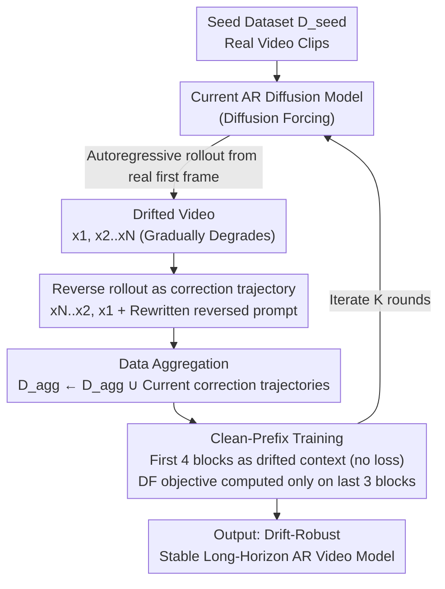

# BAgger: Backwards Aggregation for Mitigating Drift in Autoregressive Video Diffusion Models

**Conference**: CVPR 2026  
**Paper**: [CVF Open Access](https://openaccess.thecvf.com/content/CVPR2026/html/Po_BAgger_Backwards_Aggregation_for_Mitigating_Drift_in_Autoregressive_Video_Diffusion_CVPR_2026_paper.html)  
**Code**: None  
**Area**: Video Generation  
**Keywords**: Autoregressive Video Diffusion, Exposure Bias, Drift, DAgger, World Models  

## TL;DR
To address the error accumulation and subsequent image quality drift over long videos in autoregressive video diffusion, BAgger **reverses the timeline** of the model's own degradation rollouts to construct error-correcting trajectories that "recover from poor frames to good frames". Under a DAgger-style data aggregation and fine-tuning scheme utilizing standard diffusion objectives, BAgger enables the model to self-correct from its own faulty states without requiring a bidirectional teacher or distribution-matching losses, thereby achieving highly stable long-horizon generation.

## Background & Motivation
**Background**: Autoregressive (AR) diffusion models, which treat videos as "predicting the next segment frame-by-frame or block-by-block", constitute the mainstream paradigm for building world models. This is because time is physically causal; generation must proceed sequentially using causal attention rather than generating fixed-length clips all at once, as early bidirectional diffusion models did.

**Limitations of Prior Work**: All AR generative models suffer from **exposure bias**, which manifests as **drift** in video generation. During training, the model is conditioned on clean, ground-truth context frames, whereas during inference, it is conditioned on its own generated (and potentially erroneous) frames. Once an error occurs in a frame, it is treated as context for the next step, magnifying the error and cascading into rapid visual degradation over time. Typical symptoms include over-saturation, over-smoothing, loss of contrast, and motion diversity collapse, causing the video quality to break down after tens of seconds.

**Key Challenge**: Mitigating drift inherently requires the model to correctly model the **inference conditional distribution** $p(x^i \mid \hat{x}^{<i})$ (where the context consists of self-generated drifted frames). However, the training phase lacks such error-correcting pairs ("drifted context $\rightarrow$ ground-truth next frame"). Mainstream remedies attempt to align the AR model's rollout distribution with a pretrained **bidirectional teacher** (e.g., Self Forcing), which introduces three major drawbacks: (1) dependence on a massive bidirectional teacher diffusion model; (2) the need for backpropagation through time (BPTT) over the entire autoregressive generation process, which is highly computationally expensive; and (3) the fact that distribution-matching losses (e.g., score distillation, adversarial losses) are intrinsically **mode-seeking**, which stifles diversity and freezes motion. Another line of work injects noise into context frames (e.g., Diffusion Forcing), but a noisy context still mismatches the actual drifted context encountered during inference, failing to fundamentally resolve exposure bias.

**Key Insight**: The authors draw inspiration from **DAgger (Dataset Aggregation)** in imitation learning, where a policy rolls out to collect on-policy states, an oracle provides correct actions for these states, and the aggregated dataset is iteratively used to retrain the policy, teaching the model to "recover from its own mistakes." The bottleneck in video generation is the lack of a human oracle capable of manually correcting high-dimensional, continuously degrading drifted frames.

**Core Idea**: **Reversing the model's own rollout yields an oracle-free error-correcting trajectory**. An AR rollout starts from high-quality real frames and autoregressively degrades over time; reversing it temporally naturally transforms it into a recovery demonstration "progressing from bad frames back to good frames." As long as the text prompt is rewritten to describe the reversed motion, the reversed video remains in-distribution for text-to-video models. Consequently, the model's own errors are converted into valuable training data.

## Method

### Overall Architecture
BAgger is an **iterative data-aggregation training loop** built upon a causal diffusion transformer trained with Diffusion Forcing (DF). The inputs are a seed dataset $D_{\text{seed}}$ composed of real video clips; the output is an AR video model that is robust to its own drifted states and capable of stable long-horizon generation.

Each round (round $k$) consists of four steps: (1) using the current model to autoregressively roll out a gradually drifting video $(x^1, \hat{x}^{2:N})$ starting from a real initial frame; (2) **temporally reversing** this video into $(\hat{x}^{N:2}, x^1)$ to obtain an error-correcting trajectory, while rewriting the prompt to its reversed version; (3) **aggregating** all error-correcting trajectories from the current round into the cumulative dataset $D_{\text{agg}}$; (4) retraining the model on the aggregated dataset using the **original DF diffusion objective**. Iterating this loop over multiple rounds guides the dataset to progressively approximate the model's own trajectory distribution, ultimately bridging the train-inference gap. The entire process does not involve any distribution-matching losses or BPTT.

### Key Designs

**1. Reversing Rollouts as Oracle-Free Error-Correcting Trajectories**

This is the core insight of the paper. Exposure bias necessitates training data that pairs "drifted context $\rightarrow$ correctly recovered frame," but humans cannot manually repair a high-dimensional, continuously degrading video. The authors observe that the model's own rollout $(x^1, \hat{x}^{2:N})$ is inherently a "good-to-bad" trajectory. By **temporally reversing** it to $(\hat{x}^{N:2}, x^1)$, it transforms into a "bad-to-good" recovery demonstration: given a sequence of potentially drifted frames, the next frame should be one that is closer to the true distribution. This effectively utilizes the model's own mistakes as supervision without requiring an external teacher or oracle.

The feasibility rests on two assumptions. First, **the text-conditioned video manifold is closed under temporal reversal**: if $x^{1:N} \in M_{\text{data}}$, then $x^{N:1} \in M_{\text{data}}$ (a person walking backward and forward are both valid videos). Second, to make the reversed sample valid, one only needs to rewrite the original prompt $c$ into its reversed version $c'$ ("a person walking" $\rightarrow$ "a reversed video of a person walking") so that the text condition aligns with the reversed motion. With these conditions satisfied, the reversed rollout serves as an in-distribution, valid supervisory signal.

**2. DAgger-Style Data Aggregation Training Loop**

Simply generating a batch of error-correcting samples is insufficient because a single round of sampling cannot cover the entire distribution of drifted states—indeed, a single round may even perform worse than using only seed data. BAgger adopts the iterative aggregation concept of DAgger (refer to Algorithm 1): at round $k$, the current model $p_{\theta_k}$ samples $M$ drifted rollouts, which are reversed into correction trajectories $D_k$ and merged into $D_{\text{agg}} \leftarrow D_{\text{agg}} \cup D_k$. The model is then retrained from the base checkpoint to yield $p_{\theta_{k+1}}$. As the number of rounds increases, the aggregated data progressively converges to the model's **own trajectory distribution**, fundamentally aligning the context seen during training with the context generated during inference, resolving the root cause of exposure bias. Empirical tests show monotonic improvement in image quality across rounds: Round 1 may "over-correct" to an under-saturated state, Round 2 stabilizes saturation and contrast, and Round 3 further enhances details and temporal consistency.

**3. Clean-Prefix Error-Correcting Training Objective**

Correction trajectories and clean seed data cannot be treated identically during training. Seed data $D_{\text{seed}}$ is computed frame-by-frame under the standard DF objective: each frame independently samples a noise level $t_i$, corrupting $x^i_0$ into $x^i_{t_i} = \alpha_{t_i} x^i_0 + \sigma_{t_i}\epsilon_i$, and the denoiser learns to predict the noise:

$$L_{\text{DF}}(\theta) = \mathbb{E}_{t_i, x_0, \epsilon_i}\left[\,\|\hat{\epsilon}_\theta(x^i_{t_i}, t_i, x^{j<i}_{t_j}) - \epsilon_i\|_2^2\,\right]$$

However, for correction trajectories, the model **should not learn to generate the distribution of the drifted frames themselves**; it should only learn "how to output a correct frame given a drifted context." Thus, the authors designate a **prefix sequence of frames as the 'drifted state'**: these prefix frames are fed to the model cleanly as context, but **no loss is computed on them**. Loss is only computed on the subsequent frames. In practice, the first 4 latent chunks of each correction trajectory are used as the clean, non-loss drifted prefix, and the DF objective is computed only on the remaining 3 chunks. In this manner, the model treats the prefix as an "already drifted, completed fact" and focuses solely on learning how to recover from this state, rather than treating the drift frames themselves as targets to generate.

### Loss & Training
The standard Diffusion Forcing objective (frame-by-frame denoising MSE in Eq. 2) is used throughout without adding any distribution-matching or adversarial losses. Architecturally, the model is built on a diffusion transformer with **block-causal attention**, where each chunk contains 3 latent frames, totaling 7 chunks. Specifically, the bidirectional Wan2.1 1.3B model is restructured to be block-causal and trained on 832×480, 16FPS, 5-second videos (compressed from 81 frames to 21 latent frames via a 3D VAE). The seed set consists of 55k high-quality clips from Pexels (with MiraData extended captions), and the initial DF model is trained for 16K steps with a batch size of 96. Each round of BAgger generates 27K correction trajectories (50% of the seed set) by using the model from the previous round to autoregressively extend 6 chunks from a ground-truth first chunk, which is then decoded to pixel space, reversed, and re-encoded back into latents. Every round, the model is fine-tuned from the Wan2.1 1.3B base checkpoint for 16K steps (restarting training rather than continuing training to isolate the effect of "aggregation" itself and rule out the confounding factor of accumulated compute). Long video inference uses a sliding window, and the **KV-cache is recomputed for each window** (instead of a rolling cache) to ensure OOD cache values do not confound the evaluation.

## Key Experimental Results

### Main Results
50-second long text-to-video generation is evaluated on VBench (compared with Diffusion Forcing and History Guidance under the same seed data and compute budget). In addition to conventional "global metrics," the authors introduce **Drifting Metrics**: the difference between "the average of the first 20% of frames minus the average of the whole video" ($\Delta$Aesthetic / $\Delta$Imaging) is computed. **A lower value indicates smaller drift**, as frame-by-frame global averages often mask temporal degradation.

| Method | Subject Cons. ↑ | Bg. Cons. ↑ | Aesthetic ↑ | Imaging ↑ | ΔAesthetic ↓ | ΔImaging ↓ |
|------|------|------|------|------|------|------|
| Diffusion Forcing ($\sigma_{test}=0$) | 80.70 | 87.74 | 53.05 | 59.97 | 5.12 | 7.34 |
| Diffusion Forcing ($\sigma_{test}=0.2$) | 82.13 | 88.76 | 53.98 | 57.49 | 7.83 | 12.27 |
| History Guidance | 79.15 | 86.20 | 49.24 | 54.33 | 8.83 | 14.56 |
| BAgger Round 1 | 82.69 | 89.02 | 53.84 | 53.67 | 4.84 | 11.83 |
| BAgger Round 2 | 82.29 | 88.70 | 54.68 | 59.98 | 3.79 | 5.92 |
| **BAgger Round 3** | **84.05** | **89.58** | **55.35** | **63.41** | **3.29** | **3.57** |

Round 3 achieves the top performance across all frame-level quality and subject/background consistency metrics, with the drift metrics reduced to the lowest levels ($\Delta$Imaging drops from 7.34 on DF to 3.57) while maintaining comparable motion metrics.

Comparison with open-source AR models (Tab. 2, split into motion quality and frame quality):

| Model | Params | Uses Teacher? | NFE | Motion Quality ↑ | Frame Quality ↑ |
|------|------|------|------|------|------|
| MAGI-1 | 4.5B | No | 20 | 73.11 | 57.06 |
| SkyReels-V2 | 1.3B | No | 20 | 71.87 | 56.72 |
| Self Forcing | 1.3B | Yes (14B) | 4 | 73.93 | **64.81** |
| **Ours (BAgger)** | 1.3B | **No** | **20** | **87.59** | 59.38 |

Without using any teacher, BAgger outperforms all competitors in motion quality by a wide margin (87.59 vs the second best 73.93). Its frame quality is only second to Self Forcing, but the latter achieves high frame quality from a 14B teacher to the detriment of motion, producing nearly static videos (hence its low motion quality).

### Ablation Study

| Configuration | Phenomenon | Description |
|------|------|------|
| Seed-only (Round 0) | Severe over-saturation | Uses only seed data, suffering the worst drift |
| BAgger Round 1 | Over-correction to under-saturation | A single round is insufficient to cover the full distribution of drifted states, potentially performing worse than the seed baseline |
| BAgger Round 2 | Stabilized saturation/contrast | Color balance converges to a natural state |
| BAgger Round 3 | Further improvements in details and temporal consistency | Achieves optimal visual fidelity and stability |

### Key Findings
- **Multi-round aggregation is essential and non-monotonic initially**: A single round is insufficient and may over-correct (under-saturation); stable improvements only manifest in Rounds 2 and 3. This confirms that "a single sampling pass cannot cover the entire distribution of drifted states, requiring iterative approximation of the model's own trajectory distribution."
- **Drifting metrics reflect long-horizon degradation better than frame-level averages**: Traditional global averages often mask temporal decline, whereas the $\Delta$ metrics clearly expose the late-stage quality collapse of DF and History Guidance.
- **Superior motion quality achieved without a teacher**: Distribution-matching/distillation methods (e.g., Self Forcing) suffer from mode-seeking behavior, sacrificing motion diversity in favor of frame quality, which freezes scenes. BAgger preserves dynamic motion using a pure diffusion objective.

## Highlights & Insights
- **"Time reversal = free error-correcting demonstrations" is an elegant insight**: By leveraging a zero-cost temporal reversal operation, the authors construct the highly challenging "how to recover from drift" supervisory signal. They further demonstrate that the reversed samples remain in-distribution (as the manifold is closed under reversal and the prompt is rewritten).
- **Bypassing the three hurdles: teacher, BPTT, and distribution matching**: By utilizing merely standard score/flow matching objectives for DAgger aggregation, the method avoids a 14B teacher, eliminates backpropagation through time, and avoids the diversity-killing effects of mode-seeking losses. This is the root cause of its superior motion quality.
- **The clean-prefix training strategy is highly transferable**: This design—where the context frames are excluded from the loss calculation, allowing the loss to focus solely on the recovery window—can be adopted in any scenario where a model must "accept an imperfect context and correct it" rather than "learn the distribution of that imperfect context" (e.g., noisy-conditioned generation, error recovery).

## Limitations & Future Work
- The authors acknowledge that drift artifacts may still manifest in ultra-long-horizon generation, as a few rounds of BAgger might not cover the entire space of drift states. Additionally, the ratio of seed data to error-correcting data remains an open design choice that influences stability and generalization.
- To ensure a fair comparison, the model was retrained from the bidirectional base checkpoint in each round to isolate the effect of "aggregation," which wastes accumulated compute. Introducing warm-starting (continued training) could potentially accelerate and enhance the training process.
- Non-real-time generation: Currently, sampling requires 20 steps. Incorporating few-step distillation on top of BAgger is a viable future direction. Since BAgger does not rely on distribution-matching losses, distillation would not be constrained by mode-seeking objectives, representing a structural advantage over prior work.
- Self-identified limitations: All conclusions are drawn based on the Wan2.1 1.3B base model and Pexels/MiraData datasets. Scalability to larger models or extremely long horizons (e.g., multi-minute videos) remains unverified. Furthermore, the validity of "manifold closure under time reversal" for highly irreversible physical processes (e.g., pouring water, explosions) is not thoroughly discussed.

## Related Work & Insights
- **vs Self Forcing**: Self Forcing closes the train-test gap via AR self-rollouts aligned with a bidirectional teacher's distribution (using score distillation or adversarial loss), which requires a 14B teacher and introduces mode-seeking behavior. BAgger relies on self-supervised reversed rollouts with standard diffusion targets, requiring no teacher, no BPTT, and preserving motion diversity (though its frame quality is slightly inferior to distillation).
- **vs Diffusion Forcing**: DF improves robustness by injecting independent noise into context frames, but a noisy context still mismatches the actual drift context during inference, leading to accumulated errors in the long run. BAgger directly inputs actual drifted states (reversed rollouts) as training contexts, achieving fundamental alignment.
- **vs History Guidance**: HG guides generation at inference time to remain consistent with history. While effective over short horizons, it "over-anchors" onto already drifted frames, exacerbating saturation and motion collapse. BAgger teaches the model to actively recover from drift rather than rigidly anchoring to the past.
- **vs DAgger (Imitation Learning)**: Classical DAgger relies on an oracle to provide correction actions. BAgger's core contribution is utilizing "reversed rollouts" as an oracle-free correction signal, successfully porting the DAgger framework to high-dimensional, un-annotated video generation.

## Rating
- Novelty: ⭐⭐⭐⭐⭐ "Reversing rollouts as correction trajectories" is a simple yet profound insight that cleanly adapts DAgger for video diffusion.
- Experimental Thoroughness: ⭐⭐⭐⭐ VBench comparisons, evaluations against open-source models, and rounds of ablation are comprehensive, though validation on larger models or multi-minute horizons is missing.
- Writing Quality: ⭐⭐⭐⭐⭐ The derivation of motivations in the text is clear, and Algorithm 1 alongside the figures explains the loop thoroughly.
- Value: ⭐⭐⭐⭐⭐ Mitigating exposure bias without a teacher or distribution-matching losses has direct practical value for world models and long video generation.

<!-- RELATED:START -->

## Related Papers

- [\[CVPR 2026\] SoliReward: Mitigating Susceptibility to Reward Hacking and Annotation Noise in Video Generation Reward Models](solireward_mitigating_susceptibility_to_reward_hacking_and_annotation_noise_in_v.md)
- [\[CVPR 2026\] Accelerating Autoregressive Video Diffusion via History-Guided Cache and Residual Correction](accelerating_autoregressive_video_diffusion_via_history-guided_cache_and_residua.md)
- [\[CVPR 2026\] RFDM: Residual Flow Diffusion Models for Video Editing](rfdm_residual_flow_diffusion_models_for_video_editing.md)
- [\[CVPR 2025\] From Slow Bidirectional to Fast Autoregressive Video Diffusion Models](../../CVPR2025/video_generation/from_slow_bidirectional_to_fast_autoregressive_video_diffusion_models.md)
- [\[ICLR 2026\] Real-Time Motion-Controllable Autoregressive Video Diffusion](../../ICLR2026/video_generation/real-time_motion-controllable_autoregressive_video_diffusion.md)

<!-- RELATED:END -->
