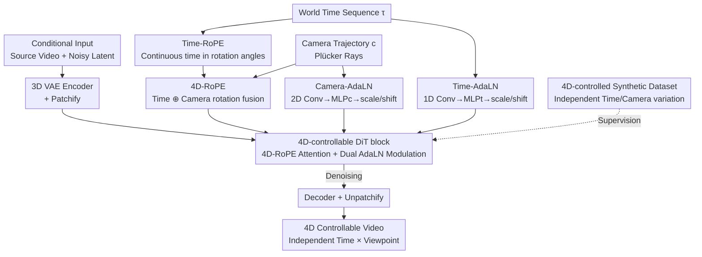

# BulletTime: Decoupled Control of Time and Camera Pose for Video Generation

**Conference**: CVPR 2026  
**Paper**: [CVF Open Access](https://openaccess.thecvf.com/content/CVPR2026/html/Wang_BulletTime_Decoupled_Control_of_Time_and_Camera_Pose_for_Video_CVPR_2026_paper.html)  
**Code**: https://19reborn.github.io/Bullet4D/ (Project page; code/data/models promised to be open-sourced, not yet released)  
**Area**: Video Generation / Controllable Video Generation / Diffusion Models  
**Keywords**: 4D Controllable Generation, Time-Camera Decoupling, Time-RoPE, AdaLN, Video Diffusion  

## TL;DR
To address the issue where video diffusion models couple "scene dynamics" and "camera movement" on the same video-time axis, BulletTime decomposes it into two orthogonal conditional paths: "world time $\tau_{world}$" and "camera pose $c$". It uses Time-RoPE + AdaLN to inject continuous time and 4D-RoPE + Camera-AdaLN to inject viewpoints. A synthetic dataset with independent time/camera variations is utilized to supervise decoupling. This supports flexible 4D control such as "Bullet Time" (moving camera, frozen time), with control precision surpassing two-stage baselines that combine camera methods with temporal remapping on both synthetic and real videos.

## Background & Motivation

**Background**: Current video diffusion models (CogVideoX, Wan, SVD, etc.) can generate realistic videos, where the temporal dimension is typically represented by "video time"—a discrete time axis implicitly determined by frame index and frame rate. Camera-controllable works (ReCamMaster, CameraCtrl, etc.) further inject camera trajectories using 6-DoF extrinsics or Plücker rays.

**Limitations of Prior Work**: Existing models force two fundamentally different concepts into the video time axis: **world time** (the absolute time coordinate determining how events evolve) and **camera pose** (the viewpoint). Treating frame indices as physical time forces world time to progress uniformly, making it impossible to independently slow down, pause, or reverse scene dynamics. Text prompts are too coarse for temporal control, while two-stage "temporal remapping then camera-controlled generation" pipelines suffer from poor 4D consistency because the input video itself changes based on temporal settings (e.g., half the video being cropped in Bullet Time). Multi-view video diffusion (like Cat4D) requires additional 4D reconstruction (4D Gaussian Splatting) and intensive sampling, which is unsuitable for interactive 4D world modeling.

**Key Challenge**: Scene dynamics and camera movement are coupled into the same video-time axis in generative videos, whereas true 4D control requires these dimensions to be orthogonal, separately specified continuous signals.

**Goal**: Equip video diffusion models with decoupled control over "world time" and "camera pose," allowing users to independently specify "at what time and from which viewpoint" to observe a dynamic 4D world, achieved via end-to-end generation without post-processing reconstruction.

**Key Insight**: Visual changes along video time are explicitly decomposed into "continuous world time $\tau_{world}$" and "camera pose $c$." Time is a smooth global scalar best suited for global modulation like AdaLN. Furthermore, embedding continuous time into the rotation angles of RoPE allows the attention mechanism to perceive arbitrary time intervals without any learnable parameters.

**Core Idea**: Use "continuous Time-RoPE + Time/Camera AdaLN + Unified 4D-RoPE" to treat time and camera as two independently specified conditional signals, supervised by a synthetic dataset with independent variations in time and camera pose.

## Method

### Overall Architecture

BulletTime is built on a pre-trained Diffusion Transformer (DiT, specifically CogVideoX-5B) and performs video-to-video generation. Source and target video tokens are concatenated along the frame dimension (following ReCamMaster's conditioning). The model regenerates a video satisfying the given **world time sequence** $\{\tau_i\}_{i=0}^{F-1}$ and **camera trajectory** $c$. Changing the intervals $\tau_{i+1}-\tau_i$ enables slow motion, acceleration, pausing, or reversal.

The framework centers on a "4D-controllable DiT block," where time and camera follow complementary modulation paths before merging in the attention layer:

- **Time Path**: The continuous time sequence is injected into the attention rotation angles via Time-RoPE and used to predict affine scale/shift via 1D convolution and MLP$_t$ for Time-AdaLN modulation.
- **Camera Path**: Camera geometry is encoded as Plücker rays and aggregated via 2D convolution. It constructs camera-aware rotations (fused with Time-RoPE into a unified 4D-RoPE) and undergoes Camera-AdaLN modulation via MLP$_c$.
- **Unified 4D-RoPE**: The outputs of both RoPE paths are fused, injecting both continuous time differences and viewpoint-related geometry into the attention logits.

The model is fine-tuned on a custom synthetic dataset where time and camera pose vary independently.

### Key Designs

**1. Time-RoPE: Embedding continuous world time directly into attention rotation angles.**

Standard video DiT position embeddings are bound to discrete frame indices, assuming uniform time. The authors extend RoPE to continuous time by defining a rotation operator $D_{\text{Time}}(\tau)=\mathrm{diag}\big(R(\tau\omega_1),R(\tau\omega_2),\dots,R(\tau\omega_{d'/2})\big)$. When applied to queries/keys with timestamps $\tau_i, \tau_j$, the attention logit simplifies to:

$$Q_i^{\text{Time}}(K_j^{\text{Time}})^{\top}=Q_i^{\top}\,D_{\text{Time}}(\tau_i-\tau_j)\,K_j,$$

meaning attention depends only on the **continuous time difference** $\tau_i-\tau_j$. This embeds temporal priors directly into logits without learnable parameters. Ablations show Time-RoPE alone (PSNR 30.45) outperforms all learnable schemes using standard RoPE (≤25.31).

**2. Time-AdaLN: Feature-level modulation for fine-grained timing.**

DiT temporal resolution is downsampled during patchification. To capture fine-grained timing, 1D convolution $f_{\text{time}}(\cdot)$ and MLP-based AdaLN inject temporal information:

$$\tilde z'_{i,n}=\mathrm{LN}(\tilde z_{i,n})\odot f_{\gamma}\big(f_{\text{time}}(\tau_i)\big)+f_{\beta}\big(f_{\text{time}}(\tau_i)\big),$$

AdaLN is chosen because world time is a smooth global scalar affecting the **entire scene**. Global modulation is more stable than token-level perturbations (like cross-attention), which can break spatial alignment.

**3. 4D-RoPE + Camera-AdaLN: Fully decoupled 4D control.**

Time-RoPE is expanded into 4D-RoPE by fusing it with camera-aware rotations. This ensures that continuous time differences and viewpoint geometry are injected simultaneously. Camera-AdaLN encodes Plücker rays via 2D convolution and MLPs for modulation. Unlike two-stage baselines where input videos change with temporal settings, this end-to-end approach uses the **same source video**, ensuring stability.

**4. 4D-controlled Synthetic Dataset: Providing decoupled supervision.**

Existing datasets couple time and space (fixed/slow cameras or synchronized multi-view). The authors used Blender and PointOdyssey to create data: for each scene, temporal remapping (slow motion, pause, random speeds) was applied to moving objects, and each variant was rendered from different camera trajectories. This allows the model to generalize from synthetic humans to real-world animals and physics.

### Loss & Training

Standard diffusion denoising loss is used for fine-tuning CogVideoX-5B-T2V. Spatial resolution is $384 \times 640$ with 81 frames. Training followed a progressive strategy: starting at half resolution and fine-tuning at full resolution. The batch size was 64 for 40K iterations. 

## Key Experimental Results

### Main Results

Evaluated on synthetic (PointOdyssey) and real (ViPE) videos. Baselines marked with * represent camera-controllable methods (ReCamMaster, TrajectoryCrafter) extended to 4D via temporal remapping.

Synthetic Dataset (Joint Camera + Time control):

| Method | PSNR↑ | SSIM↑ | LPIPS↓ |
|------|-------|-------|--------|
| TrajectoryCrafter* | 17.72 | 0.4917 | 0.3431 |
| ReCamMaster* | 21.86 | 0.5852 | 0.1846 |
| **Ours** | **24.57** | **0.6905** | **0.1265** |

Real Videos (Camera precision + Visual quality):

| Method | RotErr↓ | TransErr↓ | Temporal Flickering↑ | Motion Smoothness↑ | FVD↓ | KVD↓ |
|------|---------|-----------|-----------|-----------|------|------|
| TrajectoryCrafter* | 5.44 | 3.31 | 0.9659 | 0.9881 | 2399 | 150.2 |
| ReCamMaster* | 2.98 | 1.85 | 0.9755 | 0.9911 | 2325 | 146.1 |
| **Ours** | **1.47** | **1.32** | **0.9780** | **0.9923** | **2292** | **139.1** |

### Ablation Study

World Time Conditioning (Fixed camera; Table 4):

| Configuration | PSNR↑ | SSIM↑ | LPIPS↓ | Note |
|------|-------|-------|--------|------|
| RoPE + CrossAttention | 23.86 | 0.8274 | 0.1753 | Standard RoPE + Cross-Attention |
| RoPE + ChannelAddition | 25.31 | 0.8438 | 0.1456 | Time embedding added to channels |
| RoPE + AdaLN | 29.83 | 0.8821 | 0.0742 | Swapped to AdaLN |
| Time-RoPE | 30.45 | 0.8807 | 0.0753 | Continuous time RoPE only |
| **Time-RoPE + AdaLN** | **32.15** | **0.8962** | **0.0631** | Proposed temporal backbone |

### Key Findings
- **4D-RoPE is the primary contributor**: Encoding control in attention rotation angles is more effective than token-level injection. Removing 4D-RoPE caused the largest drop in performance (PSNR 23.45 → 21.98).
- **AdaLN is ideal for time**: Since world time is a smooth global scalar, global modulation maintains spatial alignment better than local cross-attention.
- **End-to-end consistency**: Unlike two-stage baselines, this model avoids geometric distortion and content loss during extreme scenarios like Bullet Time because the conditioning remains stable.

## Highlights & Insights
- **Continuous time in RoPE is brilliant**: It allows the model to respond to arbitrary motion scales with zero additional parameters by making attention dependent on $\tau_i - \tau_j$.
- **Mechanism selection based on signal nature**: Using AdaLN for global signals (time) and 4D-RoPE for geometric signals (camera) shows an insightful design philosophy.
- **Dataset as the key to decoupling**: Artificially manufacturing orthogonal supervision signals in a rendering engine is a powerful strategy for solving coupling problems in real-world data.

## Limitations & Future Work
- Dependency on synthetic data might limit performance in extremely complex real-world lighting or long-term dynamics.
- Parallel diffusion (non-autoregressive) struggles with ultra-long videos; future work could explore 4D autoregressive generation.
- Camera error metrics on real videos (via MegaSAM) include estimator noise; absolute values should be interpreted carefully.

## Related Work & Insights
- Compared to camera-only models (ReCamMaster), this work explicitly extracts world time for continuous control, offering better camera precision.
- Compared to two-stage remapping, this end-to-end approach prevents content cropping and artifacts.
- Unlike Cat4D, it produces 4D controllable video in one step without needing per-video 4D reconstruction.

## Rating
- Novelty: ⭐⭐⭐⭐⭐ Explicit decomposition of world time and camera pose using Time-RoPE and dual AdaLN is clean and effective.
- Experimental Thoroughness: ⭐⭐⭐⭐ Solid synthetic/real evaluation and ablations, though comparisons rely on "extended" version of 3D baselines.
- Writing Quality: ⭐⭐⭐⭐⭐ Clear explanations of why RoPE/AdaLN were chosen and why two-stage methods fail.
- Value: ⭐⭐⭐⭐⭐ High potential for XR, "Bullet Time" effects, and world modeling; compatible with existing DiT architectures.

<!-- RELATED:START -->

## Related Papers

- [\[CVPR 2026\] SymphoMotion: Joint Control of Camera Motion and Object Dynamics for Coherent Video Generation](symphomotion_joint_control_of_camera_motion_and_object_dynamics_for_coherent_vid.md)
- [\[CVPR 2026\] EditCtrl: Disentangled Local and Global Control for Real-Time Generative Video Editing](editctrl_disentangled_local_and_global_control_for_real-time_generative_video_ed.md)
- [\[CVPR 2026\] FaceCam: Portrait Video Camera Control via Scale-Aware Conditioning](facecam_portrait_video_camera_control_via_scale-aware_conditioning.md)
- [\[CVPR 2026\] ExPose: Reinforcing Video Generation Models for Extreme Pose Estimation](expose_reinforcing_video_generation_models_for_extreme_pose_estimation.md)
- [\[CVPR 2026\] 3D-Aware Implicit Motion Control for View-Adaptive Human Video Generation](3d-aware_implicit_motion_control_for_view-adaptive_human_video_generation.md)

<!-- RELATED:END -->
