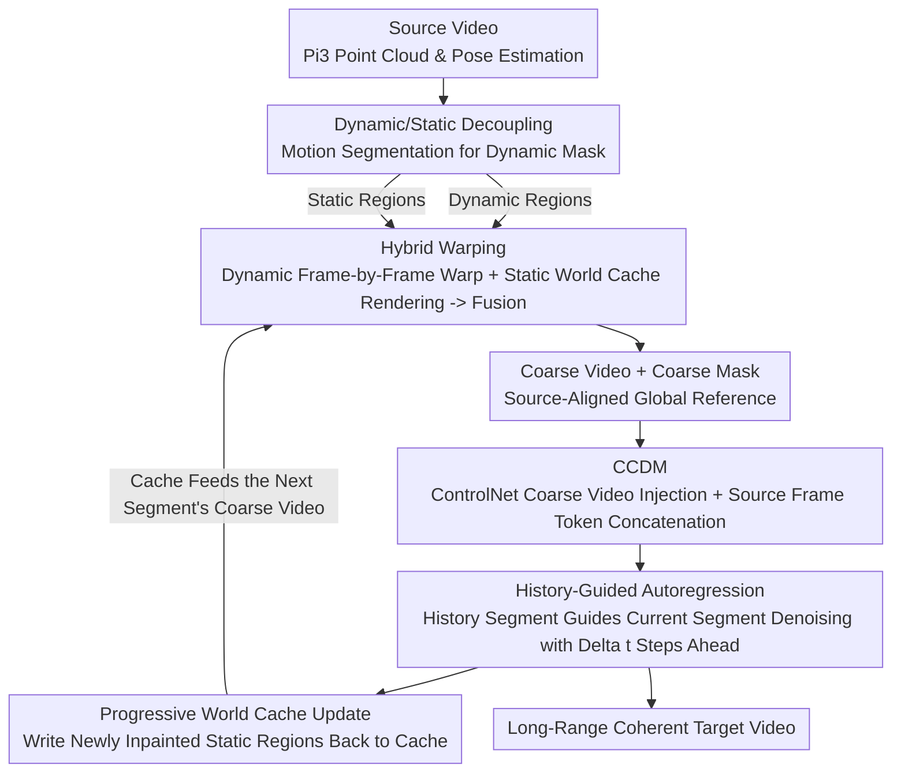

# CamDirector: Towards Long-Term Coherent Video Trajectory Editing

**Conference**: CVPR 2026  
**Paper**: [CVF Open Access](https://openaccess.thecvf.com/content/CVPR2026/html/Yin_CamDirector_Towards_Long-Term_Coherent_Video_Trajectory_Editing_CVPR_2026_paper.html)  
**Code**: None  
**Area**: Video Generation / Camera Trajectory Editing  
**Keywords**: Video trajectory editing, hybrid warping, world cache, autoregressive diffusion, long video coherence

## TL;DR
CamDirector explicitly aggregates information from the entire source video into a source-aligned coarse video using "hybrid warping + world cache", and then generates long videos segment-by-segment using a "history-guided autoregressive diffusion model + progressive world cache update", achieving SOTA camera trajectory editing on iPhone and iPhone-PTZ benchmarks with only 2.0B parameters.

## Background & Motivation

**Background**: Video (camera) trajectory editing (VTE) aims to synthesize a new video along a user-redesigned camera trajectory from a casually shot amateur video. It must preserve the original scene content while reasonably inpainting regions that were previously unseen in the new perspectives, thereby upgrading "amateur footage" to professional-grade videos with cinematic camera movements. Based on pre-trained video diffusion models, two major paradigms exist: one (GCD, RecamMaster) directly injects target camera poses into the generation process via embedding layers; the other (TrajectoryCrafter, Gen3C) adopts a warp-and-repaint strategy, first explicitly warping source frames to the target viewpoint using 3D point clouds, and then utilizing a diffusion model to refine and inpaint holes.

**Limitations of Prior Work**: The embedding injection paradigm suffers from the limited expressiveness of embedding layers and imprecise camera control, causing the generated video to fail to accurately follow the target trajectory. Conversely, while the warp-and-repaint paradigm offers more precise control, **each warped frame is derived from only a single source frame**, relying on bidirectional attention inside the diffusion model to "implicitly" aggregate complementary information from other frames. Once the video grows longer, memory constraints force chunk-based processing, preventing attention from spanning the entire sequence (especially failing to cover future frames).

**Key Challenge**: This raises two fundamental problems: ① **source alignment**: the generated content in the current frame may not align with scene evidence that clearly exists elsewhere in the source video (e.g., the floor or the rear part of a bicycle might be captured in other frames of the source video but cannot be utilized by single-frame warping); ② **self-consistency**: the newly inpainted or originally invisible regions tend to drift across segments, causing temporal flickering and appearance inconsistency over time.

**Goal**: Simultaneously guarantee strict spatial alignment with the source video and temporal coherence of the generated video in long-video scenarios, which makes VTE significantly more challenging than standard long-video generation.

**Key Insight**: The authors observe that **the static background should remain consistent throughout the entire video, whereas dynamic objects evolve over time**. Therefore, instead of treating all pixels equally with single-frame warping, static regions should be aggregated into a global 3D representation for repeated reuse, while dynamic regions are processed separately. Concurrently, long-video generation should be framed as an autoregressive process "with historical memory," allowing subsequent segments to continuously align with previous ones.

**Core Idea**: Use a "hybrid warping + world cache" pipeline to explicitly aggregate information from the entire source video to construct an aligned coarse video, replacing the implicit aggregation of single-frame warping. Then, employ "history-guided autoregression + progressive world cache updates" to extend short-segment generation to long videos while locking in long-range consistency.

## Method

### Overall Architecture
CamDirector consists of two main components. **First (hybrid warping)**: Given a source video, a 4D foundation model Pi3 is first used to estimate the point cloud and camera pose of each frame, decoupling the scene into dynamic and static parts. Dynamic regions are warped frame-by-frame (one-to-one) to the target viewpoint to preserve motion fidelity, while static regions are incrementally fused into a lightweight "world cache" (unified point cloud) and then rendered to the target poses. The two parts are fused to form a **coarse video** based on depth occlusion, serving as a global reference highly aligned with the source. **Second (history-guided autoregressive generation)**: A coarse-video-controlled diffusion model (CCDM) is first used to generate short segments, which is then extended to long videos by "using historical segments to guide current-segment denoising + progressive updating of the world cache after each segment," ensuring seamless transitions between segments and long-range temporal consistency. The entire pipeline is structured as "first constructing an aligned coarse video $\rightarrow$ then passing it to the diffusion model for refinement and autoregressive lengthening."

### Key Designs

**1. Hybrid Warping Scheme: Dynamic frame-by-frame warp + static world cache to explicitly aggregate the entire source video**

To address the pain point where "single-frame warping cannot utilize evidence from other parts of the source video, and long videos cannot fit full-sequence attention," this paper shifts away from implicit information aggregation inside the diffusion model, instead explicitly gathering global information during the warping phase. Given the source video $I^s=\{I^s_i\}_{i=1}^N$, current point clouds $P_i$ and poses $\Pi^s_i$ are first estimated using Pi3, and motion segmentation is applied to obtain dynamic masks $M^d_i$. **Dynamic regions** are projected frame-by-frame (one-to-one) to the target viewpoint to ensure motion fidelity:

$$I^{d,t}_i,\ Z^{d,t}_i,\ M^{d,t}_i = \Phi\big(\Pi^t_i\cdot(\Pi^s_i)^{-1}\cdot([P_i, I^s_i]\odot M^d_i)\big),$$

where $\Phi$ denotes perspective projection, outputting warped RGB, projection depth, and valid region masks. **Static regions** are not repeated frame-by-frame; instead, they are fused into a unified 3D "world cache". Naively stacking all static point clouds would lead to out-of-memory and computational bottlenecks when $N$ is large, so the authors adopt an incremental construction method: uniformly sampling $L$ frames, sequentially rendering the current world cache to obtain visibility masks, and only appending static point clouds that "fall outside the mask (i.e., not yet in the cache)" into the cache. Traversing all $L$ frames yields a **compact yet complete world cache that eliminates redundancy while retaining geometric layout**. Finally, the world cache is rendered to each target viewpoint to obtain $I^{w,t}_i$ and depth $Z^{w,t}_i$, which are fused with the dynamic part based on depth occlusion to produce coarse frames:

$$\hat I_i(x)=I^{d,t}_i(x)\cdot\mathbb{1}\big(Z^{d,t}_i(x)<Z^{w,t}_i(x)\big)+I^{w,t}_i(x)\cdot\mathbb{1}\big(Z^{d,t}_i(x)\ge Z^{w,t}_i(x)\big).$$

Why it works: The world cache stores static evidence even from "frames too distant for attention to reach" into a global reference. Consequently, the coarse frames are more complete and better aligned with the source. The area requiring inpainting is significantly reduced, enhancing both controllability and consistency.

**2. CCDM Base Model: ControlNet coarse video injection + source frame token concatenation, refining rather than simply inpainting**

Although coarse videos are aligned, they exhibit structural distortions and appearance mismatches due to pose/point cloud estimation errors and view-dependent effects; simply inpainting unseen areas is insufficient. The CCDM (coarse-video-controlled diffusion model) is built upon the pre-trained Wan-T2V-1.3B backbone. It injects the coarse video and its mask as conditions via **ControlNet** to help the model distinguish "what to inpaint", while encoding the target camera pose into Plücker embeddings for injection. Since camera information is primarily determined in the shallow layers of the video diffusion model, control features are injected only into the **first 15 blocks** of Wan-T2V. More crucially, for "refinement," **source frame tokens are concatenated with noisy target tokens** and fed into the joint attention layers, allowing the model to directly leverage reliable motion and appearance priors. To adapt to the source latents, **LoRA** is added to the original attention modules for efficient adaptation. In this way, the model does not inpaint blindly; it corrects the distortions of the coarse video using source evidence.

**3. History-Guided Autoregressive Generation: History segment denoising $\Delta t$ steps ahead + CFG to assemble short segments into coherent long videos**

To extend short segments to long videos without appearance drift, the authors split the long video into non-overlapping segments $\{x_k\}_{k=1}^K$, each containing $T$ frames. In each iteration, the last $T^\star$ frames of the previous segment are used as the **history** to guide the synthesis of the current $T$ frames: history tokens and current segment tokens jointly form the target noise tokens of CCDM, allowing the historical context to propagate across segments via attention. Empirically, having history tokens **lead current tokens by $\Delta t$ noise steps** throughout the denoising process yields the most consistent results; after denoising, the current clean segment is re-noised to the next segment's corresponding noise level, progressively acting as the history for the next round. To strengthen guidance and smooth transitions, classifier-free guidance is introduced:

$$v_t = w\times v_\theta(x^k_{t-1}\mid x^{k-1}_{t+\Delta t})+(1-w)\times v_\theta(x^k_{t-1}\mid x^{k-1}_{t-1}),$$

$w$ is the guidance scale. This design ensures seamless transitions and prevents appearance drift between segments.

**4. Progressive World Cache Update: Writing newly inpainted static content back to the cache to feed subsequent coarse videos**

History guidance alone is insufficient to lock in long-range consistency—if subsequent segments cannot see the content already inpainted in previous segments, they will compile independently, causing inconsistency. Thus, after generating each new segment, SAM2 is used to track static regions in both the source segment and the newly synthesized segment, and Pi3 is used to estimate their point clouds and align them to world coordinates. The **newly inpainted static regions are then merged into the existing world cache** (using $C$ uniformly sampled frames as anchors). As a result, the coarse videos of subsequent segments encode the already-inpainted stable scene structures, enabling better alignment with preceding segments. Together with history guidance, this joint mechanism ensures seamless transition and long-term temporal consistency across segments. It forms a crucial closed loop that solidifies "generated output" into global memory to avoid repetitive drift during inpainting.

### Loss & Training
Training data utilizes a dynamic multi-view dataset (approx. 13.6K dynamic scenes, with each scene containing 10 synchronized 81-frame videos with camera poses). Due to the lack of point clouds and depth, additional processing is required: 10 frames at each synchronized moment constitute a static multi-view setup, where VGGT is used to estimate depth and poses and align them to the GT camera coordinates. However, VGGT depth often exhibits errors that cause coarse video artifacts, so the authors **correct depth using epipolar constraints** and apply a series of filtering rules to discard low-quality samples (e.g., sudden mutations between adjacent frames), ultimately retaining 9.5K scenes. Training is split into two stages: ① Train the base model CCDM—each round randomly selects two videos as source/target, with the source processed via hybrid warping to generate the coarse video, and standard flow-matching targets trained with target videos subjected to 0–1000 uniformly sampled noise; ② Fine-tune CCDM for autoregression—the target video is split into $T^\star$ history frames + $T$ current frames, apply two non-decreasing noise levels $t_1\le t_2$ to the history/current frames respectively, and use flow-matching loss on both. Each model is trained for 20,000 steps with a resolution of 480×832, a learning rate of $2\times10^{-5}$, a batch size of 6, taking roughly 20 hours each.

## Key Experimental Results

### Main Results
Comparison on iPhone and the newly proposed iPhone-PTZ benchmarks, where the left represents short segments (first 41 frames) and the right represents full video results (PSNR↑, LPIPS↓, FID↓):

| Method | Parameters | iPhone PSNR↑ | iPhone LPIPS↓ | iPhone FID↓ | iPhone-PTZ PSNR↑ | iPhone-PTZ LPIPS↓ | iPhone-PTZ FID↓ |
|------|--------|------|------|------|------|------|------|
| RecamMaster | 1.3B | 10.73 / - | 0.7830 / - | 195.24 / - | 11.64 / - | 0.6981 / - | 117.77 / - |
| TrajectoryCrafter | 5.3B | 13.00 / - | 0.6197 / - | 145.58 / - | 12.56 / - | 0.5303 / - | 105.30 / - |
| Gen3C | 6.7B | 13.29 / 13.44 | 0.6107 / 0.6066 | 148.76 / 116.91 | 13.13 / 13.27 | 0.5305 / 0.5497 | 91.41 / 86.21 |
| **Ours** | **2.0B** | **14.31 / 14.12** | **0.4952 / 0.5103** | **114.99 / 107.44** | **13.78 / 13.99** | **0.4468 / 0.4752** | **79.65 / 72.33** |

In all metrics, it comprehensively outperforms prior works despite having only 2.0B parameters (compared to Gen3C's 6.7B and TrajectoryCrafter's 5.3B). In the VBench full-video quality evaluation (Tab. 2), the proposed method also leads in subject consistency, background consistency, temporal flickering, motion smoothness, and aesthetic/imaging quality. It shows a significant advantage particularly in video consistency metrics, validating the effectiveness of the design for long-video modeling (e.g., Subject Consistency 0.9400 vs Gen3C 0.8510 on iPhone).

### Ablation Study
Full-video setting, iPhone-PTZ benchmark. Ablation on hybrid warping and CCDM conditions (Tab. 3):

| Configuration | PSNR↑ | LPIPS↓ | FID↓ | Description |
|------|------|------|------|------|
| Full model | 13.99 | 0.4752 | 72.33 | Full model |
| w/o Plücker | 13.18 | 0.4897 | 78.23 | Without camera pose encoding |
| w/o Source | 13.04 | 0.5134 | 92.90 | Without source frame token concatenation |
| w/o Hybrid Warping | 12.18 | 0.5347 | 84.75 | Replaced with frame-by-frame warp, largest performance drop |

Ablation on history-guided autoregression (Tab. 4, showing VBench consistency):

| Configuration | PSNR↑ | Subject Consis.↑ | Background Consis.↑ |
|------|------|------|------|
| Ours | 13.99 | 0.8574 | 0.8816 |
| w/o History Guidance | 13.39 | 0.8543 | 0.8780 |
| w/o Progressive Update | 12.86 | 0.8487 | 0.8777 |

### Key Findings
- **Hybrid warping contributes the most**: Reverting to frame-by-frame warping causes the PSNR to drop from 13.99 to 12.18 (a drop of 1.81), which is the most severe decrease among all ablations, proving that "explicitly aggregating source information globally" is the cornerstone of source alignment and high quality.
- **Progressive world cache update > history guidance**: Removing progressive updates (12.86) leads to a heavier drop than removing history guidance (13.39)—without progressive updates, subsequent segments cannot access previously inpainted content, leading to independent repainting and inconsistency. History guidance, on the other hand, prevents scene appearance from drifting across segments. The two designs are complementary and both indispensable.
- **Source frame token concatenation is highly important**: Without source concatenation (w/o Source), the FID deteriorates from 72.33 to 92.90, indicating that feeding source motion and appearance priors directly into joint attention is critical for correcting the distortions of coarse videos during refinement.
- iPhone-PTZ, which features large camera movements (such as dolly, pan, and orbiting) and a wider FOV, is more challenging than iPhone (which has only 5 available scenes), thereby better distinguishing the true capability of each method under long videos and large trajectories.

## Highlights & Insights
- **Dynamic-Static Decoupling + World Cache**: Implements the physical prior of "static background remains globally consistent, dynamically evolving objects vary over time" directly into the warping strategy. By aggregating the static parts into a reusable world cache while warping dynamic parts frame-by-frame, it saves GPU memory and explicitly acquires evidence from distant frames. This is an elegant workaround to avoid the "long video cannot fit full-sequence attention" bottleneck.
- **World Cache as Long-Range Memory with Progressive Updates**: Writing newly generated static content back to the cache to feed subsequent coarse videos is equivalent to providing a "growing global memory" for autoregressive generation. This philosophy of solidifying generated outputs into geometric caches can be easily migrated to other 3D-aware video generation or world model tasks that demand long-range consistency.
- **History Token Denoising $\Delta t$ Steps Ahead**: Utilizing the noise level discrepancy to represent "history is cleaner and more reliable than the current state" stabilizes the guidance of the current segment through attention, which is a clever and lightweight trick for autoregressive consistency.
- **Fewer Parameters, Higher Performance**: Surpassing the 6.7B Gen3C with just a 2.0B model demonstrates that delegating information aggregation explicitly to the geometric warping stage instead of relying fully on implicit learning in large diffusion models significantly reduces the dependency on model capacity.

## Limitations & Future Work
- The authors acknowledge that the generated frames can occasionally be overly smooth, particularly in complex texture regions. This is primarily because the training uses synthetic dynamic datasets where the rendered textures are inherently coarse. A promising future direction is to incorporate real-world static multi-view datasets as a complement, or to construct new synthetic datasets with richer textures.
- Self-observed limitation: The entire pipeline heavily depends on multiple external foundation models (Pi3, VGGT, SAM2). Errors in depth, pose, and segmentation of these models propagate through the pipeline (although the paper corrected VGGT depth via epipolar constraints, it remains a vulnerability); the robustness of the frame-by-frame warped dynamic regions under fast, large motions or mutual occlusion of dynamic objects has not been fully verified.
- Directions for improvement: Explore joint end-to-end optimization of depth correction and generation to reduce reliance on the accuracy of offline geometric estimates; alternatively, extend the world cache to model time-varying dynamic components instead of storing only the static scene.

## Related Work & Insights
- **vs. RecamMaster / GCD (embedding injection paradigm)**: These methods inject target poses into networks via MLPs/latents, whereas the proposed method adopts explicit warping. The difference is that embedding injection methods have limited expressiveness and suffer from imprecise trajectory control (especially outside the training distribution or when actual physical scales are unknown), while the proposed method refines control with geometric warping and world caching using far fewer parameters.
- **vs. TrajectoryCrafter / Gen3C (warp-and-repaint paradigm)**: While they also warp using 3D point clouds, **each coarse frame inherits from only a single source frame**, relying on bidirectional attention for implicit aggregation, which fails to span the sequence once long videos are chunked. In contrast, this paper explicitly aggregates information from the entire source video into each coarse frame using a world cache, leading to markedly better source alignment (e.g., floors and bicycle rears visible in the source are correctly aligned in ours but misaligned in prior works) and stronger overall video consistency.
- **vs. Generic Long Video Generation (keyframes-to-video / high compression / discrete chunking / forcing autoregression)**: These general approaches only address temporal self-consistency, whereas VTE additionally demands strict spatial alignment with the source video. This paper satisfies both specific requirements of VTE simultaneously through complementary strategies: "hybrid warping for source alignment + autoregression for temporal coherence".

## Rating
- Novelty: ⭐⭐⭐⭐ World cache + progressive update introduces "explicit global aggregation" to VTE, with solid dynamic-static decoupling design.
- Experimental Thoroughness: ⭐⭐⭐⭐ Features two benchmarks, VBench, and three complete ablation categories; the newly proposed iPhone-PTZ is highly challenging.
- Writing Quality: ⭐⭐⭐⭐ Pain points $\rightarrow$ Method $\rightarrow$ Validation logic is clear; equations and diagrams are well-placed.
- Value: ⭐⭐⭐⭐ Achieves SOTA with fewer parameters; using a world cache as long-term memory offers transfer value for long video generation.

<!-- RELATED:START -->

## Related Papers

- [\[CVPR 2026\] Soul: Breathe Life into Digital Human for High-fidelity Long-term Multimodal Animation](soul_breathe_life_into_digital_human_for_high-fidelity_long-term_multimodal_anim.md)
- [\[CVPR 2026\] CI-VID: A Coherent Interleaved Text-Video Dataset](ci-vid_a_coherent_interleaved_text-video_dataset.md)
- [\[CVPR 2026\] OneStory: Coherent Multi-Shot Video Generation with Adaptive Memory](onestory_coherent_multi-shot_video_generation_with_adaptive_memory.md)
- [\[CVPR 2026\] RFDM: Residual Flow Diffusion Models for Video Editing](rfdm_residual_flow_diffusion_models_for_video_editing.md)
- [\[CVPR 2026\] FlexTraj: Image-to-Video Generation with Flexible Point Trajectory Control](flextraj_image-to-video_generation_with_flexible_point_trajectory_control.md)

<!-- RELATED:END -->
