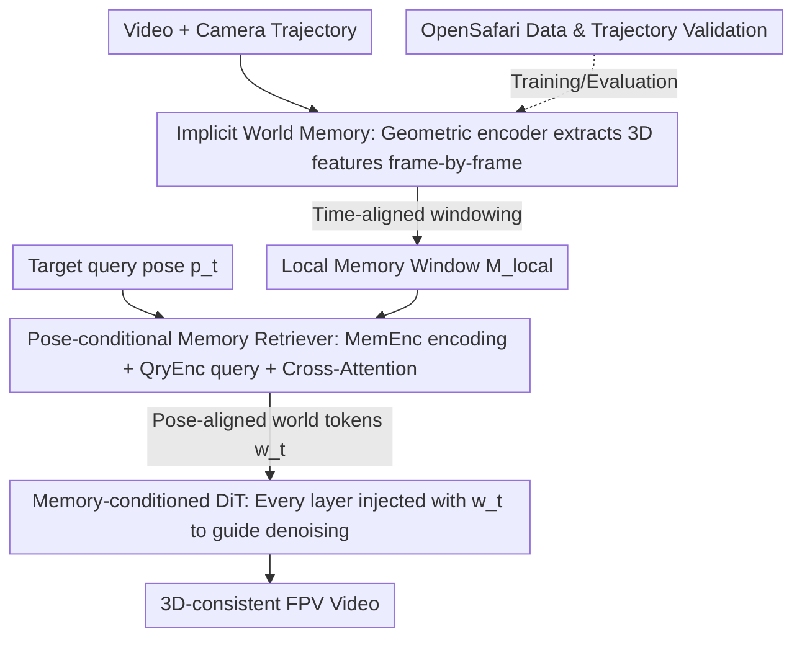

# Captain Safari: A World Engine with Pose-Aligned 3D Memory

**Conference**: CVPR 2026  
**Paper**: [CVF Open Access](https://openaccess.thecvf.com/content/CVPR2026/html/Chou_Captain_Safari_A_World_Engine_with_Pose_Aligned_3D_Memory_CVPR_2026_paper.html)  
**Code**: https://johnson111788.github.io/open-safari/ (Project Page)  
**Area**: Video Generation / World Models  
**Keywords**: World Engine, Camera-controlled video generation, Pose-aligned memory, Long-term 3D consistency, FPV drone dataset

## TL;DR
Captain Safari is a "world engine" that maintains an implicit 3D geometric memory. Given an arbitrary camera trajectory, it retrieves world tokens aligned with the target pose to condition a DiT-based video generator. This ensures both precise trajectory following and long-term 3D consistency under aggressive 6-DoF motion. It is accompanied by the OpenSafari wild FPV drone dataset.

## Background & Motivation
**Background**: Simulating a coherent 3D world (a world engine) via controllable video generation is a fundamental capability for AR, embodied AI, and virtual agents. Traditional game engines or physical simulations provide explicit geometry and precise control but require extensive manual modeling and expensive computation, making it difficult to cover the richness of real-world natural scenes. Modern video diffusion models can generate high-fidelity, diverse videos from text or images, but they are essentially feed-forward clip generators with **no persistent world state**.

**Limitations of Prior Work**: Current video world models are plagued by three issues. First, long-term consistency is constrained by the temporal window of context frames; models "forget" distant scenery and violate spatial coherence, leading to sudden scene changes. Second, achieving complex camera maneuvers under strict 3D consistency constraints is difficult—existing pose/trajectory conditioning methods usually work only under slow, near-forward motion. In scenarios with fast 6-DoF motion, heavy parallax, or sharp turns, models face a trade-off: either suppress motion to preserve geometry or follow the trajectory at the cost of distortion, flickering, and structural drift. Third, most existing methods are trained or evaluated on structured, constrained scenes (indoor tours, driving, real estate), rarely facing stress tests in wild FPV scenarios where cameras weave through buildings, vegetation, and terrain with massive parallax.

**Key Challenge**: The fundamental conflict between "strict 3D consistency" and "precise execution of aggressive trajectories"—storing the full long-term world state is computationally infeasible, yet providing only short-term context fails to capture distant geometry.

**Goal**: To allow the model to maintain a persistent world state explicitly, ensuring long-term 3D consistency under high parallax while accurately executing aggressive camera maneuvers, and to bridge the data gap for "complex outdoor layouts + aggressive camera motion."

**Key Insight**: It is not necessary to feed the entire long-term world state into the generator. Instead, aggregating a small set of the most relevant scene clues for the **current target pose** provides sufficiently strong geometric guidance. The key is that this retrieval must be **pose-aware**: assembling a world prior aligned with the specific viewpoint to steer generation.

**Core Idea**: Replace "longer context frames" with "pose-conditional world memory retrieval." By maintaining an implicit world memory and retrieving fixed-size, pose-aligned world tokens based on query poses to condition video diffusion, both consistency and controllability are achieved with constant overhead.

## Method

### Overall Architecture
Captain Safari decomposes "generating video along a trajectory" into three tasks: first, a pre-trained geometric encoder compresses the video into a frame-wise 3D-aware **world memory bank** $M=\{m_t\}$; for each 5-second clip to be generated, a time-aligned **local memory window** $\mathcal{M}_{local}$ is sampled from the bank; a **pose-conditional retriever** then "reads" a set of pose-aligned world tokens $w_t$ from the local window for the target query pose; finally, $w_t$ is injected into every cross-attention layer of a **DiT generator** to guide denoising. This way, frames no longer access memory via raw temporal indices but via "pose queries," binding multi-view observations to the same static 3D world.

The inputs are a text prompt, the first frame, and the full camera trajectory (extrinsic parameters $(R_t, T_t)$); the output is a 3D-consistent video segment $\hat V_{\mathcal{T}}$ along that trajectory.

### Key Designs

**1. Implicit World Memory + Dynamic Clip-Aligned Local Window: Taming "Full Long-term State Computational Explosion" with Fixed-size Local Windows**

Directly conditioning on the full memory bank $M$ is computationally expensive and can be dominated by temporally distant observations. The authors use a pre-trained geometric encoder (StreamVGGT) to extract 3D-aware memory features $m_t$ for each frame to form a global memory bank. However, for each target clip time interval $\mathcal{T}=[t_0, t_1]$, only a **local window** $\mathcal{M}_{local}=\{m_\omega \mid \omega \in [k_s, k_e]\}$ is used, where the endpoints are constrained by $t_0 - L \le k_s \le t_0, \max(k_s, t_0) + 1 \le k_e \le \min(k_s + L, t_1)$. These constraints ensure: the window starts no more than $L$ seconds before the clip entry $t_0$ (binding to nearby observations), the window length does not exceed $L$ (keeping the condition set compact), and the endpoint $k_e$ always touches or covers $t_0$ (ensuring each clip has a temporally compatible world prior). Since all local windows are sliced from the same shared memory bank, adjacent clips naturally share overlapping memory entries, limiting computation while coupling the generation of adjacent clips to the same 3D-consistent underlying world. In the implementation, $L=5$ seconds and memory features are sampled at 4 fps.

**2. Pose-Conditional Memory Retriever: Replacing "Temporal Context Processing" with "View-based Soft-Routing Retrieval"**

This is the core of the paper. Local memory is viewed as an **implicit world table**: each time step $\omega$ provides a pose token $p_\omega$ (derived from $(R_\omega, T_\omega)$, representing "where the scene was observed") and a set of 3D-aware memory tokens $m_{\omega, 1:M}$ ("what the world looked like from that configuration"). The retriever performs two tasks: jointly encoding pose-memory pairs into a coherent world representation and extracting a small set of aligned tokens for any query pose. First, poses and memories are embedded into the same space and concatenated as a sequence $\hat X_\omega = [\varepsilon_p(p_\omega), \varepsilon_m(m_{\omega,1}), \dots, \varepsilon_m(m_{\omega,M})]$. This is processed by transformer blocks with 3D RoPE (MemEnc) to obtain $\tilde X_\omega$, forming the encoded memory $\tilde X_{mem} = [\tilde X_{k_s}, \dots, \tilde X_{k_e}]$.

For target time step $t$, the query pose token $q_t = \varepsilon_p(p_t)$ is concatenated with $M$ learnable query tokens to form $\hat Q_t = [q_t, r_1, \dots, r_M]$, which passes through a QryEnc (isomorphic to MemEnc) to get pose-aware queries $Q_t$. Cross-attention is then applied to the encoded memory:

$$Y_t = Q_t + \mathrm{CrossAttn}(Q_t, \tilde X_{mem})$$

A subset of $Y_t$ corresponding to the learnable queries is taken as the retrieved world tokens $w_t = [w_{t,1}, \dots, w_{t,M}]$. During training, a linear head maps $w_t$ back to the original memory space to reconstruct the target memory token at the query pose as supervision. Multiple retrieval blocks are stacked to iteratively refine the query and retrieved tokens, allowing the model to **soft-route** each query pose to the most relevant subset of historical observations, rather than relying on rigid temporal neighbors. An engineering trade-off: the authors use the trajectory endpoint pose $p_{t_1}$ as the query, as drift accumulation is most severe at the furthest viewpoint; using it as a constraint strengthens geometric constraints across the entire trajectory.

**3. Memory-Conditioned DiT: Treating Pose-Aligned World Tokens as a Stable Geometric Prior Across All Layers**

The retriever outputs fixed-size $w_t \in \mathbb{R}^{M \times d_m}$ for each clip, which is mapped into the DiT latent space $W_{\mathcal{T}} = \varepsilon_w(w_t) \in \mathbb{R}^{M \times D}$ using a memory embedding MLP. The clip latent is patchified into spatio-temporal tokens $Z$. In each DiT layer $l$, after self-attention on the full sequence, the world tokens are injected via a **dedicated memory cross-attention**:

$$Z^{(l+1)} = Z^l + \mathrm{CrossAttn}(Z^l, W_{\mathcal{T}}, W_{\mathcal{T}})$$

The same clip-level world tokens $W_{\mathcal{T}}$ are reused as keys/values in all layers, providing a stable, 3D-consistent prior for denoising every spatio-temporal token. Because retrieval is decoupled from denoising and outputs fixed-size $w_t$, the memory overhead remains **constant** over time, which is the foundational engineering reason it can handle "long-term" trajectories. The base DiT uses Wan2.2-Fun-5B-Control-Camera ($D=3072$), with memory cross-attention weights initialized from the corresponding context cross-attention.

**4. OpenSafari Dataset + Multi-level Trajectory Validation: Building the Foundation for "Aggressive 6-DoF in the Wild"**

Existing camera-condition datasets (RealEstate10K is slow indoor, Minecraft is synthetic voxel) do not match the high-parallax aggressive flight scenes in this paper. The authors collected FPV drone videos from AirVuz/YouTube and used a cleaning pipeline: filter by resolution, normalize to 720p/24fps/16:9 center crop, split by scene detection, and cut into fixed length $T$ segments. Fragments with insufficient motion are filtered using RAFT optical flow amplitude to retain parallax-rich trajectories. Initial trajectories are estimated at 4 fps using hloc + COLMAP incremental SfM (Simple Radial camera model), followed by **three levels of validation-repair**: database checks (flagging suspicious transitions via SfM inlier counts/ratios) → geometric checks (recomputing essential matrices for suspicious pairs and thresholding symmetric epipolar errors) → kinematic checks (detecting translation jumps, rotation skips, forward flips, and higher-order smoothness violations using MAD-based robust scores). These are merged into a binary bad-index driving a strict policy: if bad transitions are sparse/local, directional repair is applied—linear interpolation of camera centers, SLERP with angular limits for rotations, and optional boundary extrapolation—followed by re-validation; if the bad-index is too dense or violations are severe, the entire video is discarded. This resulted in 11,481 training clips and 787 non-overlapping test clips, with captions generated by Qwen2.5-VL-7B.

### Loss & Training
Two stages: first, **warm up** the pose-conditional retriever using pose-aligned memory tokens $m_t$ (1 epoch); then, jointly train the retriever and DiT end-to-end (5 epochs). The DiT is updated using LoRA, memory cross-attention is initialized from context weights, and other new layers use standard initialization. Clip duration $T=5$s (from 15s videos), with pose and memory features sampled at 4 fps. Memory features are extracted from the {4, 11, 17, 23} layers of StreamVGGT, resulting in $M = 4 \times 782$ and $d_m = 1024$. ⚠️ During inference, the retriever is still used; for reproduction simplicity in the paper, the memory bank $M$ is constructed from GT videos (refer to the original text).

## Key Experimental Results

### Main Results
Evaluated on the 787-clip OpenSafari test set along video quality, 3D consistency, and trajectory following:

| Model | FVD ↓ | LPIPS ↓ | MEt3R ↓ | Recon. Rate ↑ | AUC@30 ↑ | AUC@15 ↑ | CosSim ↑ |
|-------|-------|---------|---------|-----------|----------|----------|----------|
| Geometry Forcing | 2662.75 | 0.667 | 0.4834 | 0.877 | 0.168 | 0.056 | 0.429 |
| Real-CamI2V | 1585.61 | 0.513 | 0.3703 | 0.923 | 0.174 | 0.051 | 0.296 |
| Wan2.2-5B-Control-Camera | 1387.75 | 0.545 | 0.3932 | 0.767 | 0.181 | 0.054 | 0.420 |
| Captain Safari **w/o Mem.** | 998.47 | 0.504 | 0.3720 | 0.912 | 0.193 | 0.068 | 0.508 |
| **Captain Safari** | 1023.46 | 0.512 | **0.3690** | **0.968** | **0.200** | **0.068** | **0.563** |

Captain Safari ranks first in 3D consistency (MEt3R 0.3690, Recon rate 0.968) and trajectory following (AUC@30 0.200, CosSim 0.563). FVD is also significantly lower than SOTA baselines (1387.75). While MEt3R is only 0.0013 lower than the strongest baseline, the authors report a 10% relative reduction in variance (Levene $p=0.0439$), indicating better stability.

Human Preference Study (50 participants × 10 cases × 3 criteria = 1500 votes):

| Model | Video Quality | 3D Consistency | Trajectory Following | Average |
|-------|---------------|----------------|----------------------|---------|
| Geometry Forcing | 0.20% | 0.00% | 0.20% | 0.13% |
| Real-CamI2V | 4.20% | 6.40% | 4.40% | 5.00% |
| Wan2.2-5B-Control-Camera | 3.20% | 3.80% | 6.40% | 4.47% |
| Captain Safari w/o Mem. | 25.00% | 24.20% | 20.00% | 23.07% |
| **Captain Safari** | **67.40%** | **65.60%** | **69.00%** | **67.33%** |

Across all three criteria, ~67% of votes went to the full model, showing significant perceptual improvement. The version without memory consistently ranked second.

### Ablation Study
| Configuration | MEt3R ↓ | Recon. Rate ↑ | AUC@30 ↑ | CosSim ↑ | FVD ↓ | Description |
|---------------|---------|---------------|----------|----------|-------|-------------|
| Captain Safari (Full) | 0.3690 | 0.968 | 0.200 | 0.563 | 1023.46 | Full Model |
| w/o Mem. (No Pose Memory) | 0.3720 | 0.912 | 0.193 | 0.508 | 998.47 | Significant drop in consistency/trajectory; FVD slightly better |

### Key Findings
- **Pose-conditional memory is a key contribution**: Adding memory significantly improves 3D consistency (Recon Rate 0.912→0.968) and trajectory following (CosSim 0.508→0.563), indicating that retrieving pose-aligned world tokens gives the model an explicit understanding of "how the scene should look."
- **Quality-Consistency trade-off**: Removing memory slightly improves FVD/LPIPS but severely hurts 3D consistency and trajectory following—memory acts as a strong geometric prior, sacrificing a bit of appearance freedom for 3D stability. This matches qualitative results: with memory, global structure and multi-view geometry remain stable; without it, drift and geometric inconsistency occur.
- **Constant overhead**: Because retrieval and DiT denoising cycles are decoupled and output fixed-size $w_t$, the computational cost remains essentially constant regardless of trajectory length, which is the engineering foundation for "long-term" capabilities.

## Highlights & Insights
- **Reframing "long-term memory" as "pose-indexed retrieval of fixed-size tokens"**: This avoids the computational explosion of storing all long-term states while remaining more compact than explicit point clouds or clip-bound implicit memories. The decoupled retriever and constant overhead make this "pose-as-key, world-appearance-as-value" paradigm highly transferable.
- **Using trajectory endpoint as query is clever**: Since drift is greatest at the furthest viewpoint, using it as a query acts as a constraint at the hardest point, effectively tightening the geometry of the entire trajectory at a low cost.
- **Dual geometric + kinematic validation on the data side**: Merging SfM statistics, epipolar geometry, and MAD-based kinematic anomaly detection into a "bad-index" system, combined with SLERP for directional repair instead of wholesale deletion, provides a reusable engineering path for building reliable FPV trajectory datasets.

## Limitations & Future Work
- **Memory bank depends on GT video construction**: The authors state that for inference, the memory bank $M$ is constructed using GT videos—this means the pure generative rollout capability for "exploring an unseen world from scratch" has not been fully verified in main experiments; practical deployment would require a memory source not dependent on GT. ⚠️ Refer to original text.
- **Small absolute MEt3R gains**: The 0.3703→0.3690 absolute difference is tiny, with the conclusion relying more on variance reduction and human preference study. The sensitivity of such metrics is limited.
- **Base model and scale constraints**: Based on Wan2.2-Fun-5B + LoRA with 5s clips and 5s memory windows, cumulative consistency over much longer timeframes (minutes) remains to be verified.
- **Improvement ideas**: Change the memory bank to generative online accumulation (writing memory while generating), introduce explicit uncertainty to decide when to trust retrieval, and extend pose retrieval to dynamic objects (the current world assumption is mostly static).

## Related Work & Insights
- **vs Real-CamI2V / Wan2.2-Control-Camera (Camera parameter conditioning)**: These feed camera extrinsic/trajectories directly as conditions without a persistent world state, failing under aggressive motion. Ours provides a pose-indexed persistent memory shared across trajectories, leading to stronger following and consistency.
- **vs Geometry Forcing / Memory Forcing (Geometric/Memory supervision)**: These couple geometric supervision or spatio-temporal memory into training, but memory is often clip-bound or explicit point clouds. Ours uses a decoupled retriever to keep conditions compact and overhead constant.
- **vs Explicit 3D (3D Gaussian / Reconstruction-driven) methods**: These usually build a one-time 3D scene; ours uses persistent, pose-indexed, cross-trajectory shared world memory to unify long-term camera control.

## Rating
- Novelty: ⭐⭐⭐⭐⭐ Reframing long-term world memory as "pose-conditional, fixed-size, soft-routable" world tokens is a very fresh mechanism in camera-controlled video generation.
- Experimental Thoroughness: ⭐⭐⭐⭐ Three-axis metrics + 1500-vote human study + key ablations are solid, though the small absolute MEt3R gain and memory reliance on GT slightly weaken the "pure exploration" narrative.
- Writing Quality: ⭐⭐⭐⭐ Clear structure from motivation to method to data; some formula-heavy sections require the diagrams for full comprehension.
- Value: ⭐⭐⭐⭐⭐ Simultaneously provides a new mechanism and the high-quality OpenSafari FPV benchmark, offering lasting value to the world engine direction.

<!-- RELATED:START -->

## Related Papers

- [\[CVPR 2026\] PAM: A Pose-Appearance-Motion Engine for Sim-to-Real HOI Video Generation](pam_a_pose-appearance-motion_engine_for_sim-to-real_hoi_video_generation.md)
- [\[CVPR 2026\] Spatia: Video Generation with Updatable Spatial Memory](spatia_video_generation_with_updatable_spatial_memory.md)
- [\[CVPR 2026\] Dual-Granularity Memory for Efficient Video Generation](dual-granularity_memory_for_efficient_video_generation.md)
- [\[CVPR 2026\] Endless World: Real-Time 3D-Aware Long Video Generation](endless_world_real-time_3d-aware_long_video_generation.md)
- [\[CVPR 2026\] OneStory: Coherent Multi-Shot Video Generation with Adaptive Memory](onestory_coherent_multi-shot_video_generation_with_adaptive_memory.md)

<!-- RELATED:END -->
